# LMCache-Ascend 全景解析：原理、机制、与 LMCache 的差异及使用指南

> 本文档基于 LMCache-Ascend 仓库（`main` 分支，对应上游 LMCache `v0.4.4`）整理，系统梳理 LMCache-Ascend 的设计原理、核心机制、前世今生、与 LMCache 的关键差异，并给出 LMCache / LMCache-Ascend 的使用方式。所有 mermaid 图表均使用标准语法，可在 GitHub、VS Code、Typora 等支持 mermaid 的渲染器中正常显示。

---

## 目录

- [一、LMCache-Ascend 是什么](#一lmcache-ascend-是什么)
- [二、前世今生](#二前世今生)
  - [2.1 诞生背景：为什么需要 LMCache-Ascend](#21-诞生背景为什么需要-lmcache-ascend)
  - [2.2 演进时间线](#22-演进时间线)
  - [2.3 兼容性矩阵](#23-兼容性矩阵)
- [三、核心原理](#三核心原理)
  - [3.1 整体架构：插件式 Monkey Patch](#31-整体架构插件式-monkey-patch)
  - [3.2 多框架支持：PyTorch / MindSpore](#32-多框架支持pytorch--mindspore)
  - [3.3 多引擎支持：vLLM / SGLang](#33-多引擎支持vllm--sglang)
- [四、核心机制](#四核心机制)
  - [4.1 NPU Connector：KV cache 的 NPU 适配层](#41-npu-connectorkv-cache-的-npu-适配层)
  - [4.2 KV Cache Format：多格式自动检测](#42-kv-cache-format多格式自动检测)
  - [4.3 Transfer Channel：Ascend 原生传输通道](#43-transfer-channelascend-原生传输通道)
  - [4.4 AscendP2PBackend：NPU 间 P2P 共享](#44-ascendp2pbackendnpu-间-p2p-共享)
  - [4.5 AscendPDBackend：PD 分离传输](#45-ascendpdbackendpd-分离传输)
  - [4.6 ProxyMemoryObj：延迟拉取的流水线化传输](#46-proxymemoryobj延迟拉取的流水线化传输)
  - [4.7 CacheBlend on Ascend：非前缀 KV 复用](#47-cacheblend-on-ascend非前缀-kv-复用)
  - [4.8 PAC Serde：Ascend 原生 CacheGen 编解码](#48-pac-serdeascend-原生-cachegen-编解码)
  - [4.9 Async Store：异步存储流水线](#49-async-store异步存储流水线)
  - [4.10 Remote-Loaded Prefix 本地持久化](#410-remote-loaded-prefix-本地持久化)
  - [4.11 内存预取/淘汰 REST API](#411-内存预取淘汰-rest-api)
- [五、与 LMCache 的关键差异](#五与-lmcache-的关键差异)
- [六、使用方式](#六使用方式)
  - [6.1 LMCache 使用方式（NVIDIA GPU）](#61-lmcache-使用方式nvidia-gpu)
  - [6.2 LMCache-Ascend 使用方式（华为昇腾 NPU）](#62-lmcache-ascend-使用方式华为昇腾-npu)
- [七、关键文件索引](#七关键文件索引)
- [八、总结](#八总结)

---

## 一、LMCache-Ascend 是什么

LMCache-Ascend 是 **LMCache 在华为昇腾（Ascend）NPU 上的社区维护插件**。它通过 monkey-patch 机制在运行时把 LMCache 的 CUDA/GPU 实现替换为 NPU/Ascend 实现，让 LMCache 的全部能力（多级存储、异步加载、CacheBlend、PD 分离、P2P 共享、CacheGen 压缩等）在 Ascend NPU 上可用。

**核心定位：**

- **插件而非 fork**：LMCache-Ascend 不是 LMCache 的分支，而是依赖上游 LMCache（通过 `pip install lmcache`）并在其之上打补丁
- **多框架**：同时支持 PyTorch（vLLM-Ascend、SGLang）和 MindSpore（vLLM-MindSpore）
- **多引擎**：支持 vLLM-Ascend、SGLang、vLLM-MindSpore 三种推理引擎
- **原生 NPU 传输**：用 HCCL / hcomm_onesided / HIXL 等 Ascend 原生通信库替代 CUDA 的 NCCL/NIXL

**支持硬件：**

- Atlas 800I A2 Inference 系列（主力）
- A3 Inference/Training、300I Duo（实验性）

---

## 二、前世今生

### 2.1 诞生背景：为什么需要 LMCache-Ascend

LMCache 最初是为 NVIDIA CUDA 生态设计的，其核心组件（GPU Connector、Transfer Channel、C++ kernels）都深度绑定 CUDA。当社区希望在华为昇腾 NPU 上复用 LMCache 的能力时，面临三大障碍：

1. **设备 API 差异**：`torch.cuda` → `torch.npu`，CUDA stream → NPU stream，CUDA event → NPU event
2. **通信库差异**：NCCL → HCCL，NIXL → hcomm_onesided / HIXL
3. **KV cache 格式差异**：vLLM-Ascend 使用 SEPARATE_KV / MERGED_KV / MLA_KV / DSA_KV 等多种格式，需要自动检测与适配

LMCache-Ascend 的解决方案是**不修改上游 LMCache 源码**，而是在 import 时通过一系列 `_patch_*` 函数把 NPU 实现注入到 LMCache 的命名空间中。这样做的好处：

- 上游 LMCache 可以独立演进，LMCache-Ascend 只需在版本升级时重新对齐 patch
- 用户安装时只需 `pip install lmcache` + `pip install -e .`（LMCache-Ascend），无需修改 LMCache
- 通过 `LMCACHE_UPSTREAM_TAG` 明确声明所依赖的上游版本，避免版本漂移

### 2.2 演进时间线

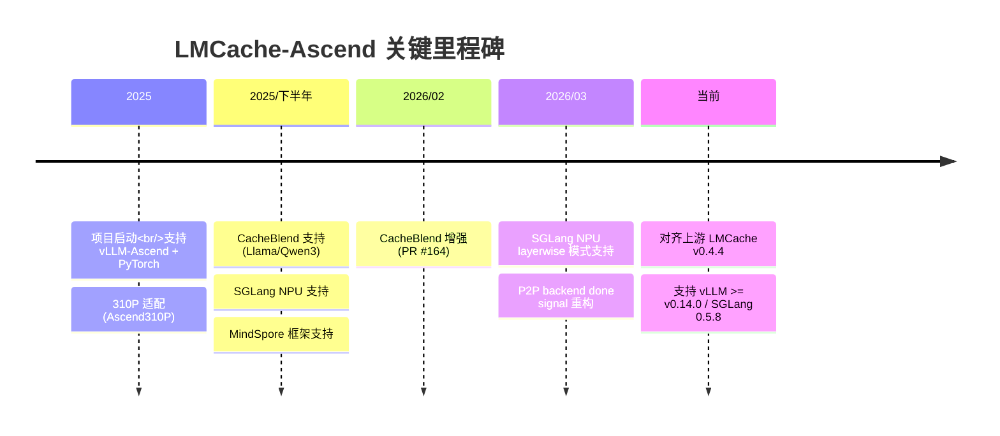
```mermaid
timeline
    title LMCache-Ascend 关键里程碑
    2025 : 项目启动<br/>支持 vLLM-Ascend + PyTorch
         : 310P 适配 (Ascend310P)
    2025/下半年 : CacheBlend 支持 (Llama/Qwen3)
                : SGLang NPU 支持
                : MindSpore 框架支持
    2026/02 : CacheBlend 增强 (PR #164)
    2026/03 : SGLang NPU layerwise 模式支持
            : P2P backend done signal 重构
    当前 : 对齐上游 LMCache v0.4.4
         : 支持 vLLM >= v0.14.0 / SGLang 0.5.8
```

### 2.3 兼容性矩阵

#### PyTorch / vLLM

| LMCache-Ascend | LMCache | vLLM Version |
| :--- | :--- | :--- |
| **main** | **v0.4.4** | **>=v0.14.0** |
| **v0.4.3** | **v0.4.3** | **>=v0.14.0** |

#### PyTorch / SGLang

| LMCache-Ascend | LMCache | SGLang Version |
| :--- | :--- | :--- |
| **main** | **v0.4.4** | **0.5.8** |
| **v0.4.3** | **v0.4.3** | **0.5.8** |

#### MindSpore

| LMCache-Ascend | LMCache | vLLM Version |
| :--- | :--- | :--- |
| **main** | **v0.4.4** | **v0.11.0** |
| **v0.4.3** | **v0.4.3** | **v0.11.0** |

---

## 三、核心原理

### 3.1 整体架构：插件式 Monkey Patch

LMCache-Ascend 的核心入口是 `lmcache_ascend/__init__.py`。当该模块被 import 时（由 `LMCacheAscendConnectorV1Dynamic` 触发），它会执行一系列 `_patch_*` 函数，把 LMCache 内部的 GPU/CUDA 实现替换为 NPU/Ascend 实现。

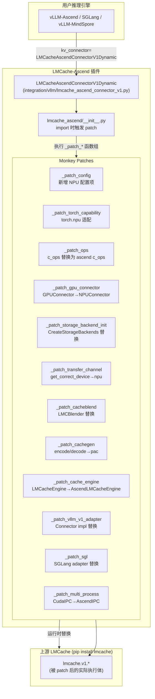
```mermaid
flowchart TB
    subgraph User["用户推理引擎"]
        VLLM["vLLM-Ascend / SGLang / vLLM-MindSpore"]
    end
    VLLM -- "kv_connector=<br/>LMCacheAscendConnectorV1Dynamic" --> CONN
    subgraph Plugin["LMCache-Ascend 插件"]
        CONN["LMCacheAscendConnectorV1Dynamic<br/>(integration/vllm/lmcache_ascend_connector_v1.py)"]
        INIT["lmcache_ascend/__init__.py<br/>import 时触发 patch"]
        CONN --> INIT
        INIT -- "执行 _patch_* 函数组" --> PATCHES
        subgraph PATCHES["Monkey Patches"]
            P1["_patch_config<br/>新增 NPU 配置项"]
            P2["_patch_torch_capability<br/>torch.npu 适配"]
            P3["_patch_ops<br/>c_ops 替换为 ascend c_ops"]
            P4["_patch_gpu_connector<br/>GPUConnector→NPUConnector"]
            P5["_patch_storage_backend_init<br/>CreateStorageBackends 替换"]
            P6["_patch_transfer_channel<br/>get_correct_device→npu"]
            P7["_patch_cacheblend<br/>LMCBlender 替换"]
            P8["_patch_cachegen<br/>encode/decode→pac"]
            P9["_patch_cache_engine<br/>LMCacheEngine→AscendLMCacheEngine"]
            P10["_patch_vllm_v1_adapter<br/>Connector impl 替换"]
            P11["_patch_sgl<br/>SGLang adapter 替换"]
            P12["_patch_multi_process<br/>CudaIPC→AscendIPC"]
        end
    end
    PATCHES -- "运行时替换" --> LMC
    subgraph LMC["上游 LMCache (pip install lmcache)"]
        CORE["lmcache.v1.*<br/>(被 patch 后的实际执行体)"]
    end
    PATCHES --> CORE
```

**关键设计点：**

- **`LMCACHE_ASCEND_PATCHED` 标志**：防止重复 patch
- **运行时检测**：通过 `_is_sglang_runtime()` / `_is_vllm_runtime()` 判断当前引擎，只 patch 需要的部分
- **框架检测**：通过 `_build_info.__framework_name__` 区分 pytorch / mindspore，框架特定的 patch 只在对应框架下执行
- **patch 顺序敏感**：例如 `gpu_connector` 必须在 `storage_backend_init` 之前 patch，因为 `CreateStorageBackends` 内部会调用 `CreateNPUConnector`

### 3.2 多框架支持：PyTorch / MindSpore

LMCache-Ascend 同时支持 PyTorch 和 MindSpore 两种深度学习框架。

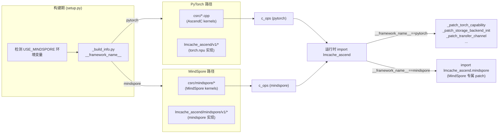
```mermaid
flowchart LR
    subgraph Build["构建期 (setup.py)"]
        DETECT["检测 USE_MINDSPORE 环境变量"]
        BUILD_INFO["_build_info.py<br/>__framework_name__"]
        DETECT --> BUILD_INFO
    end
    BUILD_INFO -- "pytorch" --> PT_PATH
    BUILD_INFO -- "mindspore" --> MS_PATH
    subgraph PT_PATH["PyTorch 路径"]
        PT_C["csrc/*.cpp<br/>(AscendC kernels)"]
        PT_PY["lmcache_ascend/v1/*<br/>(torch.npu 实现)"]
    end
    subgraph MS_PATH["MindSpore 路径"]
        MS_C["csrc/mindspore/*<br/>(MindSpore kernels)"]
        MS_PY["lmcache_ascend/mindspore/v1/*<br/>(mindspore 实现)"]
    end
    PT_C --> PT_OPS["c_ops (pytorch)"]
    MS_C --> MS_OPS["c_ops (mindspore)"]
    PT_OPS --> RUNTIME
    MS_OPS --> RUNTIME
    RUNTIME["运行时 import lmcache_ascend"]
    RUNTIME -- "__framework_name__==pytorch" --> PT_PATCH["_patch_torch_capability<br/>_patch_storage_backend_init<br/>_patch_transfer_channel<br/>..."]
    RUNTIME -- "__framework_name__==mindspore" --> MS_PATCH["import lmcache_ascend.mindspore<br/>(MindSpore 专属 patch)"]
```

**MindSpore 路径的特殊性：**

- MindSpore 有独立的 `lmcache_ascend/mindspore/v1/` 目录，包含 `npu_connector.py`、`memory_management.py`、`storage_backend/` 等
- MindSpore 的 C++ kernels 在 `csrc/mindspore/` 下独立编译
- MindSpore 通过 `vllm_mindspore` 入口启动，connector 仍用 `LMCacheAscendConnectorV1Dynamic`

### 3.3 多引擎支持：vLLM / SGLang

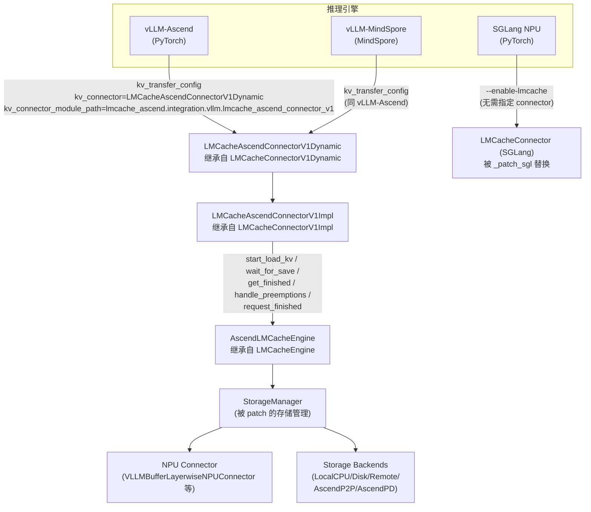
```mermaid
flowchart TB
    subgraph Engine["推理引擎"]
        VLLM["vLLM-Ascend<br/>(PyTorch)"]
        SGL["SGLang NPU<br/>(PyTorch)"]
        VLLM_MS["vLLM-MindSpore<br/>(MindSpore)"]
    end
    VLLM -- "kv_transfer_config<br/>kv_connector=LMCacheAscendConnectorV1Dynamic<br/>kv_connector_module_path=lmcache_ascend.integration.vllm.lmcache_ascend_connector_v1" --> CONN
    SGL -- "--enable-lmcache<br/>(无需指定 connector)" --> SGL_ADAPT
    VLLM_MS -- "kv_transfer_config<br/>(同 vLLM-Ascend)" --> CONN
    CONN["LMCacheAscendConnectorV1Dynamic<br/>继承自 LMCacheConnectorV1Dynamic"]
    SGL_ADAPT["LMCacheConnector (SGLang)<br/>被 _patch_sgl 替换"]
    CONN --> IMPL["LMCacheAscendConnectorV1Impl<br/>继承自 LMCacheConnectorV1Impl"]
    IMPL -- "start_load_kv / wait_for_save /<br/>get_finished / handle_preemptions /<br/>request_finished" --> ENGINE["AscendLMCacheEngine<br/>继承自 LMCacheEngine"]
    ENGINE --> SM["StorageManager<br/>(被 patch 的存储管理)"]
    SM --> NPU_CONN["NPU Connector<br/>(VLLMBufferLayerwiseNPUConnector 等)"]
    SM --> BACKENDS["Storage Backends<br/>(LocalCPU/Disk/Remote/<br/>AscendP2P/AscendPD)"]
```

**vLLM-Ascend 集成要点：**

- 通过 `--kv-transfer-config` 指定 connector，`kv_role` 可以是 `kv_both`（单机缓存）、`kv_producer`（PD prefiller）、`kv_consumer`（PD decoder）
- `LMCacheAscendConnectorV1Dynamic` 是薄包装，真正逻辑在 `LMCacheAscendConnectorV1Impl`

**SGLang NPU 集成要点：**

- 只需 `--enable-lmcache`，无需指定 connector
- `_patch_sgl` 替换 `LMCacheConnector.__init__`、`LMCacheLayerwiseConnector.global_min_tokens`、`LMCacheLayerwiseConnector.start_load_kv`
- SGLang NPU 的 KV cache 格式为 `[K_all_layers, V_all_layers]`（layer-concatenated），由 `KVCacheFormat.detect()` 自动识别

---

## 四、核心机制

### 4.1 NPU Connector：KV cache 的 NPU 适配层

NPU Connector 是 GPU Connector 的 NPU 版本，负责 KV cache 在 NPU paged memory 与 CPU MemoryObj 之间的转换。它继承自上游 GPU Connector，但重写了所有 CUDA 特定的操作。

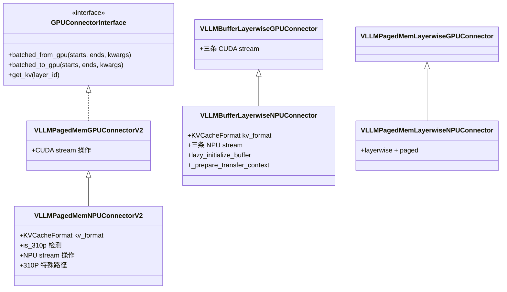
```mermaid
classDiagram
    class GPUConnectorInterface {
        <<interface>>
        +batched_from_gpu(starts, ends, kwargs)
        +batched_to_gpu(starts, ends, kwargs)
        +get_kv(layer_id)
    }
    class VLLMPagedMemGPUConnectorV2 {
        +CUDA stream 操作
    }
    class VLLMPagedMemNPUConnectorV2 {
        +KVCacheFormat kv_format
        +is_310p 检测
        +NPU stream 操作
        +310P 特殊路径
    }
    class VLLMBufferLayerwiseGPUConnector {
        +三条 CUDA stream
    }
    class VLLMBufferLayerwiseNPUConnector {
        +KVCacheFormat kv_format
        +三条 NPU stream
        +lazy_initialize_buffer
        +_prepare_transfer_context
    }
    class VLLMPagedMemLayerwiseNPUConnector {
        +layerwise + paged
    }
    GPUConnectorInterface <|.. VLLMPagedMemGPUConnectorV2
    VLLMPagedMemGPUConnectorV2 <|-- VLLMPagedMemNPUConnectorV2
    VLLMBufferLayerwiseGPUConnector <|-- VLLMBufferLayerwiseNPUConnector
    VLLMPagedMemLayerwiseGPUConnector <|-- VLLMPagedMemLayerwiseNPUConnector
```

**关键差异（vs 上游 GPU Connector）：**

1. **设备 API**：`torch.cuda.Stream()` → `torch.npu.Stream()`，`torch.cuda.Event()` → `torch.npu.Event()`，`tensor.to("cuda")` → `tensor.to("npu")`
2. **KV cache 格式检测**：`KVCacheFormat.detect(kvcaches)` 自动识别 MERGED_KV / SEPARATE_KV / MLA_KV / DSA_KV
3. **310P 特殊路径**：Ascend 310P 硬件能力受限，有专门的 `is_310p()` 分支处理
4. **slot_mapping pin memory**：在 `wait_for_save` 中把 `slot_mapping` pin 到 CPU 内存再异步拷贝到 NPU，避免 H2D 拷贝阻塞
5. **ordering_event**：用 `torch.npu.Event()` 记录 store 操作的顺序，确保 store stream 与推理 stream 的正确同步

**NPU Connector 工厂：**

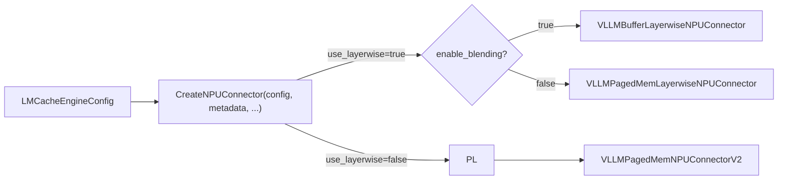
```mermaid
flowchart LR
    CFG["LMCacheEngineConfig"] --> FACTORY["CreateNPUConnector(config, metadata, ...)"]
    FACTORY -- "use_layerwise=true" --> LW
    FACTORY -- "use_layerwise=false" --> PL
    LW{"enable_blending?"}
    LW -- "true" --> BLW["VLLMBufferLayerwiseNPUConnector"]
    LW -- "false" --> PLW["VLLMPagedMemLayerwiseNPUConnector"]
    PL --> PAGED["VLLMPagedMemNPUConnectorV2"]
```

### 4.2 KV Cache Format：多格式自动检测

LMCache-Ascend 定义了 `KVCacheFormat` 枚举，自动检测 vLLM-Ascend / SGLang NPU / vLLM-MindSpore 的不同 KV cache 内存布局。

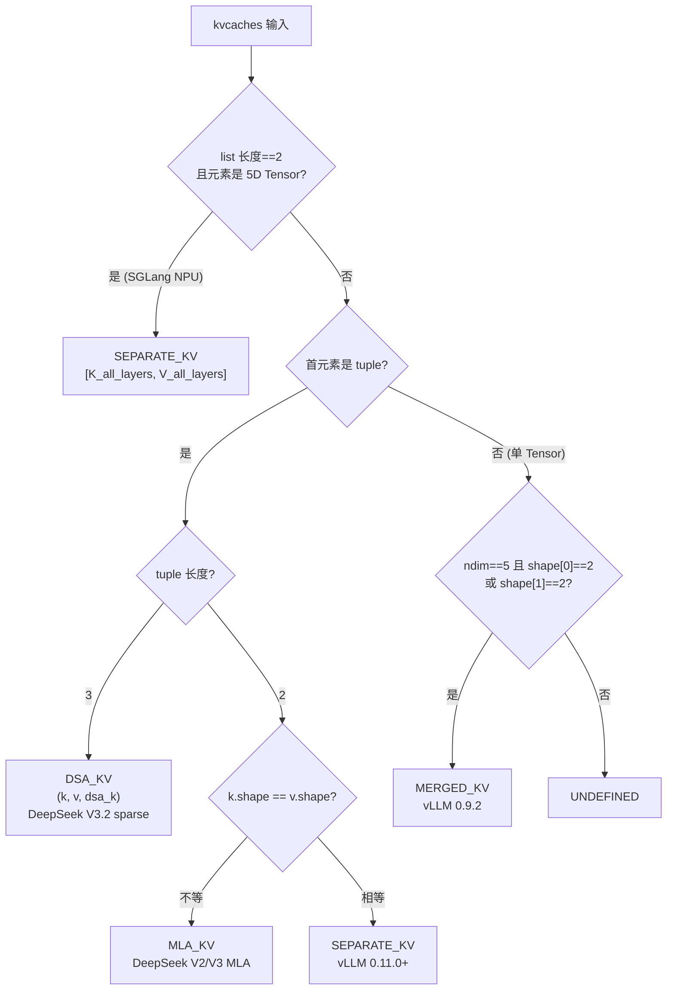
```mermaid
flowchart TB
    INPUT["kvcaches 输入"] --> CHECK1{"list 长度==2<br/>且元素是 5D Tensor?"}
    CHECK1 -- "是 (SGLang NPU)" --> SEP["SEPARATE_KV<br/>[K_all_layers, V_all_layers]"]
    CHECK1 -- "否" --> CHECK2{"首元素是 tuple?"}
    CHECK2 -- "是" --> CHECK3{"tuple 长度?"}
    CHECK3 -- "3" --> DSA["DSA_KV<br/>(k, v, dsa_k)<br/>DeepSeek V3.2 sparse"]
    CHECK3 -- "2" --> CHECK4{"k.shape == v.shape?"}
    CHECK4 -- "不等" --> MLA["MLA_KV<br/>DeepSeek V2/V3 MLA"]
    CHECK4 -- "相等" --> SEP2["SEPARATE_KV<br/>vLLM 0.11.0+"]
    CHECK2 -- "否 (单 Tensor)" --> CHECK5{"ndim==5 且 shape[0]==2<br/>或 shape[1]==2?"}
    CHECK5 -- "是" --> MERGED["MERGED_KV<br/>vLLM 0.9.2"]
    CHECK5 -- "否" --> UNDEF["UNDEFINED"]
```

**格式说明：**

| 格式 | 数据结构 | 适用场景 |
|---|---|---|
| `MERGED_KV` | `[2, num_blocks, block_size, num_heads, head_size]` | vLLM 0.9.2（Flash Attention） |
| `SEPARATE_KV` | `(K_tensor, V_tensor)` 每层一组 | vLLM 0.11.0+、SGLang NPU |
| `MLA_KV` | `(k_cache, v_cache)` K/V shape 不同 | DeepSeek V2/V3 MLA |
| `DSA_KV` | `(k_cache, v_cache, dsa_k_cache)` | DeepSeek V3.2 sparse attention |

### 4.3 Transfer Channel：Ascend 原生传输通道

LMCache-Ascend 用 Ascend 原生通信库替代了 CUDA 的 NCCL/NIXL，提供三种传输通道：

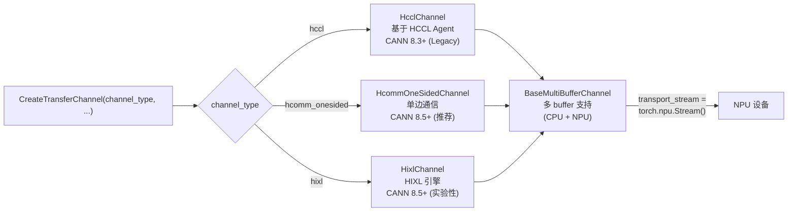
```mermaid
flowchart LR
    FACTORY["CreateTransferChannel(channel_type, ...)"] --> SW{channel_type}
    SW -- "hccl" --> HCCL["HcclChannel<br/>基于 HCCL Agent<br/>CANN 8.3+ (Legacy)"]
    SW -- "hcomm_onesided" --> HOS["HcommOneSidedChannel<br/>单边通信<br/>CANN 8.5+ (推荐)"]
    SW -- "hixl" --> HIXL["HixlChannel<br/>HIXL 引擎<br/>CANN 8.5+ (实验性)"]
    HCCL --> MULTI["BaseMultiBufferChannel<br/>多 buffer 支持<br/>(CPU + NPU)"]
    HOS --> MULTI
    HIXL --> MULTI
    MULTI -- "transport_stream =<br/>torch.npu.Stream()" --> NPU_DEV["NPU 设备"]
```

**三种通道对比：**

| 通道 | CANN 要求 | 状态 | 通信模型 | 特点 |
|---|---|---|---|---|
| `hccl` | 8.3+ | Legacy | 双边（collective） | 兼容性最好，需 pair-wise HcclComm |
| `hcomm_onesided` | 8.5+ | **推荐** | 单边（one-sided RDMA） | 类似 NIXL，receiver 主动 pull，低延迟 |
| `hixl` | 8.5+ | 实验性 | HIXL 引擎 | 最新，性能潜力最大 |

**多 Buffer 模式：** 通道支持同时注册 CPU 和 NPU 两类 buffer，通过 `BufferConfig` 列表描述。`buffer_uuid` 作为不透明标识符，在 alloc response 和 transfer spec 中引用远端 buffer，避免暴露原始内存地址。

**通道初始化握手流程（以 hcomm_onesided 为例）：**

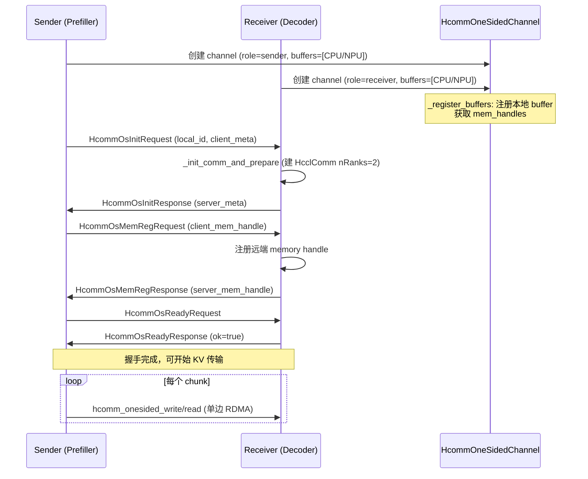
```mermaid
sequenceDiagram
    participant S as Sender (Prefiller)
    participant R as Receiver (Decoder)
    participant CH as HcommOneSidedChannel
    S->>CH: 创建 channel (role=sender, buffers=[CPU/NPU])
    R->>CH: 创建 channel (role=receiver, buffers=[CPU/NPU])
    Note over CH: _register_buffers: 注册本地 buffer<br/>获取 mem_handles
    S->>R: HcommOsInitRequest (local_id, client_meta)
    R->>R: _init_comm_and_prepare (建 HcclComm nRanks=2)
    R->>S: HcommOsInitResponse (server_meta)
    S->>R: HcommOsMemRegRequest (client_mem_handle)
    R->>R: 注册远端 memory handle
    R->>S: HcommOsMemRegResponse (server_mem_handle)
    S->>R: HcommOsReadyRequest
    R->>S: HcommOsReadyResponse (ok=true)
    Note over S,R: 握手完成，可开始 KV 传输
    loop 每个 chunk
        S->>R: hcomm_onesided_write/read (单边 RDMA)
    end
```

### 4.4 AscendP2PBackend：NPU 间 P2P 共享

`AscendP2PBackend` 继承自上游 `P2PBackend`，用 Ascend Transfer Channel 替代 NIXL，实现多 NPU 实例间的 KV cache 直接共享。

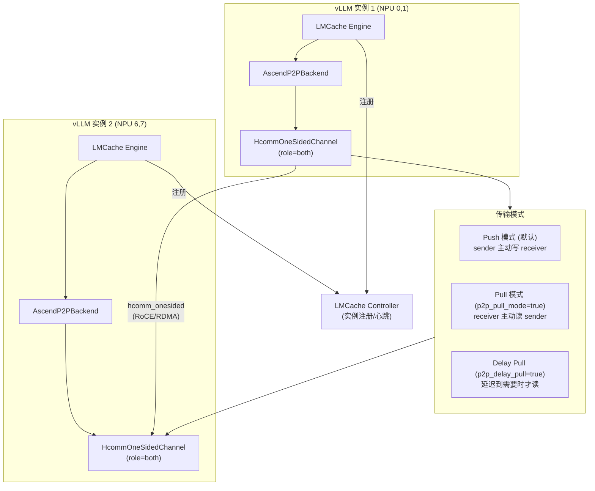
```mermaid
flowchart TB
    subgraph Inst1["vLLM 实例 1 (NPU 0,1)"]
        E1["LMCache Engine"]
        P2P1["AscendP2PBackend"]
        CH1["HcommOneSidedChannel<br/>(role=both)"]
        E1 --> P2P1
        P2P1 --> CH1
    end
    subgraph Inst2["vLLM 实例 2 (NPU 6,7)"]
        E2["LMCache Engine"]
        P2P2["AscendP2PBackend"]
        CH2["HcommOneSidedChannel<br/>(role=both)"]
        E2 --> P2P2
        P2P2 --> CH2
    end
    CTRL["LMCache Controller<br/>(实例注册/心跳)"]
    E1 -- "注册" --> CTRL
    E2 -- "注册" --> CTRL
    CH1 -- "hcomm_onesided<br/>(RoCE/RDMA)" --> CH2
    subgraph Modes["传输模式"]
        PUSH["Push 模式 (默认)<br/>sender 主动写 receiver"]
        PULL["Pull 模式 (p2p_pull_mode=true)<br/>receiver 主动读 sender"]
        DELAY["Delay Pull (p2p_delay_pull=true)<br/>延迟到需要时才读"]
    end
    CH1 --> Modes
    Modes --> CH2
```

**关键配置（LMCache-Ascend 新增）：**

| 配置项 | 默认值 | 说明 |
|---|---|---|
| `p2p_use_npu` | `false` | P2P 传输使用 NPU 内存（而非 CPU） |
| `p2p_npu_buffer_size` | `1GB` | NPU buffer 总大小 |
| `p2p_pull_mode` | `false` | 拉取模式（receiver 主动读） |
| `p2p_delay_pull` | `false` | 延迟拉取（用到才读） |
| `p2p_pull_pending_ttl` | `360s` | pull-pending 条目 TTL（防 receiver 崩溃泄漏） |
| `transfer_channel` | - | `hccl` / `hcomm_onesided` / `hixl` |

**P2P Lookup & Get 流程（Pull 模式 + Delay Pull）：**

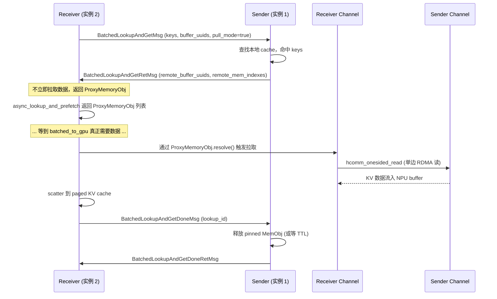
```mermaid
sequenceDiagram
    participant R as Receiver (实例 2)
    participant S as Sender (实例 1)
    participant CH_R as Receiver Channel
    participant CH_S as Sender Channel
    R->>S: BatchedLookupAndGetMsg (keys, buffer_uuids, pull_mode=true)
    S->>S: 查找本地 cache，命中 keys
    S->>R: BatchedLookupAndGetRetMsg (remote_buffer_uuids, remote_mem_indexes)
    Note over R: 不立即拉取数据，返回 ProxyMemoryObj
    R->>R: async_lookup_and_prefetch 返回 ProxyMemoryObj 列表
    Note over R: ... 等到 batched_to_gpu 真正需要数据 ...
    R->>CH_R: 通过 ProxyMemoryObj.resolve() 触发拉取
    CH_R->>CH_S: hcomm_onesided_read (单边 RDMA 读)
    CH_S-->>CH_R: KV 数据流入 NPU buffer
    R->>R: scatter 到 paged KV cache
    R->>S: BatchedLookupAndGetDoneMsg (lookup_id)
    S->>S: 释放 pinned MemObj (或等 TTL)
    S->>R: BatchedLookupAndGetDoneRetMsg
```

### 4.5 AscendPDBackend：PD 分离传输

`AscendPDBackend` 用于 Prefill-Decode 分离场景，sender（prefiller）计算 KV 后通过 Ascend Transfer Channel 传给 receiver（decoder）。

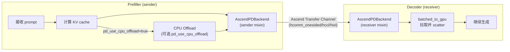
```mermaid
flowchart LR
    subgraph Sender["Prefiller (sender)"]
        P1["接收 prompt"]
        P2["计算 KV cache"]
        P3["AscendPDBackend<br/>(sender mixin)"]
        OFF["CPU Offload<br/>(可选 pd_use_cpu_offload)"]
        P1 --> P2 --> P3
        P2 -- "pd_use_cpu_offload=true" --> OFF
        OFF --> P3
    end
    subgraph Receiver["Decoder (receiver)"]
        D3["AscendPDBackend<br/>(receiver mixin)"]
        D2["batched_to_gpu<br/>拉取并 scatter"]
        D1["继续生成"]
        D3 --> D2 --> D1
    end
    P3 -- "Ascend Transfer Channel<br/>(hcomm_onesided/hccl/hixl)" --> D3
```

**PD 模式关键配置：**

| 配置项 | 说明 |
|---|---|
| `enable_pd: true` | 开启 PD 分离 |
| `pd_role: sender/receiver` | 角色 |
| `transfer_channel` | 传输通道（同 P2P） |
| `pd_pull_mode` | 拉取模式（receiver 主动读，避免预占 NPU 内存） |
| `pd_delay_pull` | 延迟拉取 |
| `pd_use_cpu_offload` | sender 先 offload 到 CPU 再 RDMA（节省 NPU 内存） |
| `pd_cpu_buffer_size` | CPU offload buffer 大小 |
| `pd_buffer_device: npu/cpu` | receiver buffer 设备 |
| `pd_buffer_size` | buffer 大小 |
| `pd_pull_done_port` | per-TP-rank 的 done signal 端口 |

**PD 传输时序（Pull 模式）：**

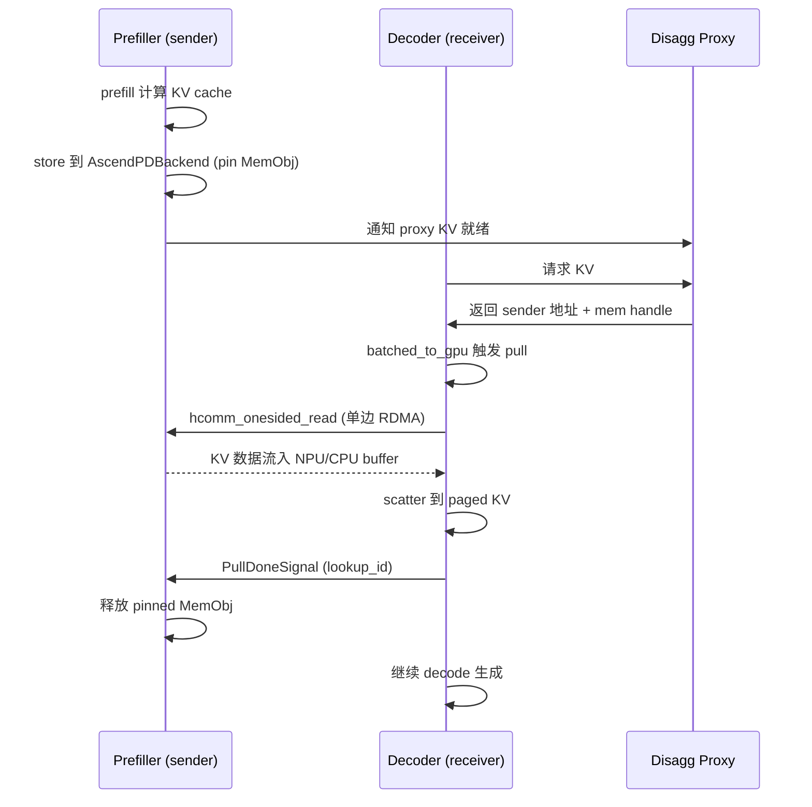
```mermaid
sequenceDiagram
    participant P as Prefiller (sender)
    participant D as Decoder (receiver)
    participant PROXY as Disagg Proxy
    P->>P: prefill 计算 KV cache
    P->>P: store 到 AscendPDBackend (pin MemObj)
    P->>PROXY: 通知 proxy KV 就绪
    D->>PROXY: 请求 KV
    PROXY->>D: 返回 sender 地址 + mem handle
    D->>D: batched_to_gpu 触发 pull
    D->>P: hcomm_onesided_read (单边 RDMA)
    P-->>D: KV 数据流入 NPU/CPU buffer
    D->>D: scatter 到 paged KV
    D->>P: PullDoneSignal (lookup_id)
    P->>P: 释放 pinned MemObj
    D->>D: 继续 decode 生成
```

### 4.6 ProxyMemoryObj：延迟拉取的流水线化传输

`ProxyMemoryObj` 是 LMCache-Ascend 的核心创新之一，用于 P2P/PD 的延迟拉取模式。它是一个"空壳" MemoryObj，只携带传输元数据，在真正需要数据时才触发远端拉取。

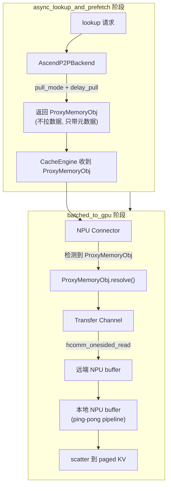
```mermaid
flowchart TB
    subgraph Lookup["async_lookup_and_prefetch 阶段"]
        REQ["lookup 请求"] --> P2P["AscendP2PBackend"]
        P2P -- "pull_mode + delay_pull" --> PROXY["返回 ProxyMemoryObj<br/>(不拉数据, 只带元数据)"]
        PROXY --> ENGINE["CacheEngine 收到 ProxyMemoryObj"]
    end
    subgraph Resolve["batched_to_gpu 阶段"]
        ENGINE --> CONN["NPU Connector"]
        CONN -- "检测到 ProxyMemoryObj" --> RESOLVE["ProxyMemoryObj.resolve()"]
        RESOLVE --> CH["Transfer Channel"]
        CH -- "hcomm_onesided_read" --> REMOTE["远端 NPU buffer"]
        REMOTE --> LOCAL["本地 NPU buffer<br/>(ping-pong pipeline)"]
        LOCAL --> SCATTER["scatter 到 paged KV"]
    end
    Lookup --> Resolve
```

**两种模式：**

1. **带 backing_obj**：预分配 MemoryObj，`resolve()` 时填充数据
2. **轻量模式（无 backing_obj）**：只带元数据，由 NPU connector 的 ping-pong pipeline 后续 `set_backing_obj()` 再拉取

**收益：**

- 避免在 lookup 阶段就把所有 chunk 拉到本地，节省 NPU/CPU 内存
- 远程拉取与 NPU scatter 流水线化，重叠 I/O 与计算
- 与 layerwise 模式协同，逐层拉取逐层 scatter

### 4.7 CacheBlend on Ascend：非前缀 KV 复用

LMCache-Ascend 通过 `_patch_cacheblend` 把上游 `LMCBlenderBuilder.get_or_create` 替换为 Ascend 版本，使用 Ascend 原生 attention kernel。

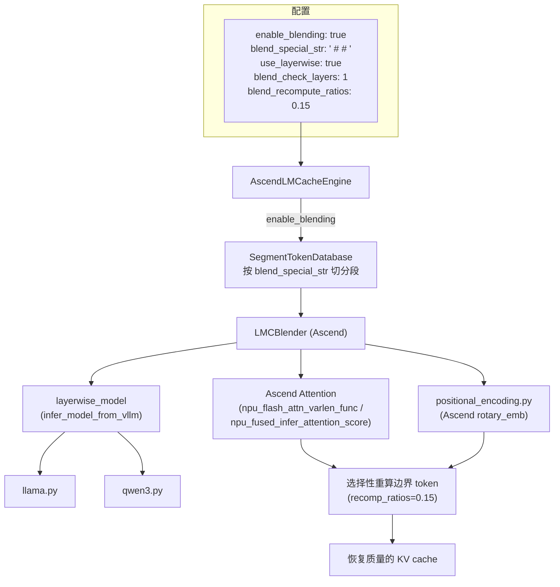
```mermaid
flowchart TB
    subgraph Config["配置"]
        YAML["enable_blending: true<br/>blend_special_str: ' # # '<br/>use_layerwise: true<br/>blend_check_layers: 1<br/>blend_recompute_ratios: 0.15"]
    end
    YAML --> ENGINE["AscendLMCacheEngine"]
    ENGINE -- "enable_blending" --> SEG["SegmentTokenDatabase<br/>按 blend_special_str 切分段"]
    SEG --> BLEND["LMCBlender (Ascend)"]
    BLEND --> MODEL["layerwise_model<br/>(infer_model_from_vllm)"]
    MODEL --> LLAMA["llama.py"]
    MODEL --> QWEN["qwen3.py"]
    BLEND --> ATTN["Ascend Attention<br/>(npu_flash_attn_varlen_func /<br/>npu_fused_infer_attention_score)"]
    BLEND --> ROPE["positional_encoding.py<br/>(Ascend rotary_emb)"]
    ATTN --> RECOMP["选择性重算边界 token<br/>(recomp_ratios=0.15)"]
    ROPE --> RECOMP
    RECOMP --> OUTPUT["恢复质量的 KV cache"]
```

**Ascend 特有实现：**

- **Attention backend**：用 `npu_flash_attn_varlen_func`（来自 `transformers.integrations.npu_flash_attention`）和 `npu_fused_infer_attention_score`（来自 `torch_npu`）替代 CUDA FlashAttention
- **eager attention**：提供 `eager_attention_causal` 作为 fallback，用 `torch.npu.empty_cache()` 主动清理
- **模型支持**：目前仅支持 Llama 和 Qwen3 架构（通过 `infer_model_from_vllm` 推断）
- **限制**：CacheBlend 与 prefix cache 不能同时启用；需手动插入 `blend_special_str` 分隔段

### 4.8 PAC Serde：Ascend 原生 CacheGen 编解码

LMCache-Ascend 实现了 Ascend 原生的 CacheGen 编解码器（称为 PAC），用 AscendC kernels 替代 CUDA kernels。

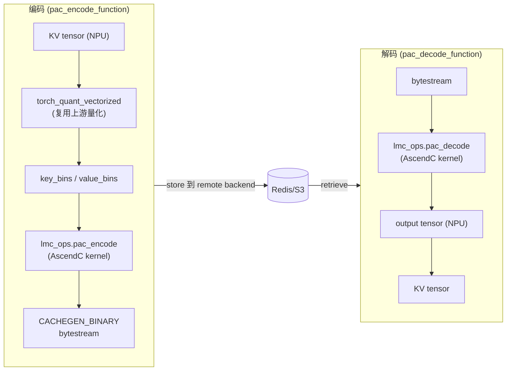
```mermaid
flowchart LR
    subgraph Encode["编码 (pac_encode_function)"]
        KV["KV tensor (NPU)"] --> QUANT["torch_quant_vectorized<br/>(复用上游量化)"]
        QUANT --> BINS["key_bins / value_bins"]
        BINS --> PAC_ENC["lmc_ops.pac_encode<br/>(AscendC kernel)"]
        PAC_ENC --> BITSTREAM["CACHEGEN_BINARY<br/>bytestream"]
    end
    subgraph Decode["解码 (pac_decode_function)"]
        BITSTREAM2["bytestream"] --> PAC_DEC["lmc_ops.pac_decode<br/>(AscendC kernel)"]
        PAC_DEC --> OUTPUT["output tensor (NPU)"]
        OUTPUT --> KV2["KV tensor"]
    end
    Encode -- "store 到 remote backend" --> REMOTE[("Redis/S3")]
    REMOTE -- "retrieve" --> Decode
```

**与上游 CacheGen 的差异：**

| 维度 | 上游 CacheGen (CUDA) | PAC (Ascend) |
|---|---|---|
| 算术编码 | 纯算术编码（regressive，带状态） | CDF 边界对齐到 2 的幂（固定 bit 序列） |
| 向量化 | CUDA 并行 | AscendC 向量接口（受类型限制） |
| 性能权衡 | 压缩率最优 | 牺牲少量压缩率换性能 |
| decode 瓶颈 | - | scalar core bound（确定符号位） |
| encode 瓶颈 | - | `RepeatInterleave` kernel（上游 LMCache 调用） |

**性能特征：**

- **cache hit 场景**：completion time 比 recompute 快 2x；比 naive serde 慢约 20%，但占用空间仅 1/3.5
- **cache miss 场景**：encode 是瓶颈（`RepeatInterleave`），比 naive serde 慢明显
- **适用场景**：远端存储珍贵时（如内存 Redis），PAC 是有吸引力的选择

### 4.9 Async Store：异步存储流水线

`AscendLMCacheEngine` 引入了异步 store 路径，把 KV cache 的存储操作放到后台线程，避免阻塞推理。

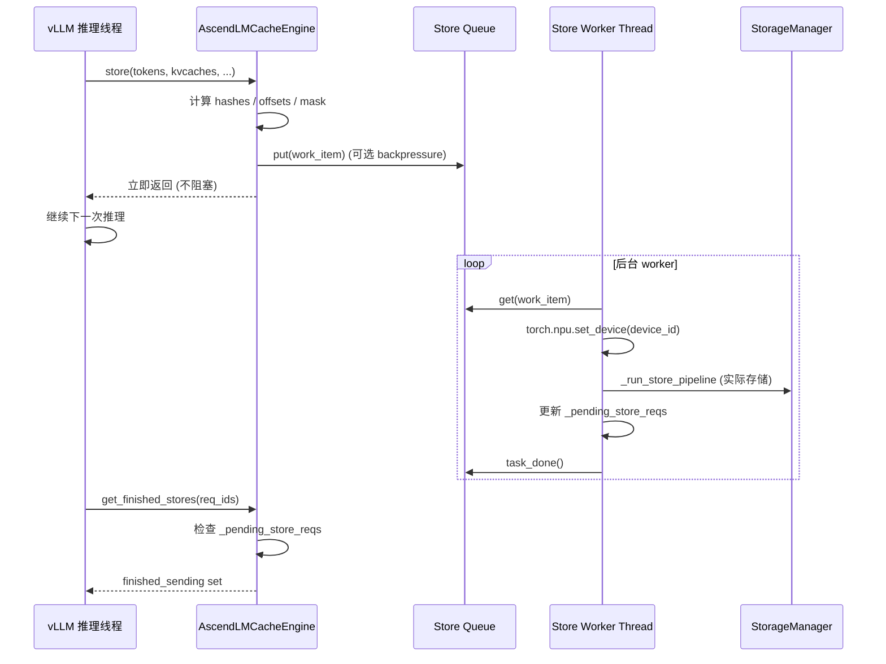
```mermaid
sequenceDiagram
    participant vLLM as vLLM 推理线程
    participant ENG as AscendLMCacheEngine
    participant Q as Store Queue
    participant W as Store Worker Thread
    participant SM as StorageManager
    vLLM->>ENG: store(tokens, kvcaches, ...)
    ENG->>ENG: 计算 hashes / offsets / mask
    ENG->>Q: put(work_item) (可选 backpressure)
    ENG-->>vLLM: 立即返回 (不阻塞)
    vLLM->>vLLM: 继续下一次推理
    loop 后台 worker
        W->>Q: get(work_item)
        W->>W: torch.npu.set_device(device_id)
        W->>SM: _run_store_pipeline (实际存储)
        W->>W: 更新 _pending_store_reqs
        W->>Q: task_done()
    end
    vLLM->>ENG: get_finished_stores(req_ids)
    ENG->>ENG: 检查 _pending_store_reqs
    ENG-->>vLLM: finished_sending set
```

**关键设计：**

- **`store_async` 配置**：开启异步 store
- **`store_async_max_queue_size`**：0=无界，>0=有界 backpressure
- **`ThreadSafeEventList`**：用 `queue.Queue` 替代 list，保证 `kv_events` 在多线程下的线程安全
- **`_pending_store_reqs`**：跟踪每个 req_id 的在途 store 数量
- **`_deferred_finished_req_ids`**：请求已完成但 store 未 drain 的 req_id 集合，在 `get_finished_stores` 时重查
- **`handle_preemptions`**：请求被抢占时，drain 其 pending store，避免泄漏

### 4.10 Remote-Loaded Prefix 本地持久化

`LMCacheAscendConnectorV1Impl._local_persist_skip` 解决了一个 P2P/PD 场景的关键问题：当匹配的前缀是从远端 peer 拉取的，本地 CPU backend 仍是冷的，后续请求会反复从远端拉取同一份 KV。

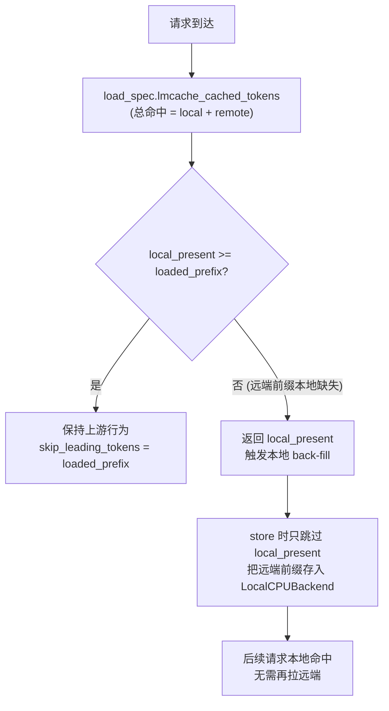
```mermaid
flowchart TB
    REQ["请求到达"] --> LOAD["load_spec.lmcache_cached_tokens<br/>(总命中 = local + remote)"]
    LOAD --> CHECK{"local_present >= loaded_prefix?"}
    CHECK -- "是" --> SKIP["保持上游行为<br/>skip_leading_tokens = loaded_prefix"]
    CHECK -- "否 (远端前缀本地缺失)" --> PERSIST["返回 local_present<br/>触发本地 back-fill"]
    PERSIST --> STORE["store 时只跳过 local_present<br/>把远端前缀存入 LocalCPUBackend"]
    STORE --> NEXT["后续请求本地命中<br/>无需再拉远端"]
```

**收益：** 避免每个后续请求都重新从远端 peer 拉取同一份 KV，把"远端命中"逐步转化为"本地命中"。

### 4.11 内存预取/淘汰 REST API

LMCache-Ascend 在内部 API server 上新增了 `/memory/prefetch` 和 `/memory/evict` 两个 REST 端点，支持跨存储层级的主动数据放置。

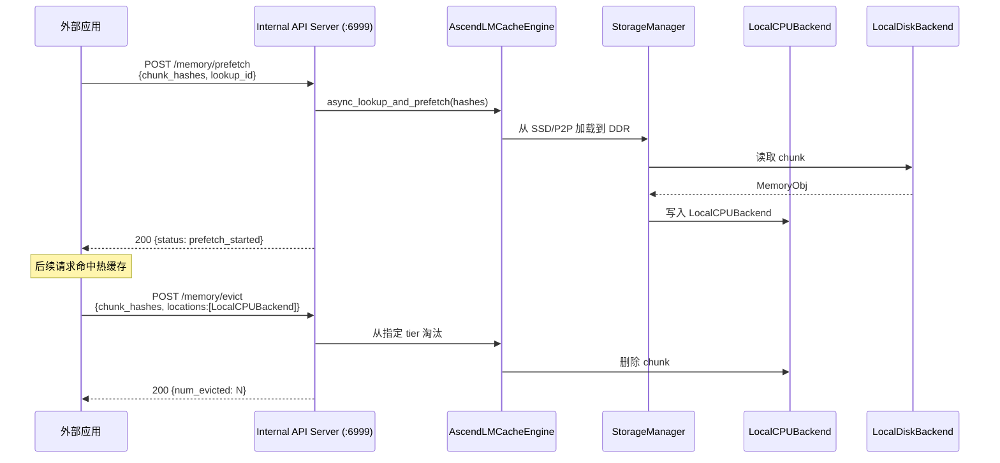
```mermaid
sequenceDiagram
    participant APP as 外部应用
    participant API as Internal API Server (:6999)
    participant ENG as AscendLMCacheEngine
    participant SM as StorageManager
    participant L1 as LocalCPUBackend
    participant L2 as LocalDiskBackend
    APP->>API: POST /memory/prefetch<br/>{chunk_hashes, lookup_id}
    API->>ENG: async_lookup_and_prefetch(hashes)
    ENG->>SM: 从 SSD/P2P 加载到 DDR
    SM->>L2: 读取 chunk
    L2-->>SM: MemoryObj
    SM->>L1: 写入 LocalCPUBackend
    API-->>APP: 200 {status: prefetch_started}
    Note over APP: 后续请求命中热缓存
    APP->>API: POST /memory/evict<br/>{chunk_hashes, locations:[LocalCPUBackend]}
    API->>ENG: 从指定 tier 淘汰
    ENG->>L1: 删除 chunk
    API-->>APP: 200 {num_evicted: N}
```

**前置配置：**

```yaml
internal_api_server_enabled: true
enable_async_loading: true
enable_chunk_hashes_return: true
lookup_hashes_cache_size: 1024  # 推荐，防内存泄漏
```

**使用场景：** KV-cache-aware 路由器根据 `kv_transfer_params.chunk_hashes`（在流式响应的最后一个 chunk 中返回）预测下一个请求，提前预取 KV 到热缓存。

---

## 五、与 LMCache 的关键差异

| 维度 | LMCache（上游） | LMCache-Ascend |
|---|---|---|
| **目标硬件** | NVIDIA GPU (CUDA) | 华为昇腾 NPU (CANN) |
| **部署形态** | 独立库（pip install lmcache） | 插件（依赖上游 lmcache + monkey patch） |
| **设备 API** | `torch.cuda.*` | `torch.npu.*` |
| **通信库** | NCCL、NIXL | HCCL、hcomm_onesided、HIXL |
| **Transfer Channel** | NIXL channel | HcclChannel / HcommOneSidedChannel / HixlChannel |
| **P2P 后端** | `P2PBackend` (NIXL) | `AscendP2PBackend` (Ascend channel + ProxyMemoryObj) |
| **PD 后端** | `PDBackend` (NIXL) | `AscendPDBackend` (Ascend channel + pull mode) |
| **GPU Connector** | `VLLMPagedMemGPUConnectorV2` 等 | `VLLMPagedMemNPUConnectorV2` 等（继承 + 重写） |
| **KV cache 格式** | 主要 MERGED_KV | MERGED_KV / SEPARATE_KV / MLA_KV / DSA_KV 自动检测 |
| **CacheGen 编解码** | CUDA kernels | PAC（AscendC kernels，CDF 对齐 2 的幂） |
| **CacheBlend attention** | FlashAttention (CUDA) | npu_flash_attn_varlen_func / npu_fused_infer_attention_score |
| **CacheBlend 模型** | 多模型 | Llama、Qwen3（子集） |
| **推理引擎** | vLLM、SGLang | vLLM-Ascend、SGLang NPU、vLLM-MindSpore |
| **深度学习框架** | PyTorch | PyTorch + MindSpore |
| **异步 store** | 无（同步） | `AscendLMCacheEngine` 支持异步 store |
| **ProxyMemoryObj** | 无 | 有（延迟拉取 + 流水线化 scatter） |
| **Pull 模式** | 无 | P2P 和 PD 均支持 pull / delay_pull |
| **CPU offload (PD)** | 无 | `pd_use_cpu_offload`（sender 先 offload 到 CPU） |
| **Remote prefix 持久化** | 无 | `_local_persist_skip`（远端命中转本地） |
| **内存预取/淘汰 API** | 无 | `/memory/prefetch`、`/memory/evict` |
| **310P 适配** | N/A | 有专门 `is_310p()` 分支 |
| **NUMA 处理** | 标准 | `_patch_sys_detection` 处理 NPU NUMA=-1 |
| **Hash 确定性** | 标准 | `_patch_hash_token` 解决 OpenEuler ASLR 问题 |
| **Socket 路径** | 标准 | `_patch_rpc_utils` 用 hash 缩短路径（绕过 107 字符限制） |
| **版本对齐** | 自身版本 | `LMCACHE_UPSTREAM_TAG` 声明依赖的上游版本 |

**核心差异总结：**

1. **传输层完全替换**：NIXL/NCCL → HCCL/hcomm_onesided/HIXL，并引入 ProxyMemoryObj 实现延迟拉取
2. **多格式 KV cache 适配**：自动检测 4 种格式，适配 vLLM-Ascend / SGLang NPU / MindSpore 的不同布局
3. **异步 store**：把存储操作 offload 到后台线程，减少推理阻塞
4. **Pull 模式 + Delay Pull**：receiver 主动按需拉取，避免预占 NPU 内存
5. **多框架支持**：PyTorch + MindSpore 双框架
6. **工程鲁棒性增强**：NUMA 修复、hash 确定性、socket 路径缩短、touch_cache 容错等

---

## 六、使用方式

### 6.1 LMCache 使用方式（NVIDIA GPU）

#### 安装

```bash
# 标准 CUDA 安装（需要预装 torch）
pip install torch
pip install -e . --no-build-isolation

# CPU-only（无 GPU 后端）
NO_GPU_EXT=1 pip install -e .
```

#### 在线服务（vLLM）

```bash
vllm serve /data/models/Qwen/Qwen3-32B \
  --served-model-name Qwen3-32B \
  --gpu-memory-utilization 0.92 \
  --tensor-parallel-size 2 \
  --max-num-seqs 32 \
  --host 0.0.0.0 --port 8100 \
  --kv-transfer-config '{"kv_connector":"LMCacheConnectorV1Dynamic","kv_role":"kv_both"}'
```

#### 配置文件（YAML）

通过环境变量指定配置文件：

```bash
export LMCACHE_CONFIG_FILE=/path/to/lmcache.yaml
```

基础配置示例：

```yaml
chunk_size: 256
local_cpu: true
max_local_cpu_size: 5
enable_async_loading: true
```

CacheBlend 配置示例：

```yaml
enable_blending: true
blend_special_str: " # # "
blend_min_tokens: 256
use_layerwise: true
blend_check_layers: [1]
blend_recompute_ratios: 0.15
save_unfull_chunk: true
```

#### 多进程（MP）模式

```bash
# 启动 MP server
lmcache server --host 0.0.0.0 --port 8000

# vLLM 连接 MP server
vllm serve ... \
  --kv-transfer-config '{"kv_connector":"LMCacheConnectorV1Dynamic","kv_role":"kv_both"}'
```

#### PD 分离（NVIDIA NIXL）

```yaml
# prefiller config
enable_pd: true
pd_role: "sender"
pd_buffer_size: 2147483648
pd_buffer_device: "gpu"
pd_peer_host: "localhost"
pd_proxy_host: "localhost"
pd_proxy_port: 7500
save_unfull_chunk: true
```

```bash
# prefiller
vllm serve ... --kv-transfer-config '{"kv_connector":"LMCacheConnectorV1Dynamic","kv_role":"kv_producer"}'

# decoder
vllm serve ... --kv-transfer-config '{"kv_connector":"LMCacheConnectorV1Dynamic","kv_role":"kv_consumer"}'

# proxy
python examples/disagg_prefill/disagg_proxy_server.py --host localhost --port 9100 ...
```

### 6.2 LMCache-Ascend 使用方式（华为昇腾 NPU）

#### 前置条件

- **硬件**：Atlas 800I A2 Inference 系列（A3 / 300I Duo 实验性）
- **OS**：Linux
- **Python**：>= 3.10
- **CANN Toolkit**：>= 8.2.RC1
- **Ascend Driver**：>= 24.1.0
- **PyTorch**：>= 2.7.1
- **vLLM + vLLM-Ascend**：>= v0.11.0（推荐 v0.14.0+）

#### 安装（vLLM-Ascend 路径）

**方式一：手动安装**

```bash
# 1. 准备基础环境（使用官方 vLLM-Ascend 镜像）
docker pull quay.io/ascend/vllm-ascend:v0.18.0
docker run -it --privileged --net=host \
  --device=/dev/davinci0 --device=/dev/davinci1 \
  --device=/dev/davinci_manager --device=/dev/devmm_svm --device=/dev/hisi_hdc \
  -v /usr/local/Ascend/driver:/usr/local/Ascend/driver \
  -v /etc/hccn.conf:/etc/hccn.conf \
  quay.io/ascend/vllm-ascend:v0.18.0

# 2. 安装上游 LMCache
NO_CUDA_EXT=1 pip install lmcache==0.4.3

# 3. 安装 LMCache-Ascend
git clone --recurse-submodules -b v0.4.3 https://github.com/LMCache/LMCache-Ascend.git
cd LMCache-Ascend
pip install -v --no-build-isolation -e .
```

**方式二：构建 Docker 镜像**

```bash
git clone --recurse-submodules -b v0.4.3 https://github.com/LMCache/LMCache-Ascend.git
cd LMCache-Ascend
docker build -f docker/Dockerfile.a2.openEuler \
  -t lmcache-ascend:v0.4.3-vllm-ascend-v0.18.0-openeuler .
```

#### 在线服务（vLLM-Ascend）

```bash
export PYTHONHASHSEED=0
vllm serve /data/models/Qwen/Qwen3-32B \
  --served-model-name Qwen3-32B \
  --gpu-memory-utilization 0.92 \
  --trust-remote-code \
  --tensor-parallel-size 2 \
  --max-num-seqs 32 \
  --max-num-batched-tokens 32768 \
  --host 0.0.0.0 --port 8100 \
  --kv-transfer-config '{"kv_connector":"LMCacheAscendConnectorV1Dynamic","kv_role":"kv_both","kv_connector_module_path":"lmcache_ascend.integration.vllm.lmcache_ascend_connector_v1"}'
```

> 注：vllm-ascend >= 0.17.0rc1 可简写为 `{"kv_connector":"LMCacheAscendConnector","kv_role":"kv_both"}`

#### 在线服务（SGLang NPU）

SGLang 集成更简单，只需 `--enable-lmcache`，无需指定 connector：

```bash
python -m sglang.launch_server \
  --model-path /data/models/Qwen/Qwen3-32B \
  --trust-remote-code \
  --device npu \
  --attention-backend ascend \
  --mem-fraction-static 0.8 \
  --cuda-graph-max-bs 16 \
  --tp-size 4 \
  --host 0.0.0.0 --port 8100 \
  --enable-lmcache
```

#### 在线服务（vLLM-MindSpore）

```bash
python -m vllm_mindspore.entrypoints vllm.entrypoints.openai.api_server \
  --port 8100 \
  --model /data/models/Qwen/Qwen3-32B \
  --trust-remote-code \
  --disable-log-requests \
  --block-size 128 \
  --kv-transfer-config '{"kv_connector":"LMCacheAscendConnectorV1Dynamic","kv_role":"kv_both","kv_connector_module_path":"lmcache_ascend.integration.vllm.lmcache_ascend_connector_v1"}'
```

#### 基础缓存配置

```yaml
# lmcache.yaml
chunk_size: 256
local_cpu: true
max_local_cpu_size: 5
enable_async_loading: true
```

```bash
export LMCACHE_CONFIG_FILE=/path/to/lmcache.yaml
```

#### CacheBlend（RAG 场景）

```yaml
# lmcache_blend.yaml
max_local_cpu_size: 100
enable_blending: true
blend_special_str: " # # "
blend_min_tokens: 256
use_layerwise: true
blend_check_layers: 1
local_cpu: true
blend_recompute_ratios: 0.15
save_unfull_chunk: true
```

**注意：**

- CacheBlend 与 prefix cache 不能同时启用
- 仅支持 Llama / Qwen3 架构
- 需手动在 prompt 中插入 `blend_special_str` 分段
- 安装时 patch 会自动应用，如遇问题可手动执行 `python /LMCache-Ascend/lmcache_ascend/integration/patch/apply_patch.py`

#### P2P KV Cache 共享（跨实例）

```yaml
# example1.yaml (实例 1)
chunk_size: 256
local_cpu: true
max_local_cpu_size: 5
enable_async_loading: true

enable_p2p: true
p2p_host: "localhost"
p2p_init_ports: [9960, 9961]    # per TP instance
p2p_lookup_ports: [9962, 9963]
transfer_channel: "hcomm_onesided"  # 推荐
p2p_use_npu: true
p2p_pull_mode: true
p2p_delay_pull: true
p2p_npu_buffer_size: 134217728  # 128MB

enable_controller: true
lmcache_instance_id: "lmcache_instance_1"
controller_pull_url: "localhost:9800"
controller_reply_url: "localhost:9900"
lmcache_worker_ports: [9950, 9951]
```

```bash
# 1. 启动 controller
PYTHONHASHSEED=123 lmcache_controller --host 0.0.0.0 --port 9000 \
  --monitor-ports '{"pull": 8600, "reply": 8700}'

# 2. 启动实例 1
export LMCACHE_CONFIG_FILE=.../example1.yaml
export ASCEND_RT_VISIBLE_DEVICES=2,3
export VLLM_ENABLE_V1_MULTIPROCESSING=1
export VLLM_WORKER_MULTIPROC_METHOD=spawn
export PYTHONHASHSEED=123
python -m vllm.entrypoints.openai.api_server \
  --port 8010 --model /data/models/Qwen/Qwen3-8B \
  --tensor-parallel-size 2 --trust-remote-code \
  --block-size 128 --max-model-len 32768 \
  --kv-transfer-config '{"kv_connector":"LMCacheAscendConnectorV1Dynamic","kv_role":"kv_both","kv_connector_module_path":"lmcache_ascend.integration.vllm.lmcache_ascend_connector_v1"}'

# 3. 启动实例 2 (类似，改 example2.yaml 和端口)
# 4. 向实例 1 发请求，再向实例 2 发相同请求，实例 2 会从实例 1 拉取 KV
```

#### PD 分离（Ascend）

```yaml
# lmcache-prefiller-config.yaml
local_cpu: false
enable_pd: true
transfer_channel: "hcomm_onesided"
pd_role: "sender"
pd_pull_mode: false
pd_use_cpu_offload: false
pd_cpu_buffer_size: 21474836480  # 20GB
pd_peer_host: "localhost"
pd_proxy_host: "localhost"
pd_proxy_port: 7500
pd_buffer_size: 2415919104
pd_buffer_device: "npu"
save_unfull_chunk: true
```

```bash
# prefiller
export LMCACHE_CONFIG_FILE=.../lmcache-prefiller-config.yaml
export ASCEND_RT_VISIBLE_DEVICES=4,5
python -m vllm.entrypoints.openai.api_server \
  --port 7100 --model /data/models/Qwen/Qwen3-8B \
  --tensor-parallel-size 2 --block-size 128 --max-model-len 32768 \
  --kv-transfer-config '{"kv_connector":"LMCacheAscendConnectorV1Dynamic","kv_role":"kv_producer","kv_connector_module_path":"lmcache_ascend.integration.vllm.lmcache_ascend_connector_v1","kv_connector_extra_config":{"discard_partial_chunks":false,"lmcache_rpc_port":"producer1"}}'

# decoder
export LMCACHE_CONFIG_FILE=.../lmcache-decoder-config.yaml
export ASCEND_RT_VISIBLE_DEVICES=6,7
python -m vllm.entrypoints.openai.api_server \
  --port 7200 --model /data/models/Qwen/Qwen3-8B \
  --tensor-parallel-size 2 --block-size 128 --max-model-len 32768 \
  --kv-transfer-config '{"kv_connector":"LMCacheAscendConnectorV1Dynamic","kv_role":"kv_consumer","kv_connector_module_path":"lmcache_ascend.integration.vllm.lmcache_ascend_connector_v1","kv_connector_extra_config":{"discard_partial_chunks":false,"lmcache_rpc_port":"consumer1","skip_last_n_tokens":1}}'

# proxy
python3 /workspace/LMCache/examples/disagg_prefill/disagg_proxy_server.py \
  --host localhost --port 9100 \
  --prefiller-host localhost --prefiller-port 7100 --num-prefillers 1 \
  --decoder-host localhost --decoder-port 7200 \
  --decoder-init-port "7300,7301" --decoder-alloc-port "7400,7401" \
  --proxy-host localhost --proxy-port 7500 --num-decoders 1
```

#### 内存预取/淘汰 API

```yaml
# prefetch_evict.yaml
chunk_size: 256
local_cpu: true
max_local_cpu_size: 100
enable_async_loading: true
local_disk: "file:///home/"
max_local_disk_size: 1000
lookup_timeout_ms: 300000
internal_api_server_enabled: true
internal_api_server_host: "0.0.0.0"
internal_api_server_port_start: 6999
enable_chunk_hashes_return: true
lookup_hashes_cache_size: 2048
```

```bash
# 预取（SSD/P2P → DDR）
curl -X POST http://localhost:6999/memory/prefetch \
  -H "Content-Type: application/json" \
  -d '{"chunk_hashes": ["abc123", "def456"], "lookup_id": "prefetch_001"}'

# 淘汰
curl -X POST http://localhost:6999/memory/evict \
  -H "Content-Type: application/json" \
  -d '{"chunk_hashes": ["abc123"], "locations": ["LocalCPUBackend"]}'
```

#### Kubernetes 部署

```yaml
apiVersion: v1
kind: Pod
metadata:
  name: lmcache-ascend
spec:
  containers:
  - name: lmcache-ascend
    image: lmcache-ascend:latest
    securityContext:
      capabilities:
        add: ["SYS_RESOURCE", "IPC_LOCK"]
    env:
    - name: ASCEND_VISIBLE_DEVICES
      value: "0,1,2,3,4,5,6,7"
    - name: VLLM_TARGET_DEVICE
      value: "npu"
    volumeMounts:
    - name: ascend-driver
      mountPath: /usr/local/Ascend/driver
    - name: davinci-manager
      mountPath: /dev/davinci_manager
    - name: devmm-svm
      mountPath: /dev/devmm_svm
    # ... 其他 Ascend 设备挂载
  volumes:
  - name: ascend-driver
    hostPath:
      path: /usr/local/Ascend/driver
  # ...
```

#### 常见问题

1. **HostRegisterError**：容器内需加 `IPC_LOCK` capability，或检查 driver >= 24.1.0
2. **`cstdint` 编译错误**（openEuler 24.03）：需手动设置 `CPLUS_INCLUDE_PATH`，参考 Dockerfile
3. **`numaif.h` 缺失**：`yum install numactl-devel`
4. **`example/offload.py` 报错**：import 顺序影响 connector，参考 LMCache-Ascend 自己的 `examples/offload.py`

---

## 七、关键文件索引

### 入口与 Patch 系统

| 文件 | 用途 |
|---|---|
| `lmcache_ascend/__init__.py` | 所有 `_patch_*` 函数，import 时触发 |
| `lmcache_ascend/_build_info.py` | 框架名（pytorch/mindspore）、SoC 版本 |
| `lmcache_ascend/integration/vllm/lmcache_ascend_connector_v1.py` | `LMCacheAscendConnectorV1Dynamic` 入口 |
| `lmcache_ascend/integration/vllm/vllm_v1_adapter.py` | `LMCacheAscendConnectorV1Impl`（重写 wait_for_save 等） |
| `lmcache_ascend/integration/sglang/sglang_adapter.py` | SGLang NPU 适配 |
| `lmcache_ascend/integration/patch/apply_patch.py` | 手动应用 vLLM-Ascend patch |

### v1 核心

| 文件 | 用途 |
|---|---|
| `lmcache_ascend/v1/cache_engine.py` | `AscendLMCacheEngine`（异步 store） |
| `lmcache_ascend/v1/kv_format.py` | `KVCacheFormat` 枚举与自动检测 |
| `lmcache_ascend/v1/proxy_memory_obj.py` | `ProxyMemoryObj`（延迟拉取） |
| `lmcache_ascend/v1/tokens_hash.py` | ASLR-safe token 哈希 |
| `lmcache_ascend/v1/token_database.py` | `SegmentTokenDatabase.process_tokens` |
| `lmcache_ascend/v1/kv_layer_groups.py` | KV layer group 适配 |
| `lmcache_ascend/v1/memory_management.py` | `GPUMemoryAllocator` NPU 适配 |
| `lmcache_ascend/v1/rpc_utils.py` | 短 ZMQ 路径 |
| `lmcache_ascend/v1/system_detection.py` | NUMA -1 修复 |

### NPU Connector

| 文件 | 用途 |
|---|---|
| `lmcache_ascend/v1/npu_connector/npu_connectors.py` | `VLLMPagedMemNPUConnectorV2`、`VLLMBufferLayerwiseNPUConnector` 等 |
| `lmcache_ascend/v1/npu_connector/utils.py` | `permute_kv_caches_to_contiguous` |

### 存储后端

| 文件 | 用途 |
|---|---|
| `lmcache_ascend/v1/storage_backend/__init__.py` | `CreateStorageBackends`（NPU 版） |
| `lmcache_ascend/v1/storage_backend/storage_manager.py` | `StorageManager.get/batched_get` patch（proxy guard、touch_cache 容错） |
| `lmcache_ascend/v1/storage_backend/p2p_backend.py` | `AscendP2PBackend` |
| `lmcache_ascend/v1/storage_backend/pd/backend.py` | `AscendPDBackend` |
| `lmcache_ascend/v1/storage_backend/pd/sender_mixin.py` | PD sender 逻辑 |
| `lmcache_ascend/v1/storage_backend/pd/receiver_mixin.py` | PD receiver 逻辑 |
| `lmcache_ascend/v1/storage_backend/utils.py` | `build_channel_transfer_spec` 等 |

### Transfer Channel

| 文件 | 用途 |
|---|---|
| `lmcache_ascend/v1/transfer_channel/__init__.py` | `CreateTransferChannel` 工厂 |
| `lmcache_ascend/v1/transfer_channel/base_channel.py` | `BaseMultiBufferChannel` |
| `lmcache_ascend/v1/transfer_channel/hccl_channel.py` | `HcclChannel`（CANN 8.3+） |
| `lmcache_ascend/v1/transfer_channel/hcomm_onesided_channel.py` | `HcommOneSidedChannel`（CANN 8.5+，推荐） |
| `lmcache_ascend/v1/transfer_channel/hixl_channel.py` | `HixlChannel`（实验性） |
| `lmcache_ascend/v1/transfer_channel/buffer_config.py` | `BufferConfig`、多 buffer 管理 |
| `lmcache_ascend/v1/transfer_channel/transfer_spec.py` | TransferSpec（buffer_uuid 等） |

### CacheBlend

| 文件 | 用途 |
|---|---|
| `lmcache_ascend/v1/blend/blender.py` | `LMCBlender`（Ascend 版） |
| `lmcache_ascend/v1/blend/attention/attention.py` | NPU attention backend |
| `lmcache_ascend/v1/blend/positional_encoding.py` | Ascend rotary embedding |
| `lmcache_ascend/v1/blend/models/llama.py` | Llama 模型适配 |
| `lmcache_ascend/v1/blend/models/qwen3.py` | Qwen3 模型适配 |
| `lmcache_ascend/v1/blend/utils.py` | `get_or_create_blender` |

### Serde

| 文件 | 用途 |
|---|---|
| `lmcache_ascend/serde/pac.py` | `pac_encode_function` / `pac_decode_function` |

### MindSpore

| 文件 | 用途 |
|---|---|
| `lmcache_ascend/mindspore/v1/npu_connector.py` | MindSpore NPU connector |
| `lmcache_ascend/mindspore/v1/memory_management.py` | MindSpore 内存管理 |
| `lmcache_ascend/mindspore/v1/storage_backend/storage_manager.py` | MindSpore 存储管理 |
| `csrc/mindspore/` | MindSpore C++ kernels |

### C++ Kernels

| 文件 | 用途 |
|---|---|
| `csrc/cachegen_kernels.cpp` | PAC 编解码 kernel |
| `csrc/mem_kernels.cpp` | 内存操作 kernel |
| `csrc/pac_kernels.cpp` | PAC 算术编码 kernel |
| `csrc/pos_kernels.cpp` | 位置编码 kernel |
| `csrc/hccl/` | HCCL agent |
| `csrc/hcomm_onesided/` | hcomm_onesided 绑定 |
| `csrc/hixl/` | HIXL 绑定 |
| `csrc/common/` | 共享工具（DCMI、内存分配等） |

### 文档与示例

| 文件 | 用途 |
|---|---|
| `README.md` | 项目概览、安装、使用 |
| `docs/deployment.md` | Docker / K8s 部署指南 |
| `docs/cachegen/Cachegen.md` | PAC 设计与性能分析 |
| `docs/internal_api_server/prefetch_evict_apis.md` | 预取/淘汰 API 文档 |
| `examples/blending/` | CacheBlend 示例 |
| `examples/disagg_prefill/1p1d/` | PD 分离示例 |
| `examples/kv_cache_reuse/share_across_instances/p2p_sharing/` | P2P 共享示例 |
| `examples/memory_apis/` | 内存 API 示例 |
| `benchmark/v1/rag/` | RAG 基准测试 |

---

## 八、总结

LMCache-Ascend 是 LMCache 在华为昇腾 NPU 生态上的关键扩展，其核心价值在于：

1. **插件式设计**：通过 monkey patch 在不修改上游 LMCache 的前提下，把所有 CUDA/GPU 实现替换为 NPU/Ascend 实现，保持与上游的解耦演进
2. **原生 NPU 传输**：用 HCCL / hcomm_onesided / HIXL 替代 NCCL/NIXL，并创新性地引入 ProxyMemoryObj 实现延迟拉取与流水线化 scatter
3. **多框架多引擎**：同时支持 PyTorch + vLLM-Ascend/SGLang 和 MindSpore + vLLM-MindSpore，覆盖昇腾生态主流推理路径
4. **工程增强**：异步 store、pull 模式、CPU offload、remote prefix 本地持久化、内存预取/淘汰 API 等特性，针对 NPU 场景做了深度优化
5. **鲁棒性**：NUMA 修复、hash 确定性、socket 路径缩短、touch_cache 容错等工程修复，解决昇腾环境特有的稳定性问题

**与 LMCache 的关系：** LMCache-Ascend 不是 LMCache 的竞争者或替代品，而是 LMCache 在昇腾生态的"适配层 + 增强包"。用户在 NVIDIA GPU 上用 LMCache，在华为 NPU 上用 LMCache + LMCache-Ascend，两者共享同一套配置格式、同一套概念模型（多级存储、异步加载、CacheBlend、PD 分离、P2P 共享），只是底层实现根据硬件不同而切换。

**选型建议：**

- **NVIDIA GPU 环境**：直接用 LMCache
- **华为昇腾 NPU 环境**：用 LMCache + LMCache-Ascend
- **混合环境**：两者可以共存，通过相同的配置文件和概念模型统一管理

---

## 参考资料

- LMCache-Ascend 仓库：[https://github.com/LMCache/LMCache-Ascend](https://github.com/LMCache/LMCache-Ascend)
- LMCache 仓库：[https://github.com/LMCache/LMCache](https://github.com/LMCache/LMCache)
- LMCache 官方文档：[https://docs.lmcache.ai/](https://docs.lmcache.ai/)
- LMCache 博客：[https://blog.lmcache.ai/](https://blog.lmcache.ai/)
- LMCache-Ascend DeepWiki：[https://deepwiki.com/LMCache/LMCache-Ascend](https://deepwiki.com/LMCache/LMCache-Ascend)
- 华为昇腾官网：[https://www.hiascend.com/](https://www.hiascend.com/)
- CacheGen 论文：ACM SIGCOMM 2024
- CacheBlend 论文：EuroSys 2025
