# LMCache 全景解析：原理、机制与演进

> 本文档基于 LMCache 代码库（`dev` 分支）与官方文档整理，系统梳理 LMCache 的设计原理、核心机制、从 v0 到 v1 的演进历程，并辅以流程图与时序图。

---

## 目录

- [一、LMCache 是什么](#一lmcache-是什么)
- [二、前世今生：从 v0 到 v1 的演进](#二前世今生从-v0-到-v1-的演进)
  - [2.1 v0 —— 进程内嵌式（已废弃）](#21-v0--进程内嵌式已废弃)
  - [2.2 v1 —— 多进程分布式架构（当前推荐）](#22-v1--多进程分布式架构当前推荐)
  - [2.3 v0 vs v1 对比](#23-v0-vs-v1-对比)
  - [2.4 演进时间线](#24-演进时间线)
- [三、核心原理](#三核心原理)
  - [3.1 为什么需要 KV Cache 管理](#31-为什么需要-kv-cache-管理)
  - [3.2 多级存储架构](#32-多级存储架构)
  - [3.3 两种工作模式](#33-两种工作模式)
- [四、核心机制](#四核心机制)
  - [4.1 多进程（MP）架构总览](#41-多进程mp架构总览)
  - [4.2 L1 对象状态机](#42-l1-对象状态机)
  - [4.3 三大核心请求流程](#43-三大核心请求流程)
  - [4.4 异步加载（Async Loading）](#44-异步加载async-loading)
  - [4.5 CacheBlend：非前缀 KV 复用](#45-cacheblend非前缀-kv-复用)
  - [4.6 CacheGen：KV Cache 压缩](#46-cachegenkv-cache-压缩)
  - [4.7 Layerwise 分层预取](#47-layerwise-分层预取)
  - [4.8 PD 分离（Disaggregated Prefill）](#48-pd-分离disaggregated-prefill)
  - [4.9 P2P KV Cache 共享](#49-p2p-kv-cache-共享)
  - [4.10 MP Coordinator：舰队管理](#410-mp-coordinator舰队管理)
  - [4.11 可观测性（Observability）](#411-可观测性observability)
  - [4.12 Token Database：缓存索引](#412-token-database缓存索引)
  - [4.13 L2 Adapter：可插拔远端后端](#413-l2-adapter可插拔远端后端)
  - [4.14 三大后台控制器](#414-三大后台控制器)
- [五、关键文件索引](#五关键文件索引)
- [六、总结](#六总结)

---

## 一、LMCache 是什么

LMCache 是一个面向 LLM 推理的 **KV Cache 管理层**。它把原本临时存在于 GPU 显存中的 KV cache 转化为可持久化、可跨请求/跨实例复用、可观测、可变换的"AI 原生知识"，从而：

- **降低 TTFT**（Time To First Token）
- **提升吞吐**，尤其针对长上下文 Agent、多轮对话、RAG 等场景
- **解耦** KV cache 与推理引擎的生命周期（不与引擎"共命运"）

它**厂商中立**，可作为 vLLM、SGLang 等推理引擎的 KV cache 层，并支持 CPU RAM、本地盘、Redis/Valkey、Mooncake、InfiniStore、S3、NIXL、GDS 等多种存储/传输后端。

**核心特性：**

- **引擎无关部署**：LMCache 作为独立守护进程管理 KV cache，与推理引擎进程隔离，引擎崩溃不丢失 cache
- **持久化多级 KV cache 卸载与复用**：跨 GPU/CPU/本地/远端四级层次化存储
- **生产级 KV cache 可观测性**：健康监控、性能诊断、请求级/Token 级前缀命中、生命周期、用户级用量等
- **可插拔存储与传输后端**：统一接口接入 Redis、Mooncake、InfiniStore、S3、NIXL、GDS 等
- **非前缀 KV 复用**：通过 CacheBlend 复用任意位置的 KV 块
- **PD 分离与 KV 传输**：通过 NVLink/RDMA/TCP 在 prefill 与 decode worker 间传 KV
- **可插拔 KV 变换**：通过 SERDE 接口实现压缩、token dropping、自定义序列化

---

## 二、前世今生：从 v0 到 v1 的演进

### 2.1 v0 —— 进程内嵌式（已废弃）

LMCache 最初以**进程内库**形式直接嵌入推理引擎进程（如 vLLM 的 `LMCacheConnectorV1`）。

**特征：**

- **单租户**：一个 LMCache 实例只服务一个推理引擎进程，同节点多个 vLLM pod 之间无法共享 KV cache
- **无进程隔离**：cache 相关 bug 会拖垮推理引擎；LMCache 的 Python GIL/CPU 工作（哈希、内存管理、L2 I/O）与 vLLM 推理线程直接竞争
- **同步 lookup + retrieve**：在推理路径上同步执行，`LMCacheEngine._process_tokens_internal()` 仍保留这条遗留同步路径
- **扁平 backend 列表**：存储组织为 `StorageBackend` 实例的扁平列表（`LocalCPUBackend`、`LocalDiskBackend`、`RemoteBackend`、`P2PBackend`、`PDBackend`），由单一 `StorageManager` 协调
- **紧耦合 vLLM 内部**：`TokenDatabase` 直接 import vLLM 的 `kv_cache_utils` 以保持哈希兼容

### 2.2 v1 —— 多进程分布式架构（当前推荐）

v1 通过**多进程重构**把 LMCache 抽离为独立 `lmcache server`（FastAPI + ZMQ），并默认采用**异步预取架构**。

**关键变化：**

- **独立服务**：LMCache 作为 `lmcache server`（FastAPI + ZMQ）运行在独立进程/容器，一个节点一个 server 可服务多个 vLLM pod
- **进程隔离**：cache bug 不再拖垮推理；LMCache 的 GIL/CPU 工作脱离推理路径
- **共享 L1 缓存**：同节点多 vLLM 实例共享一个 L1，最大化 KV 复用
- **多级 L1/L2 + 显式控制器**：L1（CPU DRAM 或 NVMe GDS slab）为热层；L2 adapter（S3、FS、Redis、Mooncake、NIXL、Aerospike 等）为持久层，由后台 `StoreController` 和 `PrefetchController` 线程驱动
- **异步预取为默认**：`LOOKUP` RPC 触发后台 L2→L1 加载；scheduler 轮询 `QUERY_PREFETCH_STATUS` 等待完成
- **可插拔引擎模块**：`MPCacheServer` 是薄组合器，`_build_modules()` 根据 `--engine-type` 和 `--supported-transfer-mode` 装配 `LookupModule`、`ManagementModule`、`LMCacheDrivenTransferModule` 和/或 `EngineDrivenTransferModule`，以及可选 `BlendV3Module`/`BlendModule`
- **舰队协调**：MP Coordinator 是独立 FastAPI 服务，注册 MP server、跟踪心跳，承载未来舰队级特性（配额对账、blend-lookup 路由、KV-op 扇出）

### 2.3 v0 vs v1 对比

| 维度 | v0（进程内） | v1（多进程/分布式） |
|---|---|---|
| 进程模型 | 嵌入 vLLM | 独立 `lmcache server` + ZMQ |
| 租户 | 一引擎一 cache | 一节点多引擎共享一个 L1 |
| 隔离 | 无，bug 拖垮推理 | 进程/容器隔离 |
| GIL | 与推理线程竞争 | 独立进程，互不干扰 |
| lookup/retrieve | 推理路径上同步 | 异步预取（LOOKUP → 轮询 → RETRIEVE） |
| 存储分层 | 扁平 `StorageBackend` 列表 | 显式 `L1Manager` + `L2Adapters` + 控制器 |
| L1 内存 | `MixedMemoryAllocator` pinned pool | `L1MemoryManager` 或 `GDSL1MemoryManager` + TTLLock |
| L2 I/O | 各 backend 自行异步 | 统一 `L2AdapterInterface`（submit/poll/eventfd） |
| 淘汰策略 | 每 backend `cache_policy`（LRU/LFU/MRU/FIFO） | `L1EvictionController` + `L2EvictionController`（LRU/IsolatedLRU/noop） |
| 可观测性 | `LMCStatsMonitor` + 日志 | `EventBus` + OTel metrics/tracing + Prometheus |
| 协调 | 无 | MP Coordinator（舰队注册、心跳） |

**为什么演进？**

1. **进程隔离** —— cache 问题不能拖垮推理
2. **无 GIL 争用** —— LMCache 的哈希/内存/L2 I/O 不应与 vLLM 线程竞争
3. **跨 pod 共享缓存** —— 同节点多 vLLM 实例共享一个 L1，最大化复用
4. **独立资源伸缩** —— cache 的 CPU 内存与推理的 GPU 内存解耦
5. **多级存储** —— 显式 L1（DRAM/GDS）+ L2（持久化）+ 后台控制器
6. **内建可观测性** —— Prometheus + OpenTelemetry 开箱即用

### 2.4 演进时间线

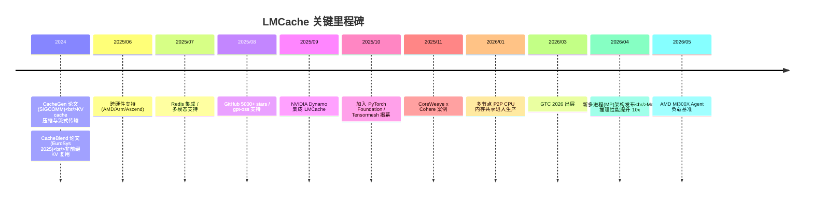

---

## 三、核心原理

### 3.1 为什么需要 KV Cache 管理

LLM 推理时，每个 token 在每一层都会产生 K、V 张量。这些 KV cache：

- **占用大量显存**：长上下文下显存压力极大
- **可复用**：相同前缀/段落无需重新 prefill
- **可迁移**：可从 GPU 卸载到 CPU/盘/远端，再按需取回

LMCache 的核心思想：**把 KV cache 当作可管理的"知识资产"**，而非临时状态。

### 3.2 多级存储架构

LMCache 实现了一个层次化存储系统，包含四个明确层级：

- **GPU Memory**：当前模型使用的活跃 KV cache 工作集
- **CPU DRAM**：最近使用 KV chunk 的"热缓存"，使用 pinned memory 加速 GPU↔CPU 传输
- **本地存储**（local disk、NVMe GDS）：大容量本地 KV 缓存（如长文档场景）
- **远端存储**（Redis、Mooncake、InfiniStore、S3）：持久化 KV cache，可靠但延迟较高

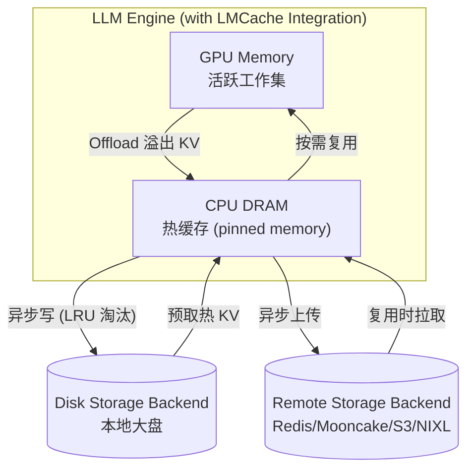

**数据流操作：**

1. **Offload**：GPU → CPU DRAM，释放显存
2. **异步写**：CPU → Disk/Remote，按 LRU 淘汰
3. **预取**：Disk/Remote → CPU，按需拉回热 KV
4. **按需复用**：CPU → GPU

### 3.3 两种工作模式

#### Storage Mode（KV cache 卸载）

LMCache 作为持久化 KV 存储，优化跨请求/会话复用。把不常用 KV 从 GPU 卸载并跨会话持久化"热"内容。KV cache 超越单次推理调用，在盘或外部存储 backing 下甚至跨进程重启存活。

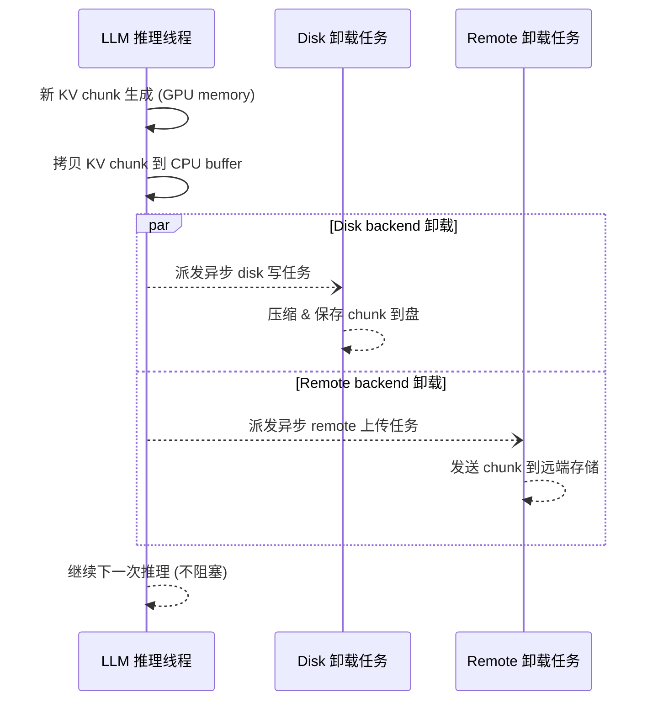

#### Transport Mode（Prefill-Decode 分离）

聚焦分布式推理，节点间实时路由 KV cache 数据。支持 PD 分离：一台 server 算 KV，通过 NIXL 等 P2P 通道低延迟高带宽传给另一台做生成。

---

## 四、核心机制

### 4.1 多进程（MP）架构总览

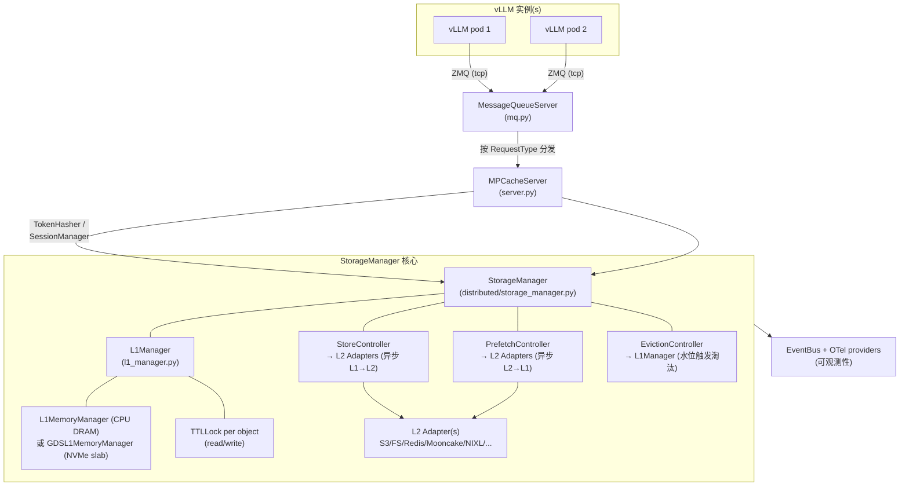

**核心组件：**

- **MPCacheServer**：薄组合器，持有 `MPCacheServerContext` 和一组 `EngineModule`（由 `_build_modules()` 根据 `--engine-type` 和 `--supported-transfer-mode` 装配）
- **EngineModule**：`LookupModule`、`ManagementModule`、`LMCacheDrivenTransferModule`、`EngineDrivenTransferModule`、可选 `BlendV3Module`/`BlendModule`
- **StorageManager**：顶层管理器，串联 L1、L2 和所有控制器
- **L1Manager**：CPU 内存对象管理，带状态机
- **L2 Adapters**：可插拔远端后端
- **Controllers**：Store/Prefetch/Eviction 后台线程

### 4.2 L1 对象状态机

`L1Manager` 管理对象在 CPU 内存（或 NVMe slab）中的状态转换：

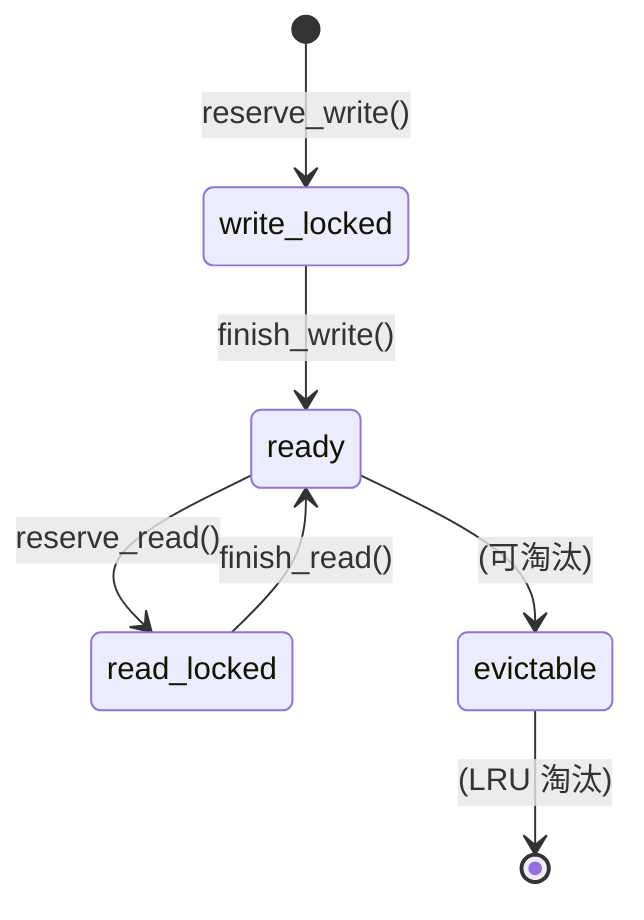

每个对象有两把 `TTLLock`（读/写），带可配置超时，防止客户端崩溃导致死锁。

底层内存分配由启动时选择的两层之一承担（都满足 `L1ManagerProtocol`）：

- `L1MemoryManager`（默认）：pinned CPU DRAM，惰性增长至 `--l1-size-gb`
- `GDSL1MemoryManager`：当 `--gds-l1-path` 设置时使用 NVMe slab 文件；字节驻留盘上，通过 cuFile 在 GPU staging buffer 与 slab 间 DMA，CPU 层在此模式禁用

### 4.3 三大核心请求流程

#### LOOKUP 流程（异步预取）

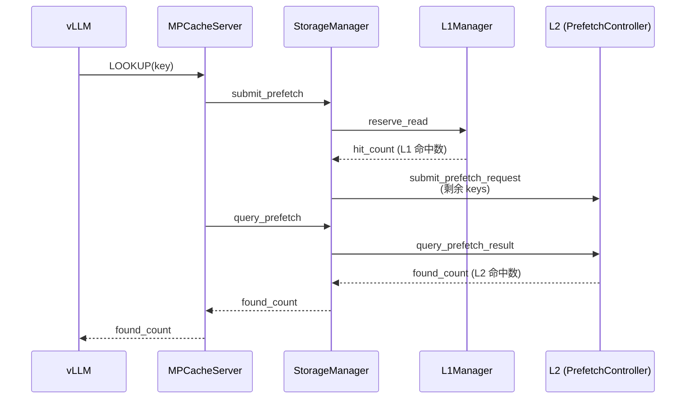

#### STORE 流程（GPU→L1→L2）

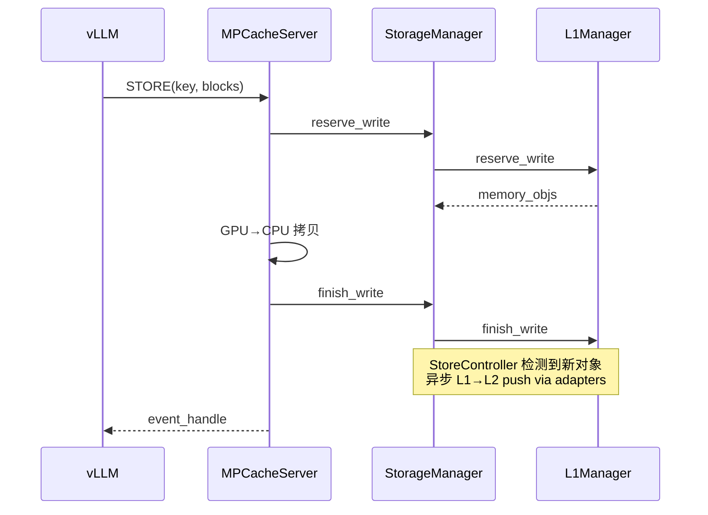

#### RETRIEVE 流程（L1→GPU）

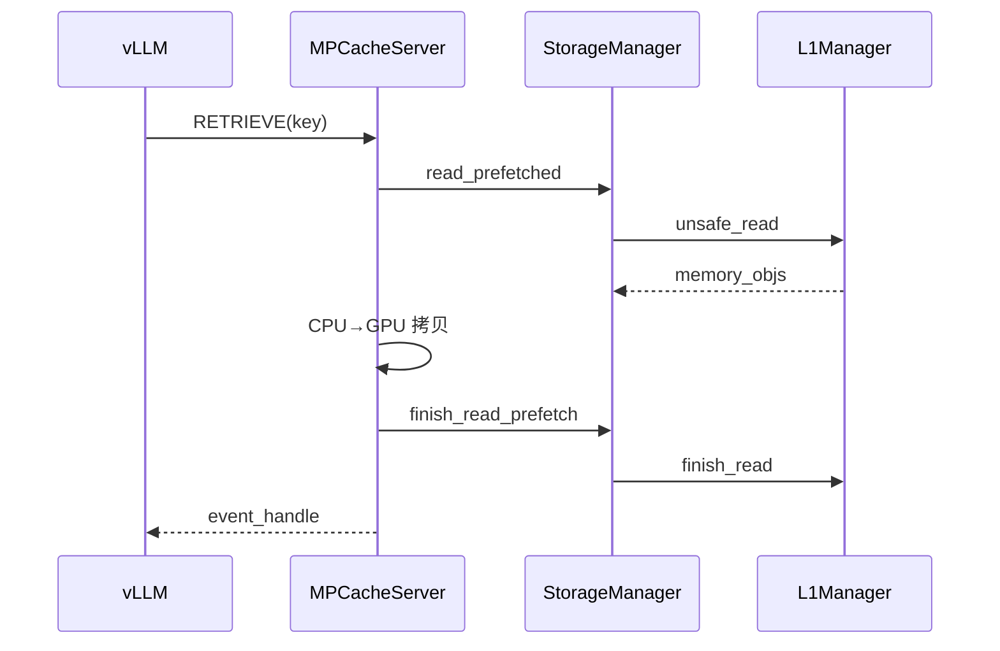

### 4.4 异步加载（Async Loading）

核心思想：**把 scheduler 侧的 lookup 与 worker 侧的 prefetch/retrieve 解耦**，让 I/O 与计算重叠，同时保持基于前缀的正确性。

- scheduler 发送带 token chunk 哈希和偏移的 lookup 请求
- worker 侧 server 在可用 backend 上执行分层 `batched_async_contains`，并对命中前缀立即发起非阻塞批量 get
- 通过 `EventManager` 跟踪完成情况，安全地把 memory obj 交还请求路径
- `AsyncSerializer` + 加权信号量按 chunk 预算整形并发，防止分配器死锁

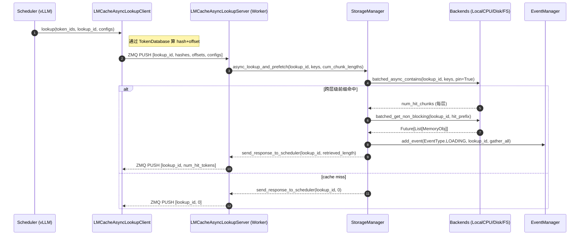

**收益：**

- **I/O–计算重叠**：解耦 lookup/prefetch 与加载，vLLM 持续调度/计算时并行拉 KV chunk
- **事件驱动同步**：`EventManager` 确保 future 安全交接，避免线程与 async loop 间竞态
- **背压与防死锁**：`AsyncSerializer` + 加权信号量按分配器预算限制并发 chunk 检索
- **优雅缺失路径**：无可检索时立即返回 `None`，worker 快速返回不阻塞 scheduler

### 4.5 CacheBlend：非前缀 KV 复用

CacheBlend 让 LMCache 能复用**任意位置**重复文本块的 KV cache（不只是共享前缀），通过对 chunk 边界处少量 token 选择性重算来恢复质量。这对 RAG、多文档场景至关重要。

**原理示意：**

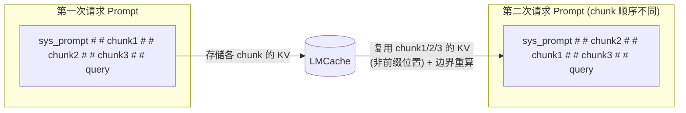

**三个版本演进：**

| 版本 | 模块 | 选择方式 | 关键创新 |
|---|---|---|---|
| V1 | `BlendModule`/`BlendEngineV2` | `--engine-type blend_legacy` | 原始 CacheBlend，多项式滚动哈希 + 紧凑 ID 查找表 |
| V2 | (V2 RPCs) | `CB_LOOKUP_PRE_COMPUTED_V2` | 返回 `CBMatchResult`（含 old/cur 范围和 per-chunk hash），retrieve 跳过重哈希 |
| V3 | `BlendV3Module` | `--engine-type blend` | **token 粒度匹配**（probe_stride=1，任意偏移）；**paged scatter** 写入 paged KV；**仅对偏移子集 re-RoPE**；`CB_UNIFIED_LOOKUP` 单 RPC 跑前缀+非前缀匹配 |

**V3 统一 lookup 流程：**

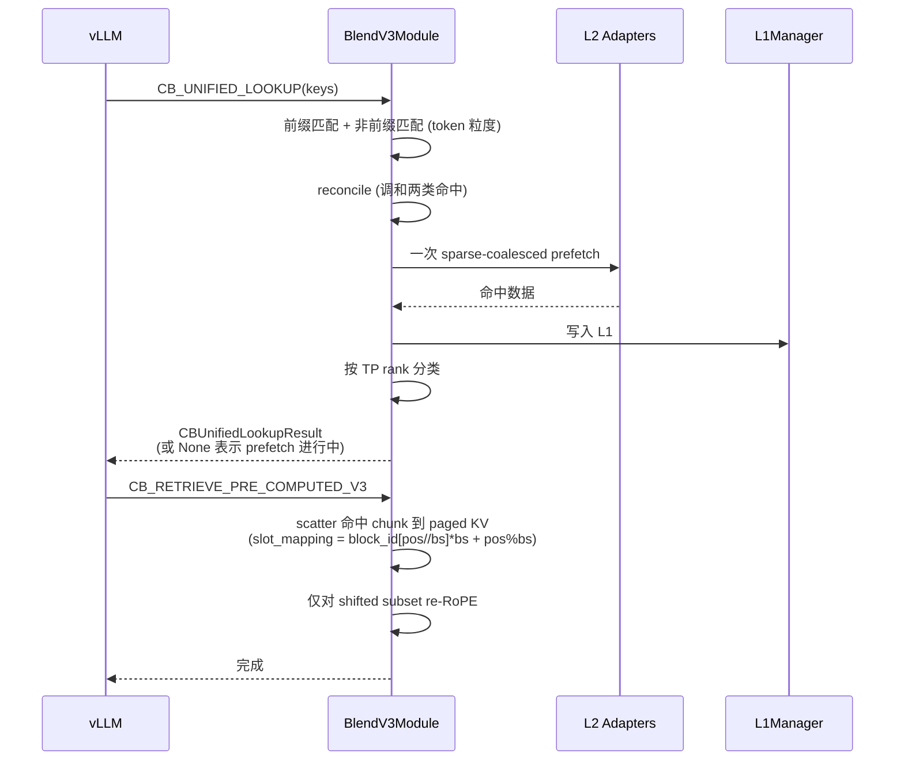

**V3 关键创新：**

- **Token 粒度匹配**（probe_stride=1，任意偏移）—— 不对齐 chunk/block
- **Paged scatter** 通过 `multi_layer_kv_transfer`，`slot_mapping = block_id[pos // bs] * bs + pos % bs` —— 按 token 写入 paged KV，正确处理 vLLM 部分 block
- **仅对偏移子集 re-RoPE**
- **`CB_UNIFIED_LOOKUP`** 是唯一活跃 lookup 路径：一个 RPC 跑前缀 + 非前缀匹配，调和，发起一次 sparse-coalesced prefetch，按 TP rank 分类
- L2 存储保持 chunk 粒度（256 token）；scatter 只写匹配的 token 子范围

### 4.6 CacheGen：KV Cache 压缩

CacheGen 利用 KV cache 的分布特性，将其编码为紧凑比特流，解码开销可忽略。

- **编码器**：`CacheGenSerializer`，使用 `CacheGenConfig.from_model_name()` 获取每层 bin 数（`kspecs`/`vspecs`），构建 `key_bins`/`value_bins` 张量，调用共享 `encode_function`。输入 `KV_2LTD` MemoryObj，输出 `CACHEGEN_BINARY` BytesBufferMemoryObj
- **配置**：`remote_serde: "cachegen"`（YAML）或 `os.environ["LMCACHE_REMOTE_SERDE"] = "cachegen"`
- **MP 模式**：L2 adapter 可通过 `SerdeL2AdapterWrapper` 透明包装 serde，控制器看到的是普通 adapter，serde 在 store/load 时透明应用
- **按需压缩**：`LMCacheEngine` 暴露 `compress()` / `decompress()` 方法，查找 key、取 memory obj、跑序列化/反序列化、重新存储
- **其他 serde**：`naive_serde`、`kivi_serde`（KIVI 量化）、分布式 serde 栈（`fp8.py`、`asym_k16_v8.py`、`multi.py`、`async_processor.py`）

### 4.7 Layerwise 分层预取

**按层粒度**存储/加载 KV cache，让前向传播在每层 KV 到达时"交错"推进，而不必等整个加载完成。CacheBlend 即构建在 layerwise 之上以流水线化重算与加载。

**核心组件：**

- **CacheEngine**：含两个生成器
  - **Retrieval Generator**（N+2 次 yield）：逐层加载，按需分配内存
  - **Storage Generator**（N+1 次 yield）：逐层保存，预先分配所有层 CPU 内存
- **LayerwiseGPUConnector**：用三条 CUDA 流协调
  - `current_stream`：vLLM 前向计算
  - `load_stream`：KV 加载
  - `store_stream`：KV 存储
- **StorageManager**：`layerwise_batched_get()`（异步检索，`.result()` 用于请求级并发）、`batched_put()`

**执行流程：**

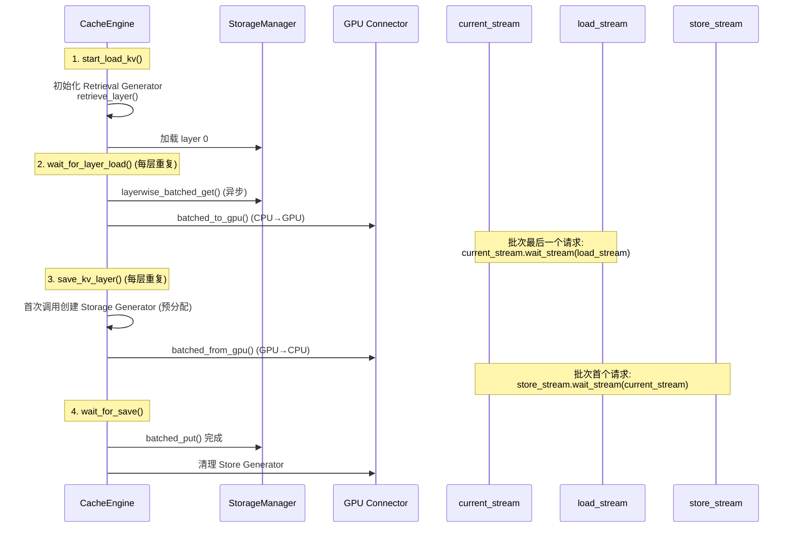

**关键优化：**

- **流水线**：layer N+1 计算与 layer N 存储重叠
- **批级协调**：首个请求提供 store 流同步，末个请求提供 load 流同步
- **内存策略**：检索逐层分配，存储预先全分配
- **Cache Key 管理**：多层 key 用 `key.split_layers(N)` 创建 per-layer key
- **配置**：`use_layerwise: true`，自动选择 `VLLMPagedMemLayerwiseGPUConnector` 或 `VLLMBufferLayerwiseGPUConnector`（blend 时）

### 4.8 PD 分离（Disaggregated Prefill）

一台 prefill 节点算 KV，通过 NIXL（NVLink/RDMA/TCP）传给 decode 节点做生成，无需重算。

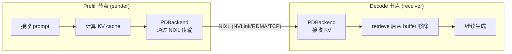

**关键配置：**

- `enable_pd: true`，`pd_role: "sender"` 或 `"receiver"`
- `pd_backend_mode: "async"`（默认，asyncio）或 `"sync"`（线程）
- sender 用 `store_location: [PDBackend]`，receiver 用 `retrieve_locations: [PDBackend]`
- receiver `remove_after_retrieve = True`（取回后从 buffer 丢弃）
- PD 与 `enable_p2p=True` 不兼容；要求 `save_unfull_chunk=True`（自动设置）

**实现要点：**

- `PDBackend` 定义 ZMQ 消息协议：`AllocRequest`/`AllocResponse`（分配远端内存）、`ProxyNotif`（通知 proxy）、`CacheQueryRequest`/`CacheQueryResponse`（查询 decoder 缓存 key）
- sync `PDBackend.remove()` 不内部调 `ref_count_down()`，engine 需手动调
- 传输用 NIXL via `CreateTransferChannel`（`nixl_channel.py`、`transfer_utils.py`）

**MP 模式 PD**：coming soon。

### 4.9 P2P KV Cache 共享

基于 controller 架构 + NIXL，实现多推理实例间**直接** cache 传输，无需中心化 cache server。适用于分布式推理场景，提供高性能 cache 共享、低延迟、可扩展性。

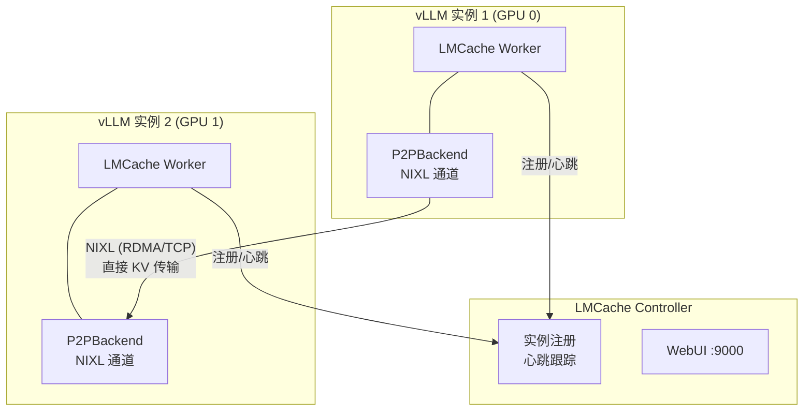

**前置条件：**

- 多 GPU 设置（至少 2 GPU）
- 推荐 RDMA NIC
- NIXL、vLLM v1、LMCache

**实测效果**（长文档 QA）：

- 第二个实例 TTFT 从 2.286s 降到 1.036s（**-54.7%**）
- 总推理时间从 37.957s 降到 13.814s（**-63.6%**）

### 4.10 MP Coordinator：舰队管理

当运行多个 MP server 时，Coordinator 是它们注册的独立 FastAPI 服务，提供舰队级视图。每个 MP server 独立缓存，coordinator 把它们绑成一个协调舰队。

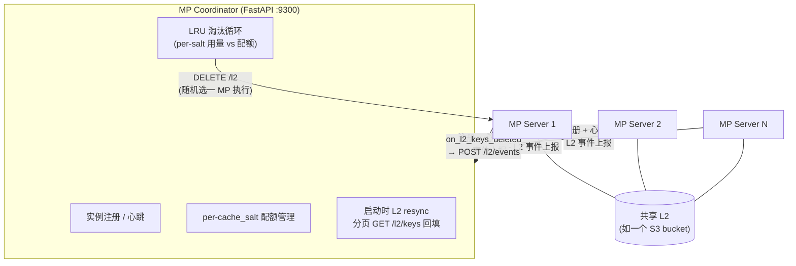

**关键能力：**

- **舰队注册/心跳**：`GET /instances`、`GET /healthz`；MP server 通过 `--coordinator-url` 注册，启动注册、运行心跳、关闭注销
- **L2 用量跟踪与淘汰**：MP server 上报 `store`/`lookup`/`delete` 事件，coordinator 聚合 per-salt 用量、执行配额、选 LRU victim
- **配额管理**：`PUT /l2/quota/{cache_salt}` 设字节预算，无配额 salt 默认 0 字节（白名单语义）
- **启动 resync**：分页拉取 MP server 的 `GET /l2/keys` 回填内存跟踪器
- **至少一次语义**：dispatch 失败或无实例则下轮重试，S3 delete 幂等
- **主动淘汰循环**：每 `EVICTION_CHECK_INTERVAL` 秒检查 per-salt 用量，超 trigger watermark 则选 LRU victim，向随机注册 MP server 发 `DELETE /l2`（因所有 MP 共享同一 L2，一次 dispatch 全舰队生效）

### 4.11 可观测性（Observability）

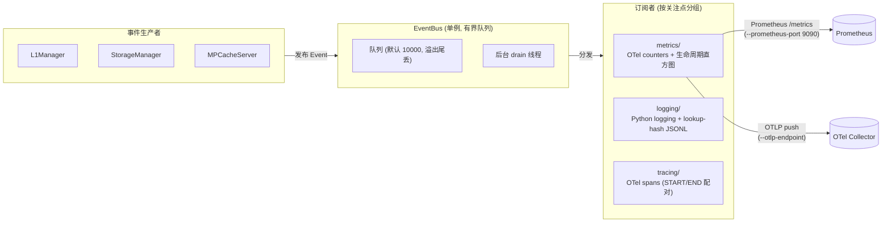

**EventBus** 是服务启动时由 `init_observability()` 初始化的全局单例。生产者发布 `Event` 到有界队列（`--event-bus-queue-size`，默认 10000，溢出尾丢），后台 drain 线程分发到所有注册订阅者。

**订阅者**按关注点分组：

- `metrics/`：OTel counters 和生命周期直方图
- `logging/`：Python logging handlers、lookup-hash JSONL
- `tracing/`：由 START/END 事件对构建的 OTel spans

**OTel providers** 在订阅者构造前由 `otel_init.py` 设置，使模块级 `get_meter()` / `get_tracer()` 绑定真实 provider。metrics 同时导出到进程内 Prometheus `/metrics` 端点（`--prometheus-port`，默认 9090）和（设置 `--otlp-endpoint` 时）OTel collector。

**KV Cache 事件**：LMCache 生成 `BlockStored`/`BlockRemoved` 事件（格式遵循 vLLM `kv_events.py`），交给 vLLM/SGLang 的消息系统发布，可用于 **KV-cache-aware 路由**。需 `enable_kv_events: true`，多 worker 时需用非默认 `pre_caching_hash_algorithm` 保证各 worker 哈希一致。

### 4.12 Token Database：缓存索引

维护内部索引，映射 token 序列到缓存 KV 条目及其位置。支持跨请求、跨实例 cache 查找，可配置 chunking 策略（默认 256 token）和哈希方案。

- **ChunkedTokenDatabase**：默认，按固定 chunk（默认 256 token）切分并哈希，支持前缀复用
- **SegmentTokenDatabase**：开启 blending 时使用，按 `blend_special_str` 切分段并独立哈希，使 chunk 可任意顺序复用
- 哈希与 vLLM prefix cache 兼容（直接复用 vLLM `kv_cache_utils.get_hash_fn_by_name`）

### 4.13 L2 Adapter：可插拔远端后端

`L2AdapterInterface` 定义三个异步任务方法（submit → poll eventfd → query result）：

- `submit_store_task(keys, objects)` → 推数据到 L2
- `submit_lookup_and_lock_task(keys, layout_desc)` → 查存在性 + 加锁防淘汰
- `submit_load_task(keys, objects)` → 从 L2 加载到 L1 buffer

每个 adapter 暴露**三个独立 eventfd**（store/lookup/load）供控制器轮询。工厂 `create_l2_adapter()` 用 `isinstance()` 匹配 config 类型；新 adapter 通过 `register_l2_adapter_type()` / `register_l2_adapter_factory()` 自注册，`__init__.py` 用 `pkgutil` 自动发现。

**已实现 adapter：**

| Adapter | 说明 |
|---|---|
| `s3` | S3 兼容对象存储 |
| `fs` / `fs_native` | 文件系统 |
| `raw_block` | 裸块设备 |
| `dax` / `devdax` | DAX 持久内存 |
| `aerospike` | Aerospike |
| `resp` | Redis/Valkey |
| `mooncake_store` | Mooncake |
| `nixl_store` / `nixl_store_dynamic` | NIXL |
| `hfbucket` | HF Bucket |
| `p2p` | P2P |
| `fault_inject` | 故障注入（测试） |
| `mock` | Mock（测试） |
| `native_connector` | 桥接 C++/Rust connector |
| `serde_wrapper` | 透明 serde 包装 |

### 4.14 三大后台控制器

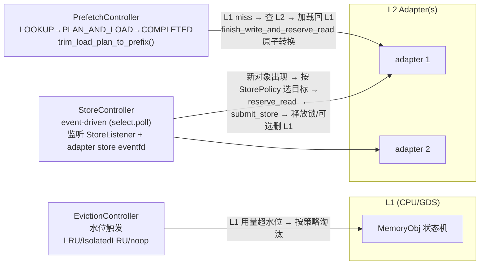

- **StoreController**：事件驱动后台线程，用 `select.poll()` 监听 listener eventfd 和 adapter store eventfd。当 L1 `finish_write()` 完成，`StoreListener` 入队 key；controller 按 shape 分组，应用 `StorePolicy.select_store_targets()`，reserve L1 读锁，提交 store 任务，完成后释放锁并按 `select_l1_deletions()` 可选删 L1
- **PrefetchController**：处理 `LOOKUP` RPC 的 L2 lookup + load。两阶段状态机：LOOKUP → PLAN_AND_LOAD → COMPLETED。**强制只加载连续前缀**（`trim_load_plan_to_prefix()`，只加载找到 key 的连续前缀）。用 `finish_write_and_reserve_read()` 原子 write→read 转换
- **EvictionController**：两个变体 —— `L1EvictionController`（水位触发 L1 淘汰）和 `L2EvictionController`（per-adapter L2 淘汰，用 `LRU`、`IsolatedLRU` per `cache_salt`、或 `noop`）。`IsolatedLRU` 按 `cache_salt` 隔离淘汰，限额通过 `/quota` HTTP 端点注册

---

## 五、关键文件索引

### v1 核心（进程内引擎）

| 文件 | 用途 |
|---|---|
| `lmcache/v1/cache_engine.py` | `LMCacheEngine`、`LMCacheEngineBuilder` |
| `lmcache/v1/cache_interface.py` | `LMCacheModelRequest` |
| `lmcache/v1/config.py` | `LMCacheEngineConfig` |
| `lmcache/v1/manager.py` | `LMCacheManager`（生命周期） |
| `lmcache/v1/metadata.py` | `LMCacheMetadata` |
| `lmcache/v1/token_database.py` | `TokenDatabase`、`ChunkedTokenDatabase`、`SegmentTokenDatabase` |

### v1 进程内存储

| 文件 | 用途 |
|---|---|
| `lmcache/v1/storage_backend/storage_manager.py` | 进程内 `StorageManager` |
| `lmcache/v1/storage_backend/local_cpu_backend.py` 等 | 各 backend 实现 |
| `lmcache/v1/storage_backend/cache_policy/` | `lru.py`、`lfu.py`、`mru.py`、`fifo.py` |
| `lmcache/v1/storage_backend/naive_serde/` | `cachegen_encoder.py`、`cachegen_decoder.py`、`kivi_serde.py`、`naive_serde.py` |

### v1 分布式（MP）存储

| 文件 | 用途 |
|---|---|
| `lmcache/v1/distributed/storage_manager.py` | 分布式 `StorageManager` |
| `lmcache/v1/distributed/l1_manager.py` | `L1Manager`（状态机） |
| `lmcache/v1/distributed/memory_manager/` | `L1MemoryManager`、`GDSL1MemoryManager` |
| `lmcache/v1/distributed/l2_adapters/base.py` | `L2AdapterInterface` |
| `lmcache/v1/distributed/l2_adapters/` | 所有 adapter 实现 |
| `lmcache/v1/distributed/storage_controllers/` | `store_controller.py`、`prefetch_controller.py`、`eviction_controller.py`、`store_policy.py`、`prefetch_policy.py` |
| `lmcache/v1/distributed/eviction_policy/` | `lru.py`、`isolated_lru.py`、`noop.py` |

### MP server 与模块

| 文件 | 用途 |
|---|---|
| `lmcache/v1/multiprocess/server.py` | `MPCacheServer`、`_build_modules()` |
| `lmcache/v1/multiprocess/http_server.py` | FastAPI 封装 |
| `lmcache/v1/multiprocess/modules/` | `lookup.py`、`management.py`、`lmcache_driven_transfer.py`、`engine_driven_transfer.py`、`blend.py`、`blend_v3.py` |
| `lmcache/v1/multiprocess/protocols/` | `base.py`、`blend.py`、`blend_v2.py`、`blend_v3.py`、`engine.py`、`p2p.py` |
| `lmcache/v1/mp_coordinator/` | 舰队协调器 |
| `lmcache/v1/mp_observability/` | EventBus、订阅者（metrics/logging/tracing）、OTel init |

### CacheBlend 计算

| 文件 | 用途 |
|---|---|
| `lmcache/v1/compute/blend/blender.py` | `LMCBlender` |
| `lmcache/v1/compute/attention/` | `flash_attn.py`、`flash_infer_sparse.py`、`triton_sparse.py` |
| `lmcache/v1/compute/models/` | `llama.py`、`qwen3.py` |

### 关键文档

| 文档 | 内容 |
|---|---|
| `docs/source/legacy/index.rst` | 遗留进程内模式（已废弃） |
| `docs/source/mp/index.rst` | MP 架构、ZMQ 协议、请求流程 |
| `docs/source/developer_guide/architecture.rst` | 高层架构 |
| `docs/source/kv_cache_optimizations/` | blending、cacheblend、layerwise、segmented_prefill |
| `docs/source/kv_cache/` | async_loading、caching_policies、p2p_sharing、multiprocess_mode |
| `docs/source/mp/` | coordinator、deployment、disaggregated_prefill、p2p |
| `docs/design/` | 设计文档（镜像 `lmcache/` 包树） |

---

## 六、总结

LMCache 的演进本质是**从"嵌入式缓存库"到"独立 KV cache 管理服务"**的架构升级：

1. **前世（v0）**：进程内嵌，单租户，同步路径，扁平 backend —— 简单但脆弱、不可共享
2. **今生（v1）**：独立 MP server，多租户共享 L1，异步预取，显式 L1/L2 + 控制器，可插拔 adapter，舰队协调，全链路可观测

**核心机制可归纳为五条主线：**

- **多级存储**：GPU → CPU DRAM → 本地盘 → 远端，四级层次化卸载/预取
- **异步预取**：LOOKUP → 后台 L2→L1 → 轮询 → RETRIEVE，I/O 与计算重叠
- **非前缀复用**：CacheBlend V1→V2→V3，从 chunk 粒度到 token 粒度，paged scatter + re-RoPE
- **分布式传输**：PD 分离（NIXL）+ P2P 共享 + MP Coordinator 舰队管理
- **可插拔与可观测**：L2 adapter 自注册 + EventBus/OTel/Prometheus 全链路追踪

这些机制共同把 KV cache 从"临时显存状态"提升为"可管理、可复用、可观测的 AI 原生知识资产"，是长上下文 Agent、多轮对话、RAG 场景下降低 TTFT、提升吞吐的关键基础设施。

---

## 参考资料

- LMCache 论文：[arXiv:2510.09665](https://arxiv.org/abs/2510.09665)
- CacheGen 论文：ACM SIGCOMM 2024
- CacheBlend 论文：EuroSys 2025
- 官方文档：[https://docs.lmcache.ai/](https://docs.lmcache.ai/)
- 官方博客：[https://blog.lmcache.ai/](https://blog.lmcache.ai/)
- GitHub：[https://github.com/LMCache/LMCache](https://github.com/LMCache/LMCache)
