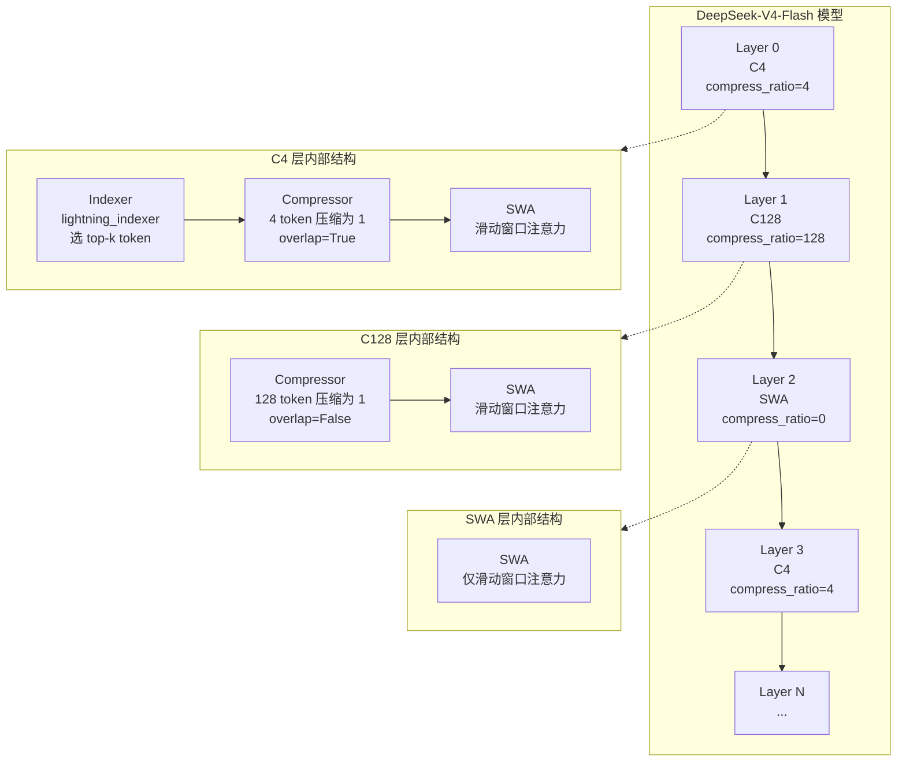
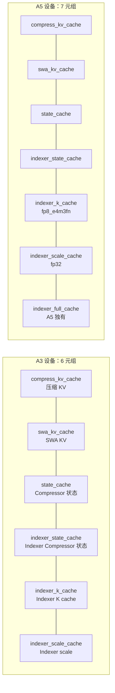
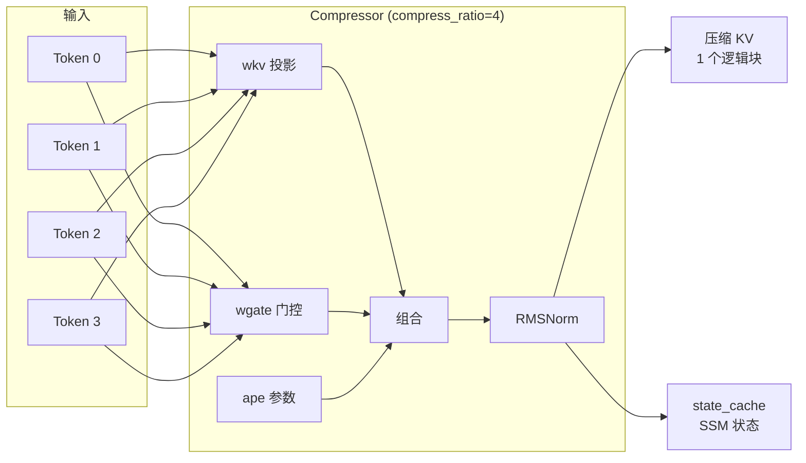
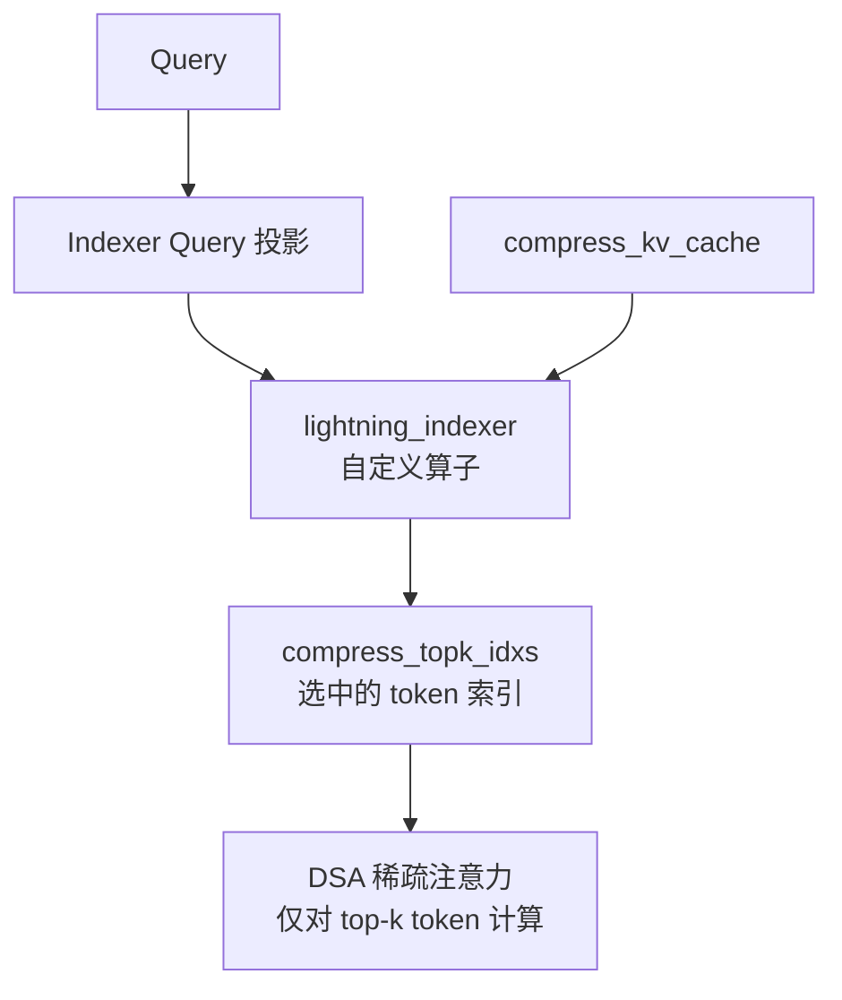
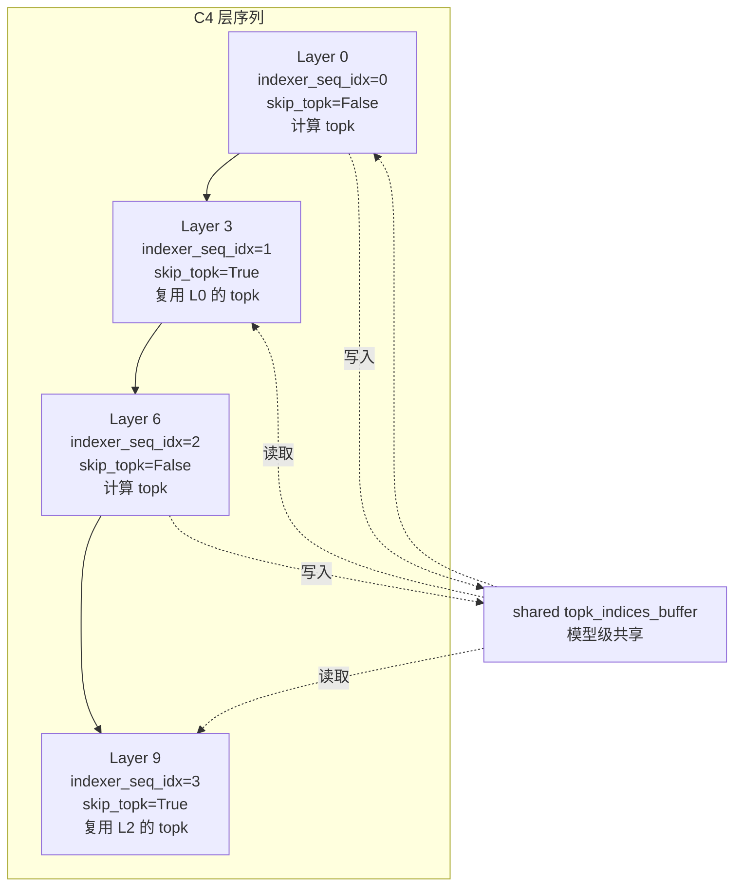
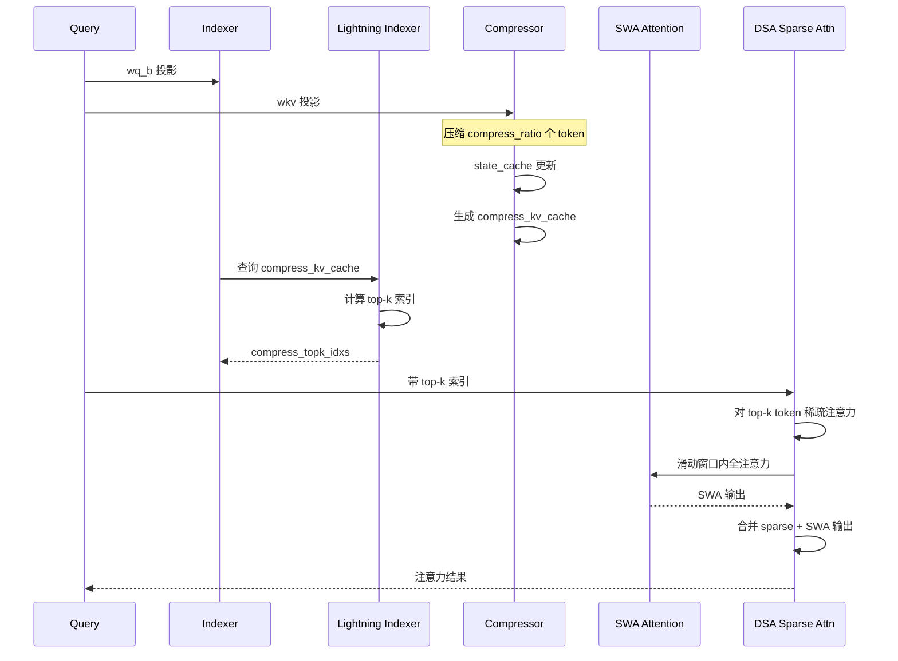
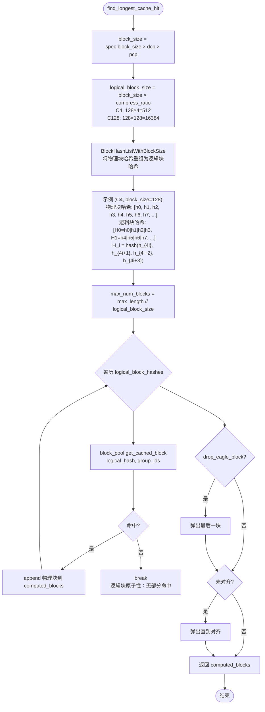
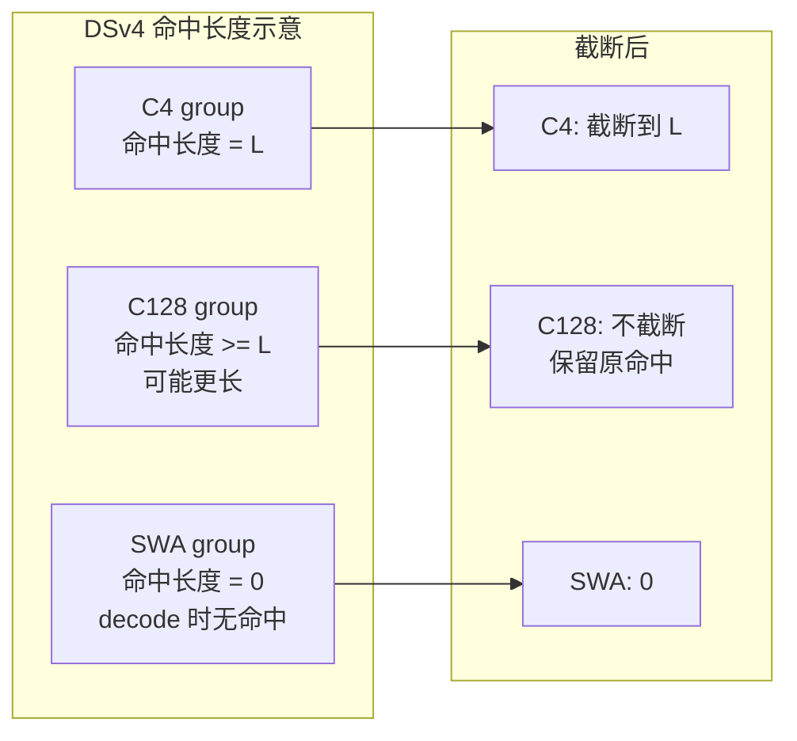
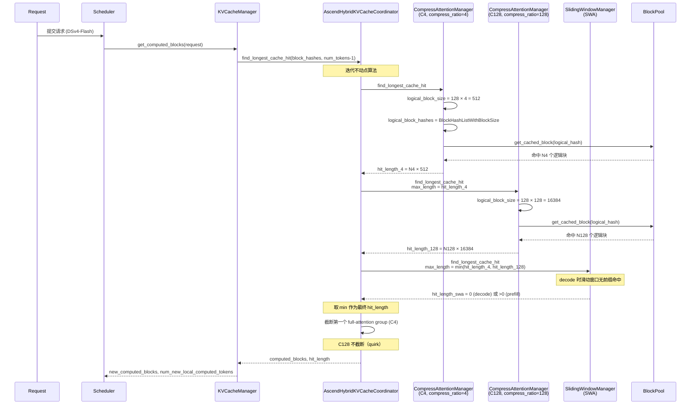

# DeepSeek-V4-Flash KV 计算与 Prefix Cache 分析

> 基于 vllm-ascend main 分支源码分析。DSv4-Flash 是 DeepSeek V4 系列的轻量变体，采用异构层架构（C4 / C128 / SWA）与压缩 MLA，对 KV 计算和 prefix cache 提出了独特挑战。

## 1. DSv4-Flash 模型架构总览

### 1.1 异构层架构

DSv4-Flash 通过 `compress_ratios` 配置为每层指定类型。源码位置：`vllm_ascend/utils.py:105`

```python
def get_dsv4_compress_ratio(config: Any, layer_idx: int) -> int:
    """Return DSV4 compress ratio, treating unspecified MTP layers as dense."""
    compress_ratios = getattr(config, "compress_ratios", None)
    if compress_ratios is None or layer_idx >= len(compress_ratios):
        return 0
    return compress_ratios[layer_idx]
```

| compress_ratio | 层类型 | 组成 | KV cache 组 |
|---|---|---|---|
| `4` | **C4 层** | Indexer + Compressor + SWA | MLAAttentionSpec (compress_ratio=4) |
| `128` | **C128 层** | Compressor + SWA（无 Indexer） | MLAAttentionSpec (compress_ratio=128) |
| `0` 或 `1` | **SWA 层** | 仅 Sliding Window Attention | SlidingWindowMLASpec |

### 1.2 整体架构图



### 1.3 三类层的对比

| 特性 | C4 层 | C128 层 | SWA 层 |
|---|---|---|---|
| compress_ratio | 4 | 128 | 0/1 |
| Indexer（稀疏选择） | 有 | 无 | 无 |
| Compressor（KV 压缩） | 有（overlap=True） | 有（overlap=False） | 无 |
| SWA（滑动窗口） | 有 | 有 | 有 |
| 逻辑块大小 | block_size × 4 | block_size × 128 | block_size |
| KV cache 组 | MLAAttentionSpec | MLAAttentionSpec | SlidingWindowMLASpec |

## 2. DSv4-Flash 的 KV 计算

### 2.1 KV Cache 6 元组 / 7 元组布局

源码位置：`vllm_ascend/ops/dsa.py:226`

```python
def _build_kv_cache(self, forward_context):
    """Construct the 6-tuple KV cache used by impl.forward()."""
    compress_kv_cache = None
    swa_kv_cache = self.swa_cache_layer.kv_cache
    state_cache = None
    indexer_state_cache = None
    indexer_k_cache = None
    indexer_scale_cache = None
    indexer_full_cache = None

    if self.compress_ratio > 1:
        state_cache = self.compressor.state_cache.kv_cache
        compress_kv_cache = self.dsa_attn.kv_cache
    if self.compress_ratio == 4:
        indexer_state_cache = self.indexer.compressor.state_cache.kv_cache
        if get_ascend_device_type() in {AscendDeviceType.A5}:
            indexer_k_cache, indexer_scale_cache, indexer_full_cache = (
                self.indexer.k_cache.kv_cache[0][0],
                self.indexer.k_cache.kv_cache[0][1],
                self.indexer.k_cache.kv_cache[0][2],
            )
        else:
            indexer_k_cache, indexer_scale_cache = (
                self.indexer.k_cache.kv_cache[0][0],
                self.indexer.k_cache.kv_cache[0][1],
            )

    # A5: 7-tuple, A3: 6-tuple
    if get_ascend_device_type() in {AscendDeviceType.A5}:
        kv_cache = (compress_kv_cache, swa_kv_cache, state_cache,
                    indexer_state_cache, indexer_k_cache,
                    indexer_scale_cache, indexer_full_cache)
    else:
        kv_cache = (compress_kv_cache, swa_kv_cache, state_cache,
                    indexer_state_cache, indexer_k_cache, indexer_scale_cache)
    return kv_cache
```

### 2.2 KV Cache 元组结构



**各字段含义：**

| 字段 | C4 层 | C128 层 | SWA 层 | 说明 |
|---|---|---|---|---|
| `compress_kv_cache` | ✓ | ✓ | ✗ | 压缩后的 KV（逻辑块） |
| `swa_kv_cache` | ✓ | ✓ | ✓ | 滑动窗口内的原始 KV |
| `state_cache` | ✓ | ✓ | ✗ | Compressor 的隐状态（SSM 风格） |
| `indexer_state_cache` | ✓ | ✗ | ✗ | Indexer 内部 Compressor 的状态 |
| `indexer_k_cache` | ✓ | ✗ | ✗ | Indexer 的 K cache（int8/fp8） |
| `indexer_scale_cache` | ✓ | ✗ | ✗ | Indexer K 的 scale |
| `indexer_full_cache` | ✓(A5) | ✗ | ✗ | A5 独有的完整 indexer cache |

### 2.3 Compressor 机制

源码位置：`vllm_ascend/models/deepseek_v4.py:588`

```python
class Compressor(nn.Module):
    def __init__(self, vllm_config, config, compress_ratio=4, head_dim=512, ...):
        self.compress_ratio = compress_ratio
        self.overlap = compress_ratio == 4  # 仅 C4 启用 overlap
        self.coff = 1 + self.overlap  # C4: coff=2, C128: coff=1
        self.ape = nn.Parameter(torch.empty(
            compress_ratio, self.coff * self.head_dim, dtype=torch.float32
        ))
        self.wkv = ReplicatedLinear(self.dim, self.coff * self.head_dim, ...)
        self.wgate = ReplicatedLinear(self.dim, self.coff * self.head_dim, ...)
```

**Compressor 工作原理：**



**关键设计：**

- **C4 的 overlap**：`coff=2`，ape 参数宽度翻倍，允许相邻压缩块有重叠信息
- **C128 无 overlap**：`coff=1`，简单压缩
- **state_cache**：Compressor 维护类似 SSM 的隐状态，跨块传递

### 2.4 Indexer 与 Lightning Indexer

源码位置：`vllm_ascend/models/deepseek_v4.py:521`

```python
class Indexer(nn.Module):
    def __init__(self, vllm_config, config, compress_ratio, ...):
        self.wq_b = ReplicatedLinear(...)
        self.wk_weights_proj = ReplicatedLinear(...)
        self.k_norm = RMSNorm(...)
        self.compressor = Compressor(...)  # Indexer 内部还有自己的 Compressor
```

**Lightning Indexer 自定义算子：**

- `torch.ops._C_ascend.npu_quant_lightning_indexer` —— 量化 lightning indexer 内核
- `torch.ops._C_ascend.npu_quant_lightning_indexer_metadata` —— metadata 构建器

**Indexer 的作用：** 从压缩 KV cache 中选择 top-k 相关 token，生成 `compress_topk_idxs`，供 DSA 稀疏注意力使用。



### 2.5 IndexCache：跨层 top-k 复用

源码位置：`vllm_ascend/models/deepseek_v4.py:826`

```python
# IndexCache: 决定本层是否复用前序层的 topk
# 参考: https://arxiv.org/abs/2603.12201
skip_topk = False
if self.compress_ratio == 4 and getattr(config, "use_index_cache", False) \
   and ".mtp." not in prefix:
    compress_ratios = getattr(config, "compress_ratios", None) or []
    indexer_seq_idx = sum(1 for r in compress_ratios[:config_layer_idx] if r == 4)
    pattern = getattr(config, "index_topk_pattern", None)
    freq = getattr(config, "index_topk_freq", 1)
    if pattern is None:
        # 默认：按 freq 频率复用
        skip_topk = max(indexer_seq_idx - 1, 0) % freq != 0
    else:
        # 自定义模式：F=计算, S=跳过
        assert pattern[0] == "F", "index_topk_pattern must start with 'F'"
        if 0 <= indexer_seq_idx < len(pattern):
            skip_topk = pattern[indexer_seq_idx] == "S"
```

**IndexCache 工作流程：**



**关键点：**

- `topk_indices_buffer` 在模型级分配，跨 C4 层共享
- MTP 层排除（`.mtp.` not in prefix），因为 spec_decode 仅在模型级共享
- `index_topk_pattern` 支持 "F"（计算）/"S"（跳过）自定义模式
- `index_topk_freq` 控制复用频率（默认 1 = 每层都计算）

### 2.6 DSA 前向计算流程

源码位置：`vllm_ascend/attention/dsa_v1.py:1732`

```python
# 解包 KV cache 6/7 元组
(compress_kv_cache, swa_kv_cache, state_cache, indexer_k_cache,
 indexer_scale_cache, indexer_full_cache) = (
    DeviceOperator.unpack_dsa_forward_kv_cache(kv_cache, self.compress_ratio)
)

if self.compress_ratio == 4:
    # C4: 5 个 attn_metadata
    # [attn, compressor.state_state, indexer.compressor.state_state,
    #  indexer.k_cache, swa_cache]
    (compressor_attn_metadata, compressor_kv_state_metadata, _,
     indexer_kv_scale_metadata, swa_metadata) = attn_metadata
elif self.compress_ratio == 128:
    # C128: 3 个 attn_metadata
    # [attn, compressor.state_state, swa_cache]
    (compressor_attn_metadata, compressor_kv_state_metadata, swa_metadata) = attn_metadata
```

**C4 层前向计算时序：**



### 2.7 RoPE with rope_groups

源码位置：`vllm_ascend/ops/rope_dsv4.py`

DSv4-Flash 支持不同层类型使用不同 RoPE 频率：

```python
class ComplexExpRotaryEmbedding:
    """支持 rope_groups 的 RoPE"""
    # 不同 compress_ratio 的层可属于不同 rope_group
    # 例如 "default" 和 "c4" 两组
```

**关键组件：**

- `RopeGlobalState`：全局 RoPE 状态，含 `static_cache`、`runtime_buffer`
- `RopeDataProxy`：多组 RoPE 访问代理
- `get_cos_and_sin_dsa`：DSA 专用 cos/sin 计算

## 3. DSv4-Flash 的 Prefix Cache 计算

### 3.1 核心挑战：压缩逻辑块哈希

DSv4-Flash 的 prefix cache 面临独特挑战：

- **C4 层**：每 4 个物理块（4 × block_size token）压缩为 1 个逻辑块
- **C128 层**：每 128 个物理块（128 × block_size token）压缩为 1 个逻辑块
- **SWA 层**：标准物理块

**问题：** 若用物理块粒度哈希，压缩块的部分命中无意义（压缩是原子的）。因此必须用**逻辑块粒度**哈希。

### 3.2 CompressAttentionManager

源码位置：`vllm_ascend/core/single_type_kv_cache_manager.py:29`

```python
class CompressAttentionManager(FullAttentionManager):
    def __init__(self, kv_cache_spec: MLAAttentionSpec, block_pool: BlockPool, **kwargs):
        super().__init__(kv_cache_spec, block_pool, **kwargs)
        self.compress_ratio = kv_cache_spec.compress_ratio
        self._null_block = block_pool.null_block
```

**Token 数缩放：** 所有 token 计数除以 `compress_ratio` 后委托给父类：

```python
def get_num_blocks_to_allocate(self, ..., num_tokens, ...):
    num_tokens //= self.compress_ratio
    num_tokens_main_model //= self.compress_ratio
    return super().get_num_blocks_to_allocate(...)
```

### 3.3 逻辑块哈希机制

源码位置：`vllm_ascend/core/single_type_kv_cache_manager.py:193`

```python
@classmethod
def find_longest_cache_hit(cls, block_hashes, max_length, kv_cache_group_ids,
                           block_pool, kv_cache_spec, alignment_tokens, ...):
    computed_blocks = tuple([] for _ in range(len(kv_cache_group_ids)))
    block_size = kv_cache_spec.block_size
    if dcp_world_size * pcp_world_size > 1:
        block_size *= dcp_world_size * pcp_world_size

    # 关键：逻辑块大小 = 物理块大小 × 压缩比
    logical_block_size = block_size * kv_cache_spec.compress_ratio
    # 将物理块哈希重组为逻辑块哈希
    logical_block_hashes = BlockHashListWithBlockSize(
        block_hashes, block_size, logical_block_size
    )
    max_num_blocks = max_length // logical_block_size

    for block_hash in itertools.islice(logical_block_hashes, max_num_blocks):
        if cached_block := block_pool.get_cached_block(block_hash, kv_cache_group_ids):
            for computed, cached in zip(computed_blocks, cached_block):
                computed.append(cached)
        else:
            break  # 首次 miss 即停

    # EAGLE/MTP 末块丢弃
    if eagle_drop and computed_blocks[0]:
        for computed in computed_blocks:
            computed.pop()

    # 对齐处理
    while (logical_block_size != alignment_tokens
           and len(computed_blocks[0]) * logical_block_size % alignment_tokens != 0):
        for computed in computed_blocks:
            computed.pop()

    return computed_blocks
```

### 3.4 逻辑块哈希流程



### 3.5 逻辑块哈希的原子性

**关键特性：** 逻辑块内的任一物理块 token 变化都会使整个逻辑块哈希失效。

测试验证（`tests/ut/test_compressed_prefix_cache.py:82`）：

```python
def test_compressed_prefix_cache_uses_logical_block_hash():
    block_size = 128
    compress_ratio = 4
    logical_block_size = block_size * compress_ratio  # 512
    spec, block_pool, manager = _make_compress_manager(block_size, compress_ratio)

    request_a_tokens = list(range(logical_block_size))  # [0..511]
    request_b_tokens = request_a_tokens.copy()
    request_b_tokens[block_size + 7] = 999_999  # 修改第 135 个 token（第 2 个物理块内）

    request_a = _make_request("a", request_a_tokens, block_size)
    request_b = _make_request("b", request_b_tokens, block_size)

    # 缓存 request_a
    manager.allocate_new_blocks(request_a.request_id, ...)
    manager.cache_blocks(request_a, num_tokens=logical_block_size)

    # request_b 查找命中
    hit_blocks = CompressAttentionManager.find_longest_cache_hit(
        block_hashes=request_b.block_hashes, ...
    )[0]

    assert hit_blocks == []  # 无部分命中！
```

### 3.6 cache_blocks 的逻辑块写入

源码位置：`vllm_ascend/core/single_type_kv_cache_manager.py:157`

```python
def cache_blocks(self, request, num_tokens, ...):
    num_cached_blocks = self.num_cached_block.get(request.request_id, 0)
    # 逻辑块数 = token 数 / (block_size × compress_ratio)
    num_full_blocks = num_tokens // (self.block_size * self.compress_ratio)

    if num_cached_blocks >= num_full_blocks:
        return

    self.block_pool.cache_full_blocks(
        request=request,
        blocks=self.req_to_blocks[request.request_id],
        num_cached_blocks=num_cached_blocks,
        num_full_blocks=num_full_blocks,
        block_size=self.block_size * self.compress_ratio,  # 逻辑块大小
        kv_cache_group_id=self.kv_cache_group_id,
    )
    self.num_cached_block[request.request_id] = num_full_blocks
```

### 3.7 AscendHybridKVCacheCoordinator 的 DSv4 处理

源码位置：`vllm_ascend/patch/platform/patch_kv_cache_coordinator.py:58`

#### 3.7.1 有效块大小计算

```python
def _get_effective_block_size(self, kv_cache_spec: KVCacheSpec) -> int:
    block_size = kv_cache_spec.block_size
    if isinstance(kv_cache_spec, MambaSpec) and self.enable_caching:
        return block_size
    if self.dcp_world_size * self.pcp_world_size > 1:
        block_size *= self.dcp_world_size * self.pcp_world_size
    if hasattr(kv_cache_spec, "compress_ratio"):
        compress_ratio = kv_cache_spec.compress_ratio or 1
        compress_ratio = compress_ratio if compress_ratio >= 1 else 1
        block_size *= compress_ratio
    return block_size
```

**示例（block_size=128, dcp=1, pcp=1）：**

| 层类型 | compress_ratio | 有效块大小 |
|---|---|---|
| C4 | 4 | 128 × 4 = 512 |
| C128 | 128 | 128 × 128 = 16384 |
| SWA | 0/1 | 128 × 1 = 128 |

#### 3.7.2 LCM 对齐块大小

```python
block_sizes = [self._get_effective_block_size(spec) for spec, _, _ in self.attention_groups]
self.lcm_block_size = lcm(*block_sizes)
# DSv4: lcm(512, 16384, 128) = 16384 (16k)
```

注释提到："use 16k as the alignment tokens for model with compress ratio"。

#### 3.7.3 迭代不动点算法

```mermaid
flowchart TD
    Start([find_longest_cache_hit]) --> Init[hit_length = max_cache_hit_length]
    Init --> Loop{迭代}

    Loop --> Scan[对每个 attention group:<br/>manager.find_longest_cache_hit<br/>alignment = lcm_block_size]
    Scan --> Update[curr_hit_length = len(hit_blocks[0]) × effective_block_size]
    Update --> Check{curr_hit_length < hit_length?}

    Check -- 是 --> Eagle[EAGLE 验证失效处理]
    Eagle --> SetHit[hit_length = curr_hit_length]
    SetHit --> Simple{is_simple_hybrid?}
    Check -- 否 --> Simple

    Simple -- 否 --> Loop
    Simple -- 是 --> Truncate[截断第一个 full-attention group]
    Truncate --> Return[返回 hit_blocks, hit_length]
    Return --> End([结束])
```

#### 3.7.4 DSv4 的「两个 Full-Attention Group」Quirk

源码位置：`vllm_ascend/patch/platform/patch_kv_cache_coordinator.py:310`

```python
# Truncate full attention blocks to final hit_length (if present)
# NOTE(zxr): for deepseek-v4, there is two fullattn groups, but
# in this function, only the first fullattn group is truncate by
# the belowing codes(c4), c128 layer does not truncate, which may
# have prefix cache block hit.
# Due to slidingwindow attn, deepseek-v4 decode node can't have
# any prefix cache hit, because `hit_length` of SWA is 0.
spec, group_ids, _ = self.attention_groups[0]
if isinstance(spec, FullAttentionSpec):
    num_blocks = hit_length // self._get_effective_block_size(spec)
    for group_id in group_ids:
        if (blks := hit_blocks_by_group[group_id]) is not None:
            del blks[num_blocks:]
```

**关键含义：**

1. DSv4 有**两个 full-attention group**（C4 和 C128）
2. 截断逻辑**只处理第一个** full-attention group（C4）
3. **C128 group 不截断**，可能保留超过 C4 命中长度的 prefix cache 块
4. **SWA 层在 decode 时无 prefix cache 命中**（`hit_length` 为 0，因为滑动窗口只覆盖最近 token）



### 3.8 DSv4-Flash Prefix Cache 端到端流程



## 4. DSv4-Flash 的 Attention Spec

### 4.1 AscendMLAAttentionSpec（C4/C128 层）

源码位置：`vllm_ascend/patch/platform/patch_kv_cache_interface.py:29`

```python
@dataclass(frozen=True)
class AscendMLAAttentionSpec(MLAAttentionSpec):
    scale_dim: int = 0
    scale_dtype: torch.dtype = torch.int8
    sparse_head_dim: tuple[int, ...] | None = None
    cache_sparse_c8: bool = False
    c8_k_cache_dtype: torch.dtype = field(default_factory=_get_c8_k_cache_dtype)
    c8_k_scale_cache_dtype: torch.dtype = field(default_factory=_get_c8_k_scale_cache_dtype)
```

**A5 vs A3 dtype 差异：**

```python
def _get_c8_k_cache_dtype() -> torch.dtype:
    return torch.float8_e4m3fn if get_ascend_device_type() == AscendDeviceType.A5 else torch.int8

def _get_c8_k_scale_cache_dtype() -> torch.dtype:
    return torch.float32 if get_ascend_device_type() == AscendDeviceType.A5 else torch.float16
```

### 4.2 AscendSlidingWindowMLASpec（SWA 层）

源码位置：`vllm_ascend/patch/platform/patch_kv_cache_interface.py:214`

```python
@dataclass(frozen=True, kw_only=True)
class AscendSlidingWindowMLASpec(SlidingWindowMLASpec):
    cache_dtype_str: str | None = None
    alignment: int | None = None
    compress_ratio: int = 1
    model_version: str | None = None
```

### 4.3 compress_ratio 验证

源码位置：`vllm_ascend/patch/platform/patch_kv_cache_interface.py:198`

```python
def _init_mla_cache_fields(spec):
    FP8_DTYPE = "fp8_ds_mla"
    MODEL_VERSIONS = ["v32", "deepseek_v4"]
    if spec.cache_dtype_str != FP8_DTYPE:
        return
    assert spec.model_version in MODEL_VERSIONS
    assert (spec.model_version == "v32" and spec.compress_ratio == 1) or (
        spec.model_version == "deepseek_v4" and spec.compress_ratio in [0, 4, 128]
    )
    if spec.compress_ratio > 1:
        assert spec.block_size % spec.compress_ratio == 0, (
            f"Block size {spec.block_size} must be divisible by compress ratio."
        )
```

**合法配置：**

| model_version | compress_ratio | 说明 |
|---|---|---|
| `v32` | 1 | DSv3.2 标准 MLA |
| `deepseek_v4` | 0 | SWA-only 层 |
| `deepseek_v4` | 4 | C4 层（Indexer + Compressor） |
| `deepseek_v4` | 128 | C128 层（Compressor only） |

### 4.4 max_memory_usage_bytes

源码位置：`vllm_ascend/patch/platform/patch_kv_cache_interface.py:187`

```python
@property
def max_memory_usage_bytes(self):
    return cdiv(max_model_len, self.block_size * self.compress_ratio) * self.page_size_bytes
```

**关键：** 块数 = `ceil(max_model_len / (block_size × compress_ratio))`，因为压缩后逻辑块更大，所需块数更少。

## 5. EAGLE/MTP 与 Prefix Cache 的交互

### 5.1 末块丢弃

源码位置：`vllm_ascend/core/single_type_kv_cache_manager.py:230`

```python
if eagle_drop and computed_blocks[0]:
    # EAGLE/MTP 启用时，丢弃最后一块以强制重算
    # 获取 hidden states 用于 draft token 生成
    for computed in computed_blocks:
        computed.pop()
```

### 5.2 EAGLE 验证失效处理

源码位置：`vllm_ascend/patch/platform/patch_kv_cache_coordinator.py:294`

```python
# 如果命中长度缩小，EAGLE 验证失效
if curr_hit_length < hit_length:
    # 失效之前基于更长 hit_length 的 EAGLE 验证
    eagle_verified.discard(...)
```

### 5.3 MTP 与 IndexCache

- MTP 层排除在 IndexCache `skip_topk` 逻辑外（`".mtp." not in prefix`）
- `topk_indices_buffer` 在模型级共享，MTP draft 模型通过属性替换复用

## 6. DSv4-Flash vs 标准 MLA / DSv3 对比

| 方面 | 标准 MLA (DSv3) | DSv4-Flash |
|---|---|---|
| 层类型 | 单一（全 MLA） | 异构（C4/C128/SWA） |
| compress_ratio | 无（=1） | 4/128/0 |
| KV cache 元组 | 2 元组 (kv_lora, k_rope) | 6/7 元组 |
| Indexer | 无 | C4 层有（lightning_indexer） |
| Compressor | 无 | C4/C128 层有 |
| 逻辑块哈希 | 不适用 | compress_ratio 物理块 → 1 逻辑块 |
| Prefix cache 粒度 | 物理块 | 逻辑块（C4: 512 token, C128: 16384 token） |
| 部分命中 | 支持 | 不支持（逻辑块原子） |
| IndexCache | 无 | 跨 C4 层 top-k 复用 |
| SWA prefix cache | N/A | decode 时无命中 |
| Hybrid 协调器 | 单 group | 多 group + 不动点 + C128 不截断 quirk |

## 7. 块大小配置

源码位置：`vllm_ascend/models/layer/attention/layer.py:31`

```python
_DSV4_BLOCK_SIZES = {
    128: [[128, 128, 8, 32], [16640, 131072]],  # head_dim=128
    64:  [[64, 64, 4, 16],   [8320, 65536]],    # head_dim=64
    32:  [[32, 32, 2, 8],    [4160, 32768]],    # head_dim=32
}
```

**格式：** `[mla_block_size, swa_block_size, c4_state_block_size, c128_state_block_size], [page_size_padded_t1, page_size_padded_t2]`

**示例（head_dim=128）：**

| 缓存类型 | block_size | 说明 |
|---|---|---|
| MLA (compress_kv_cache) | 128 | C4/C128 的压缩 KV |
| SWA (swa_kv_cache) | 128 | 滑动窗口 KV |
| C4 state_cache | 8 | Compressor 状态 |
| C128 state_cache | 32 | Compressor 状态 |

## 8. 关键源码索引

| 功能 | 文件 | 行号 |
|---|---|---|
| `get_dsv4_compress_ratio` | `vllm_ascend/utils.py` | 105 |
| `DeepseekV4Attention` | `vllm_ascend/models/deepseek_v4.py` | 701 |
| `Indexer` | `vllm_ascend/models/deepseek_v4.py` | 521 |
| `Compressor` | `vllm_ascend/models/deepseek_v4.py` | 588 |
| `AscendCompressorStateCache` | `vllm_ascend/models/deepseek_v4.py` | 103 |
| `AscendDeepseekV4IndexerCache` | `vllm_ascend/models/deepseek_v4.py` | 136 |
| `AscendDeepseekV4SWACache` | `vllm_ascend/models/deepseek_v4.py` | 172 |
| IndexCache `skip_topk` 逻辑 | `vllm_ascend/models/deepseek_v4.py` | 826 |
| `_build_kv_cache` (6/7 元组) | `vllm_ascend/ops/dsa.py` | 226 |
| `DSAModules` dataclass | `vllm_ascend/ops/dsa.py` | 41 |
| DSA 前向 KV 解包 | `vllm_ascend/attention/dsa_v1.py` | 1732 |
| IndexCache buffer 读取 | `vllm_ascend/attention/dsa_v1.py` | 1484 |
| `CompressAttentionManager` | `vllm_ascend/core/single_type_kv_cache_manager.py` | 29 |
| `find_longest_cache_hit` (压缩) | `vllm_ascend/core/single_type_kv_cache_manager.py` | 193 |
| `cache_blocks` (逻辑块写入) | `vllm_ascend/core/single_type_kv_cache_manager.py` | 157 |
| `get_manager_for_kv_cache_spec` | `vllm_ascend/core/single_type_kv_cache_manager.py` | 244 |
| `AscendHybridKVCacheCoordinator` | `vllm_ascend/patch/platform/patch_kv_cache_coordinator.py` | 58 |
| `_get_effective_block_size` | `vllm_ascend/patch/platform/patch_kv_cache_coordinator.py` | 154 |
| DSv4 截断 quirk | `vllm_ascend/patch/platform/patch_kv_cache_coordinator.py` | 310 |
| `AscendMLAAttentionSpec` | `vllm_ascend/patch/platform/patch_kv_cache_interface.py` | 29 |
| `AscendSlidingWindowMLASpec` | `vllm_ascend/patch/platform/patch_kv_cache_interface.py` | 214 |
| `_init_mla_cache_fields` | `vllm_ascend/patch/platform/patch_kv_cache_interface.py` | 198 |
| `ComplexExpRotaryEmbedding` | `vllm_ascend/ops/rope_dsv4.py` | - |
| `DSV4_BLOCK_SIZES` | `vllm_ascend/models/layer/attention/layer.py` | 31 |
| 压缩 prefix cache 测试 | `tests/ut/test_compressed_prefix_cache.py` | - |
| MTP 实现 | `vllm_ascend/models/deepseek_v4_mtp.py` | - |

## 9. 核心结论

1. **异构层架构**：DSv4-Flash 通过 `compress_ratio` (4/128/0) 区分 C4/C128/SWA 三种层类型，每种层的 KV 计算和缓存策略不同

2. **6/7 元组 KV cache**：相比标准 MLA 的 2 元组，DSv4 的 KV cache 包含 compress/swa/state/indexer_state/indexer_k/indexer_scale（+ A5 的 indexer_full）

3. **逻辑块哈希**：`CompressAttentionManager` 将 `compress_ratio` 个物理块哈希为 1 个逻辑块，保证压缩的原子性——任一物理块 token 变化都使整个逻辑块失效

4. **无部分命中**：与物理块粒度 prefix cache 不同，DSv4 的压缩 prefix cache 要么整个逻辑块命中，要么完全 miss

5. **两个 Full-Attention Group Quirk**：DSv4 有 C4 和 C128 两个 full-attention group，但截断逻辑只处理 C4，C128 可能保留更长命中

6. **SWA Decode 无命中**：滑动窗口注意力在 decode 时只覆盖最近 token，无 prefix cache 命中

7. **IndexCache 跨层复用**：C4 层可通过 `skip_topk` 复用前序层的 top-k 索引，减少 lightning_indexer 计算开销

8. **LCM 对齐**：多 group 的有效块大小取 LCM（DSv4 为 16k），作为 `alignment_tokens` 保证跨 group 对齐

9. **A5 vs A3 差异**：A5 使用 fp8_e4m3fn + fp32 scale，A3 使用 int8 + fp16 scale，KV cache 元组从 6 扩展到 7

10. **EAGLE/MTP 交互**：末块丢弃机制 + 验证失效处理 + IndexCache 排除 MTP 层

上一篇：[vllm-ascend Prefix Cache 定制实现](../prefix-cache/04_vllm-ascend-prefix-cache.zh.md)
