# vllm-ascend KV Cache CPU 卸载方案详解

本文档详细整理 vllm-ascend 中三套 KV Cache CPU 卸载方案的实现原理、关键流程与时序图。

## 目录

- [一、三套方案概览](#一三套方案概览)
- [二、方案一：NPUOffloadingSpec（OffloadingConnector 框架）](#二方案一npuoffloadingspecoffloadingconnector-框架)
  - [2.1 架构与组件](#21-架构与组件)
  - [2.2 初始化流程](#22-初始化流程)
  - [2.3 D2H 卸载时序图（NPU→CPU）](#23-d2h-卸载时序图npucpu)
  - [2.4 H2D 回载时序图（CPU→NPU）](#24-h2d-回载时序图cpunpu)
  - [2.5 关键实现细节](#25-关键实现细节)
  - [2.6 配置与使用](#26-配置与使用)
- [三、方案二：AscendSimpleCPUOffloadConnector（上游适配）](#三方案二ascendsimplecpuoffloadconnector上游适配)
  - [3.1 架构与组件](#31-架构与组件)
  - [3.2 初始化与注册流程](#32-初始化与注册流程)
  - [3.3 拷贝任务时序图](#33-拷贝任务时序图)
  - [3.4 关键实现细节](#34-关键实现细节)
  - [3.5 配置与使用](#35-配置与使用)
- [四、方案三：CPUOffloadingConnector（独立实现 + Prefix Cache）](#四方案三cpuoffloadingconnector独立实现--prefix-cache)
  - [4.1 架构与组件](#41-架构与组件)
  - [4.2 三层架构逻辑流程图](#42-三层架构逻辑流程图)
  - [4.3 启动与初始化时序图](#43-启动与初始化时序图)
  - [4.4 请求处理时序图（Prefix Cache 命中场景）](#44-请求处理时序图prefix-cache-命中场景)
  - [4.5 KV Save 时序图（请求完成后异步保存）](#45-kv-save-时序图请求完成后异步保存)
  - [4.6 关键实现细节](#46-关键实现细节)
  - [4.7 配置与使用](#47-配置与使用)
- [五、三套方案对比](#五三套方案对比)
- [六、选型建议](#六选型建议)

---

## 一、三套方案概览

vllm-ascend 提供三套独立的 KV Cache CPU 卸载实现，分别面向不同场景：

| 方案 | Connector 名称 | 核心文件 | 适用场景 |
|------|---------------|----------|----------|
| 方案一 | `OffloadingConnector` + `NPUOffloadingSpec` | `vllm_ascend/kv_offload/` | 单实例 NPU 显存不足，LRU 淘汰 |
| 方案二 | `SimpleCPUOffloadConnector`（自动覆盖为 NPU 版） | `vllm_ascend/simple_kv_offload/` | 与上游 API 一致的简单 KV 卸载 |
| 方案三 | `CPUOffloadingConnector` | `vllm_ascend/distributed/kv_transfer/kv_pool/cpu_offload/` | 跨 DP 共享、CPU prefix caching、大容量 swap |

---

## 二、方案一：NPUOffloadingSpec（OffloadingConnector 框架）

### 2.1 架构与组件

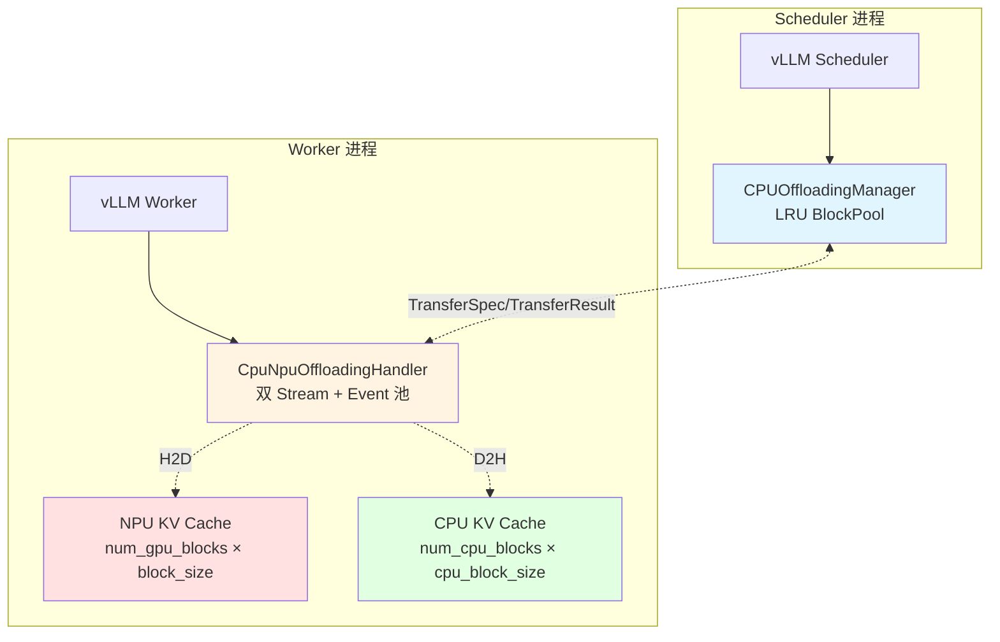

**核心组件：**
- `NPUOffloadingSpec`：spec 工厂，分别在 scheduler 侧创建 `CPUOffloadingManager`，worker 侧创建 `CpuNpuOffloadingHandler`。
- `CPUOffloadingManager`（来自 vLLM v1）：scheduler 侧的 CPU block 池管理器，使用 LRU 策略。
- `CpuNpuOffloadingHandler`：worker 侧的 NPU↔CPU 异步传输处理器。

### 2.2 初始化流程

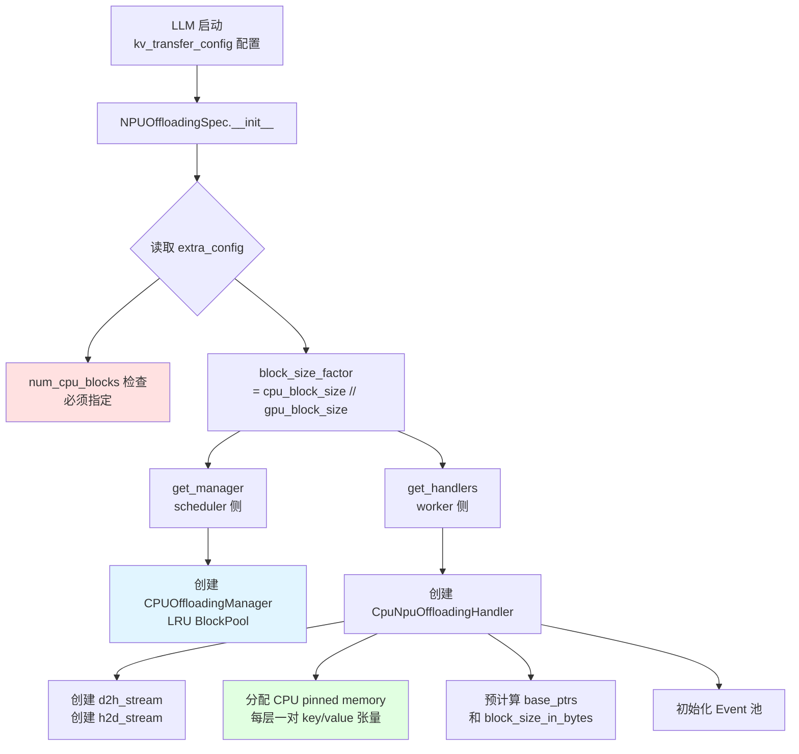

### 2.3 D2H 卸载时序图（NPU→CPU）

当 NPU 显存满且需要新 block 时，scheduler 决定淘汰某些 block 到 CPU：

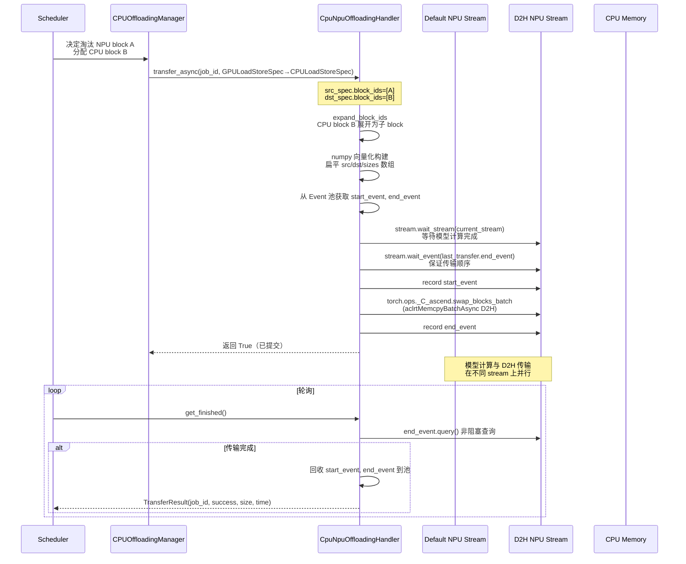

### 2.4 H2D 回载时序图（CPU→NPU）

当 prefix cache 在 NPU 未命中但 CPU 命中时：

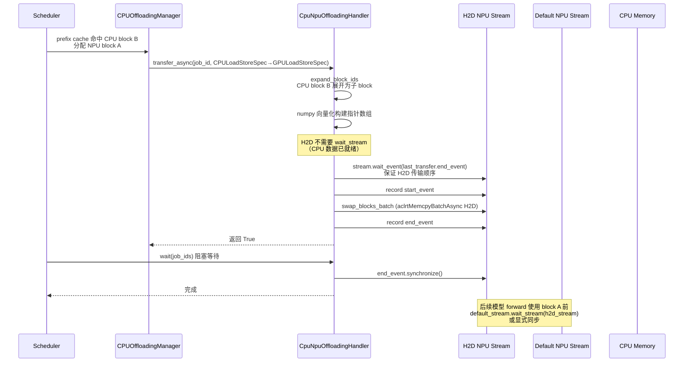

### 2.5 关键实现细节

**1. CPU block 与 NPU block 的映射关系：**

```
NPU block_size = 16 (示例)
CPU block_size = 128 (典型值)
block_size_factor = 128 / 16 = 8

1 个 CPU block = 8 个 NPU block
expand_block_ids([0, 1, 3], factor=8) = [0,1,2,3,4,5,6,7, 8,9,10,11,12,13,14,15, 24,25,26,27,28,29,30,31]
```

**2. numpy 向量化构建指针数组（避免 Python 循环）：**

```python
# 形状: (num_sub_tensors, num_pairs) -> ravel to 1D
bsz_col = self._block_size_in_bytes_arr[:, None]          # (T, 1)
all_src = (src_base_ptrs[:, None] + src_block_ids[None, :] * bsz_col).ravel()
all_dst = (dst_base_ptrs[:, None] + dst_block_ids[None, :] * bsz_col).ravel()
all_sizes = np.broadcast_to(bsz_col, (num_sub_tensors, num_pairs)).ravel().copy()
```

**3. Event 池复用：** 避免每次传输都创建新的 `torch.npu.Event`，减少分配开销。

**4. 传输顺序保证：**
- D2H：`d2h_stream.wait_stream(current_stream)` 确保读到的是计算完成的数据。
- 同方向连续传输：`stream.wait_event(last_transfer.end_event)` 保证 FIFO 顺序。

### 2.6 配置与使用

```python
from vllm import LLM, SamplingParams
from vllm.config import KVTransferConfig

kv_transfer_config = KVTransferConfig(
    kv_connector="OffloadingConnector",
    kv_role="kv_both",
    kv_connector_extra_config={
        "num_cpu_blocks": 1000,        # CPU 内存中分配的 block 数量
        "block_size": 128,             # CPU 侧 block 大小
        "spec_name": "NPUOffloadingSpec",
        "spec_module_path": "vllm_ascend.kv_offload.npu",
    },
)

llm = LLM(
    model="Qwen/Qwen3-0.6B",
    gpu_memory_utilization=0.5,
    kv_transfer_config=kv_transfer_config,
)
```

**配置参数说明：**

| 参数 | 说明 |
|------|------|
| `kv_connector` | 必须为 `"OffloadingConnector"` |
| `kv_role` | `"kv_both"` 同时启用存储和加载 |
| `num_cpu_blocks` | CPU 内存中分配的 block 数量，每个 block 消耗 `block_size × num_layers × (key_size + value_size)` 字节 |
| `block_size` | CPU 侧 block 大小，应为 NPU block 大小的整数倍，典型值 128 |
| `spec_name` | 必须为 `"NPUOffloadingSpec"` |
| `spec_module_path` | 必须为 `"vllm_ascend.kv_offload.npu"` |

---

## 三、方案二：AscendSimpleCPUOffloadConnector（上游适配）

### 3.1 架构与组件

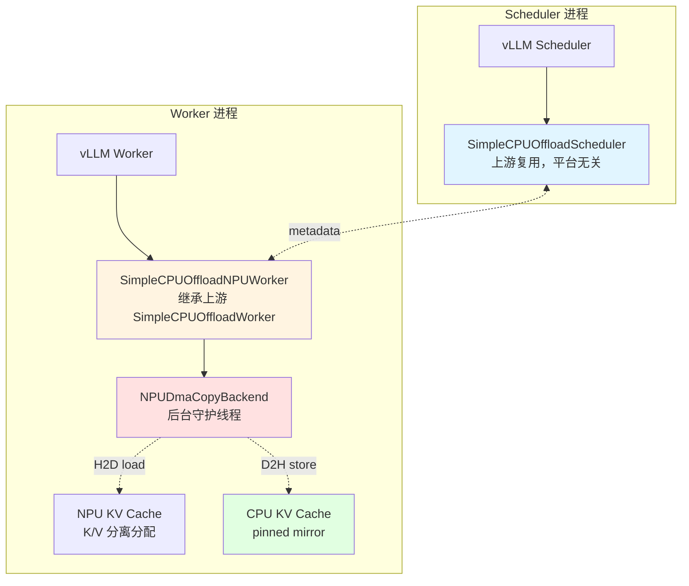

**核心组件：**
- `AscendSimpleCPUOffloadConnector`：继承上游 `SimpleCPUOffloadConnector`，scheduler 侧逻辑完全复用。
- `SimpleCPUOffloadNPUWorker`：继承上游 `SimpleCPUOffloadWorker`，替换 CUDA 拷贝后端为 NPU 版本。
- `NPUDmaCopyBackend`：后台守护线程执行 FIFO 拷贝任务。
- `BatchMemcpyParams`：预构建的批量拷贝参数（src_bases, dst_bases, bpb）。

### 3.2 初始化与注册流程

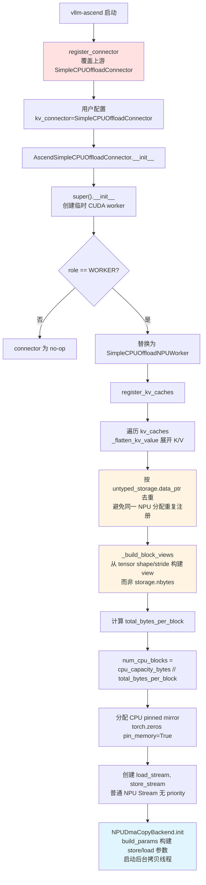

### 3.3 拷贝任务时序图

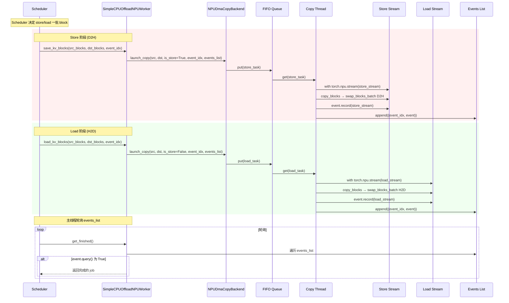

### 3.4 关键实现细节

**1. K/V 分离分配的处理：**

Ascend 上 K 和 V 是 **分离的独立分配**（不像 CUDA 堆叠在一个外层维度下），因此必须遍历每个子张量：

```python
def _flatten_kv_value(value):
    if isinstance(value, torch.Tensor):
        return [value]
    return [t for t in value if isinstance(torch.Tensor)]  # (k_cache, v_cache) → [k, v]
```

**2. storage 去重：**

```python
unique_caches = {}
seen_ptrs = set()
for layer_name, value in kv_caches.items():
    for sub_idx, tensor in enumerate(_flatten_kv_value(value)):
        ptr = tensor.untyped_storage().data_ptr()
        if ptr in seen_ptrs:
            continue  # 同一 NPU 分配可能被多层引用
        seen_ptrs.add(ptr)
        unique_caches.update(self._build_block_views(...))
```

**3. view 大小来自 tensor 自身（非 storage.nbytes）：**

```python
# runner 会为每个 KV 张量过度分配 +alignment (2 MiB) 用于对齐
# 因此 view 大小必须来自 tensor.shape/stride，而非 storage.nbytes()
page_size_bytes = tensor.stride(0) * el  # 而非 storage.nbytes()
data_bytes = num_blocks * page_size_bytes
raw = torch.empty(0, dtype=torch.int8, device=tensor.device).set_(
    storage, storage_offset_bytes, (data_bytes,)
)
return {key: raw.view(num_blocks, page_size_bytes)}
```

**4. CPU pinned memory 分配方式差异：**

```python
# CUDA 上游：cudaHostRegister（CUDA 专有）
# NPU 适配：torch.zeros(pin_memory=True)
self.cpu_kv_caches = {
    name: torch.zeros(..., device="cpu", pin_memory=pin_memory)
    for name, t in unique_caches.items()
}
```

**5. Stream priority 差异：**

```python
# CUDA 上游：load_stream = torch.cuda.Stream(priority=-1)  # 最低优先级让步计算
# NPU 适配：torch.npu.Stream()  # 不支持 priority 参数
# 影响：失去"always yield"提示，但传输仍在独立 stream 上与 forward 并行
```

### 3.5 配置与使用

使用上游的 `SimpleCPUOffloadConnector` 名称即可（vllm-ascend 启动时自动覆盖为 NPU 版本）：

```bash
vllm serve Qwen/Qwen3-0.6B \
    --kv-transfer-config '{
        "kv_connector": "SimpleCPUOffloadConnector",
        "kv_role": "kv_both",
        "kv_connector_extra_config": {
            "cpu_capacity_bytes": 5368709120
        }
    }'
```

---

## 四、方案三：CPUOffloadingConnector（独立实现 + Prefix Cache）

### 4.1 架构与组件

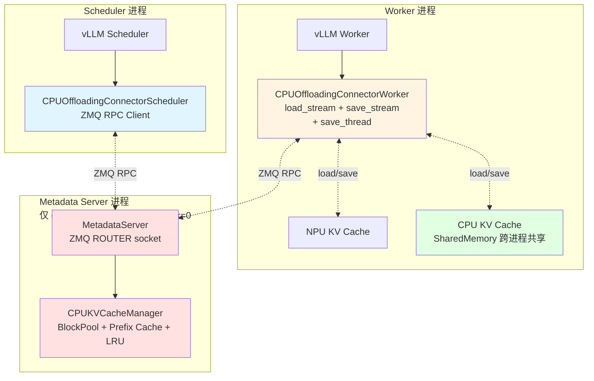

**三层架构：**
1. **Scheduler 侧**（`CPUOffloadingConnectorScheduler`）：通过 ZMQ RPC 与 Metadata Server 通信。
2. **Worker 侧**（`CPUOffloadingConnectorWorker`）：使用 `torch.npu.Stream` 异步加载/保存 KV cache。
3. **Metadata Server**（`MetadataServer`/`MetadataServerProc`）：独立进程，管理 `CPUKVCacheManager`。

### 4.2 三层架构逻辑流程图

```mermaid
flowchart TB
    subgraph 启动阶段
        A1[Worker 启动] --> A2{dp_rank==0<br/>AND tp_rank==0<br/>AND pp_rank==0?}
        A2 -- 是 --> A3[启动 Metadata Server 线程<br/>MetadataServerProc.run_metadata_server]
        A2 -- 否 --> A4[跳过]
        A3 --> A5[MetadataServer.__init__<br/>创建 ZMQ ROUTER socket<br/>读取 cpu_swap_space_gb 默认 800GB]
        A5 --> A6[等待 ready RPC 成功]

        A4 --> A6
        A6 --> A7[Worker.register_kv_caches]
        A7 --> A8[ZMQ RPC: init_cpu_kv_caches<br/>传递 pp_rank, tp_rank, kv_cache_specs, mla_config]
        A8 --> A9[MetadataServer 创建 SharedMemory<br/>按 pp_rank/tp_rank 分配]
        A9 --> A10[返回 SharedMemory dict<br/>Worker 通过 torch.frombuffer 重建张量视图]
        A10 --> A11[MetadataServer.post_init<br/>创建 CPUKVCacheManager<br/>注册 RPC 函数]
    end

    subgraph 推理阶段
        B1[新请求到达] --> B2[Scheduler: get_num_new_matched_tokens]
        B2 --> B3[ZMQ RPC: get_matched_num_and_touch<br/>查询 CPU prefix cache 命中]
        B3 --> B4{命中数 >= swap_in_threshold?}
        B4 -- 是 --> B5[返回命中数, load_async=True]
        B4 -- 否 --> B6[返回 0, load_async=False]
        B5 --> B7[Scheduler: build_connector_meta<br/>ZMQ RPC: allocate_slots 分配 CPU block]
        B7 --> B8[Worker: bind_connector_metadata<br/>构建 load_block_mapping]
        B8 --> B9[Worker: start_load_kv<br/>逐 layer 异步 H2D copy]
        B9 --> B10[模型 forward<br/>每层前 wait_for_layer_load 同步]
    end

    subgraph 完成阶段
        C1[请求完成] --> C2[Scheduler: request_finished<br/>ZMQ RPC: record_request_cache_and_free_slots]
        C2 --> C3[Worker: save_input_queue.put<br/>触发后台 save_thread]
        C3 --> C4[save_thread: 逐 layer D2H copy<br/>到 CPU SharedMemory]
        C4 --> C5[save_thread: save_output_queue.put]
        C5 --> C6[get_finished: TP 协调<br/>所有 TP rank 完成后]
        C6 --> C7[ZMQ RPC: cache_and_free_slots<br/>CPUKVCacheManager.cache_blocks<br/>写入 prefix cache]
    end

    style A3 fill:#ffe1e1
    style A9 fill:#ffe1e1
    style B3 fill:#e1f5ff
    style C4 fill:#fff4e1
    style C7 fill:#e1ffe1
```

### 4.3 启动与初始化时序图

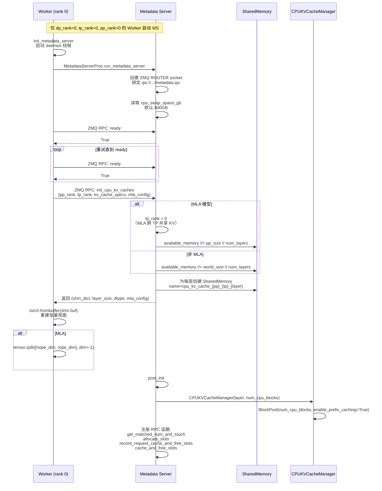

### 4.4 请求处理时序图（Prefix Cache 命中场景）

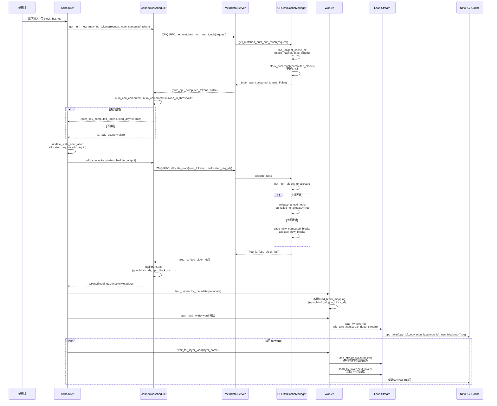

### 4.5 KV Save 时序图（请求完成后异步保存）

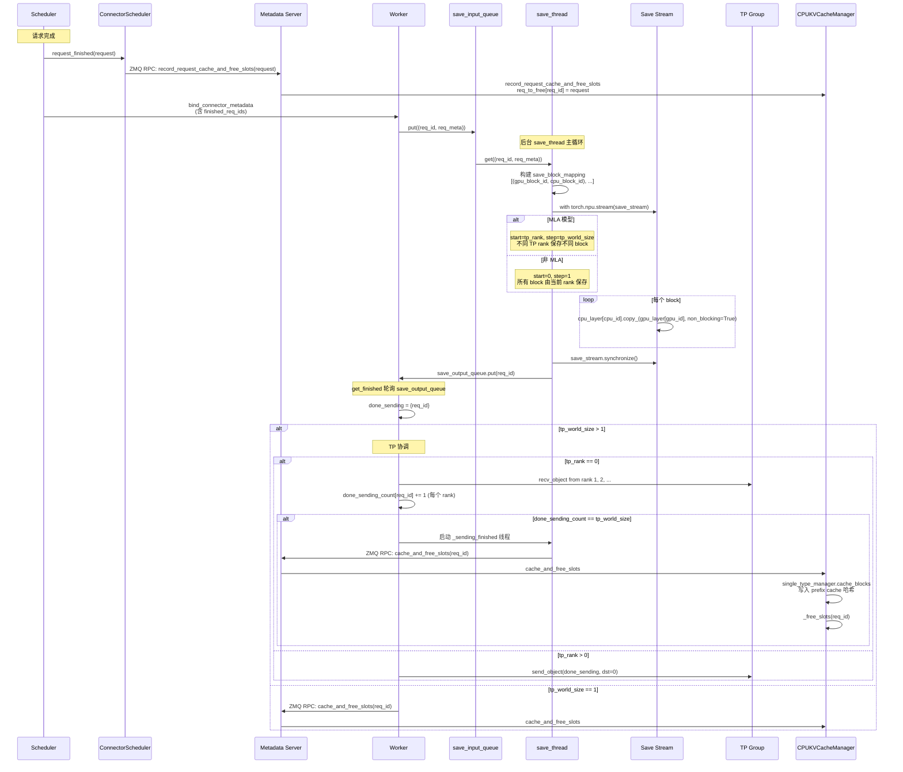

### 4.6 关键实现细节

**1. SharedMemory 跨进程共享：**

```python
# MetadataServer 创建
shared_memory_dict[layer_name] = SharedMemory(
    name=f"cpu_kv_cache_{pp_rank}_{tp_rank}_{layer_name}",
    create=True, size=nbytes
)

# Worker 通过 ZMQ RPC 收到 shm 名称后重建张量
for key, shm in memory_dict.items():
    tensor = torch.frombuffer(shm.buf, dtype=layer_dtype).reshape(layer_size)
    if mla_config is not None:
        tensor = tensor.split([mla_config.nope_dim, mla_config.rope_dim], dim=-1)
    result[key] = tensor
```

**2. MLA 模型的特殊处理：**

```python
# MLA: KV cache 跨 TP 共享（tp_rank=0 创建即可）
if use_mla:
    tp_rank = 0  # 所有 TP rank 共享同一份
    available_memory //= pipeline_parallel_size  # 按 PP 切分
    layer_size = (num_blocks, block_size, num_kv_heads, head_size)
else:
    available_memory //= world_size  # 按 world_size 切分
    layer_size = (2, num_blocks, block_size, num_kv_heads, head_size)  # K/V 堆叠

# MLA 保存时按 TP rank 分担
if self.use_mla:
    start, step = self.tp_rank, self.tp_world_size  # 不同 rank 保存不同 block
else:
    start, step = 0, 1
```

**3. swap_in_threshold 阈值控制：**

```python
# Scheduler 侧：只有 CPU 命中数超过阈值才触发 swap-in
if num_cpu_computed_tokens - num_computed_tokens >= self.swap_in_threshold:
    return num_cpu_computed_tokens - num_computed_tokens, load_async
else:
    return 0, load_async  # 命中太少不值得 swap-in
```

**4. CPUKVCacheManager 的 prefix cache 机制：**

```python
class CPUKVCacheManager:
    def __init__(self, kv_cache_spec, num_cpu_blocks, ...):
        self.block_pool = BlockPool(num_cpu_blocks, True, block_size, ...)  # enable_prefix_caching=True
        self.single_type_manager = get_manager_for_kv_cache_spec(...)
        self.req_to_block_hashes = defaultdict(list)  # 缓存 block 哈希避免重复计算

    def get_matched_num_and_touch(self, request):
        # 复用 vLLM 的 find_longest_cache_hit
        computed_blocks = self.single_type_manager.find_longest_cache_hit(
            block_hashes=block_hashes, max_length=max_cache_hit_length, ...
        )
        self.block_pool.touch(computed_blocks)  # 更新 LRU
        return num_computed_tokens, False

    def cache_and_free_slots(self, request_id):
        # 请求完成后，将 block 写入 prefix cache 哈希表
        self.single_type_manager.cache_blocks(request, num_tokens)
        self._free_slots(request_id)
```

**5. TP 协调机制：**

```python
# tp_rank > 0：发送完成信号给 rank 0
if self.tp_rank == 0:
    for i in range(1, self.tp_world_size):
        other_ranks_finished_ids.extend(self.tp_group.recv_object(src=i))
    # 所有 rank 都完成后才释放 CPU 槽位
    for req_id in list(self.done_sending_count.keys()):
        if self.done_sending_count[req_id] == self.tp_world_size:
            all_done_sending.add(req_id)
    # 异步 RPC 避免 blocking
    sending_finished_thread = threading.Thread(target=self._sending_finished, args=(all_done_sending,))
else:
    self.tp_group.send_object(done_sending, dst=0)
```

### 4.7 配置与使用

```python
from vllm import LLM, SamplingParams
from vllm.config import KVTransferConfig

kv_transfer_config = KVTransferConfig(
    kv_connector="CPUOffloadingConnector",
    kv_role="kv_both",
    kv_connector_extra_config={
        "cpu_swap_space_gb": 800,         # CPU swap 空间大小（GB），默认 800
        "swap_in_threshold": 0,           # 触发 swap-in 的阈值
    },
)

llm = LLM(
    model="Qwen/Qwen3-0.6B",
    enable_prefix_caching=True,           # 前提条件：必须启用 prefix caching
    kv_transfer_config=kv_transfer_config,
)
```

**配置参数说明：**

| 参数 | 默认值 | 说明 |
|------|--------|------|
| `kv_connector` | - | `"CPUOffloadingConnector"` |
| `kv_role` | - | `"kv_both"` 等 |
| `cpu_swap_space_gb` | `800` | CPU swap 空间大小（GB） |
| `swap_in_threshold` | `0` | CPU 命中数超过此阈值才触发 swap-in |
| `enable_prefix_caching` | - | **必须为 True**，否则 connector 为 no-op |

---

## 五、三套方案对比

### 5.1 架构对比

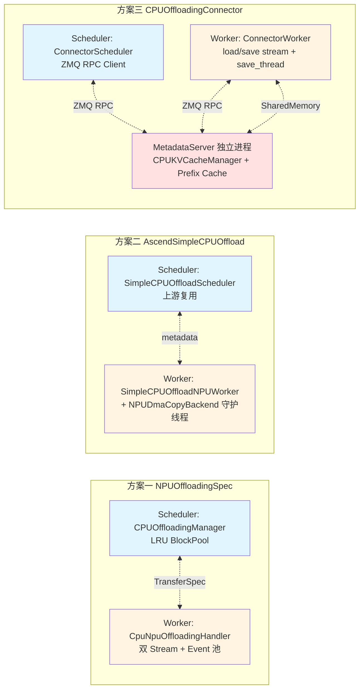

### 5.2 特性对比表

| 特性 | 方案一 NPUOffloadingSpec | 方案二 AscendSimpleCPUOffload | 方案三 CPUOffloadingConnector |
|------|------|------|------|
| **基础框架** | vLLM OffloadingConnector | vLLM SimpleCPUOffloadConnector（上游适配） | 独立实现 KVConnectorBase_V1 |
| **CPU Prefix Caching** | 通过 CPUOffloadingManager（LRU） | 复用上游 SimpleCPUOffloadScheduler | 自带 CPUKVCacheManager（完整 prefix cache） |
| **跨进程共享** | 否 | 否 | 是（SharedMemory + ZMQ RPC） |
| **独立进程** | 否 | 否 | 是（MetadataServerProc） |
| **传输底层** | `swap_blocks_batch`（aclrtMemcpyBatchAsync） | `swap_blocks_batch`（aclrtMemcpyBatchAsync） | `torch.Tensor.copy_`（non_blocking） |
| **CPU 容量配置** | `num_cpu_blocks` | `cpu_capacity_bytes` | `cpu_swap_space_gb`（默认 800GB） |
| **MLA 支持** | 通过 spec | 通过 spec | 显式 MLAConfig |
| **TP 协调** | 不涉及 | 不涉及 | tp_group.send_object/recv_object |
| **后台线程** | 无（主线程轮询 Event） | 有（_copy_loop 守护线程） | 有（_save_listener 线程） |
| **Block 映射** | CPU block = N × NPU block | 1:1（block_size 相同） | 1:1（block_size 相同） |
| **Event 机制** | Event 池复用 | events_list 轮询 | stream.synchronize() |
| **scheduler 侧逻辑** | vLLM 上游 CPUOffloadingManager | vLLM 上游 SimpleCPUOffloadScheduler | 自研 ConnectorScheduler |
| **worker 侧逻辑** | 自研 CpuNpuOffloadingHandler | 继承上游 + 替换 backend | 自研 ConnectorWorker |

### 5.3 传输机制对比

```mermaid
graph TB
    subgraph "方案一 传输机制"
        direction LR
        T1A[transfer_async 提交] --> T1B[主线程在专用 stream<br/>record start_event]
        T1B --> T1C[swap_blocks_batch<br/>aclrtMemcpyBatchAsync]
        T1C --> T1D[record end_event]
        T1D --> T1E[get_finished 轮询<br/>end_event.query 非阻塞]
    end

    subgraph "方案二 传输机制"
        direction LR
        T2A[launch_copy 提交] --> T2B[put 到 FIFO Queue]
        T2B --> T2C[守护线程 get]
        T2C --> T2D[在专用 stream<br/>copy_blocks → swap_blocks_batch]
        T2D --> T2E[event.record]
        T2E --> T2F[append 到 events_list<br/>主线程轮询]
    end

    subgraph "方案三 传输机制"
        direction LR
        T3A[load_kv_layer/save<br/>逐 layer 提交] --> T3B[在 load_stream/save_stream<br/>tensor.copy_ non_blocking]
        T3B --> T3C[stream.synchronize<br/>阻塞等待]
    end

    style T1C fill:#ffe1e1
    style T2D fill:#ffe1e1
    style T3B fill:#e1f5ff
```

---

## 六、选型建议

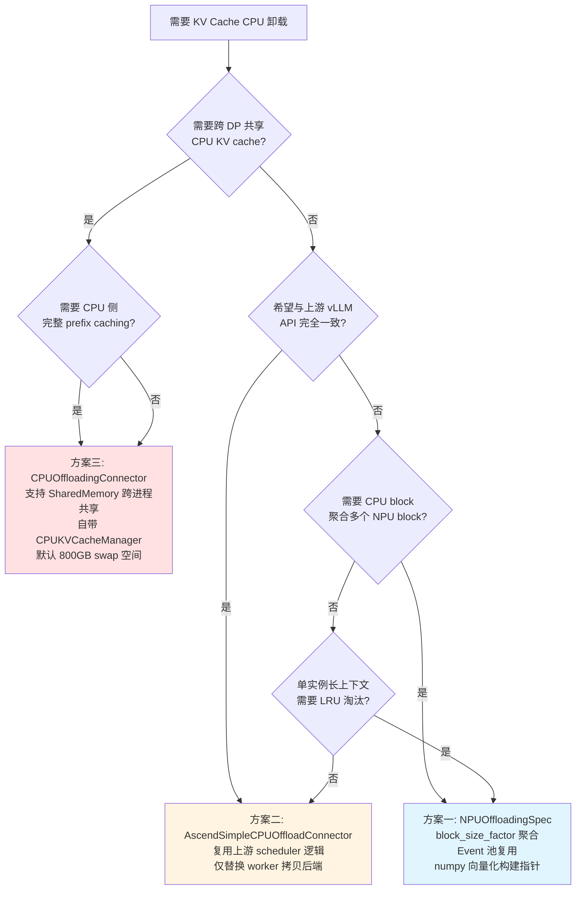

### 选型要点

| 场景 | 推荐方案 | 理由 |
|------|----------|------|
| 单实例 NPU 显存不足，长上下文 | 方案一 | LRU 淘汰 + block 聚合减少传输次数 |
| 与上游 vLLM API 一致的简单卸载 | 方案二 | scheduler 逻辑上游复用，维护成本低 |
| 跨 DP 共享 CPU KV cache | 方案三 | SharedMemory 跨进程共享 |
| 需要 CPU 侧 prefix caching | 方案三 | 自带 CPUKVCacheManager + BlockPool |
| 大容量 CPU swap（数百 GB） | 方案三 | 默认 800GB，可配置 |
| MLA 模型 + CPU 卸载 | 方案三 | 显式 MLAConfig 处理 rope/nope 分离 |
| RL 训练场景 | 方案一/二 | 单实例内 LRU 淘汰即可 |

### 性能考量

- **传输效率：** 方案一和方案二使用 `aclrtMemcpyBatchAsync` 批量 DMA，方案三使用 `tensor.copy_` 逐 layer 传输。
- **CPU 内存利用率：** 方案三的 prefix caching 能显著减少重计算，但需要额外的哈希计算和 BlockPool 管理。
- **跨进程开销：** 方案三的 ZMQ RPC 和 SharedMemory 同步有额外开销，但支持跨 DP 共享。
- **TP 扩展性：** 方案三显式处理 TP 协调，适合大规模 TP 部署；方案一/二不涉及 TP 协调。
