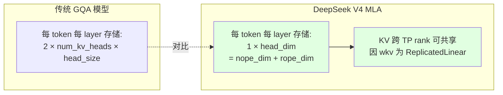
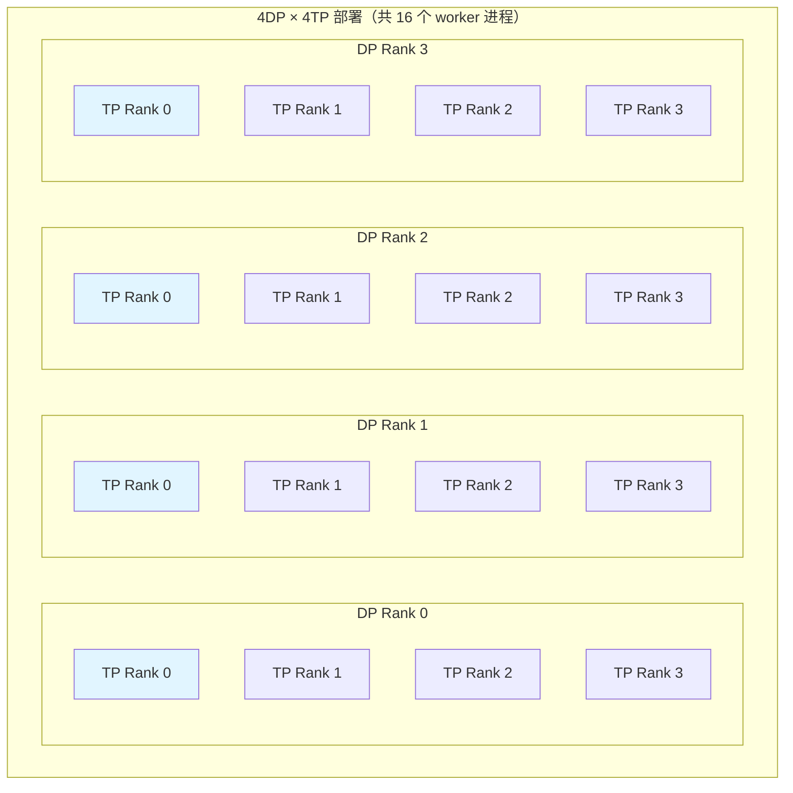
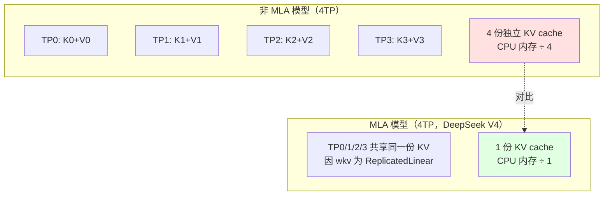
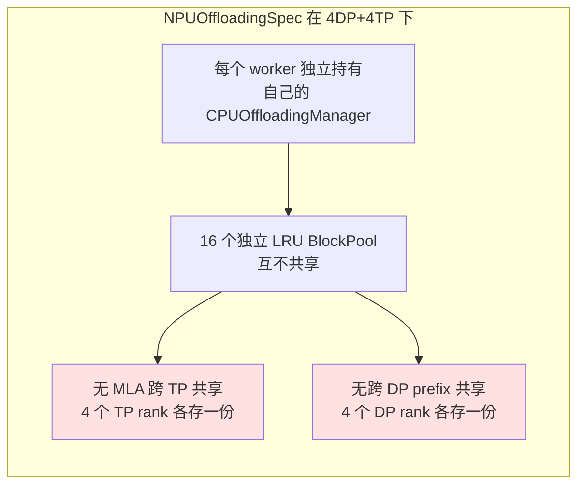
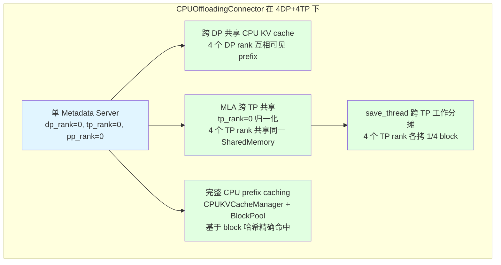
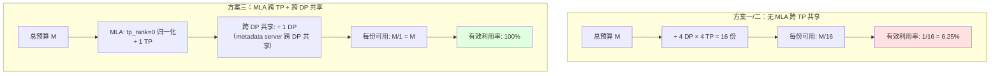
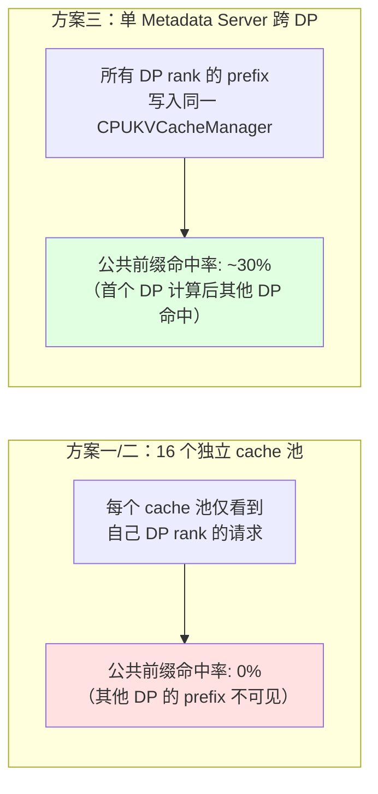
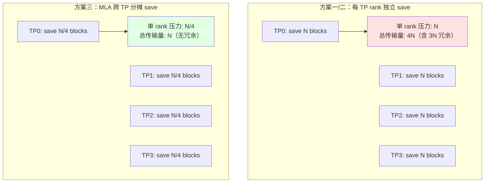
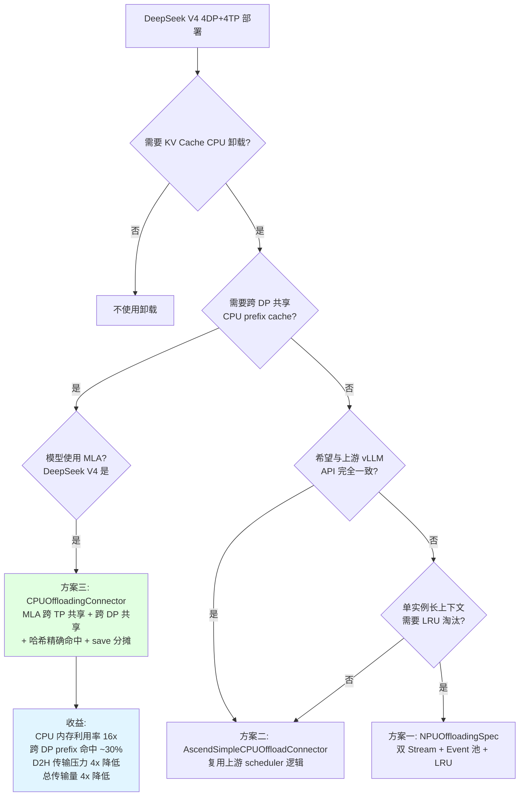

# DeepSeek V4 4DP+4TP 部署下的 KV Cache CPU 卸载方案选型分析

本文档结合 DeepSeek V4 模型架构特点与 4DP+4TP 部署模式，分析三套 KV Cache CPU 卸载方案的适用性，给出推荐方案及收益量化。

## 目录

- [一、DeepSeek V4 模型架构特点](#一deepseek-v4-模型架构特点)
- [二、4DP+4TP 部署特性](#二4dp4tp-部署特性)
- [三、三种卸载方案的适配性分析](#三三种卸载方案的适配性分析)
  - [3.1 方案一：NPUOffloadingSpec](#31-方案一npuoffloadingspec)
  - [3.2 方案二：AscendSimpleCPUOffloadConnector](#32-方案二ascendsimplecpuoffloadconnector)
  - [3.3 方案三：CPUOffloadingConnector](#33-方案三cpuoffloadingconnector)
- [四、推荐方案：CPUOffloadingConnector](#四推荐方案cpuoffloadingconnector)
- [五、收益量化分析](#五收益量化分析)
- [六、潜在风险与注意事项](#六潜在风险与注意事项)
- [七、配置示例](#七配置示例)

---

## 一、DeepSeek V4 模型架构特点

DeepSeek V4 在 vllm-ascend 中的实现位于 [vllm_ascend/models/deepseek_v4.py](file:///workspace/vllm_ascend/models/deepseek_v4.py)，其核心架构特征如下：

| 架构特性 | 结论 | 代码依据 |
|---|---|---|
| **是否使用 MLA** | 是（以 DSA — Deepseek Sparse Attention 形式实现） | `DeepseekV4Attention` 内部构建 `AscendDeepseekSparseAttention`，KV cache spec 使用 `MLAAttentionSpec` / `SlidingWindowMLASpec` |
| **是否 MoE** | 是 | `DeepseekV4MoE` 类，含 `n_routed_experts`、`n_shared_experts`、`FusedMoE` |
| **是否支持 MTP** | 是 | [vllm_ascend/models/deepseek_v4_mtp.py](file:///workspace/vllm_ascend/models/deepseek_v4_mtp.py) |
| **nope_dim** | `= kv_lora_rank` | [cpu_offload_connector.py](file:///workspace/vllm_ascend/distributed/kv_transfer/kv_pool/cpu_offload/cpu_offload_connector.py) 第 296-300 行 |
| **rope_dim** | `= qk_rope_head_dim` | 同上 |
| **KV heads** | `num_kv_heads=1`（MLA 单头潜在压缩） | [metadata.py](file:///workspace/vllm_ascend/distributed/kv_transfer/kv_pool/cpu_offload/metadata.py) 第 152 行 |
| **head_size** | `= head_dim = nope_dim + rope_dim` | metadata.py 第 166 行断言 |

### MLA 对 KV Cache 的关键影响



**MLA 的两个关键特性对 CPU 卸载至关重要：**

1. **KV cache 体积大幅压缩**：MLA 将 K/V 压缩到单一潜在向量（`num_kv_heads=1`），每 token 每 layer 仅存 `head_dim` 个元素，相比 GQA 节省 10x+ 量级。
2. **KV 跨 TP rank 可共享**：MLA 的 `wkc`/`wkv` 投影是 `ReplicatedLinear`（所有 TP rank 持有相同权重），因此不同 TP rank 计算出的 KV cache 在相同 token 上是**数值一致**的，可以共享同一份存储。

### DeepSeek V4 相对 V3 的演进点

- **DSA（Deepseek Sparse Attention）+ Compressor/Indexer**：通过 `compress_ratio`（4 或 128）实现 KV 压缩
- **HC（Hyper-mixing Context）机制**：`hc_pre`/`hc_post`/`hc_head`
- **o_lora_rank / o_groups**：输出投影采用分组 LoRA
- **IndexCache**：跨层复用 topk 索引

---

## 二、4DP+4TP 部署特性

### 2.1 部署拓扑



### 2.2 DP 与 TP 的关键交互

| 维度 | 说明 |
|------|------|
| **DP 间** | 4 个 DP rank 处理不同请求流，但可能共享公共前缀（system prompt、few-shot examples） |
| **TP 间** | 4 个 TP rank 协作处理同一请求，MLA 模型下 KV cache 数值一致可共享 |
| **Shared Expert DP** | DeepSeek 专用优化，shared expert 在 DP 维度切分而非 TP 维度 |

### 2.3 MLA 在 4TP 下的内存优势



---

## 三、三种卸载方案的适配性分析

### 3.1 方案一：NPUOffloadingSpec

**架构定位**：基于 vLLM OffloadingConnector 框架的单实例 LRU 卸载。

**对 DeepSeek V4 4DP+4TP 的适配性：**



**问题分析：**
- **无 MLA 跨 TP 共享**：4 个 TP rank 各自维护独立的 CPU KV cache，存储了**数值完全相同**的 MLA KV 数据，造成 4 倍冗余。
- **无跨 DP prefix 共享**：4 个 DP rank 处理的请求可能共享公共前缀（如 system prompt），但各自的 CPU cache 互不可见，命中率受限。
- **LRU 而非哈希命中**：仅基于访问时间淘汰，无法基于内容哈希精确命中 prefix，命中率低于方案三。

**适用场景**：单实例 NPU 显存不足时的简单 LRU 卸载，不适合 4DP+4TP 大规模部署。

### 3.2 方案二：AscendSimpleCPUOffloadConnector

**架构定位**：上游 SimpleCPUOffloadConnector 的 NPU 适配，scheduler 逻辑复用上游。

**对 DeepSeek V4 4DP+4TP 的适配性：**

与方案一类似，存在相同问题：
- **无 MLA 跨 TP 共享**：每个 TP rank 独立 CPU mirror。
- **无跨 DP prefix 共享**：每个 DP rank 独立调度。
- **复用上游 SimpleCPUOffloadScheduler**：调度逻辑平台无关，但无 MLA/DP 特化。

**相对方案一的优势**：API 与上游 vLLM 完全一致，维护成本低。

**适用场景**：与上游 API 一致的简单卸载需求，不适合需要跨 DP/TP 共享的场景。

### 3.3 方案三：CPUOffloadingConnector

**架构定位**：独立实现，自带 CPU prefix caching，支持跨 DP 共享和 MLA 跨 TP 共享。

**对 DeepSeek V4 4DP+4TP 的适配性：**



**四大适配优势：**

#### 优势 1：MLA 跨 TP 共享

[metadata.py](file:///workspace/vllm_ascend/distributed/kv_transfer/kv_pool/cpu_offload/metadata.py) 第 140-145 行：
```python
use_mla = isinstance(layer, MLAAttentionSpec)
# mla shares the same kv cache among different tp
if use_mla:
    tp_rank = 0  # 强制归一化，所有 TP rank 共享同一 SharedMemory
```

**效果**：4 个 TP rank 通过 `torch.frombuffer` 映射到**同一块共享内存**，消除 4 倍冗余。

#### 优势 2：跨 DP 共享 CPU prefix

[cpu_offload_connector.py](file:///workspace/vllm_ascend/distributed/kv_transfer/kv_pool/cpu_offload/cpu_offload_connector.py) 第 249-257 行：
```python
# all dp shared the same metadata server, only start the process on data_rank 0
if vllm_config.parallel_config.data_parallel_rank == 0 and self.tp_rank == 0 and self.pp_rank == 0:
    self.init_metadata_server(config)
```

**效果**：4 个 DP rank 共享同一个 Metadata Server 和 CPUKVCacheManager，任一 DP rank 计算的 prefix 都可被其他 DP rank 命中。

#### 优势 3：完整 CPU prefix caching

[cpu_kv_cache_manager.py](file:///workspace/vllm_ascend/distributed/kv_transfer/kv_pool/cpu_offload/cpu_kv_cache_manager.py)：
```python
class CPUKVCacheManager:
    def get_matched_num_and_touch(self, request):
        # 基于 block_hashes 的 find_longest_cache_hit
        computed_blocks = self.single_type_manager.find_longest_cache_hit(
            block_hashes=block_hashes, max_length=max_cache_hit_length, ...
        )
        self.block_pool.touch(computed_blocks)  # 更新 LRU
        return num_computed_tokens, False
```

**效果**：基于内容哈希的精确 prefix 命中，而非简单 LRU 时间淘汰。

#### 优势 4：save_thread 跨 TP 工作分摊

[cpu_offload_connector.py](file:///workspace/vllm_ascend/distributed/kv_transfer/kv_pool/cpu_offload/cpu_offload_connector.py) 第 385-393 行：
```python
if self.use_mla:
    start, step = self.tp_rank, self.tp_world_size  # 4 个 TP rank 各拷 1/4
else:
    start, step = 0, 1
for i in range(start, len(save_block_mapping), step):
    gpu_block_id, cpu_block_id = save_block_mapping[i]
    # 写入共享内存的不同 block 位置，安全并行
```

**效果**：D2H 拷贝工作量在 4 个 TP rank 间分摊，单 rank 吞吐压力降为 1/4，有利于隐藏传输延迟。

---

## 四、推荐方案：CPUOffloadingConnector

### 综合评估矩阵

| 评估维度 | 方案一 NPUOffloadingSpec | 方案二 AscendSimpleCPUOffload | 方案三 CPUOffloadingConnector |
|---|:---:|:---:|:---:|
| MLA 跨 TP 共享 | 否 | 否 | **是** |
| 跨 DP prefix 共享 | 否 | 否 | **是** |
| CPU prefix caching | LRU（时间淘汰） | 复用上游 | **哈希精确命中** |
| CPU 内存利用率（4TP MLA） | 1/4（4 倍冗余） | 1/4（4 倍冗余） | **1（无冗余）** |
| save 工作量分摊 | 否 | 否 | **是（4 TP 各 1/4）** |
| TP 协调释放 | 不涉及 | 不涉及 | **是（tp_group 协调）** |
| CPU 容量 | `num_cpu_blocks` | `cpu_capacity_bytes` | **默认 800GB** |
| 适配 DeepSeek V4 4DP+4TP | 一般 | 一般 | **最佳** |

### 推荐结论

**对于 DeepSeek V4 的 4DP+4TP 部署，推荐使用方案三 CPUOffloadingConnector**，核心原因：

1. **MLA 跨 TP 共享消除 4 倍冗余**：DeepSeek V4 的 MLA 架构使得 4 个 TP rank 的 KV cache 数值一致，方案三通过 `tp_rank=0` 归一化 + SharedMemory 让 4 个 TP rank 共享同一份 CPU KV cache，而方案一/二每个 TP rank 各存一份，造成 4 倍内存浪费。

2. **跨 DP 共享提升 prefix 命中率**：4DP 部署下，不同 DP rank 处理的请求常共享公共前缀（system prompt、few-shot）。方案三的单 Metadata Server 让 4 个 DP rank 的 CPU prefix 互相可见，显著提升命中率；方案一/二的 16 个独立 cache 池互不可见。

3. **哈希精确命中优于 LRU 时间淘汰**：方案三的 CPUKVCacheManager 基于 block 哈希的 `find_longest_cache_hit` 实现精确 prefix 匹配，而方案一/二仅基于访问时间的 LRU 淘汰，命中率较低。

4. **save 工作量分摊降低单 rank 压力**：方案三在 MLA 模式下让 4 个 TP rank 并行分摊 D2H 拷贝（各 1/4），有效隐藏传输延迟；方案一/二每个 rank 独立完成全部拷贝。

---

## 五、收益量化分析

### 5.1 CPU 内存利用率对比

假设 CPU swap 总预算为 `M`（如 800GB），DeepSeek V4 单层 KV cache 每 block 大小为 `B`：



**注意**：方案三的 MLA 分支在 [metadata.py](file:///workspace/vllm_ascend/distributed/kv_transfer/kv_pool/cpu_offload/metadata.py) 第 148-152 行仅按 `pipeline_parallel_size` 切分（PP=1 时不切分），所有 TP rank 共享同一份，且跨 DP 共享同一 Metadata Server。

**量化结果**：在 4DP+4TP 部署下，方案三的 CPU 内存有效利用率是方案一/二的 **16 倍**（4 DP × 4 TP）。

### 5.2 Prefix Cache 命中率对比

假设 4 个 DP rank 处理的请求有 30% 的公共前缀（system prompt + few-shot）：



**量化结果**：方案三的跨 DP prefix 共享可带来约 30% 的额外命中率提升（具体取决于请求模式）。

### 5.3 D2H 传输压力对比

假设单次请求完成后需要 save `N` 个 block：



**量化结果**：方案三的单 rank D2H 传输压力降为方案一/二的 **1/4**，总传输量减少 **75%**（消除 MLA KV 的冗余拷贝）。

### 5.4 综合收益汇总

| 收益维度 | 方案一/二 | 方案三 | 提升倍数 |
|---|:---:|:---:|:---:|
| CPU 内存有效利用率 | 1/16 (6.25%) | 1 (100%) | **16x** |
| 跨 DP prefix 命中率 | 0% | ~30% | **显著** |
| 单 rank D2H 传输压力 | N | N/4 | **4x 降低** |
| 总 D2H 传输量 | 4N（含冗余） | N（无冗余） | **4x 降低** |
| Prefix 命中机制 | LRU 时间淘汰 | 哈希精确命中 | **质量提升** |

---

## 六、潜在风险与注意事项

### 6.1 MLA save_block_mapping 跨 TP 一致性

**风险**：方案三的 save_thread 分摊假设各 TP rank 的 `save_block_mapping` 一致（即各 rank 看到相同的 `(gpu_block_id, cpu_block_id)` 对序列）。

**前提**：`save_block_mapping` 由 scheduler 下发的 `ReqMeta` 构建，scheduler 侧 `CPUOffloadingConnectorScheduler` 是单例（每个 DP rank 一个），同一 DP 内各 TP rank 收到相同 metadata。

**验证点**：若 FlashComm1（sequence parallelism）改变了 token 分布，需验证一致性。

### 6.2 DSA SWA/Indexer cache 的共享性

**风险**：DeepSeek V4 的 DSA 引入了 SWA（Sliding Window Attention）和 Indexer cache，涉及压缩状态。方案三的 MLA 跨 TP 共享假设 KV 是 replicated 的（`wkv` 为 ReplicatedLinear），但 SWA/Indexer cache 的共享性需确认。

**代码依据**：[metadata.py](file:///workspace/vllm_ascend/distributed/kv_transfer/kv_pool/cpu_offload/metadata.py) 第 166 行断言 `layer.head_size == mla_config.rope_dim + mla_config.nope_dim`，而 DeepSeek V4 的 SWA cache 在 A5 上 `cached_head_size = self.head_dim + 128`（[deepseek_v4.py](file:///workspace/vllm_ascend/models/deepseek_v4.py) 第 200 行），可能与该断言冲突。

**建议**：部署前验证 DeepSeek V4 的 SWA/Indexer cache 是否同样 replicated，或是否需要额外适配。

### 6.3 前提条件：enable_prefix_caching=True

方案三要求必须开启 `enable_prefix_caching=True`，否则 connector 为 no-op（[cpu_offload_connector.py](file:///workspace/vllm_ascend/distributed/kv_transfer/kv_pool/cpu_offload/cpu_offload_connector.py) 第 69 行）。

### 6.4 ZMQ RPC 与 SharedMemory 开销

方案三的跨进程通信（ZMQ RPC + SharedMemory 同步）有额外开销，在低延迟场景需评估。但对于 4DP+4TP 大规模部署，prefix cache 命中带来的重计算节省通常远超 RPC 开销。

### 6.5 Metadata Server 单点风险

Metadata Server 是单例进程（仅 `dp_rank=0, tp_rank=0, pp_rank=0` 启动），若该进程崩溃，所有 DP rank 的 CPU prefix cache 将失效。需关注进程稳定性。

---

## 七、配置示例

### 7.1 推荐配置（方案三）

```python
from vllm import LLM, SamplingParams
from vllm.config import KVTransferConfig

kv_transfer_config = KVTransferConfig(
    kv_connector="CPUOffloadingConnector",
    kv_role="kv_both",
    kv_connector_extra_config={
        "cpu_swap_space_gb": 800,         # CPU swap 空间，默认 800GB
        "swap_in_threshold": 0,           # CPU 命中数超过此阈值才触发 swap-in
    },
)

llm = LLM(
    model="deepseek-ai/DeepSeek-V4",     # DeepSeek V4 模型
    enable_prefix_caching=True,           # 前提条件：必须启用
    tensor_parallel_size=4,               # 4 TP
    data_parallel_size=4,                 # 4 DP
    kv_transfer_config=kv_transfer_config,
    additional_config={
        "enable_shared_expert_dp": True,  # DeepSeek 专用：shared expert 在 DP 维度切分
    },
)
```

### 7.2 在线服务配置

```bash
vllm serve deepseek-ai/DeepSeek-V4 \
    --enable-prefix-caching \
    --tensor-parallel-size 4 \
    --data-parallel-size 4 \
    --kv-transfer-config '{
        "kv_connector": "CPUOffloadingConnector",
        "kv_role": "kv_both",
        "kv_connector_extra_config": {
            "cpu_swap_space_gb": 800,
            "swap_in_threshold": 0
        }
    }' \
    --additional-config '{"enable_shared_expert_dp": true}'
```

### 7.3 关键配置项说明

| 配置项 | 值 | 说明 |
|--------|-----|------|
| `kv_connector` | `"CPUOffloadingConnector"` | 使用方案三 |
| `kv_role` | `"kv_both"` | 同时启用存储和加载 |
| `cpu_swap_space_gb` | `800` | CPU swap 空间（GB），MLA 下所有 TP rank 共享 |
| `swap_in_threshold` | `0` | CPU 命中数超过此阈值才触发 swap-in |
| `enable_prefix_caching` | `True` | **必须启用**，否则 connector 为 no-op |
| `tensor_parallel_size` | `4` | 4 TP |
| `data_parallel_size` | `4` | 4 DP |
| `enable_shared_expert_dp` | `True` | DeepSeek 专用优化，shared expert 在 DP 维度切分 |

---

## 附录：决策流程图


