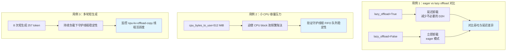
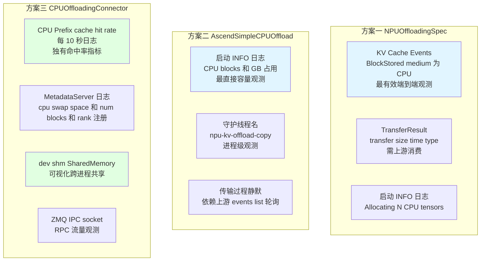
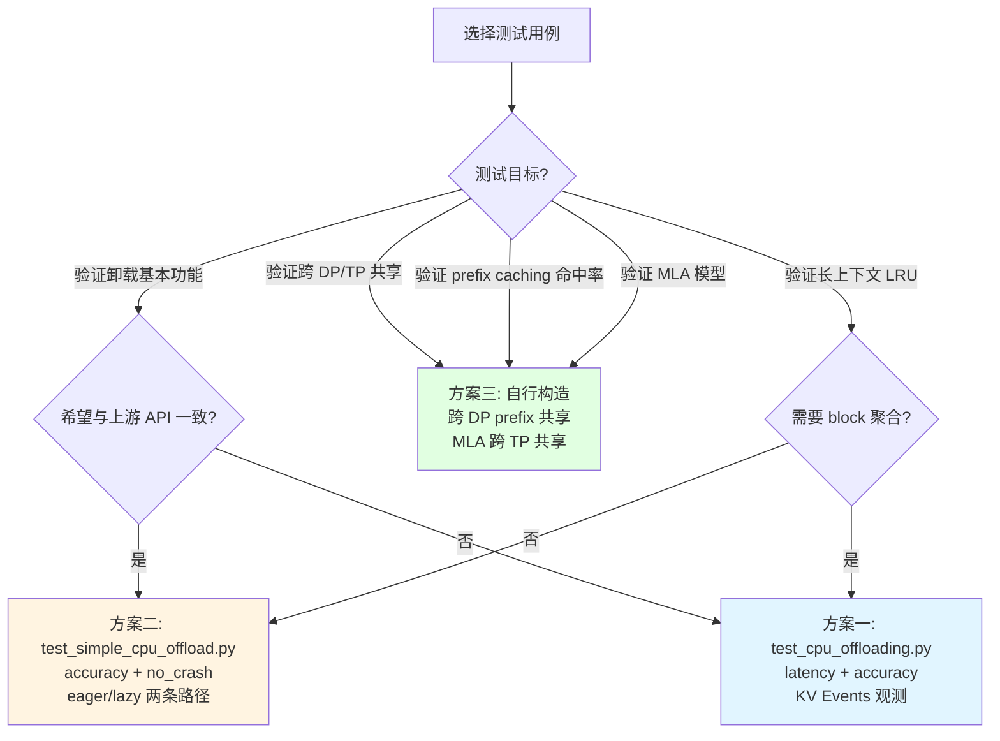

```mermaid
graph TB
    subgraph "用例 1：长上下文 + LRU 淘汰"
        T1A[num_cpu_blocks 设较小值] --> T1B[prompt 长度远超 NPU KV 容量]
        T1B --> T1C[迫使 LRU 淘汰到 CPU]
        T1C --> T1D[观测 KV Events<br/>BlockStored medium=CPU]
    end

    subgraph "用例 2：Prefix sharing 回载"
        T2A[同一 prefix 多次请求] --> T2B[先 reset NPU prefix cache]
        T2B --> T2C[验证从 CPU 回载]
        T2C --> T2D[对比 cold vs CPU hit 延迟]
    end

    subgraph "用例 3：block_size_factor 调优"
        T3A[CPU block_size=128<br/>NPU block_size=16<br/>factor=8] --> T3B[验证 expand_block_ids 正确性]
        T3B --> T3C[对比 factor=1 vs factor=8 的传输次数]
    end

    style T1D fill:#e1f5ff
    style T2D fill:#e1f5ff
    style T3C fill:#e1f5ff
```

# vllm-ascend KV Cache CPU 卸载方案观测与测试用例报告

本文档针对 vllm-ascend 三套 KV Cache CPU 卸载方案，详细说明如何观测 KV 是否被卸载到 CPU 内存，以及各自的优势场景与推荐测试用例。

## 目录

- [一、总体说明](#一总体说明)
- [二、方案一：NPUOffloadingSpec 观测与测试](#二方案一npuoffloadingspec-观测与测试)
- [三、方案二：AscendSimpleCPUOffloadConnector 观测与测试](#三方案二ascendsimplecpuoffloadconnector-观测与测试)
- [四、方案三：CPUOffloadingConnector 观测与测试](#四方案三cpuoffloadingconnector-观测与测试)
- [五、跨方案通用观测手段](#五跨方案通用观测手段)
- [六、三套方案观测能力对比](#六三套方案观测能力对比)
- [七、三套方案测试用例对比](#七三套方案测试用例对比)

---

## 一、总体说明

vllm-ascend 三套 KV Cache CPU 卸载方案的**可观测性差异显著**：

| 方案 | 可观测性 | 内置统计指标 | Prometheus | 专属 e2e 测试 |
|------|:---:|:---:|:---:|:---:|
| 方案一 NPUOffloadingSpec | 中 | TransferResult（需上游消费） | 否 | 有（被 skip） |
| 方案二 AscendSimpleCPUOffload | 中 | 启动 INFO 日志 | 否 | 有（可运行） |
| 方案三 CPUOffloadingConnector | **强** | **CPU Prefix cache hit rate** | 否 | **无** |

**重要**：三套方案均未实现 Prometheus 指标导出。全仓搜索 `prometheus|Gauge|Counter|Histogram` 仅在 `ucm_connector.py:313` 的注释中提到"per-connector Prometheus metrics"作为 TODO，未落地。

---

## 二、方案一：NPUOffloadingSpec 观测与测试

### 2.1 如何观测 KV 是否被卸载到 CPU

#### 方法 1：KV Cache Events 机制（最有效的端到端观测手段）

这是方案一**最有效的运行时观测手段**，通过 vLLM 的 KV Events 发布机制暴露 `BlockStored` 事件，其中 `medium == "CPU"` 表示 block 被存到 CPU。

**启用方式：**

```python
from vllm.config import KVEventsConfig

kv_events_config = KVEventsConfig(
    enable_kv_cache_events=True,
    publisher="zmq",
    endpoint="tcp://*:5555",
    topic="kv_events",
)
```

**订阅与过滤（参考 [tests/e2e/pull_request/one_card/test_cpu_offloading.py](file:///workspace/tests/e2e/pull_request/one_card/test_cpu_offloading.py) 第 33-55 行）：**

```python
class MockSubscriber:
    def get_new_cpu_stored_events(self):
        # 订阅 ZMQ topic，过滤 BlockStored 事件且 medium == "CPU"
        events = self.subscriber.get_new_events()
        return [e for e in events
                if isinstance(e, BlockStored) and e.medium == "CPU"]
```

**观测效果**：可精确追踪每个被卸载到 CPU 的 block_id，统计卸载次数与总量。

#### 方法 2：TransferResult 统计结构

[cpu_npu.py](file:///workspace/vllm_ascend/kv_offload/cpu_npu.py) 第 232-252 行的 `get_finished()` 方法构造 `TransferResult` 对象：

```python
TransferResult(
    job_id=transfer.job_id,
    success=True,
    transfer_size=transfer.num_bytes,        # 本次传输字节数
    transfer_time=transfer_time,             # 传输耗时（秒）
    transfer_type=("NPU", "CPU"),            # D2H 卸载；("CPU", "NPU") 为 H2D 回载
)
```

**注意**：这些 `TransferResult` 由上游 vLLM `OffloadingManager`/`OffloadingConnector` 消费。vllm-ascend 自身未将这些统计写入日志或 metrics，要观测需在调用方打点。

#### 方法 3：启动日志

[cpu_npu.py](file:///workspace/vllm_ascend/kv_offload/cpu_npu.py) 第 80 行：
```python
logger.info("Allocating %d CPU tensors...", len(gpu_caches))
```
确认 CPU 侧 pinned memory 已就绪。第 92 行 DEBUG 日志报告每层 CPU 张量形状（需 DEBUG 级别）。

#### 方法 4：外部内存观测

```python
import torch
free, total = torch.npu.mem_get_info()
used_bytes = total - free
# 对比卸载前后 used_bytes 变化，可量化卸载到 CPU 的字节数
```

### 2.2 优势场景与推荐测试用例

#### 优势场景

方案一的核心优势是 **block_size_factor 聚合 + LRU 淘汰 + Event 池复用**，适合：
- 单实例 NPU 显存不足的长上下文场景
- 需要将多个 NPU block 聚合为一个 CPU block 减少传输次数
- prefix cache 命中后异步回载

#### 现有测试

[test_cpu_offloading.py](file:///workspace/tests/e2e/pull_request/one_card/test_cpu_offloading.py)（**注意：当前被 skip**，第 131 行 `@pytest.mark.skip(reason="cpu offload connector is deprecated.")`，但仍是黄金参考）：

| 测试方法 | 场景 | 断言 |
|----------|------|------|
| `_latency_test` | 10001 token 长 prompt，对比 cold/GPU hit/CPU hit 三种延迟 | CPU hit 优于 cold 的比例 >= 80% |
| `_accuracy_test` | 验证从 CPU 回载后输出与冷启动一致 | >= 50% 成功率 |

#### 推荐压测用例



**用例 1 配置示例：**

```python
kv_transfer_config = KVTransferConfig(
    kv_connector="OffloadingConnector",
    kv_role="kv_both",
    kv_connector_extra_config={
        "num_cpu_blocks": 100,      # 故意设小，迫使 LRU 淘汰
        "block_size": 128,
        "spec_name": "NPUOffloadingSpec",
        "spec_module_path": "vllm_ascend.kv_offload.npu",
    },
)
# 配合 KVEventsConfig 订阅 BlockStored(medium="CPU") 事件
```

---

## 三、方案二：AscendSimpleCPUOffloadConnector 观测与测试

### 3.1 如何观测 KV 是否被卸载到 CPU

#### 方法 1：启动 INFO 日志（最直接的容量观测）

[worker.py](file:///workspace/vllm_ascend/simple_kv_offload/worker.py) 第 117-122 行（**最关键的启动观测点**）：

```python
logger.info(
    "SimpleCPUOffloadNPUWorker: %d unique NPU KV tensors, allocating %d CPU blocks (%.2f GB)",
    len(unique_caches), self.num_cpu_blocks,
    (self.num_cpu_blocks * total_bytes_per_block) / (1024**3),
)
```

这条 INFO 日志明确报告：
- 去重后的 NPU KV 张量数
- 分配的 CPU block 数
- **CPU 内存占用（GB）** —— 确认 CPU 卸载容量已就绪的直接证据

[simple_cpu_offload_connector.py](file:///workspace/vllm_ascend/distributed/kv_transfer/kv_pool/simple_cpu_offload/simple_cpu_offload_connector.py) 第 57-59 行：
```python
logger.info(
    "AscendSimpleCPUOffloadConnector: swapped CUDA worker for NPU worker (per_rank=%.2f GB)",
    cpu_capacity / (1024**3),
)
```
确认 NPU worker 已替换 CUDA worker，并报告每 rank CPU 容量。

#### 方法 2：拷贝线程活动观测

[copy_backend.py](file:///workspace/vllm_ascend/simple_kv_offload/copy_backend.py) 第 62 行，后台守护线程名为 `"npu-kv-offload-copy"`：

```bash
# 观测线程活跃度
ps -eLf | grep npu-kv-offload-copy
# 或使用 py-spy
py-spy dump --pid <worker_pid>
```

线程主循环 `_copy_loop`（第 91-124 行）**无日志**，但每次拷贝会 `event.record(stream)` 并 `events_list.append((event_idx, event))`。主线程通过 `get_finished()` 轮询 `events_list` 中 `event.query()` 判断完成。

#### 方法 3：pinned memory 不可用告警

[worker.py](file:///workspace/vllm_ascend/simple_kv_offload/worker.py) 第 126 行：
```python
logger.warning("Pinned memory not available; CPU offload throughput may be degraded on this host.")
```

#### 方法 4：外部内存观测

同方案一：`torch.npu.mem_get_info()`、`/proc/meminfo`、`/proc/<pid>/status`。

### 3.2 优势场景与推荐测试用例

#### 优势场景

方案二的核心优势是 **与上游 vLLM API 完全一致 + 后台守护线程 FIFO 队列**，适合：
- 需要与上游 vLLM 保持一致 API 的简单 KV 卸载
- eager/lazy 两种 offload 模式切换
- 多轮短生成的稳定性验证

#### 现有测试

[test_simple_cpu_offload.py](file:///workspace/tests/e2e/pull_request/one_card/test_simple_cpu_offload.py)（**可运行**）：

| 测试方法 | 场景 | 断言 |
|----------|------|------|
| `test_simple_cpu_offload_accuracy` | `"hi " * 500` 长 prompt（约 1500 token），1 GiB CPU 容量，先冷启动触发卸载，再 `reset_prefix_cache()` 后重跑 | 输出与冷启动一致（>= 50% 成功率） |
| `test_simple_cpu_offload_no_crash_on_repeat` | 8 次短生成（257 token），参数化 `lazy=[False, True]` | 覆盖 eager 和 lazy offload 两条路径稳定性 |

#### 推荐压测用例



**用例 1 配置示例：**

```python
# eager 模式
kv_transfer_config = KVTransferConfig(
    kv_connector="SimpleCPUOffloadConnector",
    kv_role="kv_both",
    kv_connector_extra_config={
        "cpu_bytes_to_use": 1073741824,  # 1 GiB
        "lazy_offload": False,           # eager 模式
    },
)

# lazy 模式（对比）
kv_transfer_config_lazy = KVTransferConfig(
    kv_connector="SimpleCPUOffloadConnector",
    kv_role="kv_both",
    kv_connector_extra_config={
        "cpu_bytes_to_use": 1073741824,
        "lazy_offload": True,            # lazy 模式
    },
)
```

---

## 四、方案三：CPUOffloadingConnector 观测与测试

### 4.1 如何观测 KV 是否被卸载到 CPU

方案三是三套方案中**日志最丰富、自带统计指标**的实现。

#### 方法 1：CPU Prefix cache hit rate（独有的内置命中率指标）

[cpu_kv_cache_manager.py](file:///workspace/vllm_ascend/distributed/kv_transfer/kv_pool/cpu_offload/cpu_kv_cache_manager.py) 第 22-27 行：

```python
def log(self):
    current_time_sec = int(time.time())
    # Log the prefix cache hit rate every 10 seconds.
    if current_time_sec - self.time_sec >= 10:
        self.time_sec = current_time_sec
        logger.info("CPU Prefix cache hit rate: %.1f%%", self.cpu_prefix_cache_metrics.hit_rate * 100)
```

**每 10 秒输出一次 CPU prefix cache 命中率**，这是方案三独有的运行时观测点。第 81 行 `log_stats=True` 默认开启。

#### 方法 2：MetadataServer 启动日志（容量与 rank 注册观测）

[metadata.py](file:///workspace/vllm_ascend/distributed/kv_transfer/kv_pool/cpu_offload/metadata.py)：

| 行号 | 日志内容 | 观测点 |
|------|----------|--------|
| 第 99 行 | `"cpu swap space: %s bytes"` | **CPU swap 总容量**（默认 800 GB） |
| 第 136 行 | `"receive pp rank: %s, tp rank: %s"` | 各 rank 注册确认 |
| 第 180 行 | `"assign cpu num blocks: %s"` | **最终分配的 CPU block 总数** |
| 第 246 行 | `"Metadata server started."` | Metadata server 进程就绪 |
| 第 49 行 | `"metadata client for worker %s started"` | 每个 worker 的 ZMQ RPC client 启动 |

#### 方法 3：ConnectorScheduler/Worker 日志

[cpu_offload_connector.py](file:///workspace/vllm_ascend/distributed/kv_transfer/kv_pool/cpu_offload/cpu_offload_connector.py)：

| 行号 | 日志内容 | 观测点 |
|------|----------|--------|
| 第 141 行 | `"init CPUOffloadingConnectorScheduler"` | Scheduler 初始化 |
| 第 155 行 | `"swap_in_threshold: %s"` | **swap-in 阈值**（控制何时触发 CPU→NPU 回载） |
| 第 229 行 | `"init CPUOffloadingConnectorWorker"` | Worker 初始化 |
| 第 274 行 | `"wait for metadata server to start, error: %s"` | 等待 metadata server 就绪重试 |
| 第 370 行 | `"call cache_and_free_slots for req_id: %s"`（DEBUG） | 请求完成后的 CPU 槽位释放 |

#### 方法 4：SharedMemory 使用观测（方案三独有）

方案三使用 SharedMemory 跨进程共享 KV cache，可通过 `/dev/shm` 直接观测：

```bash
# 查看每层共享内存段大小与数量
ls -lh /dev/shm/ | grep cpu_kv_cache

# 预期输出类似：
# -rw------- 1 user group 2.0G Jan 1 00:00 cpu_kv_cache_0_0_model.layers.0.self_attn
# -rw------- 1 user group 2.0G Jan 1 00:00 cpu_kv_cache_0_0_model.layers.1.self_attn
# ...
```

SharedMemory 名称格式为 `cpu_kv_cache_{pp_rank}_{tp_rank}_{layer_name}`（[metadata.py](file:///workspace/vllm_ascend/distributed/kv_transfer/kv_pool/cpu_offload/metadata.py) 第 162 行）。MLA 模式下 `tp_rank=0` 归一化，所有 TP rank 共享同一份。

#### 方法 5：ZMQ RPC 流量观测

IPC 地址：`f"ipc://{envs.VLLM_RPC_BASE_PATH}/metadata.ipc"`（第 42 行）。

```bash
# 观测 socket 文件
ls -la $VLLM_RPC_BASE_PATH/metadata.ipc

# 观测 RPC 流量
strace -e trace=network -p <metadata_server_pid>
```

每次 `get_matched_num_and_touch`（prefix cache 查询）和 `allocate_slots`（CPU block 分配）都是一次 RPC 往返。

#### 方法 6：外部内存观测

同前两方案，额外可看 `/dev/shm` 占用（SharedMemory）。

### 4.2 优势场景与推荐测试用例

#### 优势场景

方案三的核心优势是 **跨 DP 共享 + MLA 跨 TP 共享 + 完整 CPU prefix caching + save 工作分摊**，适合：
- 多 DP rank 部署，跨 DP 共享 CPU KV cache
- MLA 模型（DeepSeek V3/V4），跨 TP 共享 CPU KV cache
- 大容量 CPU swap（默认 800GB）
- 需要 CPU 侧完整 prefix caching

#### 现有测试

**方案三没有专属的 e2e 测试文件**。[tests/ut/kv_offload/](file:///workspace/tests/ut/kv_offload/) 下只有 mooncake connector 相关测试，不覆盖 `CPUOffloadingConnector`。这是三套方案中测试覆盖最薄弱的。

#### 推荐压测用例



```mermaid
graph TB
    subgraph "用例 1：跨 DP 共享 CPU KV cache（核心卖点）"
        D1A[多 DP rank 部署] --> D1B[同一 prefix 在不同 DP rank 间共享]
        D1B --> D1C[验证 MetadataServer 正确服务所有 DP rank]
        D1D[观测 CPU Prefix cache hit rate 上升]
    end

    subgraph "用例 2：CPU prefix caching 命中率"
        D2A[构造大量共享 prefix 的请求] --> D2B[观察 CPU Prefix cache hit rate 日志]
        D2B --> D2C[swap_in_threshold 调高可观察回载被抑制]
    end

    subgraph "用例 3：MLA 模型场景"
        D3A[DeepSeek V4/V3 MLA 模型] --> D3B[验证 MLAConfig 正确处理 rope/nope 分离]
        D3B --> D3C[验证 MLA 时 KV 跨 TP 共享 tp_rank=0]
        D3C --> D3D[观测 /dev/shm 中 SharedMemory 数量减少 4 倍]
    end

    subgraph "用例 4：大容量 swap"
        D4A[cpu_swap_space_gb=800] --> D4B[数百 GB CPU 缓存场景]
        D4B --> D4C[验证 BlockPool LRU 行为]
    end

    subgraph "用例 5：TP 协调"
        D5A[tp_world_size > 1] --> D5B[验证 tp_group.send_object/recv_object 协调]
        D5B --> D5C[所有 TP rank 完成保存后才释放 CPU 槽位]
    end

    subgraph "用例 6：swap_in_threshold 阈值"
        D6A[构造 CPU 命中数略低于/高于阈值] --> D6B[验证回载触发/抑制行为]
    end

    style D1D fill:#e1ffe1
    style D2B fill:#e1ffe1
    style D3D fill:#e1ffe1
```

**用例 1 配置示例（跨 DP 共享）：**

```python
kv_transfer_config = KVTransferConfig(
    kv_connector="CPUOffloadingConnector",
    kv_role="kv_both",
    kv_connector_extra_config={
        "cpu_swap_space_gb": 100,
        "swap_in_threshold": 0,
    },
)

llm = LLM(
    model="Qwen/Qwen3-0.6B",
    enable_prefix_caching=True,           # 前提条件
    data_parallel_size=4,                 # 4 DP
    kv_transfer_config=kv_transfer_config,
)

# 构造 4 组请求，每组共享不同 prefix
# 预期：首个 DP 计算后其他 DP 命中，hit rate 上升
prompts = [
    ["System: You are a helpful assistant.\n" + "Question " + str(i) + ": ..."]
    for i in range(4)
]
```

**用例 3 配置示例（MLA 模型）：**

```python
kv_transfer_config = KVTransferConfig(
    kv_connector="CPUOffloadingConnector",
    kv_role="kv_both",
    kv_connector_extra_config={
        "cpu_swap_space_gb": 800,
        "swap_in_threshold": 0,
    },
)

llm = LLM(
    model="deepseek-ai/DeepSeek-V3",
    enable_prefix_caching=True,
    tensor_parallel_size=4,               # 4 TP
    kv_transfer_config=kv_transfer_config,
)

# 观测 /dev/shm 中 SharedMemory：
# MLA 模式下 tp_rank=0 归一化，4 个 TP rank 共享同一份
# 预期 SharedMemory 文件数为 num_layers（而非 4 × num_layers）
```

---

## 五、跨方案通用观测手段

### 5.1 启用 DEBUG 日志

vllm-ascend 复用 vllm 的 logger（`from vllm.logger import logger`）。启用 DEBUG 级别：

```bash
# 全局
export VLLM_LOGGING_LEVEL=DEBUG

# 或针对模块
export VLLM_LOGGING_LEVEL=INFO  # 默认
# 方案三的 DEBUG 日志（cache_and_free_slots 等）需 DEBUG 级别
```

### 5.2 NPU 显存观测

```python
import torch
free, total = torch.npu.mem_get_info()
used_bytes = total - free
# 对比卸载前后 used_bytes 变化
```

```bash
# 进程级 NPU 显存占用
npu-smi info
```

### 5.3 CPU 内存观测

```bash
# 系统级
cat /proc/meminfo | grep -E "MemAvailable|MemFree"

# 进程级
cat /proc/<pid>/status | grep -E "VmRSS|VmHWM"

# 方案三 SharedMemory 专属
ls -lh /dev/shm/ | grep cpu_kv_cache
```

### 5.4 相关环境变量

| 环境变量 | 说明 |
|----------|------|
| `VLLM_LOGGING_LEVEL` | vLLM 全局日志级别 |
| `VLLM_ASCEND_ENABLE_BATCH_MEMCPY` | 控制 `aclrtMemcpyBatchAsync` 编译路径（非日志） |

---

## 六、三套方案观测能力对比



### 观测能力详细对比表

| 观测维度 | 方案一 | 方案二 | 方案三 |
|----------|:---:|:---:|:---:|
| **启动容量确认** | INFO: Allocating N CPU tensors | **INFO: CPU blocks + GB 占用** | INFO: cpu swap space + num blocks |
| **运行时传输统计** | TransferResult（size/time/type） | 无（静默） | 无（stream.synchronize） |
| **命中率指标** | 无 | 无 | **CPU Prefix cache hit rate（每 10s）** |
| **Block 级追踪** | **KV Events（BlockStored medium=CPU）** | 无 | 无 |
| **跨进程共享观测** | 不涉及 | 不涉及 | **/dev/shm SharedMemory** |
| **RPC 流量观测** | 不涉及 | 不涉及 | ZMQ IPC socket |
| **线程活跃度** | 不涉及 | **npu-kv-offload-copy 线程名** | save_thread |
| **Prometheus 指标** | 否 | 否 | 否 |

---

## 七、三套方案测试用例对比

### 7.1 现有测试覆盖

| 方案 | 测试文件 | 状态 | 覆盖场景 |
|------|----------|:---:|----------|
| 方案一 | [test_cpu_offloading.py](file:///workspace/tests/e2e/pull_request/one_card/test_cpu_offloading.py) | **被 skip** | latency（cold/GPU hit/CPU hit）、accuracy |
| 方案二 | [test_simple_cpu_offload.py](file:///workspace/tests/e2e/pull_request/one_card/test_simple_cpu_offload.py) | **可运行** | accuracy、no_crash（eager/lazy） |
| 方案三 | 无 | **无专属测试** | - |

### 7.2 推荐测试用例矩阵

| 测试场景 | 方案一 | 方案二 | 方案三 |
|----------|:---:|:---:|:---:|
| **长上下文 + LRU 淘汰** | **核心场景** | 适合 | 适合 |
| **Prefix sharing 回载** | **核心场景** | 适合 | **核心场景** |
| **block_size_factor 调优** | **独有** | 不适用 | 不适用 |
| **eager vs lazy offload** | 不适用 | **独有** | 不适用 |
| **多轮短生成稳定性** | 适合 | **核心场景** | 适合 |
| **跨 DP 共享 CPU KV** | 不支持 | 不支持 | **独有核心场景** |
| **CPU prefix caching 命中率** | 不支持 | 不支持 | **独有核心场景** |
| **MLA 跨 TP 共享** | 不支持 | 不支持 | **独有核心场景** |
| **大容量 swap（数百 GB）** | 适合 | 适合 | **核心场景** |
| **TP 协调释放** | 不涉及 | 不涉及 | **独有** |
| **swap_in_threshold 阈值** | 不适用 | 不适用 | **独有** |

### 7.3 选型测试建议



---

## 附录：观测脚本模板

### A.1 通用 NPU 显存监控脚本

```python
import torch
import time

def monitor_npu_memory(interval=1, duration=60):
    """监控 NPU 显存变化，检测卸载生效"""
    initial_free, total = torch.npu.mem_get_info()
    initial_used = total - initial_free
    print(f"Initial NPU memory used: {initial_used / 1024**3:.2f} GB")

    for i in range(duration // interval):
        time.sleep(interval)
        free, _ = torch.npu.mem_get_info()
        used = total - free
        delta = used - initial_used
        print(f"[{i*interval}s] Used: {used / 1024**3:.2f} GB, Delta: {delta / 1024**3:+.2f} GB")
```

### A.2 方案三 CPU 命中率日志监控

```bash
# 实时监控 CPU Prefix cache hit rate
tail -f vllm.log | grep "CPU Prefix cache hit rate"

# 预期输出（每 10 秒）：
# INFO: CPU Prefix cache hit rate: 0.0%
# INFO: CPU Prefix cache hit rate: 35.2%
# INFO: CPU Prefix cache hit rate: 62.8%
```

### A.3 方案三 SharedMemory 监控

```bash
# 监控 SharedMemory 创建与大小
watch -n 5 'ls -lh /dev/shm/ | grep cpu_kv_cache | wc -l; ls -lh /dev/shm/ | grep cpu_kv_cache | head -5'

# MLA 模式下预期文件数 = num_layers（tp_rank=0 归一化）
# 非 MLA 预期文件数 = num_layers × tp_world_size
```
