# KV Cache CPU 卸载可挖掘技术点与专利 Idea

基于对 vllm-ascend 三套 KV Cache CPU 卸载实现的深入代码审查，本文档系统梳理了 15 个可挖掘的技术创新点，每个均包含现状分析、技术差距、专利方案设计与预期收益。

## 目录

- [一、总体分析框架](#一总体分析框架)
- [二、压缩与编码类专利](#二压缩与编码类专利)
  - [Idea 1：KV Cache 卸载前的量化压缩传输](#idea-1kv-cache-卸载前的量化压缩传输)
  - [Idea 2：MLA rope/nope 分离存储与差异化传输](#idea-2mla-ropenope-分离存储与差异化传输)
  - [Idea 3：KV Cache 的内容寻址去重存储](#idea-3kv-cache-的内容寻址去重存储)
- [三、预测与预取类专利](#三预测与预取类专利)
  - [Idea 4：基于请求队列预测的 KV Cache 预取](#idea-4基于请求队列预测的-kv-cache-预取)
  - [Idea 5：基于序列访问模式预测的智能淘汰](#idea-5基于序列访问模式预测的智能淘汰)
  - [Idea 6：swap_in_threshold 的自适应学习](#idea-6swap_in_threshold-的自适应学习)
- [四、调度与重叠类专利](#四调度与重叠类专利)
  - [Idea 7：计算与传输的层间流水线重叠](#idea-7计算与传输的层间流水线重叠)
  - [Idea 8：D2H/H2D 双向带宽感知交替调度](#idea-8d2hh2d-双向带宽感知交替调度)
  - [Idea 9：SLA 感知的传输优先级调度](#idea-9sla-感知的传输优先级调度)
  - [Idea 10：KV Cache 传输的批量合并与乱序完成处理](#idea-10kv-cache-传输的批量合并与乱序完成处理)
- [五、自适应与调优类专利](#五自适应与调优类专利)
  - [Idea 11：基于工作负载的 block_size_factor 自适应](#idea-11基于工作负载的-block_size_factor-自适应)
  - [Idea 12：基于背压的卸载流控](#idea-12基于背压的卸载流控)
- [六、存储与可靠性类专利](#六存储与可靠性类专利)
  - [Idea 13：KV Cache 多级存储溢出（DRAM→SSD）](#idea-13kv-cache-多级存储溢出dramssd)
  - [Idea 14：metadata server 高可用与故障转移](#idea-14metadata-server-高可用与故障转移)
- [七、NPU 硬件协同类专利](#七npu-硬件协同类专利)
  - [Idea 15：NPU DMA 路径运行时自适应选择](#idea-15npu-dma-路径运行时自适应选择)
  - [Idea 16：NUMA 感知的 pinned memory 分配](#idea-16numa-感知的-pinned-memory-分配)
- [八、专利价值矩阵与优先级排序](#八专利价值矩阵与优先级排序)

---

## 一、总体分析框架

### 1.1 现有实现的共性局限

通过对 vllm-ascend 三套 KV Cache CPU 卸载实现的代码审查，发现以下共性局限：

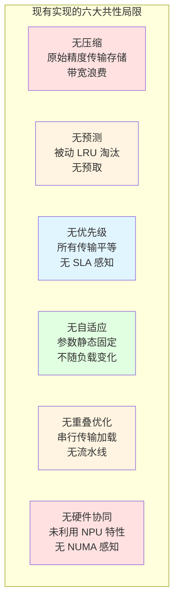

### 1.2 专利方向分类

| 类别 | 数量 | 核心价值 |
|------|:---:|----------|
| 压缩与编码 | 3 | 降低带宽与存储需求 |
| 预测与预取 | 3 | 降低回载延迟 |
| 调度与重叠 | 4 | 提升传输吞吐与计算重叠 |
| 自适应与调优 | 2 | 适应动态工作负载 |
| 存储与可靠性 | 2 | 扩展容量与提升可靠性 |
| NPU 硬件协同 | 2 | 利用 NPU 硬件特性 |

---

## 二、压缩与编码类专利

### Idea 1：KV Cache 卸载前的量化压缩传输

**现状分析：**

三套实现均以原始精度（bf16/fp16）传输和存储 KV cache：
- [cpu_npu.py](file:///workspace/vllm_ascend/kv_offload/cpu_npu.py) 第 217 行 `swap_blocks_batch` 直接传输原始张量
- [metadata.py](file:///workspace/vllm_ascend/distributed/kv_transfer/kv_pool/cpu_offload/metadata.py) 第 124 行 SharedMemory 明文存储
- 全仓搜索 "compress"/"quantiz" 仅匹配 DSA 压缩注意力或权重量化，与 KV cache 卸载无关

**技术差距：**
- 无量化：KV cache 以 bf16 传输，带宽需求高
- 无编码：无差分编码、无游程编码
- 无稀疏化：不利用 KV cache 的稀疏性

**专利方案：**

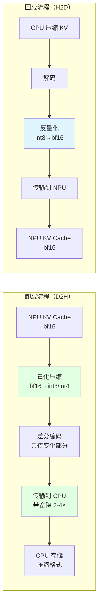

**核心创新点：**
1. **分层量化策略**：热数据（即将回载）保持高精度，冷数据（长期存储）低精度
2. **差分编码**：同一请求的连续 block 之间做差分，只传变化部分
3. **量化感知的传输调度**：根据当前带宽状况动态选择量化精度

**预期收益：**
- 带宽节省 2-4 倍（int8 节省 50%，int4 节省 75%）
- CPU 存储容量提升 2-4 倍
- 回载延迟降低（传输数据量减少）

**权利要求要点：**
- 一种 KV Cache 卸载方法，包括：在 NPU 侧对 KV cache 进行量化压缩；将压缩后的 KV cache 传输到 CPU；在 CPU 侧以压缩格式存储；回载时反量化恢复
- 量化精度根据 block 的访问频率动态确定
- 差分编码基于同一请求连续 block 的相似性

---

### Idea 2：MLA rope/nope 分离存储与差异化传输

**现状分析：**

[metadata.py](file:///workspace/vllm_ascend/distributed/kv_transfer/kv_pool/cpu_offload/metadata.py) 第 78 行将 MLA KV cache 按 `[nope_dim, rope_dim]` split，但两者存储在同一 SharedMemory，使用相同传输策略。

**技术差距：**
- nope 和 rope 无分离优化：rope 维度小（如 64）且可独立计算，nope 维度大（如 512），但两者同等对待
- 无差异化传输：rope 数据量小可优先传输，nope 可压缩后传输
- 无跨 TP 传输优化：MLA 时 KV 跨 TP 共享，但无传输优化

**专利方案：**

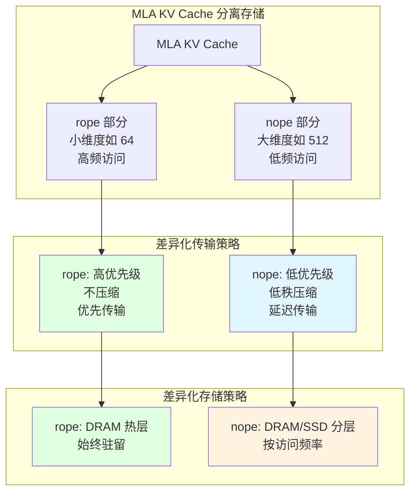

**核心创新点：**
1. **rope/nope 物理分离存储**：rope 存储在快速 DRAM 热层，nope 可溢出到冷层
2. **差异化传输优先级**：rope 优先传输（数据量小、计算必需），nope 延迟传输（可压缩）
3. **nope 低秩压缩**：nope 本身是低秩投影结果，可进一步压缩

**预期收益：**
- 回载延迟降低（rope 先到，计算可部分启动）
- CPU 存储容量提升（nope 压缩后）
- 带宽利用率优化

**权利要求要点：**
- 一种 MLA 模型的 KV Cache 卸载方法，将 KV cache 分离为 rope 部分和 nope 部分
- rope 部分以高优先级、不压缩方式传输和存储
- nope 部分以低优先级、压缩方式传输和存储
- rope 和 nope 存储在不同的存储层级

---

### Idea 3：KV Cache 的内容寻址去重存储

**现状分析：**

- [simple_kv_offload/worker.py](file:///workspace/vllm_ascend/simple_kv_offload/worker.py) 第 96-112 行的 `data_ptr()` 去重仅是 NPU 分配去重（同一存储 backing 多个 layer），非内容去重
- [cpu_kv_cache_manager.py](file:///workspace/vllm_ascend/distributed/kv_transfer/kv_pool/cpu_offload/cpu_kv_cache_manager.py) 第 75 行使用 `block_hashes` 做 prefix cache 命中，但不做存储级去重——相同内容的 block 从不同请求保存时会占用多个 CPU slot

**技术差距：**
- 无内容寻址存储：相同内容的 KV block 在 CPU 中存多份
- 无跨请求/DP rank 去重：不同请求的相同 prefix 在 CPU 中重复存储
- 无引用计数：无法安全共享 block

**专利方案：**

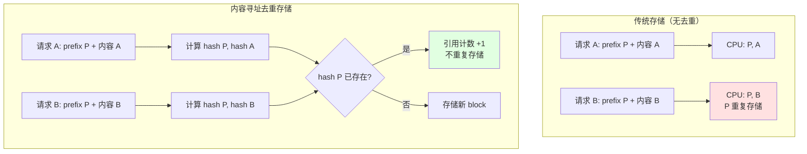

**核心创新点：**
1. **内容寻址存储**：每个 CPU KV block 以内容哈希为键存储
2. **引用计数去重**：相同内容的 block 只存一份，通过引用计数管理生命周期
3. **跨 DP rank 去重**：4 个 DP rank 的相同 prefix 在 CPU 中只存一份

**预期收益：**
- CPU 存储节省 30-60%（取决于 prefix 共享程度）
- 跨 DP rank 共享时节省 4 倍（4 DP 相同 prefix）

**权利要求要点：**
- 一种 KV Cache 卸载的去重存储方法，包括：计算每个 KV block 的内容哈希
- 以内容哈希为键存储 KV block，相同哈希的 block 通过引用计数共享
- 跨 DP rank 的相同内容 block 去重存储

---

## 三、预测与预取类专利

### Idea 4：基于请求队列预测的 KV Cache 预取

**现状分析：**

三套实现均无预取机制：
- [cpu_npu.py](file:///workspace/vllm_ascend/kv_offload/cpu_npu.py) 只在收到 `transfer_async` 调用时才发起传输
- [cpu_kv_cache_manager.py](file:///workspace/vllm_ascend/distributed/kv_transfer/kv_pool/cpu_offload/cpu_kv_cache_manager.py) 第 85-117 行 `get_matched_num_and_touch` 是被动查询
- 全部使用被动 LRU 淘汰

**技术差距：**
- 无预测：不会预测哪些 block 即将被需要
- 无预取：不会在请求到达前预加载 block 到 NPU
- 无主动淘汰：LRU 不考虑 block 的未来重用概率

**专利方案：**

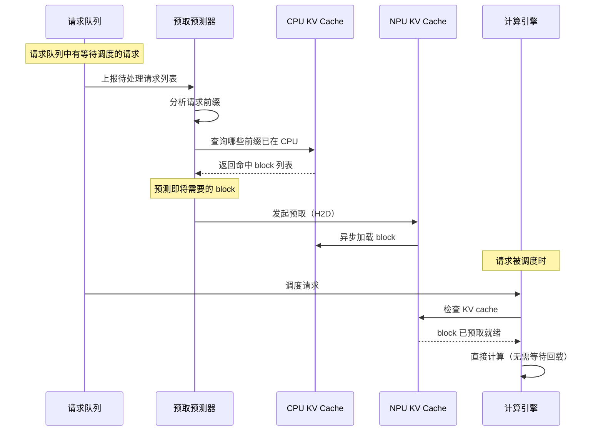

**核心创新点：**
1. **请求队列前缀分析**：分析等待调度的请求的前缀，预测即将需要的 block
2. **优先级预取**：根据请求优先级和预计调度时间排序预取
3. **预取与淘汰协同**：预取新 block 时主动淘汰预测不再需要的 block

**预期收益：**
- 回载延迟降低 50-80%（预取掩盖传输延迟）
- TTFT 降低

**权利要求要点：**
- 一种 KV Cache 预取方法，包括：分析请求队列中待处理请求的前缀
- 预测即将被调度的请求所需的 KV block
- 在请求被调度前异步预取 block 到 NPU
- 预取优先级基于请求优先级和预计调度时间

---

### Idea 5：基于序列访问模式预测的智能淘汰

**现状分析：**

三套实现全部使用被动 LRU 淘汰：
- [npu.py](file:///workspace/vllm_ascend/kv_offload/npu.py) 第 38-42 行 LRU 委托给上游
- [cpu_kv_cache_manager.py](file:///workspace/vllm_ascend/distributed/kv_transfer/kv_pool/cpu_offload/cpu_kv_cache_manager.py) 第 68 行 BlockPool 标准 LRU

**技术差距：**
- LRU 不考虑 block 的未来重用概率
- 无基于请求模式的预测

**专利方案：**

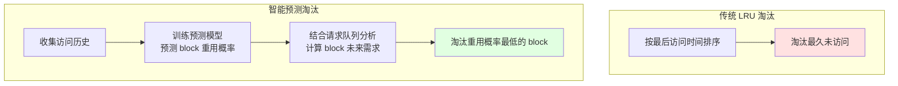

**核心创新点：**
1. **访问模式学习**：基于历史访问模式训练轻量预测模型
2. **请求队列感知**：结合当前请求队列分析 block 的未来需求
3. **重用概率排序淘汰**：替代 LRU，按预测重用概率淘汰

**预期收益：**
- 命中率提升 10-30%
- CPU 内存利用率提升

**权利要求要点：**
- 一种 KV Cache 智能淘汰方法，包括：收集 block 访问历史
- 基于访问历史和请求队列预测 block 的未来重用概率
- 按重用概率排序淘汰

---

### Idea 6：swap_in_threshold 的自适应学习

**现状分析：**

[cpu_offload_connector.py](file:///workspace/vllm_ascend/distributed/kv_transfer/kv_pool/cpu_offload/cpu_offload_connector.py) 第 152-155 行 `swap_in_threshold` 从配置读取，静态值。第 163 行简单比较 `num_cpu_computed_tokens - num_computed_tokens >= self.swap_in_threshold`。

**技术差距：**
- 无学习：不会根据 swap-in 的实际收益调整阈值
- 无自适应：不会根据 NPU 显存压力、CPU 带宽状况动态调整

**专利方案：**

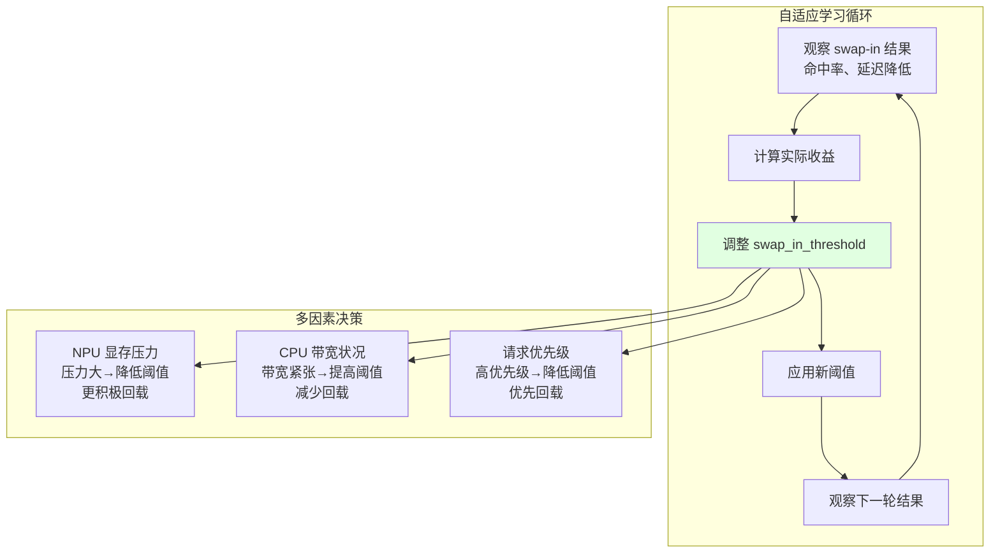

**核心创新点：**
1. **在线学习**：基于 swap-in 的实际收益（命中率、延迟降低）在线调整阈值
2. **多因素决策**：结合 NPU 显存压力、CPU 带宽、请求优先级
3. **强化学习优化**：将阈值调整建模为强化学习问题

**预期收益：**
- 回载时机优化，避免过早或过晚回载
- 自适应不同工作负载

**权利要求要点：**
- 一种 KV Cache swap-in 阈值的自适应调整方法
- 基于 swap-in 的实际收益在线调整阈值
- 结合 NPU 显存压力、CPU 带宽、请求优先级多因素决策

---

## 四、调度与重叠类专利

### Idea 7：计算与传输的层间流水线重叠

**现状分析：**

[cpu_offload_connector.py](file:///workspace/vllm_ascend/distributed/kv_transfer/kv_pool/cpu_offload/cpu_offload_connector.py) 第 311-330 行 `load_kv_layer` 逐层串行加载，`wait_for_layer_load` 在每层加载后同步（第 318 行 `self.load_stream.synchronize()`）。

**技术差距：**
- 无跨层并行传输：不会同时加载多个 layer 的 KV cache
- 无层间流水线：不会在 layer N 计算时预加载 layer N+1 的 KV

**专利方案：**

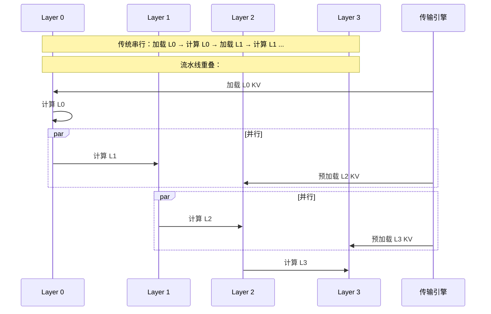

**核心创新点：**
1. **层间预取流水线**：在 layer N 计算时预加载 layer N+1（或 N+2）的 KV
2. **多层并行传输**：利用 `swap_blocks_batch` 的批量能力一次传输多层
3. **计算-传输依赖分析**：确保数据一致性，避免读取未就绪数据

**预期收益：**
- 传输延迟隐藏 50-80%
- 整体推理延迟降低

**权利要求要点：**
- 一种 KV Cache 加载与模型计算的层间流水线方法
- 在第 N 层计算时，异步预加载第 N+K 层的 KV cache
- K 的值根据传输延迟和计算延迟动态确定

---

### Idea 8：D2H/H2D 双向带宽感知交替调度

**现状分析：**

三套实现均无显式的 D2H/H2D 双向重叠优化：
- [cpu_npu.py](file:///workspace/vllm_ascend/kv_offload/cpu_npu.py) 第 67-68 行两条 stream 但无双向调度
- [copy_backend.py](file:///workspace/vllm_ascend/simple_kv_offload/copy_backend.py) 第 60-65 行两条 stream 但单工作线程串行提交
- [cpu_offload_connector.py](file:///workspace/vllm_ascend/distributed/kv_transfer/kv_pool/cpu_offload/cpu_offload_connector.py) 第 239-240 行 load_stream 和 save_stream 独立但无重叠调度

**技术差距：**
- 无双向带宽利用：PCIe/HCCS 支持双向传输，但未交替调度
- 无带宽监测：不监测当前带宽利用率

**专利方案：**

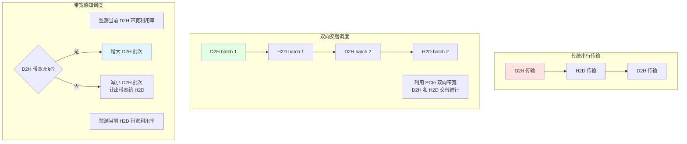

**核心创新点：**
1. **双向交替传输调度**：D2H 和 H2D 交替进行，利用 PCIe 双向带宽
2. **带宽感知批次调整**：根据实时带宽利用率调整传输批次大小
3. **方向优先级**：H2D（回载，阻塞计算）优先于 D2H（offload，可延迟）

**预期收益：**
- 传输吞吐提升 1.5-2 倍（利用双向带宽）
- 回载延迟降低

**权利要求要点：**
- 一种 NPU-CPU 双向 KV Cache 传输调度方法
- D2H 和 H2D 传输交替进行，利用双向带宽
- 传输批次大小根据实时带宽利用率动态调整

---

### Idea 9：SLA 感知的传输优先级调度

**现状分析：**

三套实现均无基于请求重要性或 deadline 的传输优先级：
- 全仓搜索 "priority" 仅匹配 NPU stream priority（不支持，[worker.py](file:///workspace/vllm_ascend/simple_kv_offload/worker.py) 第 141-142 行）或 scheduler 请求优先级（无关）

**技术差距：**
- 无请求优先级：高优先级请求的 KV 回载与低优先级请求的 offload 同等对待
- 无 deadline 感知：不考虑请求的 SLA 要求

**专利方案：**

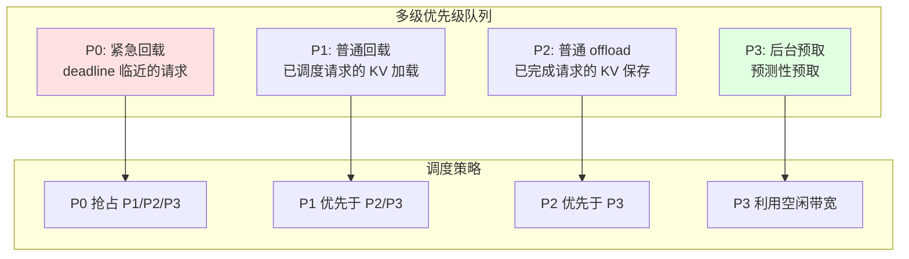

**核心创新点：**
1. **四级优先级队列**：紧急回载 > 普通回载 > 普通 offload > 后台预取
2. **SLA deadline 感知**：根据请求的 SLA deadline 计算紧急度
3. **抢占式调度**：高优先级传输可抢占低优先级传输

**预期收益：**
- 高优先级请求延迟降低
- SLA 达标率提升

**权利要求要点：**
- 一种 SLA 感知的 KV Cache 传输优先级调度方法
- 传输任务按请求优先级和 deadline 分为多级队列
- 高优先级传输可抢占低优先级传输

---

### Idea 10：KV Cache 传输的批量合并与乱序完成处理

**现状分析：**

[cpu_npu.py](file:///workspace/vllm_ascend/kv_offload/cpu_npu.py) 第 232-252 行 `get_finished` 只轮询 deque 头部，无法检测乱序完成。如果头部传输较慢，后续已完成的传输会被阻塞报告。每次 `transfer_async` 只处理一个 TransferSpec，无法一次性提交多个传输并合并。

**技术差距：**
- 无批量提交：每个 `transfer_async` 独立发起 `swap_blocks_batch`
- 无乱序完成处理：严格 FIFO 完成检测
- 无传输取消：一旦提交无法取消

**专利方案：**

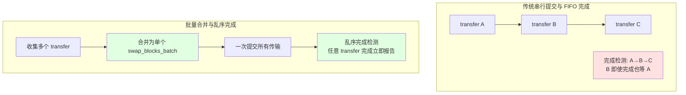

**核心创新点：**
1. **批量合并提交**：将多个 `transfer_async` 合并为单个 `swap_blocks_batch`
2. **乱序完成检测**：扫描所有 in-flight 传输，任意完成立即报告
3. **传输取消机制**：请求被抢占时取消对应传输

**预期收益：**
- 传输吞吐提升（减少 `swap_blocks_batch` 调用开销）
- 完成检测延迟降低（乱序完成立即报告）

**权利要求要点：**
- 一种 KV Cache 传输的批量合并方法
- 多个传输请求合并为单次批量拷贝调用
- 完成检测支持乱序，任意传输完成立即报告

---

## 五、自适应与调优类专利

### Idea 11：基于工作负载的 block_size_factor 自适应

**现状分析：**

[cpu_npu.py](file:///workspace/vllm_ascend/kv_offload/cpu_npu.py) 第 64 行 `block_size_factor = cpu_block_size // gpu_block_size` 在初始化时静态固定，运行时不可调整。

**技术差距：**
- 无动态调整：长上下文请求和短上下文请求使用相同的聚合因子
- 小请求浪费 CPU 内存，大请求碎片化严重

**专利方案：**

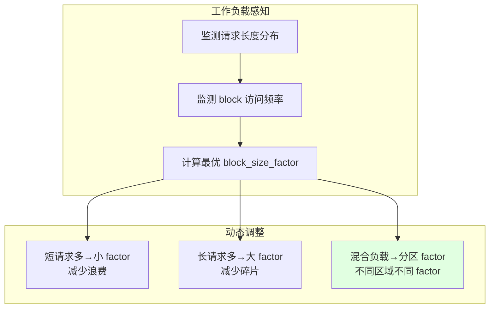

**核心创新点：**
1. **工作负载监测**：实时监测请求长度分布和 block 访问频率
2. **动态 factor 调整**：根据工作负载动态调整 block_size_factor
3. **分区 factor**：不同 CPU 内存区域使用不同 factor

**预期收益：**
- CPU 内存利用率提升 20-40%
- 碎片化减少

**权利要求要点：**
- 一种 KV Cache 卸载块大小的自适应调整方法
- 根据请求长度分布和 block 访问频率动态调整 block_size_factor
- 支持 CPU 内存分区，不同区域使用不同 factor

---

### Idea 12：基于背压的卸载流控

**现状分析：**

三套实现均无背压机制：
- handler 不告知调度器当前传输队列深度
- 不监测 CPU 内存使用率
- 不会在内存紧张时主动减少 offload 频率

**技术差距：**
- 无传输队列深度反馈
- 无 CPU 内存压力感知
- 无过载保护

**专利方案：**

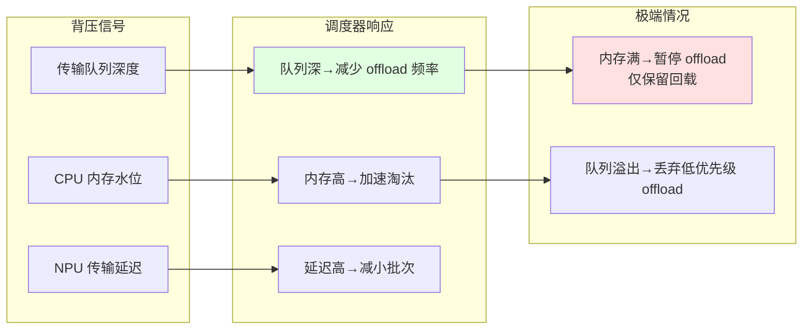

**核心创新点：**
1. **多维度背压信号**：传输队列深度、CPU 内存水位、NPU 传输延迟
2. **分级响应**：轻度压力减少频率，中度压力加速淘汰，极端压力暂停 offload
3. **端到端流控**：从 handler 到 scheduler 的完整反馈链路

**预期收益：**
- 防止过载导致的性能崩溃
- 稳定系统行为

**权利要求要点：**
- 一种基于背压的 KV Cache 卸载流控方法
- 监测传输队列深度、CPU 内存水位、NPU 传输延迟
- 根据背压信号分级调整 offload 策略

---

## 六、存储与可靠性类专利

### Idea 13：KV Cache 多级存储溢出（DRAM→SSD）

**现状分析：**

[cpu_kv_cache_manager.py](file:///workspace/vllm_ascend/distributed/kv_transfer/kv_pool/cpu_offload/cpu_kv_cache_manager.py) 第 125-151 行 `allocate_slots` 在 CPU block 不足时直接拒绝分配，无 SSD 溢出。仅 mooncake backend 有 SSD offload。

**技术差距：**
- 无 SSD 溢出：CPU 内存满时直接拒绝分配
- 无分层存储：所有 block 平等存储在 DRAM
- 无冷热分层

**专利方案：**

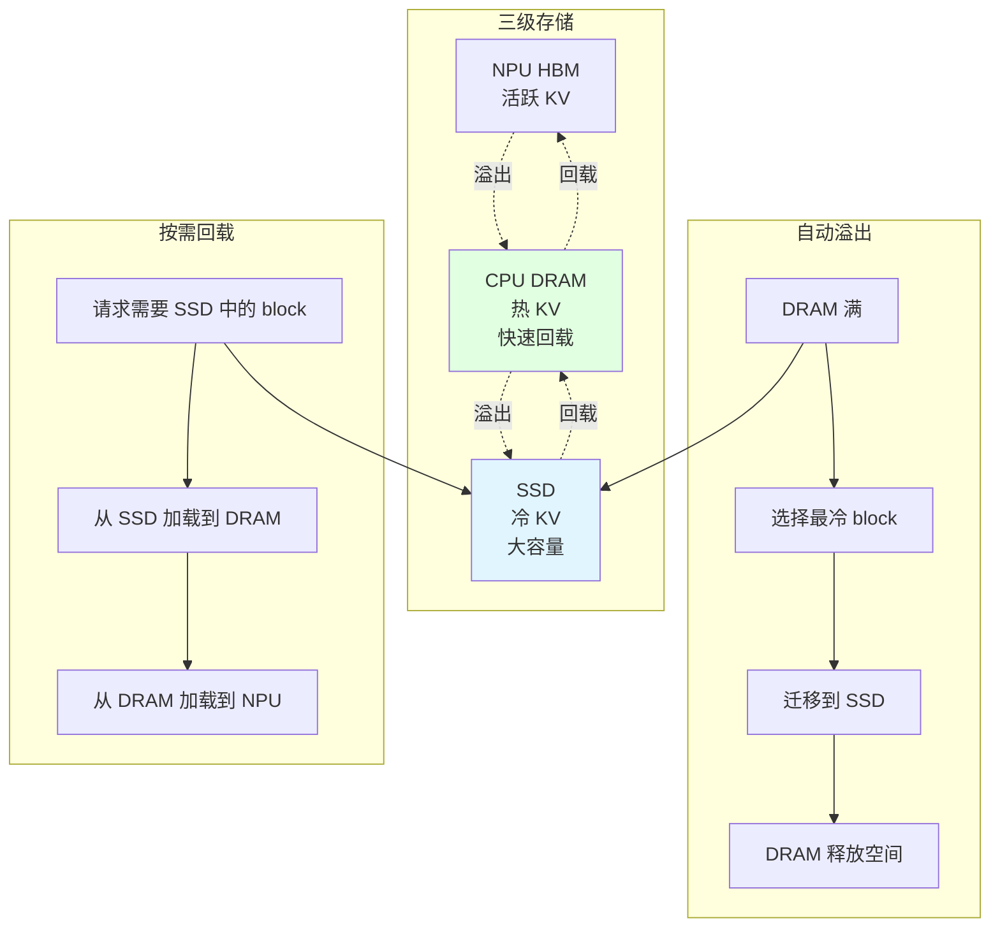

**核心创新点：**
1. **三级存储栈**：NPU HBM → CPU DRAM → SSD
2. **自动溢出**：DRAM 满时自动将冷 block 迁移到 SSD
3. **冷热分层**：基于访问频率自动分层

**预期收益：**
- 有效容量提升 10-100 倍（SSD 容量远大于 DRAM）
- 支持更长上下文和更多并发请求

**权利要求要点：**
- 一种 KV Cache 的多级存储管理方法
- CPU DRAM 满时自动将冷 block 迁移到 SSD
- 基于访问频率的冷热分层

---

### Idea 14：metadata server 高可用与故障转移

**现状分析：**

[metadata.py](file:///workspace/vllm_ascend/distributed/kv_transfer/kv_pool/cpu_offload/metadata.py) 第 226-257 行单进程、单线程，无复制、无故障转移。若崩溃，所有 worker 的 RPC 调用永久阻塞。

**技术差距：**
- 无复制：metadata server 状态无副本
- 无故障转移：崩溃后无法恢复
- 无状态检查点：BlockPool 状态不持久化
- 无健康检查：worker 不监测存活状态

**专利方案：**

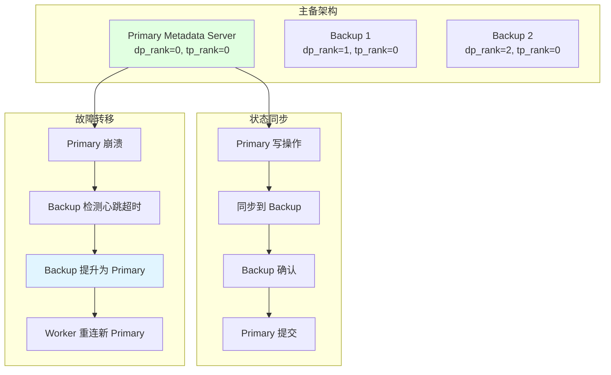

**核心创新点：**
1. **主备复制**：Primary 将状态同步到多个 Backup
2. **心跳检测与自动故障转移**：Backup 检测 Primary 心跳，超时自动提升
3. **状态检查点**：定期将 BlockPool 状态持久化

**预期收益：**
- 系统可靠性提升
- 单点故障不影响服务

**权利要求要点：**
- 一种 KV Cache 元数据服务的高可用方法
- 主备复制，Primary 状态同步到多个 Backup
- 心跳检测与自动故障转移

---

## 七、NPU 硬件协同类专利

### Idea 15：NPU DMA 路径运行时自适应选择

**现状分析：**

[csrc/torch_binding.cpp](file:///workspace/csrc/torch_binding.cpp) 第 164-218 行仅使用 `aclrtMemcpyBatchAsync`（CANN 8.5+）或回退到逐个 `aclrtMemcpyAsync`。`VLLM_ASCEND_ENABLE_BATCH_MEMCPY` 环境变量仅控制编译路径，非运行时选择。

**技术差距：**
- 未使用的 NPU DMA 能力：`aclrtMemCopy2dAsync`、SDMA 引擎、内存压缩引擎
- 无性能监测：不记录哪种路径更快
- 无自适应选择

**专利方案：**

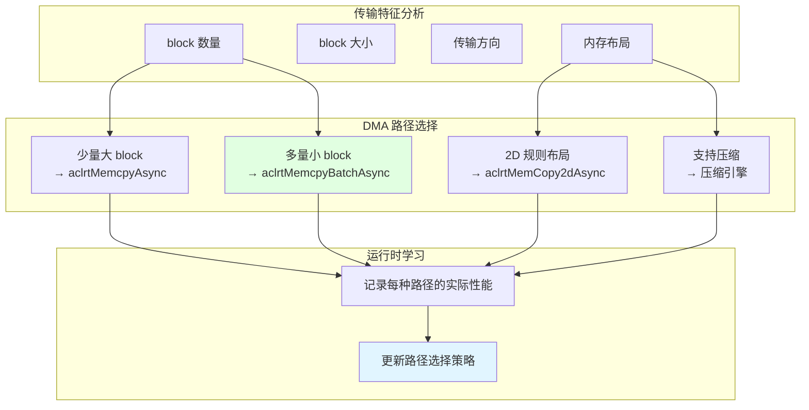

**核心创新点：**
1. **多 DMA 路径支持**：`aclrtMemcpyAsync`、`aclrtMemcpyBatchAsync`、`aclrtMemCopy2dAsync`
2. **传输特征分析**：根据 block 数量、大小、布局选择最优路径
3. **运行时学习**：记录实际性能，持续优化选择策略

**预期收益：**
- 传输性能提升 10-30%
- 适应不同 NPU 硬件版本

**权利要求要点：**
- 一种 NPU KV Cache 传输路径的自适应选择方法
- 根据传输特征（block 数量、大小、布局）选择 DMA 路径
- 运行时记录性能并持续优化选择策略

---

### Idea 16：NUMA 感知的 pinned memory 分配

**现状分析：**

- [platform.py](file:///workspace/vllm_ascend/platform.py) 第 1132-1165 行明确禁用 NUMA："--numa-bind is not supported on Ascend NPU"
- 三套卸载实现均无 NUMA 感知的内存分配
- [worker.py](file:///workspace/vllm_ascend/simple_kv_offload/worker.py) 第 129-137 行 `torch.zeros(pin_memory=...)` 不指定 NUMA 节点

**技术差距：**
- 无 NUMA 感知：NPU 与 CPU 之间的 DMA 传输应优先使用 NPU 亲和的 NUMA 节点内存
- 跨 NUMA 访问降低 DMA 带宽

**专利方案：**

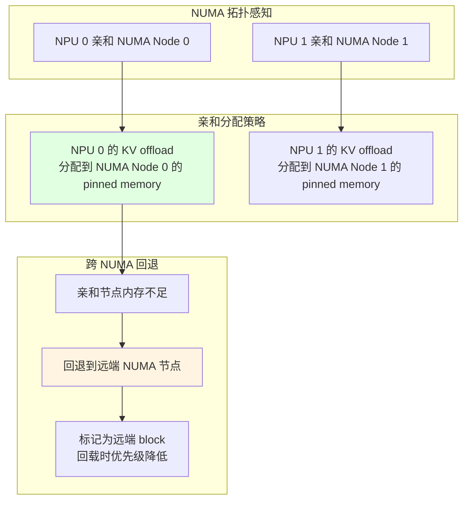

**核心创新点：**
1. **NPU-NUMA 亲和性映射**：建立 NPU 与 NUMA 节点的亲和性映射
2. **亲和分配**：KV offload 的 pinned memory 优先分配在 NPU 亲和的 NUMA 节点
3. **远端回退与降级**：亲和节点不足时回退到远端，但标记降级优先级

**预期收益：**
- DMA 带宽提升 20-50%（避免跨 NUMA 访问）
- 传输延迟降低

**权利要求要点：**
- 一种 NUMA 感知的 KV Cache 卸载内存分配方法
- 建立 NPU 与 NUMA 节点的亲和性映射
- pinned memory 优先分配在 NPU 亲和的 NUMA 节点

---

## 八、专利价值矩阵与优先级排序

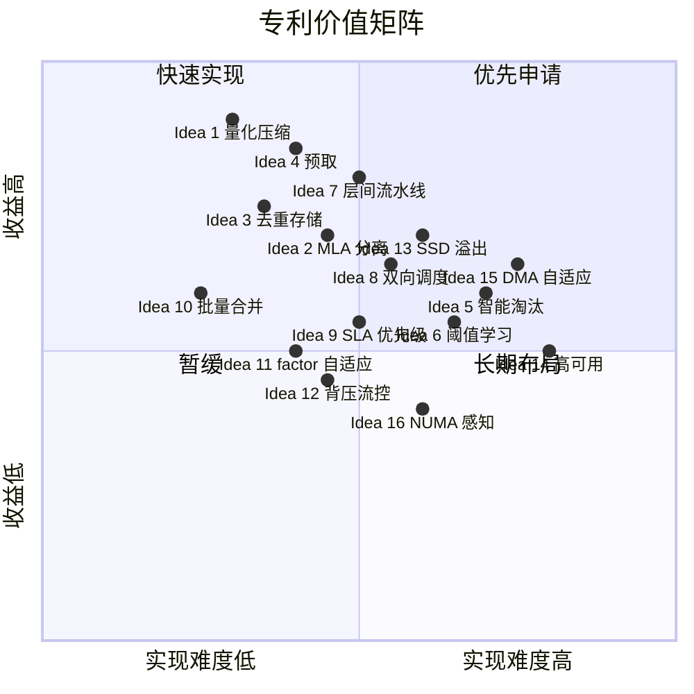

### 优先级排序

| 优先级 | Idea | 核心价值 | 实现难度 | 建议动作 |
|:---:|------|----------|:---:|----------|
| **P0** | Idea 1 量化压缩 | 带宽节省 2-4× | 中 | **立即申请** |
| **P0** | Idea 4 预取 | 回载延迟降 50-80% | 中 | **立即申请** |
| **P0** | Idea 7 层间流水线 | 传输延迟隐藏 50-80% | 中 | **立即申请** |
| **P1** | Idea 3 去重存储 | CPU 存储节省 30-60% | 中 | 优先申请 |
| **P1** | Idea 2 MLA 分离 | 利用 MLA 结构特性 | 中 | 优先申请 |
| **P1** | Idea 8 双向调度 | 传输吞吐 1.5-2× | 中高 | 优先申请 |
| **P1** | Idea 10 批量合并 | 传输吞吐提升 | 低 | 快速实现 |
| **P2** | Idea 13 SSD 溢出 | 容量提升 10-100× | 中高 | 计划申请 |
| **P2** | Idea 9 SLA 优先级 | 差异化服务 | 中 | 计划申请 |
| **P2** | Idea 11 factor 自适应 | 内存利用率提升 20-40% | 中 | 计划申请 |
| **P2** | Idea 6 阈值学习 | 回载时机优化 | 中高 | 计划申请 |
| **P3** | Idea 12 背压流控 | 防止过载 | 中 | 暂缓 |
| **P3** | Idea 5 智能淘汰 | 命中率提升 10-30% | 高 | 暂缓 |
| **P3** | Idea 15 DMA 自适应 | 传输性能 10-30% | 高 | 长期布局 |
| **P3** | Idea 16 NUMA 感知 | DMA 带宽 20-50% | 中高 | 长期布局 |
| **P3** | Idea 14 高可用 | 可靠性提升 | 高 | 长期布局 |

### 推荐组合申请策略

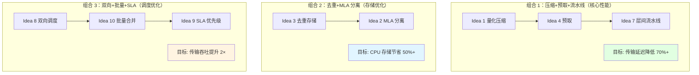

**推荐三组组合申请**：
1. **核心性能组合**（Idea 1+4+7）：量化压缩 + 预取 + 层间流水线，目标传输延迟降低 70%+
2. **存储优化组合**（Idea 3+2）：去重存储 + MLA 分离，目标 CPU 存储节省 50%+
3. **调度优化组合**（Idea 8+10+9）：双向调度 + 批量合并 + SLA 优先级，目标传输吞吐提升 2×

每组组合内的 Idea 相互协同，可形成完整的专利布局。
