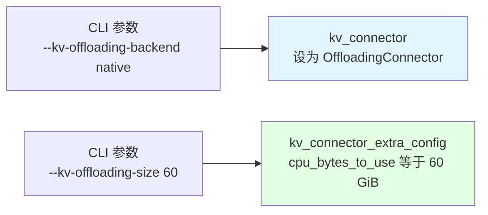
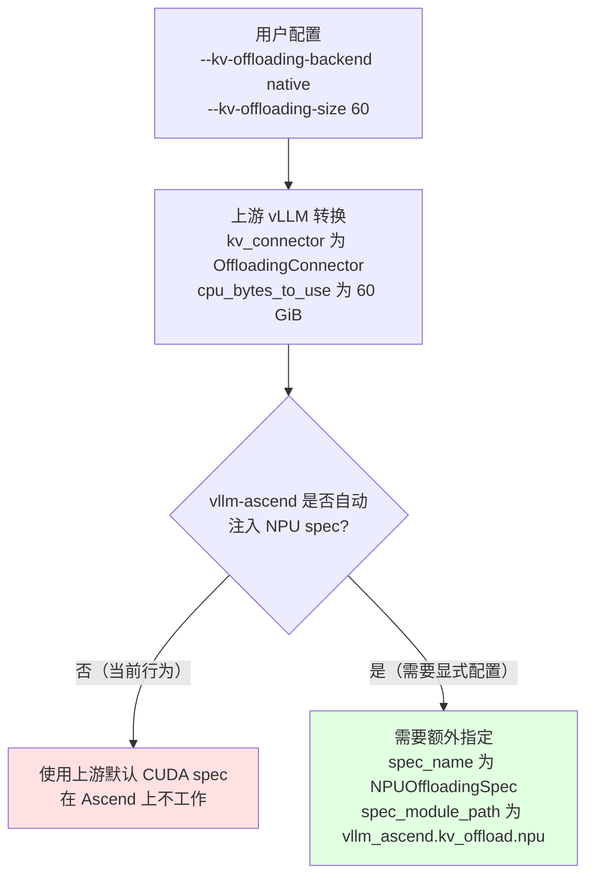
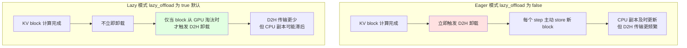
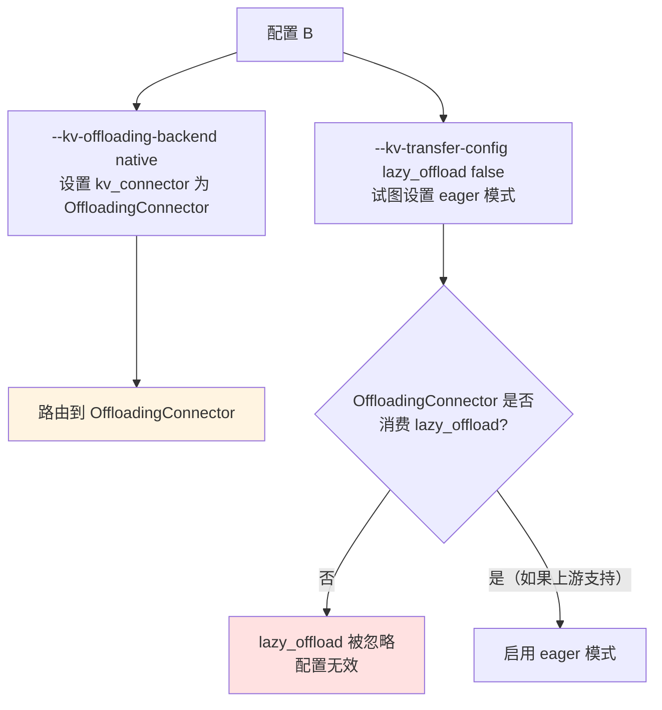
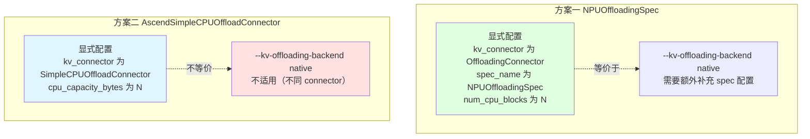
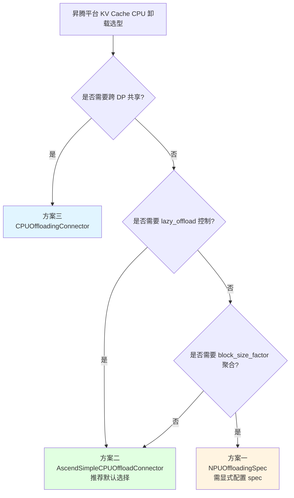

# `--kv-offloading-backend native` 配置在昇腾平台的路由分析

## 目录

- [一、问题背景](#一问题背景)
- [二、上游 vLLM 的配置映射逻辑](#二上游-vllm-的配置映射逻辑)
- [三、昇腾平台的路由分析](#三昇腾平台的路由分析)
- [四、与文档02 simplekv 配置的区别](#四与文档02-simplekv-配置的区别)
- [五、lazy_offload 参数的作用](#五lazy_offload-参数的作用)
- [六、配置等价关系与选型建议](#六配置等价关系与选型建议)
- [七、关键代码证据](#七关键代码证据)

---

## 一、问题背景

用户在昇腾平台（如 910C）启动 vLLM 服务时，使用了以下两种配置：

**配置 A：**
```bash
--kv-offloading-backend native --kv-offloading-size 60
```

**配置 B：**
```bash
--kv-offloading-size 60 --kv-offloading-backend native \
    --kv-transfer-config '{"kv_connector_extra_config": {"lazy_offload": false}}'
```

需要回答的问题：
1. 配置 A 在昇腾平台默认走哪一种卸载方式？对应之前分析的三种卸载中的哪一种？
2. 配置 B 与文档02中介绍的 simplekv 卸载配置有什么区别？

---

## 二、上游 vLLM 的配置映射逻辑

### 2.1 CLI 参数定义

`--kv-offloading-backend` 和 `--kv-offloading-size` 是**上游 vLLM 的 CLI 便捷参数**（vLLM 0.14.0+，PR #24498 引入），不在 vllm-ascend 代码库中定义。

上游 `CacheConfig` 中的定义：

```python
@config
@dataclass
class CacheConfig:
    kv_offloading_size: float | None = None
    """KV cache offloading buffer 总大小（GiB）。
    当 TP > 1 时，这是所有 TP rank 的总和。
    默认为 None（不启用）。"""

    kv_offloading_backend: KVOffloadingBackend = "native"
    """KV cache offloading 的后端选择：
    - "native": vLLM 原生 CPU offloading（OffloadingConnector）
    - "lmcache": LMCache connector"""
```

### 2.2 内部转换逻辑

上游 vLLM 在配置初始化时，将 CLI 参数转换为 `KVTransferConfig`：

```python
# vllm/config/vllm.py 中的自动配置逻辑
if kv_offloading_backend == "native":
    self.kv_transfer_config.kv_connector = "OffloadingConnector"
    self.kv_transfer_config.kv_connector_extra_config.update(
        {"cpu_bytes_to_use": kv_offloading_size * (1 << 30)}
    )
```

**关键映射关系：**



### 2.3 重要结论

`--kv-offloading-backend native` 映射到的是 **`OffloadingConnector`**，而**不是** `SimpleCPUOffloadConnector`。这是两个不同的上游 connector。

---

## 三、昇腾平台的路由分析

### 3.1 vllm-ascend 的三套卸载实现回顾

| 方案 | Connector 名称 | 触发方式 | 核心文件 |
|------|---------------|----------|----------|
| 方案一 | `OffloadingConnector` + `NPUOffloadingSpec` | 显式指定 spec_name | `vllm_ascend/kv_offload/` |
| 方案二 | `SimpleCPUOffloadConnector`（自动覆盖为 NPU 版） | kv_connector 为 SimpleCPUOffloadConnector | `vllm_ascend/simple_kv_offload/` |
| 方案三 | `CPUOffloadingConnector` | kv_connector 为 CPUOffloadingConnector | `vllm_ascend/distributed/kv_transfer/kv_pool/cpu_offload/` |

### 3.2 `OffloadingConnector` 在昇腾平台的行为

`--kv-offloading-backend native` 设置 `kv_connector="OffloadingConnector"`。在昇腾平台上，这对应**方案一（NPUOffloadingSpec）**的框架，但有一个关键问题：**vllm-ascend 不会自动注入 NPU spec**。



### 3.3 vllm-ascend 的注册覆盖机制

vllm-ascend 在插件加载时通过 `register_connector()` 覆盖上游注册（见 [distributed/kv_transfer/__init__.py](file:///workspace/vllm_ascend/distributed/kv_transfer/__init__.py) 第 67-81 行）：

```python
# 覆盖 SimpleCPUOffloadConnector 为 NPU 版本
if "SimpleCPUOffloadConnector" in KVConnectorFactory._registry:
    KVConnectorFactory._registry.pop("SimpleCPUOffloadConnector")
KVConnectorFactory.register_connector(
    "SimpleCPUOffloadConnector",
    "vllm_ascend.distributed.kv_transfer.kv_pool.simple_cpu_offload.simple_cpu_offload_connector",
    "AscendSimpleCPUOffloadConnector",
)
```

**关键发现：vllm-ascend 只覆盖了 `SimpleCPUOffloadConnector`，没有覆盖 `OffloadingConnector`。**

这意味着：
- `kv_connector="SimpleCPUOffloadConnector"` → 自动路由到 `AscendSimpleCPUOffloadConnector`（方案二）
- `kv_connector="OffloadingConnector"` → 使用上游 `OffloadingConnector`，需要显式指定 NPU spec

### 3.4 NPUOffloadingSpec 的配置要求

方案一的 `NPUOffloadingSpec` 需要显式配置以下参数（见 [kv_offload/npu.py](file:///workspace/vllm_ascend/kv_offload/npu.py) 第 20-22 行）：

```python
num_cpu_blocks = self.extra_config.get("num_cpu_blocks")
if not num_cpu_blocks:
    raise Exception("num_cpu_blocks must be specified in kv_connector_extra_config")
```

完整配置示例（来自 [kv_cache_cpu_offload.md](file:///workspace/docs/source/user_guide/feature_guide/kv_cache_cpu_offload.md)）：

```bash
vllm serve Qwen/Qwen3-0.6B \
    --kv-transfer-config '{
        "kv_connector": "OffloadingConnector",
        "kv_role": "kv_both",
        "kv_connector_extra_config": {
            "num_cpu_blocks": 1000,
            "block_size": 128,
            "spec_name": "NPUOffloadingSpec",
            "spec_module_path": "vllm_ascend.kv_offload.npu"
        }
    }'
```

### 3.5 参数不兼容问题

`--kv-offloading-size 60` 转换为 `cpu_bytes_to_use`（字节单位），而 `NPUOffloadingSpec` 需要 `num_cpu_blocks`（块数量）。两者参数不兼容：

| 参数 | 来源 | 含义 |
|------|------|------|
| `cpu_bytes_to_use` | 上游 `--kv-offloading-size` | CPU 卸载总字节数（GiB 转字节） |
| `num_cpu_blocks` | vllm-ascend `NPUOffloadingSpec` | CPU 卸载块数量 |
| `cpu_capacity_bytes` | 上游 `SimpleCPUOffloadConnector` | CPU 卸载总字节数 |

### 3.6 结论

**`--kv-offloading-backend native --kv-offloading-size 60` 在昇腾平台上的行为：**

1. 上游设置 `kv_connector="OffloadingConnector"` 和 `cpu_bytes_to_use=60GB`
2. vllm-ascend **没有**自动覆盖 `OffloadingConnector` 的 spec 为 `NPUOffloadingSpec`
3. vllm-ascend **没有**自动将 `cpu_bytes_to_use` 转换为 `num_cpu_blocks`
4. 因此，此配置在昇腾平台上**需要额外配置 `spec_name` 和 `spec_module_path`** 才能使用 `NPUOffloadingSpec`
5. 如果不额外配置 spec，会使用上游默认的 CUDA spec，在 Ascend 上不工作

**要在昇腾平台使用方案一（NPUOffloadingSpec），必须使用显式配置：**

```bash
vllm serve <model> \
    --kv-transfer-config '{
        "kv_connector": "OffloadingConnector",
        "kv_role": "kv_both",
        "kv_connector_extra_config": {
            "num_cpu_blocks": 1000,
            "block_size": 128,
            "spec_name": "NPUOffloadingSpec",
            "spec_module_path": "vllm_ascend.kv_offload.npu"
        }
    }'
```

---

## 四、与文档02 simplekv 配置的区别

### 4.1 文档02 中的 simplekv 配置

文档02（[kv_cache_cpu_offload_detailed.zh.md](file:///workspace/docs/source/user_guide/feature_guide/kv_cache_cpu_offload_detailed.zh.md)）第 427-436 行给出的配置：

```bash
vllm serve Qwen/Qwen3-0.6B \
    --kv-transfer-config '{
        "kv_connector": "SimpleCPUOffloadConnector",
        "kv_role": "kv_both",
        "kv_connector_extra_config": {
            "cpu_capacity_bytes": 5368709120
        }
    }'
```

这对应**方案二（AscendSimpleCPUOffloadConnector）**。

### 4.2 两种配置的本质区别


### 4.3 详细对比表

| 维度 | 配置 A（native） | 文档02 simplekv |
|------|-----------------|----------------|
| **CLI 参数** | `--kv-offloading-backend native --kv-offloading-size 60` | `--kv-transfer-config '{"kv_connector":"SimpleCPUOffloadConnector",...}'` |
| **上游映射** | `kv_connector="OffloadingConnector"` | `kv_connector="SimpleCPUOffloadConnector"` |
| **对应方案** | 方案一（NPUOffloadingSpec） | 方案二（AscendSimpleCPUOffloadConnector） |
| **vllm-ascend 自动覆盖** | 否（需手动配置 spec） | 是（自动覆盖为 NPU 版） |
| **CPU 容量参数** | `cpu_bytes_to_use`（字节） | `cpu_capacity_bytes`（字节）或 `cpu_bytes_to_use`（字节） |
| **块数量参数** | `num_cpu_blocks`（需手动指定） | 自动从容量计算 |
| **spec 配置** | 需显式指定 `spec_name` 和 `spec_module_path` | 不需要 spec |
| **block_size_factor** | 支持（CPU block 为 NPU block 的整数倍） | 不支持 |
| **传输机制** | 双 Stream + Event 池 + 直接提交 | 后台守护线程 + FIFO 队列 |
| **淘汰策略** | LRU（委托上游 CPUOffloadingManager） | LRU（委托上游 SimpleCPUOffloadScheduler） |
| **lazy_offload 支持** | 不支持（不是 SimpleCPUOffloadConnector） | 支持（eager 和 lazy 两种模式） |

### 4.4 核心差异总结

**两者是完全不同的实现，不是同一个卸载方案：**

1. **配置 A**（`--kv-offloading-backend native`）→ 方案一（`OffloadingConnector` + `NPUOffloadingSpec`）
   - 基于 vLLM 的 `OffloadingConnector` 框架
   - 使用 spec 机制加载 NPU 特定实现
   - vllm-ascend 不自动覆盖，需手动配置

2. **文档02 simplekv**（`SimpleCPUOffloadConnector`）→ 方案二（`AscendSimpleCPUOffloadConnector`）
   - 基于上游 `SimpleCPUOffloadConnector` 的 NPU 适配
   - vllm-ascend 自动覆盖注册
   - 继承上游 scheduler 逻辑，支持 `lazy_offload`

---

## 五、lazy_offload 参数的作用

### 5.1 lazy_offload 的归属

`lazy_offload` 是**上游 `SimpleCPUOffloadConnector` 的参数**，由上游 `SimpleCPUOffloadScheduler` 消费。它**不是** `OffloadingConnector` 的参数。

在 vllm-ascend 代码库中，`lazy_offload` 仅出现在以下位置：
- [test_simple_cpu_offload.py](file:///workspace/tests/e2e/pull_request/one_card/test_simple_cpu_offload.py) 第 29-37 行：测试配置
- [kv_cache_offload_observability_and_tests.zh.md](file:///workspace/docs/source/user_guide/feature_guide/kv_cache_offload_observability_and_tests.zh.md)：文档示例

### 5.2 两种模式对比



### 5.3 配置 B 的行为分析

配置 B：
```bash
--kv-offloading-size 60 --kv-offloading-backend native \
    --kv-transfer-config '{"kv_connector_extra_config": {"lazy_offload": false}}'
```

**存在配置冲突：**

1. `--kv-offloading-backend native` 设置 `kv_connector="OffloadingConnector"`
2. `lazy_offload: false` 是 `SimpleCPUOffloadConnector` 的参数
3. `OffloadingConnector` 不消费 `lazy_offload`，该参数会被忽略



### 5.4 正确的 eager 模式配置

如果要在昇腾平台使用 eager 模式（`lazy_offload: false`），应该使用**方案二**的配置：

```bash
vllm serve <model> \
    --kv-transfer-config '{
        "kv_connector": "SimpleCPUOffloadConnector",
        "kv_role": "kv_both",
        "kv_connector_extra_config": {
            "cpu_capacity_bytes": 64424509440,
            "lazy_offload": false
        }
    }'
```

其中 `cpu_capacity_bytes: 64424509440` 等于 60 GiB（60 * 1024 * 1024 * 1024）。

---

## 六、配置等价关系与选型建议

### 6.1 配置等价关系图



### 6.2 三种配置的完整对比

| 配置方式 | 对应方案 | 昇腾自动适配 | lazy_offload 支持 | 推荐度 |
|---------|---------|:---:|:---:|:---:|
| `--kv-offloading-backend native --kv-offloading-size 60` | 方案一 | 否（需补充 spec 配置） | 否 | 低 |
| `--kv-transfer-config '{"kv_connector":"OffloadingConnector","spec_name":"NPUOffloadingSpec",...}'` | 方案一 | 是（显式指定） | 否 | 中 |
| `--kv-transfer-config '{"kv_connector":"SimpleCPUOffloadConnector",...}'` | 方案二 | 是（自动覆盖） | 是 | 高 |
| `--kv-transfer-config '{"kv_connector":"CPUOffloadingConnector",...}'` | 方案三 | 是（原生实现） | 否 | 中 |

### 6.3 选型建议



### 6.4 推荐配置示例

**推荐方案二（最简单、自动适配）：**

```bash
vllm serve <model> \
    --kv-transfer-config '{
        "kv_connector": "SimpleCPUOffloadConnector",
        "kv_role": "kv_both",
        "kv_connector_extra_config": {
            "cpu_capacity_bytes": 64424509440,
            "lazy_offload": false
        }
    }'
```

**方案一（需要 block_size_factor 聚合）：**

```bash
vllm serve <model> \
    --kv-transfer-config '{
        "kv_connector": "OffloadingConnector",
        "kv_role": "kv_both",
        "kv_connector_extra_config": {
            "num_cpu_blocks": 1000,
            "block_size": 128,
            "spec_name": "NPUOffloadingSpec",
            "spec_module_path": "vllm_ascend.kv_offload.npu"
        }
    }'
```

**方案三（需要跨 DP 共享）：**

```bash
vllm serve <model> \
    --kv-transfer-config '{
        "kv_connector": "CPUOffloadingConnector",
        "kv_role": "kv_both",
        "kv_connector_extra_config": {
            "cpu_swap_space_gb": 60,
            "swap_in_threshold": 0
        }
    }'
```

---

## 七、关键代码证据

### 7.1 上游 CLI 参数转换

上游 vLLM（v0.14.0+）的 `config/vllm.py` 中：

```python
if kv_offloading_backend == "native":
    self.kv_transfer_config.kv_connector = "OffloadingConnector"
    self.kv_transfer_config.kv_connector_extra_config.update(
        {"cpu_bytes_to_use": kv_offloading_size * (1 << 30)}
    )
```

来源：[vLLM 内置 KV Cache Offloading 模块解析](https://forceinjection.github.io/09_inference_system/vllm/module_analysis/vllm_native_kv_offloading.html)

### 7.2 vllm-ascend 的注册覆盖

[distributed/kv_transfer/__init__.py](file:///workspace/vllm_ascend/distributed/kv_transfer/__init__.py) 第 67-81 行：

```python
# Override the upstream SimpleCPUOffloadConnector with the NPU adaptation
try:
    import vllm.v1.simple_kv_offload  # noqa: F401
except ImportError:
    pass
else:
    if "SimpleCPUOffloadConnector" in KVConnectorFactory._registry:
        KVConnectorFactory._registry.pop("SimpleCPUOffloadConnector")
    KVConnectorFactory.register_connector(
        "SimpleCPUOffloadConnector",
        "vllm_ascend.distributed.kv_transfer.kv_pool.simple_cpu_offload.simple_cpu_offload_connector",
        "AscendSimpleCPUOffloadConnector",
    )
```

**注意：只覆盖了 `SimpleCPUOffloadConnector`，没有覆盖 `OffloadingConnector`。**

### 7.3 NPUOffloadingSpec 的参数要求

[kv_offload/npu.py](file:///workspace/vllm_ascend/kv_offload/npu.py) 第 20-22 行：

```python
num_cpu_blocks = self.extra_config.get("num_cpu_blocks")
if not num_cpu_blocks:
    raise Exception("num_cpu_blocks must be specified in kv_connector_extra_config")
```

### 7.4 vllm-ascend 不处理 cpu_bytes_to_use

在 vllm-ascend 整个代码库中搜索 `cpu_bytes_to_use`，**无任何匹配**。这证实 vllm-ascend 不处理上游 `--kv-offloading-size` 转换的 `cpu_bytes_to_use` 参数。

### 7.5 lazy_offload 的消费位置

`lazy_offload` 由上游 `SimpleCPUOffloadScheduler` 消费。vllm-ascend 的 `AscendSimpleCPUOffloadConnector` 完全继承上游 scheduler 逻辑（见 [simple_cpu_offload_connector.py](file:///workspace/vllm_ascend/distributed/kv_transfer/kv_pool/simple_cpu_offload/simple_cpu_offload_connector.py) 第 24-32 行注释）：

```python
class AscendSimpleCPUOffloadConnector(SimpleCPUOffloadConnector):
    """NPU-flavored ``SimpleCPUOffloadConnector``.

    Inherits the full scheduler/worker plumbing from upstream and only
    replaces the CUDA worker handler with the NPU one. All other public
    APIs are inherited verbatim.
    """
```

### 7.6 platform.py 的 check_and_update_config

[platform.py](file:///workspace/vllm_ascend/platform.py) 第 439-443 行：

```python
if vllm_config.kv_transfer_config is not None:
    check_kv_extra_config(vllm_config)
    if not getattr(vllm_config.kv_transfer_config, "_engine_id_patched", False):
        vllm_config.kv_transfer_config.engine_id = f"{vllm_config.kv_transfer_config.engine_id}-{uuid4().hex}"
        vllm_config.kv_transfer_config._engine_id_patched = True
```

`check_kv_extra_config`（[utils.py](file:///workspace/vllm_ascend/utils.py) 第 1306 行）只检查 tp_size 和 dp_size，**不涉及 spec_name 或 OffloadingConnector 的 spec 注入**。

---

## 八、总结

### 8.1 核心结论

1. **`--kv-offloading-backend native` 映射到 `OffloadingConnector`**（不是 `SimpleCPUOffloadConnector`），对应方案一（NPUOffloadingSpec）的框架。

2. **vllm-ascend 不自动覆盖 `OffloadingConnector` 的 spec**，需要显式配置 `spec_name="NPUOffloadingSpec"` 和 `spec_module_path="vllm_ascend.kv_offload.npu"` 才能在昇腾平台工作。

3. **文档02 的 simplekv 配置对应方案二**（`AscendSimpleCPUOffloadConnector`），vllm-ascend 自动覆盖，无需额外配置。

4. **两者是完全不同的实现**，不是同一个卸载方案。

5. **`lazy_offload` 是 `SimpleCPUOffloadConnector` 的参数**，与 `OffloadingConnector` 不兼容。配置 B 中同时使用 `--kv-offloading-backend native` 和 `lazy_offload: false` 存在配置冲突。

### 8.2 配置选择建议

| 场景 | 推荐配置 | 原因 |
|------|---------|------|
| 简单 KV 卸载，需要 lazy_offload 控制 | 方案二 `SimpleCPUOffloadConnector` | 自动适配，支持 eager 和 lazy 模式 |
| 需要 block_size_factor 聚合 | 方案一 `OffloadingConnector` + `NPUOffloadingSpec` | 支持 CPU block 为 NPU block 的整数倍 |
| 需要跨 DP 共享 CPU KV | 方案三 `CPUOffloadingConnector` | 支持 MLA 跨 TP 共享和跨 DP prefix cache |
| 使用 `--kv-offloading-backend native` | 需补充 spec 配置 | 上游 CLI 不会自动注入 NPU spec |
