# KV Cache 的前世今生

本文档系统梳理 KV Cache（键值缓存）从 2017 年诞生至今的完整演进历程，涵盖其数学起源、基本机制、架构优化、系统优化、算法优化，以及在 DeepSeek 与 vLLM 生态中的最新进展。

## 目录

- [一、引子：为什么 8B 模型在 128K 上下文会 OOM](#一引子为什么-8b-模型在-128k-上下文会-oom)
- [二、前世：KV Cache 的起源（2017）](#二前世kv-cache-的起源2017)
- [三、基本机制：KV Cache 如何工作](#三基本机制kv-cache-如何工作)
- [四、架构优化线：从 MHA 到 MLA 到 DSA](#四架构优化线从-mha-到-mla-到-dsa)
- [五、系统优化线：从 PagedAttention 到多级缓存](#五系统优化线从-pagedattention-到多级缓存)
- [六、算法优化线：从 SWA 到 Cache 驱逐](#六算法优化线从-swa-到-cache-驱逐)
- [七、DeepSeek 的贡献：MLA 革命](#七deepseek-的贡献mla-革命)
- [八、vLLM 的 KV Cache 管理演进](#八vllm-的-kv-cache-管理演进)
- [九、今生：现代趋势与未来方向](#九今生现代趋势与未来方向)
- [十、关键论文时间线](#十关键论文时间线)

---

## 一、引子：为什么 8B 模型在 128K 上下文会 OOM

在理解 KV Cache 之前，先看一个令人困惑的现象：一个仅 8B 参数的模型（FP16 权重约 16GB），在 128K 上下文推理时却会 OOM（显存不足）。

**答案在于 KV Cache**：模型权重是固定的，但 KV Cache 随序列长度线性增长。以 LLaMA-3.1-8B 为例（32 层、8 个 KV 头、head_dim=128、GQA）：

```
KV Cache 大小 = 2 × 32 × 8 × 128 × 128000 × 2 bytes ≈ 16 GB
```

128K 上下文的 KV Cache（16GB）已经**超过模型权重本身**。这就是 KV Cache 问题的本质——**以存储换计算的代价是存储爆炸**。

---

## 二、前世：KV Cache 的起源（2017）

### 2.1 历史背景

KV Cache 的概念源自 2017 年 6 月 Google Brain 团队发表的里程碑论文 **"Attention Is All You Need"**（Vaswani et al., NeurIPS 2017, arXiv:1706.03762）。该论文提出了完全基于注意力机制的 Transformer 架构，摒弃了此前主导序列建模的循环（RNN/LSTM）和卷积结构。截至 2025 年，该论文已被引用超过 17.3 万次。

### 2.2 数学动机：自回归生成的冗余计算

Transformer 解码器采用**自回归（autoregressive）**生成方式：每次生成一个 token，新 token 必须通过 self-attention 关注之前所有 token。Attention 的核心公式为：

$$\text{Attention}(Q, K, V) = \text{softmax}\left(\frac{QK^T}{\sqrt{d_k}}\right)V$$

**没有 KV Cache 时的计算开销**：

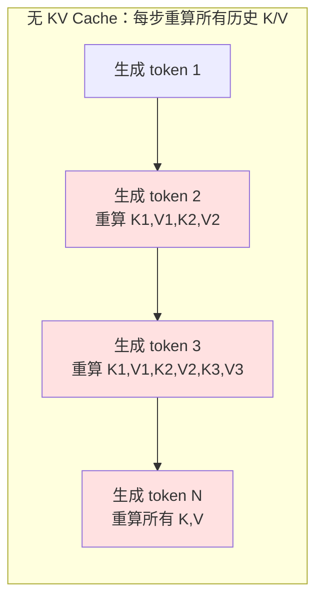

- 在生成第 t 个 token 时，模型需要为前 t-1 个 token 重新计算 Key 和 Value 投影
- 由于因果掩码（causal mask），历史 token 的 K、V 向量在不同步之间是**完全相同**的，重复计算纯属浪费
- **时间复杂度**：每步 O(n²)，生成 n 个 token 总复杂度 **O(n³)**
- 每步需要重新加载并计算所有历史 token 的 K/V，造成严重的内存带宽瓶颈

**引入 KV Cache 后**：

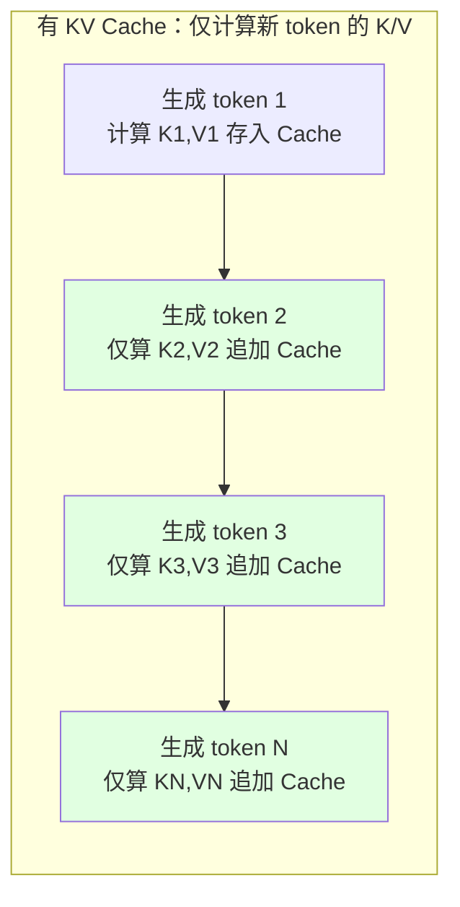

- 仅需计算当前新 token 的 q、k、v，将 k、v 追加到缓存
- **每步复杂度降为 O(n)**（仅与历史 token 做点积），生成 n 个 token 总复杂度 **O(n²)**
- 将计算瓶颈转化为**内存瓶颈**：以存储换计算

### 2.3 关键洞察

- **缓存 K 和 V，不缓存 Q**：Q 是当前 token 的"提问"，仅对当前步有意义；K、V 是历史 token 的"标识"和"内容"，会被后续所有步重复使用
- 训练阶段无需 KV Cache（所有 token 并行处理），仅在**推理（inference）阶段**生效

---

## 三、基本机制：KV Cache 如何工作

### 3.1 多头注意力中的工作流程

在每层 Transformer 的多头注意力（MHA）中：

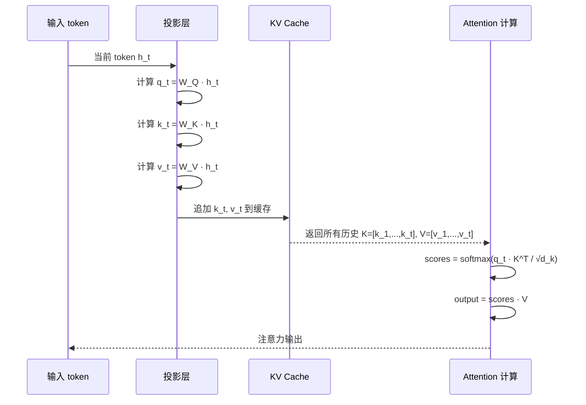

### 3.2 内存布局

KV Cache 的标准张量布局为 **`[batch, num_heads, seq_len, head_dim]`**，K 和 V 各一份。

### 3.3 内存消耗公式

```
KV Cache 大小 = 2 × num_layers × num_heads × head_dim × seq_len × batch_size × dtype_size
```

其中：
- **2**：Key 和 Value 各一份
- **dtype_size**：FP16/BF16 = 2 字节，FP32 = 4 字节，INT8 = 1 字节，INT4 = 0.5 字节

### 3.4 LLaMA-2-70B 内存计算实例

LLaMA-2-70B 配置：80 层、64 个注意力头、head_dim=128、采用 GQA（8 个 KV 头）

```python
def calc_kv_cache_size(num_layers, num_kv_heads, head_dim, seq_len, batch_size, bytes=2):
    return num_layers * 2 * num_kv_heads * head_dim * seq_len * batch_size * bytes

# LLaMA-2-70B 示例（GQA，8 KV heads）
kv_cache_size = calc_kv_cache_size(
    num_layers=80, num_kv_heads=8, head_dim=128,
    seq_len=2048, batch_size=4, bytes=2
) / (1024**3)
# ≈ 60 GB（GQA 优化后）
```

**对比表（FP16）**：

| 模型规模 | 序列长度 | batch | MHA 显存 | MQA 显存 | GQA 显存 |
|---|---|---|---|---|---|
| 13B | 1024 | 8 | 48 GB | 6 GB | 12 GB |
| 70B | 2048 | 4 | 240 GB | 30 GB | 60 GB |

**关键事实**：在长上下文场景下，KV Cache 可超过模型权重本身占用——LLaMA-3.1-8B 在 128K 上下文时 KV Cache 可超 16 GB，超过模型权重。

---

## 四、架构优化线：从 MHA 到 MLA 到 DSA

KV Cache 优化的第一条主线是**从注意力架构层面减小 KV Cache 的体积**。

### 4.1 演进总览

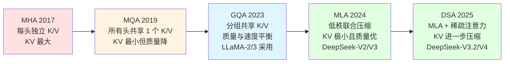

### 4.2 MQA（Multi-Query Attention，2019）

**论文**：Noam Shazeer, "Fast Transformer Decoding: One Write-Head is All You Need", 2019 年 11 月（arXiv:1911.02150）。

**核心思想**：所有查询头共享**单一**的 Key 头和 Value 头。

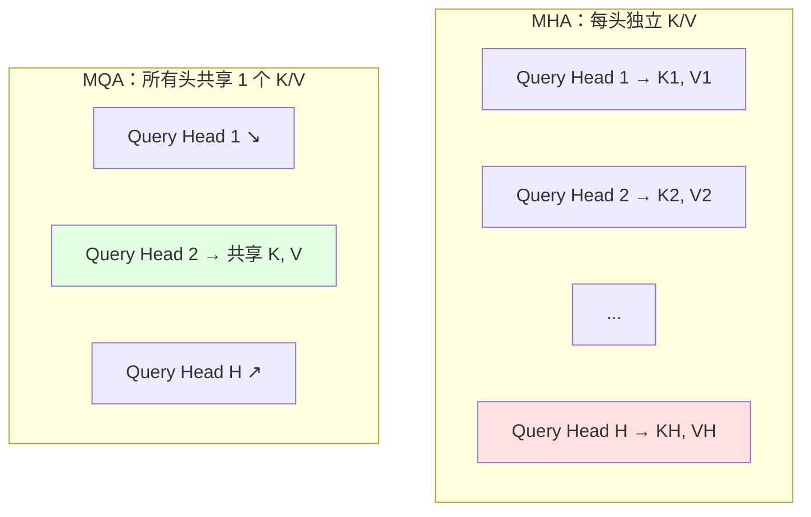

**效果**：对 64 头模型，KV Cache 缩小 **64×**（如 2.5GB → 40MB）。被 PaLM、Falcon、StarCoder、Gemini 等采用。代价是模型质量有可测量的下降。

### 4.3 GQA（Grouped-Query Attention，2023）

**论文**：Ainslie et al., "GQA: Training Generalized Multi-Query Transformer Models from Multi-Head Checkpoints", EMNLP 2023（arXiv:2305.13245），Google。

**核心思想**：MHA 和 MQA 的折中——将查询头分为 G 组，每组共享一套 K/V。**GQA-1 = MQA，GQA-H = MHA**。

**关键贡献**：
- 提出"uptraining"配方：将已有 MHA 检查点转换为 GQA，仅需约 **5% 原预训练算力**
- GQA-8 在质量上接近 MHA，速度接近 MQA

**采用情况**：**LLaMA-2-70B、LLaMA-3 全系、Mistral、DeepSeek-V1、StarCoder2、Yi、ChatGLM2/3** 等几乎所有现代开源模型采用，已成为新模型默认配置。

### 4.4 MLA（Multi-head Latent Attention，2024）

**论文**：DeepSeek-AI, "DeepSeek-V2: A Strong, Economical, and Efficient Mixture-of-Experts Language Model", 2024 年 5 月（arXiv:2405.04434）。

**核心思想**：通过**低秩联合压缩（low-rank key-value joint compression）**将 K、V 压缩为低维潜在向量后再缓存，推理时通过上投影恢复。

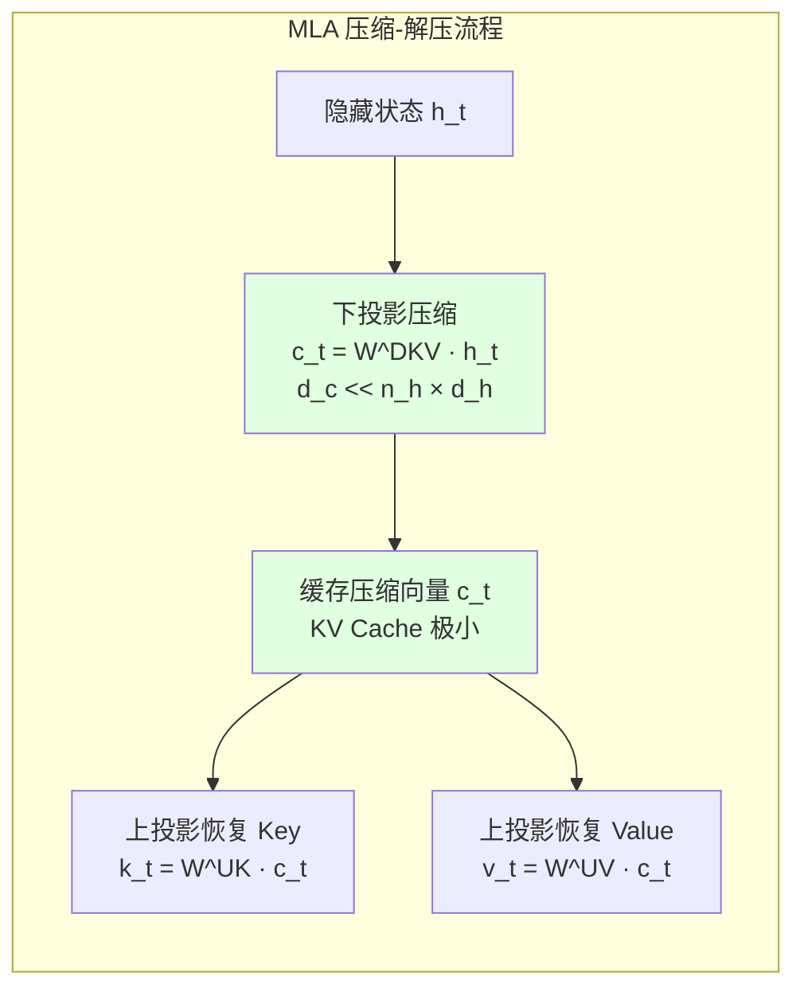

**解耦 RoPE（Decoupled RoPE）**：因 RoPE 与低秩压缩不兼容，将内容信息和位置信息物理分离：
- 内容部分 `k_t^C` 通过低秩压缩传递
- 位置部分 `k_t^R = RoPE(W^KR · h_t)` 单独维护

**关键参数**（DeepSeek-V2 配置）：
- `kv_lora_rank = 512`（d_c，KV 压缩维度）
- `qk_nope_head_dim = 128`（d_c，无 PE 的每头维度）
- `qk_rope_head_dim = 64`（d_r，RoPE 每头维度）
- n_h = 128 头，d_h = 128

**KV Cache 对比**（每 token 每层元素数）：

| 机制 | 元素数 | 相对 MHA |
|---|---|---|
| MHA | 2×128×128 = 32,768 | 100% |
| GQA（8 组） | 2×8×128 = 2,048 | 6.25% |
| **MLA（d_c=512）** | **512 + 64 = 576** | **~1.76%** |

**DeepSeek-V2 成果**：相比 DeepSeek 67B，**KV Cache 减少 93.3%**，训练成本节省 42.5%，最大生成吞吐量提升 **5.76×**，且性能超过 MHA。

**推理优化（Absorption Trick）**：利用矩阵乘法结合律，将 `W^UK` 吸收进 Q 投影、`W^UV` 吸收进 O 投影，使 KV Cache 全程保持压缩状态，无需解压。DeepSeek 官方 **FlashMLA** 算子采用此模式。

### 4.5 DSA（Deepseek Sparse Attention，2025）

DeepSeek-V3.2（2025.09）引入 **DSA（DeepSeek Sparse Attention）**，在 MLA 之上叠加稀疏注意力：

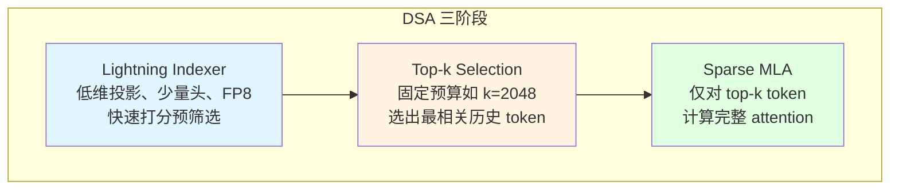

DSA 是 DeepSeek 与北大合作的 **ACL 2025 最佳论文 NSA（Native Sparse Attention）** 的工程化落地。

---

## 五、系统优化线：从 PagedAttention 到多级缓存

KV Cache 优化的第二条主线是**从系统层面提升 KV Cache 内存利用率与传输效率**。

### 5.1 PagedAttention / vLLM（2023，SOSP）

**论文**：Kwon et al., "Efficient Memory Management for Large Language Model Serving with PagedAttention", SOSP 2023（arXiv:2309.06180），UC Berkeley 团队。

**核心思想**：借鉴操作系统**虚拟内存分页（paging）**机制管理 KV Cache：

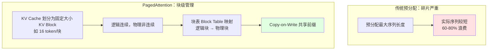

**解决的问题**：
- **内部碎片**：传统预分配最大序列长度导致 60-80% 浪费；PagedAttention 仅最后一块部分使用，**碎片 < 4%**
- **外部碎片**：块级分配/释放，消除外部碎片
- **内存共享**：通过 **Copy-on-Write (CoW)** 实现共享前缀的 KV Cache 复用，并行采样可节省 55% 内存

**效果**：相比 FasterTransformer、Orca 等系统，吞吐量提升 **2-4×**。**vLLM 已成为开源 LLM 推理事实标准**。

### 5.2 Prefix Caching / RadixAttention

**RadixAttention 论文**：Zheng et al., "SGLang: Efficient Execution of Structured Language Model Programs", arXiv:2312.07104（Stanford + UC Berkeley）。

**核心思想**：通过**基数树（Radix Tree）**结构管理 KV Cache，自动检测并复用跨请求的共享前缀：

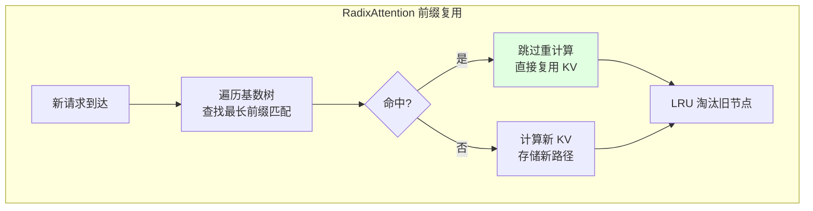

**应用场景**：多轮对话（共享 system prompt）、批处理相似文档、few-shot 提示、RAG 流水线。典型多轮对话可获 40-70% 命中率，批处理文档处理 60-90% 命中率。SGLang 在多种任务上相比 SOTA 推理系统吞吐量提升 **6.4×**。

vLLM 也通过 `--enable-prefix-caching` 提供类似能力。

### 5.3 KV Cache 量化

| 量化方案 | 内存节省 | 精度损失 | 代表工作 |
|----------|----------|----------|----------|
| INT8/FP8 | 50% | 几乎无损 | 通用 |
| INT4 | 75% | 轻微 | KIVI（arXiv:2402.02750） |
| INT2/FP4 | 87.5%+ | 需配合训练 | NVIDIA NVFP4（Blackwell） |

**KIVI**：按通道量化 K、按 token 量化 V，2-bit 量化几乎无损。

**NVIDIA NVFP4**（2025）：在 Blackwell GPU 上将 KV Cache 量化为 4-bit，相比 FP8 内存减少 50%，精度损失 <1%。

### 5.4 KV Cache Offloading（CPU/SSD 卸载）

**Mooncake**（Moonshot AI / 清华，arXiv:2407.00079，ACM Transactions on Storage 2025）：

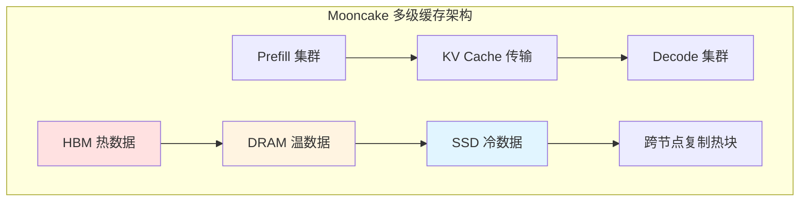

- **以 KVCache 为中心的分离式架构**，服务 Kimi 聊天机器人
- 充分利用 GPU 集群中闲置的 **CPU、DRAM、SSD、NIC** 资源构建分布式 KVCache 池
- Prefill 集群与 Decode 集群物理分离，KV Cache 通过 NVLink/RDMA 传输
- **Layer-wise Prefill**：layer 0 计算完即开始流式传输，隐藏传输延迟
- **多级缓存**：HBM（热）+ DRAM（温）+ SSD（冷），按内容哈希索引、LRU 淘汰、热块跨节点复制
- 生产规模：数千节点，日处理 1000+ 亿 token，相比基线有效请求容量提升 **59%-498%**

**DeepSeek 3FS**（Fire-Flyer File System）：基于 NVMe SSD over RDMA，180 节点集群提供 6.6 TiB/s 聚合读吞吐，使"缓存存盘"成为可行方案。

### 5.5 Ring Attention / 分布式 KV

**论文**：Liu et al., "Ring Attention with Blockwise Transformers for Near-Infinite Context", 2023（UC Berkeley）。

**核心思想**：将长序列切分到多个设备，KV 块以**环形（ring）**拓扑循环传递，并行计算 attention：

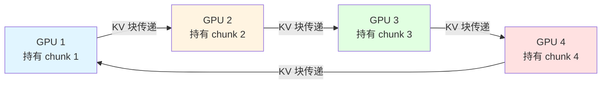

- 计算与通信重叠（overlap），隐藏传输延迟
- 支持百万级 token 上下文，单设备内存需求从 O(n²) 降为 O(n/P)

**相关系统**：阿里 **Infinite-LLM**（arXiv:2401.02669）提出 DistAttention，将 attention 计算与 KVCache 在集群中分布式调度，支持 2000K 上下文。

---

## 六、算法优化线：从 SWA 到 Cache 驱逐

KV Cache 优化的第三条主线是**从算法层面限制 KV Cache 的大小或驱逐不重要 token**。

### 6.1 演进总览

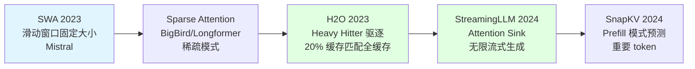

### 6.2 Sliding Window Attention（SWA，Mistral）

**论文**：Mistral AI, "Mistral 7B", 2023 年 10 月（arXiv:2310.06825）。

**核心思想**：每个 token 仅关注前 W 个 token（Mistral 中 W=4096），KV Cache 大小固定为 W。

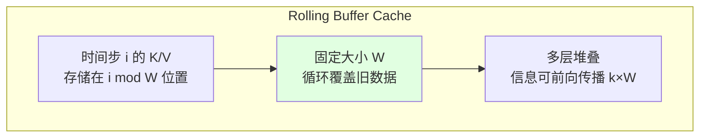

- 通过多层堆叠，信息可前向传播 k×W 个 token（Mistral 32 层 × 4096 ≈ 131K 理论注意力跨度）
- 计算复杂度从 O(n²) 降为 O(n×W)

**效果**：Mistral 7B 在所有基准上超越 LLaMA-2 13B，部分任务超越 LLaMA-1 34B。

### 6.3 Sparse Attention（BigBird、Longformer）

**Longformer**（Beltagy et al., 2020, AllenAI）：组合三种模式
- **Local Attention**（窗口）
- **Dilated Window**（扩张窗口）
- **Global Attention**（特定 token 全局关注）

**BigBird**（Zaheer et al., NeurIPS 2020, Google Brain, arXiv:2007.14062）：三种组件
- **Random Attention**：随机连接（BigBird 独创，理论保证信息快速传播）
- **Window Attention**：局部窗口
- **Global Attention**：全局 token

**理论贡献**：证明 BigBird 是**通用逼近器**且**图灵完备**，保留全注意力的表达能力。复杂度从 O(n²) 降为 O(n)，可处理 8× 长序列。

### 6.4 Cache 压缩 / 驱逐

**StreamingLLM**（Xiao et al., ICLR 2024）：
- 仅保留最近 N 个 token + 最初几个 **attention sink** token
- **关键发现**：删除初始 token 会导致 attention 缺乏"归属感"，保留少量 sink token 即可恢复接近全上下文性能
- KV Cache 固定大小，支持无限流式生成

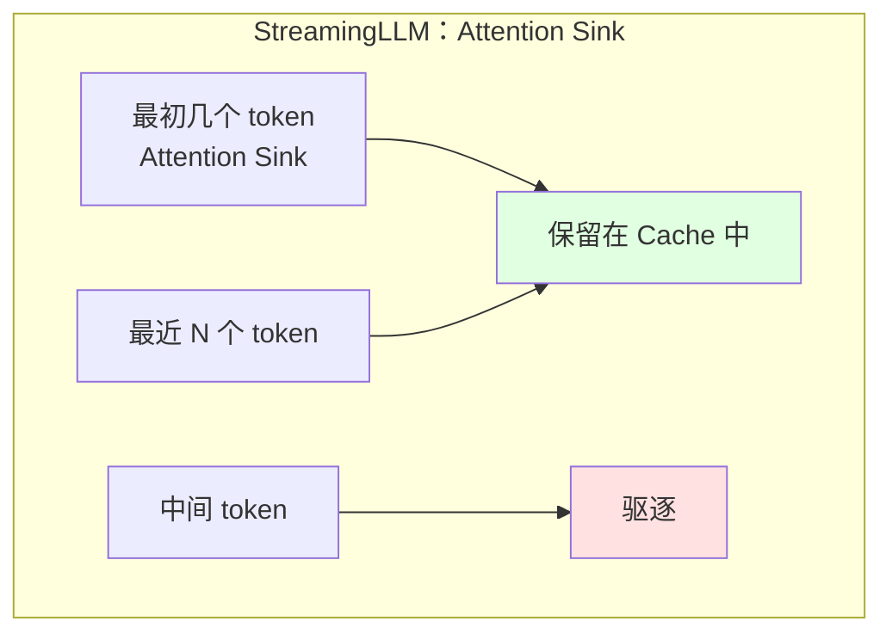

**H2O（Heavy-Hitter Oracle）**（Zhang et al., NeurIPS 2023, arXiv:2306.14048, Stanford/UT Austin/Meta）：
- 发现少量 **Heavy Hitter (H2)** token 贡献大部分 attention 分数
- 动态保留"最近 token + H2 token"的平衡组合
- 将驱逐形式化为**动态次模最大化问题**，提供理论近似保证
- **20% 缓存预算**下匹配全缓存精度，吞吐量提升 **29×**

**SnapKV**（Li et al., 2024）：基于 prefill 阶段的 attention 模式预测重要 token。

---

## 七、DeepSeek 的贡献：MLA 革命

DeepSeek 在 KV Cache 优化史上留下了浓墨重彩的一笔。

### 7.1 DeepSeek 系列演进

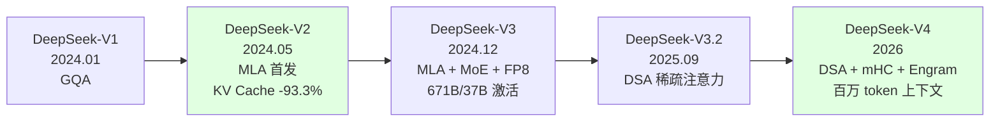

### 7.2 DeepSeek-V2（2024.05）：MLA 首发

- 引入 **MLA**，KV Cache 减少 93.3%，吞吐量提升 5.76×
- 配合 DeepSeekMoE（细粒度专家 + 共享专家），236B 总参数/21B 激活
- 关键参数：`kv_lora_rank=512`，`qk_rope_head_dim=64`

### 7.3 DeepSeek-V3（2024.12）：效率极致

- 延续 MLA，671B 总参数/37B 激活
- FP8 训练、MTP（Multi-Token Prediction）
- 训练成本仅 557 万美元，性能比肩 GPT-4o、Claude 3.5 Sonnet

### 7.4 DeepSeek-V3.2（2025.09）：DSA 登场

- 引入 **DeepSeek Sparse Attention（DSA）**，在 MLA 之上叠加稀疏注意力
- **Lightning Indexer**：低维投影、少量头、FP8 快速打分预筛选
- **Top-k Selection**：固定预算（如 k=2048）选出最相关历史 token
- **Sparse MLA**：仅对 top-k token 计算完整 attention
- DSA 是 ACL 2025 最佳论文 NSA（Native Sparse Attention）的工程化落地

### 7.5 DeepSeek-V4（2026）

- **DSA（Dense Sparse Attention）**：每个 token 动态决定使用 dense 还是 sparse attention
- **mHC（Manifold-Constrained Hyper-Connections）**：跨层连接创新
- **Engram**：O(1) 外部记忆，支持百万级上下文
- **DualPath 推理策略**：长上下文 agentic 工作负载优化
- Blackwell GPU + FP8 KV Cache + FlashMLA 优化
- KV Cache 仅为 V3.2 的 10%，支持百万 token 上下文

### 7.6 MLA vs GQA 表达能力

**TransMLA**（NeurIPS 2025, 北大/MuLab）证明：在相同 KV Cache 预算下，**MLA 严格比 GQA 更具表达能力**，任何 GQA 层都可等价转换为 MLA，反之不行。LLaMA2-7B 压缩 93% KV Cache 后 8K 上下文加速 10×，仅需 6B token 微调即可恢复性能。

---

## 八、vLLM 的 KV Cache 管理演进

### 8.1 PagedAttention 原始论文（SOSP 2023）

- 块级虚拟内存管理，碎片 <4%
- CoW 共享、preemption 调度、分布式执行支持

### 8.2 Prefix Caching 集成

- `--enable-prefix-caching` 启用
- 自动检测共享前缀，复用 KV 块

### 8.3 KV Connectors 与传输（v1 API）

vLLM 提供可插拔的 **KV Connector API**，支持异步 KV 数据加载/存储：

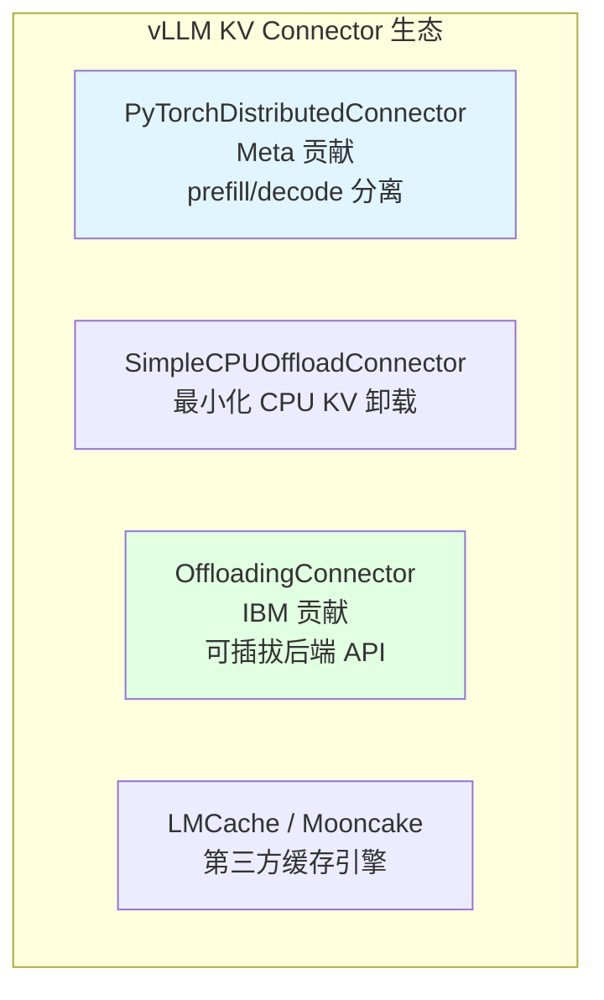

- **PyTorchDistributedConnector**：Meta 贡献，基于 vLLM v1 KV connector 接口，实现 prefill/decode 分离的异步 KV 传输，已在 Meta 内部大规模服务
- **SimpleCPUOffloadConnector**：最小化 CPU KV cache 卸载，配合 BlockPool LRU
- **OffloadingConnector**（vLLM 0.11.0+，IBM 贡献）：可插拔后端 API，原生 CPU 后端，异步卸载/加载。TTFT 可降低 2-22×（从 CPU 加载 vs GPU 重算）

### 8.4 vllm-ascend 的三套 KV Cache CPU 卸载实现

vllm-ascend 作为 vLLM 的 Ascend NPU 硬件插件，提供了三套 KV Cache CPU 卸载实现：

| 实现 | 基础框架 | 核心特性 |
|------|----------|----------|
| NPUOffloadingSpec | vLLM OffloadingConnector | 双 Stream + Event 池 + LRU + block 聚合 |
| AscendSimpleCPUOffloadConnector | 上游 SimpleCPUOffloadConnector 适配 | 后台守护线程 FIFO 队列 |
| CPUOffloadingConnector | 独立实现 | 跨 DP 共享 + MLA 跨 TP 共享 + CPU prefix caching |

### 8.5 多级缓存（GPU + CPU + SSD）

- **LMCache**、**Mooncake**、**NVIDIA KVBM** 等第三方缓存引擎通过 connector API 接入
- llm-d 项目提供 cache-aware routing，跨节点复用缓存块
- 读取缓存块比重算快达 **16×**（长 prompt 场景）

---

## 九、今生：现代趋势与未来方向

### 9.1 Prefill/Decode 分离（Disaggregated Serving）

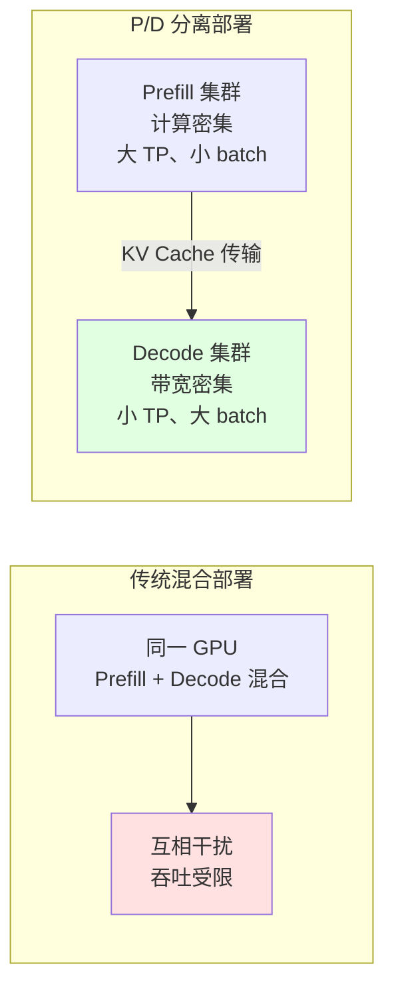

- **DistServe**（OSDI 2024）首次提出，**Mooncake**（Moonshot, 2024）大规模生产化
- vLLM-disagg、SGLang-disagg、NVIDIA NIXL/Dynamo 已成 2026 前沿部署标准
- **核心理由**：Prefill 是计算密集型（适合大 TP、小 batch），Decode 是 HBM 带宽密集型（适合小 TP、大 batch），同一 GPU 强行混合会互相干扰
- **效果**：相同 SLO 下 decode 吞吐 3-4×，或相同吞吐下 TTFT 紧缩 2×；长上下文（128K+）生产部署的关键

### 9.2 跨实例 KV 共享

- Mooncake Store 按内容哈希索引、LRU 淘汰、热块跨节点复制
- DeepSeek 3FS：NVMe SSD over RDMA，180 节点 6.6 TiB/s 聚合读
- Perplexity KV Messenger：基于 RDMA/libfabric，DeepSeek-R1 服务从 50 TPS 提升到 90+ TPS

### 9.3 硬件感知 KV Cache 设计

- **NVFP4 KV Cache**（Blackwell）：4-bit 存储，FP8 解压，<1% 精度损失
- **FlashMLA**、**ThunderMLA**：MLA 专用算子，Absorb 模式达硬件极限
- **MLA 硬件协同设计**（arXiv:2506.02523）：MLA 将 attention 从带宽受限转向计算受限，对带宽受限硬件尤其有利

### 9.4 NPU/Ascend 特定考量

vLLM-Ascend 插件的 KV Cache 适配：

- **KV Cache 布局**：`(2, num_blocks, block_size, num_kv_heads × head_size)`，dim 0 分离 K/V
- **AscendAttentionBackend**：
  - Prefill 阶段：`torch_npu.npu_prompt_flash_attention`
  - Decode 阶段：`torch_npu.npu_incre_flash_attention`
- **DeepSeek V4 完整支持**（v0.20.2rc1, 2026.06）：DSA attention backend、KV Pool 适配、MTP 层 KV cache 分片
- **MLA 优化**：`VLLM_ASCEND_MLA_PA` 环境变量启用 MLA paged attention 算子
- **PD 分离**：v0.10.0rc1 起 V1 引擎支持 disaggregated prefill，DeepSeek-R1 W8A8 在 Atlas 800T A3 上"2P1D"架构部署

**NPU 特有注意事项**：
- `tensor.item()` 在 device tensor 上会触发 NPU→CPU 同步传输，严重拖慢 AsyncScheduler
- 避免热路径中的 CPU-NPU 内存传输
- 优先使用 in-place 操作（`x.add_()`, `x.mul_()`）
- 长时运行需监控内存碎片

### 9.5 未来方向

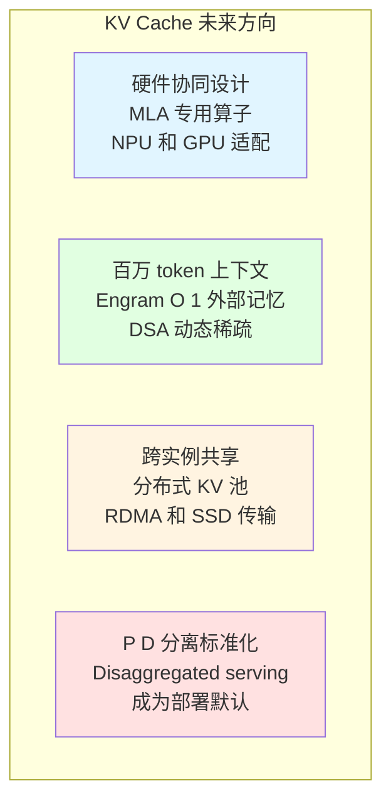

---

## 十、关键论文时间线

| 年份 | 技术 | 论文/系统 | 关键贡献 |
|---|---|---|---|
| 2017 | MHA + KV Cache | Attention Is All You Need (NeurIPS) | Transformer 起源 |
| 2019 | MQA | Fast Transformer Decoding (Shazeer) | 共享单 K/V 头 |
| 2020 | Longformer | Beltagy et al. | 局部+全局稀疏 |
| 2020 | BigBird | Zaheer et al. (NeurIPS) | 随机+窗口+全局，图灵完备 |
| 2023.06 | H2O | Zhang et al. (NeurIPS) | Heavy Hitter 驱逐 |
| 2023.09 | PagedAttention/vLLM | Kwon et al. (SOSP) | OS 虚拟内存分页 |
| 2023.10 | Mistral SWA | Mistral 7B | 滑动窗口 + Rolling Buffer |
| 2023.12 | RadixAttention | SGLang (Zheng et al.) | 基数树前缀复用 |
| 2023.05 | GQA | Ainslie et al. (EMNLP) | 分组共享 K/V |
| 2024.01 | Infinite-LLM | Alibaba | DistAttention 分布式 KV |
| 2024.05 | MLA | DeepSeek-V2 | 低秩联合 KV 压缩 |
| 2024.06 | Mooncake | Moonshot/Tsinghua | KVCache 中心分离架构 |
| 2024.12 | DeepSeek-V3 | DeepSeek-AI | MLA + MoE + FP8 + MTP |
| 2024 | OSDI | DistServe | P/D 分离学术化 |
| 2025.09 | DSA | DeepSeek-V3.2-Exp | Lightning Indexer + Sparse MLA |
| 2025 | NVFP4 KV | NVIDIA | Blackwell 4-bit KV |
| 2025 | TransMLA | NeurIPS | GQA→MLA 迁移，MLA 表达力更强 |
| 2026 | DeepSeek-V4 | DeepSeek-AI | DSA + mHC + Engram，百万 token |

---

## 结语

KV Cache 从 2017 年 Transformer 论文中的一个简单优化（缓存历史 K/V 避免重算），演变为 2026 年 LLM 推理系统的核心战场。其演进沿着三条主线：

1. **架构优化线**：MHA → MQA → GQA → MLA → DSA，从每头独立 K/V 到低秩压缩再到稀疏化，KV Cache 体积压缩了 50-100 倍。
2. **系统优化线**：PagedAttention → Prefix Caching → 量化 → Offloading → P/D 分离，从块级内存管理到多级缓存到跨实例共享。
3. **算法优化线**：SWA → Sparse Attention → H2O/StreamingLLM/SnapKV，从固定窗口到稀疏模式到智能驱逐。

DeepSeek 的 MLA 是这条演进路上的里程碑——它证明了低秩压缩可以在几乎不损失质量的前提下将 KV Cache 减少 93%，而 TransMLA 进一步证明 MLA 严格优于 GQA。vLLM 生态通过 PagedAttention 和 KV Connector API 将这些研究成果工程化，vllm-ascend 则将这些能力带到了 Ascend NPU 平台。

未来，随着百万 token 上下文、跨实例 KV 共享、硬件协同设计的推进，KV Cache 的故事远未结束。
