# KV Cache 卸载的前世今生

本文档系统梳理 KV Cache 卸载（KV Cache Offloading）技术从 2022 年至今的完整演进脉络，涵盖早期单机卸载、PagedAttention 的奠基作用、LMCache 与 Mooncake 的工业化实践、分布式与跨实例共享、SSD 卸载、Prefill/Decode 分离、量化压缩结合，以及 Ascend/NPU 平台的特定实现。

## 目录

- [一、引言：为什么需要 KV Cache 卸载](#一引言为什么需要-kv-cache-卸载)
- [二、早期 KV Cache 卸载（2022-2023）](#二早期-kv-cache-卸载2022-2023)
- [三、PagedAttention 的奠基作用（2023）](#三pagedattention-的奠基作用2023)
- [四、CPU 卸载系统（2023-2024）](#四cpu-卸载系统2023-2024)
- [五、LMCache：多级分层与跨进程共享（2024-2025）](#五lmcache多级分层与跨进程共享2024-2025)
- [六、Mooncake：KVCache-centric 分离架构（2024-2025）](#六mooncakekvcache-centric-分离架构2024-2025)
- [七、分布式 KV Cache 系统（2024-2025）](#七分布式-kv-cache-系统2024-2025)
- [八、SSD/NVMe 卸载（2024-2025）](#八ssdnvme-卸载2024-2025)
- [九、跨实例与跨节点 KV 共享（2025-2026）](#九跨实例与跨节点-kv-共享2025-2026)
- [十、Prefill/Decode 分离（2024-2026）](#十prefilldecode-分离2024-2026)
- [十一、量化 + 卸载结合](#十一量化--卸载结合)
- [十二、Ascend/NPU 特定卸载](#十二ascendnpu-特定卸载)
- [十三、现代趋势与未来方向](#十三现代趋势与未来方向)
- [十四、关键性能数据汇总](#十四关键性能数据汇总)
- [十五、关键论文时间线](#十五关键论文时间线)

---

## 一、引言：为什么需要 KV Cache 卸载

随着大语言模型规模与上下文窗口的爆炸式增长，KV Cache 已成为推理系统中最核心的内存瓶颈。以 LLaMA-70B 为例，在 128K 上下文下，单次请求的 KV Cache 即可达数十 GB；生产环境中并发数十至上百请求时，GPU 显存根本无法承载。

KV Cache 卸载技术应运而生——它将 KV Cache 从昂贵的 GPU HBM 转移到 CPU DRAM、SSD、甚至分布式远端存储，以"以存换算"的思路突破显存墙。

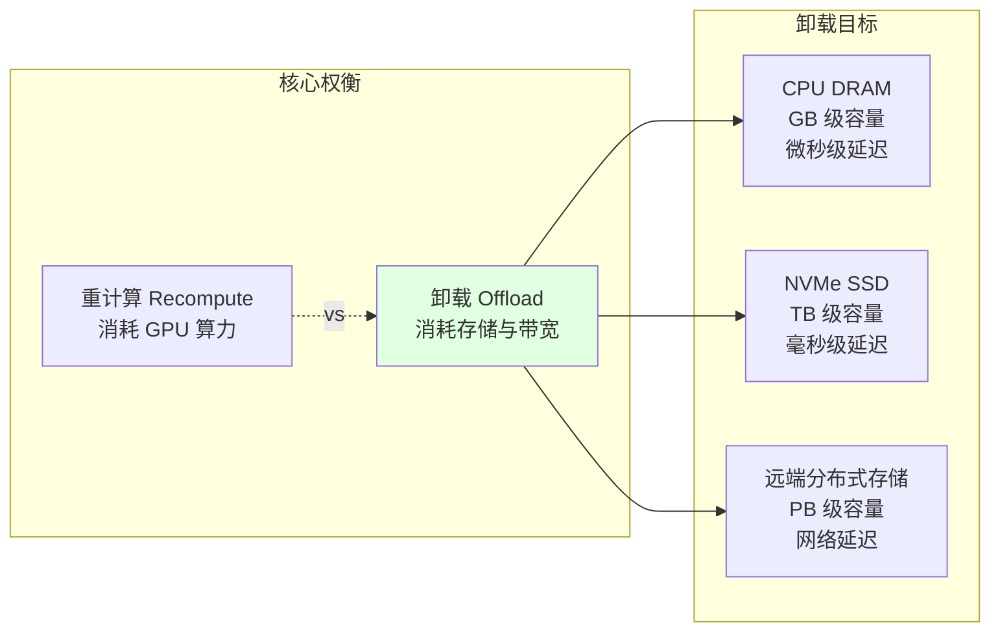

---

## 二、早期 KV Cache 卸载（2022-2023）

### 2.1 FlexGen（2023）

**论文**：FlexGen（arXiv:2303.06865，ICML 2023），斯坦福大学。

FlexGen 是早期离线 LLM 推理卸载的代表作。其核心思想是通过线性规划（linear programming）联合优化 GPU、CPU、SSD 之间的计算与 I/O 调度，在显存受限的硬件上运行超大模型。

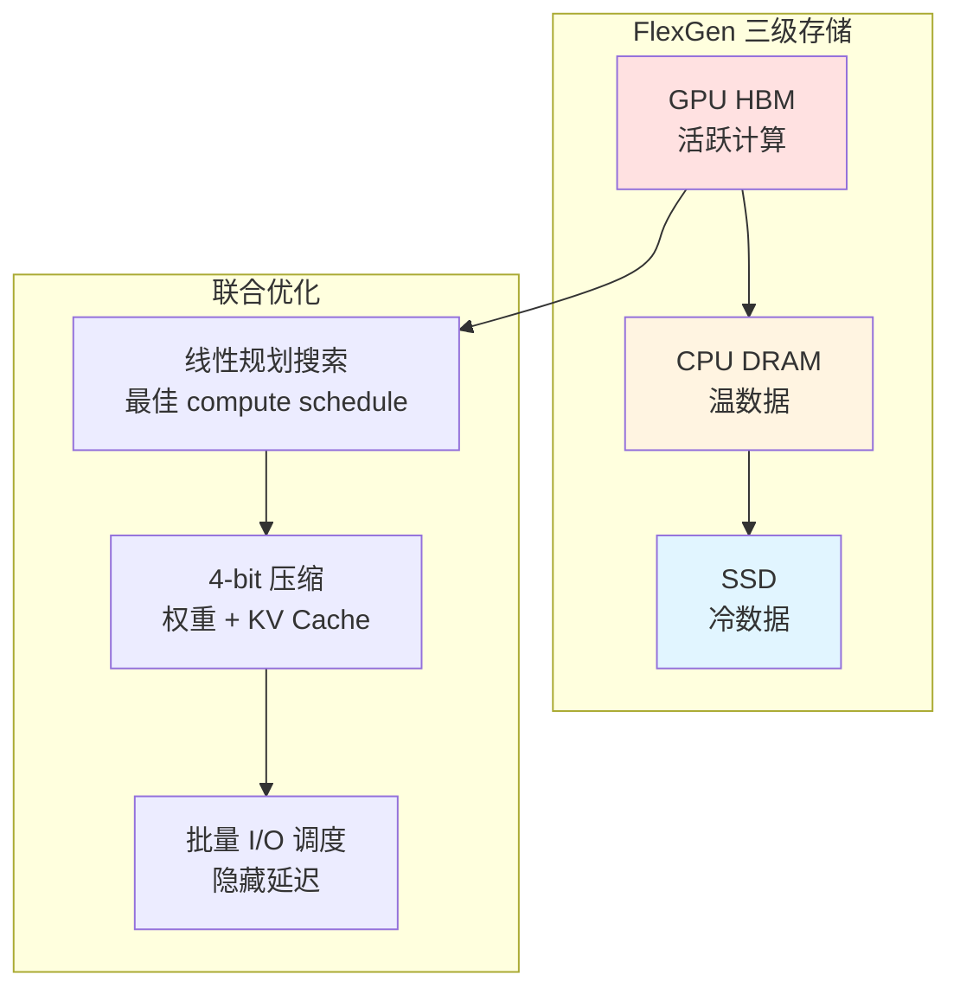

**关键贡献与数据：**
- 通过 4-bit 压缩与权重的 offload，在单张 GPU 上实现高达 **100× 吞吐量提升**
- 提出基于线性规划的搜索空间，自动选择最佳的 offload 模式
- 支持将权重与 KV Cache 同时卸载到 CPU/SSD，实现单卡运行 175B 模型

**局限**：面向离线高吞吐场景（throughput-oriented），未考虑在线服务的延迟 SLO，但其"卸载 + 压缩 + 调度联合优化"的思路深刻影响了后续工作。

### 2.2 DeepSpeed Zero-Inference 与 HuggingFace Accelerate

同期，DeepSpeed Zero-Inference 与 HuggingFace Accelerate 提供了通用的参数卸载框架：
- **DeepSpeed ZeRO-Inference**：将模型权重卸载到 CPU/NVMe，在生成时按层即时加载（just-in-time loading）
- **HuggingFace Accelerate**：提供 `device_map="auto"` 等接口，支持模型在 GPU/CPU/磁盘间的自动分片

这些框架主要面向**参数卸载**（parameter offloading），对 KV Cache 的专门管理较弱，但为后续 KV Cache 卸载奠定了工程基础。

### 2.3 Petals：跨互联网分布式推理

**论文**：Petals（arXiv:2312.08361）进一步探索了跨互联网的分布式推理，其 BLOOM-176B 的分布式推理比单机 RAM 卸载快 **10× 以上**。

### 2.4 MoE 卸载与早期探索

针对 Mixture-of-Experts（MoE）模型，arXiv:2312.17238 提出利用专家局部性（expert locality）与 LRU 缓存进行投机式专家加载（speculative expert loading），使 Mixtral-8x7B 能在消费级硬件上运行。这类工作将"卸载"从静态调度推向了基于访问模式的动态预取。

---

## 三、PagedAttention 的奠基作用（2023）

### 3.1 vLLM 与 PagedAttention（SOSP 2023）

**论文**：vLLM（arXiv:2309.06180，SOSP 2023），UC Berkeley。

PagedAttention 是 KV Cache 管理的分水岭。受操作系统虚拟内存与分页机制启发，PagedAttention 将 KV Cache 组织为固定大小的**非连续物理块**（blocks），通过 block table 映射逻辑地址到物理地址。

**关键数据：**
- 将内存浪费从传统连续分配的 **60-80% 降至 <4%**
- 实现 **2-4× 吞吐量提升**
- 支持 copy-on-write 的前缀共享（prefix sharing）

### 3.2 对卸载的深远影响

PagedAttention 对 KV Cache 卸载的影响是基础性的：

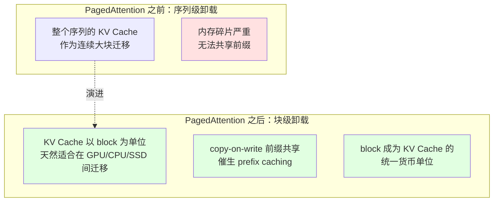

1. **块级管理**：KV Cache 以 block 为单位，天然适合在 GPU/CPU/SSD 间迁移，无需大块连续内存
2. **前缀共享**：copy-on-write 使多个请求复用相同前缀 KV 成为可能，催生了 prefix caching
3. **统一抽象**：block 成为 KV Cache 的"货币单位"，后续所有卸载系统（LMCache、Mooncake、vLLM KV Connector）均建立在 block 粒度之上

可以说，没有 PagedAttention 的块级抽象，就没有现代 KV Cache 卸载生态。

---

## 四、CPU 卸载系统（2023-2024）

### 4.1 vLLM 的 SimpleCPUOffloadConnector 与 OffloadingConnector

vLLM 社区逐步发展出 KV Connector 抽象。早期实现包括：
- **SimpleCPUOffloadConnector**：最朴素的 CPU 卸载连接器，将溢出的 KV block 同步拷贝到 CPU pinned memory
- **OffloadingConnector**：更通用的卸载接口，支持异步 save/load

这些连接器通过 `KVTransferConfig` 配置，定义了 `kv_role`（kv_producer / kv_consumer / kv_both）等角色，为后续 LMCache、Mooncake 等第三方连接器提供了标准接入点。

### 4.2 CacheGen（SIGCOMM 2024）

**论文**：CacheGen（arXiv:2310.07240，SIGCOMM 2024）。

CacheGen 将 KV Cache 视为可压缩的"流"，结合上下文感知编码与差分编码进行压缩存储。

**关键数据：**
- KV Cache 压缩比达 **3.5-4.3×**
- 延迟降低 **3.2-3.7×**
- 支持流式传输，适合网络传输场景

CacheGen 的压缩思想后被 LMCache 集成为可选的压缩后端。

### 4.3 AttentionStore / CachedAttention（USENIX ATC 2024）

**论文**：AttentionStore（arXiv:2403.19708，USENIX ATC 2024）。

AttentionStore 提出**层次化 KV 缓存**，构建 HBM → DRAM → SSD 的多级存储栈，并通过预取（prefetching）隐藏 I/O 延迟。

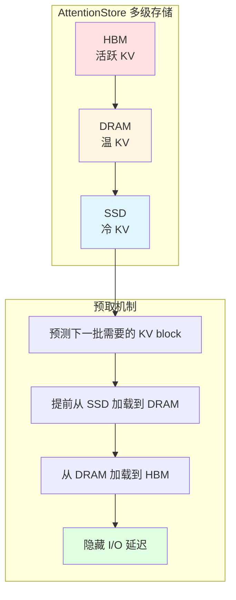

**关键数据：**
- TTFT 降低 **87%**
- Prefill 吞吐量提升 **7.8×**
- 跨请求复用历史 KV Cache，显著减少重复计算

AttentionStore 是早期"多级存储 + 预取"思路的代表，其设计理念与后来的 LMCache 分层架构高度一致。

### 4.4 vLLM-Ascend 的 CPU 卸载实现

vLLM-Ascend 针对昇腾 NPU 实现了三种 CPU offload 方案（详见 [cpu_offloading_overview.zh.md](file:///workspace/docs/source/user_guide/feature_guide/cpu_offloading_overview.zh.md)）：

| 方案 | 核心特性 |
|------|----------|
| NPUOffloadingSpec | 双 Stream + Event 池 + LRU + block 聚合 |
| AscendSimpleCPUOffloadConnector | 后台守护线程 FIFO 队列，上游 API 适配 |
| CPUOffloadingConnector | 跨 DP 共享 + MLA 跨 TP 共享 + CPU prefix caching |

---

## 五、LMCache：多级分层与跨进程共享（2024-2025）

### 5.1 设计理念

LMCache 是目前最成熟的开源 KV Cache 管理层，其核心理念是：**KV Cache 不应是一次性临时状态，而应是可持久化、跨引擎复用、可观测管理的"AI 原生知识资产"**。

LMCache 以独立 daemon 进程运行，与推理引擎（vLLM、SGLang）解耦，避免"命运共享"——即使引擎崩溃，KV Cache 仍可恢复。

### 5.2 多级分层架构

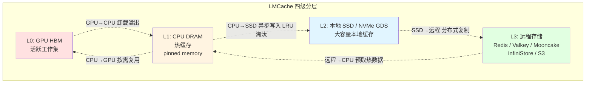

数据流支持：
- GPU→CPU 卸载溢出
- CPU→SSD/远程异步写入（LRU 淘汰）
- SSD/远程→CPU 预取热数据
- CPU→GPU 按需复用

### 5.3 跨进程共享与 MP 模式

LMCache 最核心的优化是 **MP（Multi-Process）模式**：在 Data Parallelism 部署中，将多个 DP rank 各自独立的 KV 缓冲区统一为共享内存层。

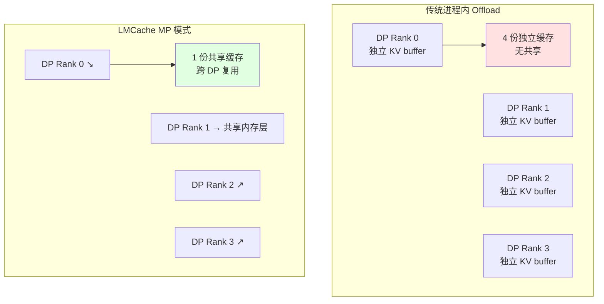

**官方 benchmark 数据：**

| 指标 | LMCache MP 模式 | 进程内 Offload |
|---|---|---|
| TTFT 均值 | 0.29s | 3.98s |
| TTFT p99 | 1.30s | 13.55s |
| 解码速度均值 | 37.47 tok/s | 9.81 tok/s |
| 解码速度 p99 | 45.14 tok/s | 34.27 tok/s |

即 **TTFT 降低约 13×，p99 延迟降低 10×+，解码吞吐提升近 4×**。整体吞吐量提升最高达 **15×**。

### 5.4 CacheBlend：非前缀 KV 复用

传统 KV 复用仅支持前缀匹配。CacheBlend 打破此限制，可在 prompt 任意位置复用已缓存 KV block，并选择性重算部分 token 以恢复质量。

这对 RAG 场景尤为关键——检索到的知识片段即使不在 prompt 开头也能被复用。

### 5.5 生态与工业采用

LMCache 已被 NVIDIA Dynamo、PyTorch 基金会、CoreWeave、Google GKE 集成，GitHub 累计 8600+ stars。其模块化 Connector 设计使其能快速适配新引擎与存储后端。

---

## 六、Mooncake：KVCache-centric 分离架构（2024-2025）

### 6.1 KVCache-centric 分离架构

**论文**：Mooncake（arXiv:2407.00079 / 2411.09054，FAST 2025），Moonshot AI / 清华大学。

Mooncake 是 Moonshot AI 为 Kimi 服务构建的生产级推理平台，提出**以 KVCache 为中心的分离式架构**（KVCache-centric Disaggregated Architecture）。

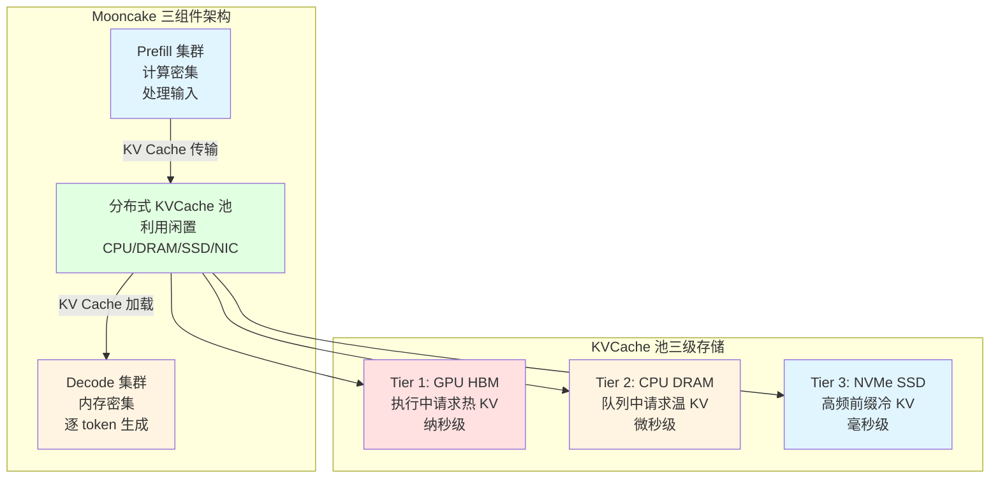

### 6.2 三级 KVCache 存储

| 层级 | 存储 | 用途 | 延迟 |
|---|---|---|---|
| Tier 1 | GPU HBM | 执行中请求的热 KV | 纳秒级 |
| Tier 2 | CPU DRAM | 队列中请求的温 KV | 微秒级 |
| Tier 3 | NVMe SSD | 高频前缀的冷 KV | 毫秒级 |

Mooncake Store 作为分布式 KVCache 存储引擎，基于 Transfer Engine 构建，支持多副本、RDMA（最高 8×400 Gbps）高速传输。

### 6.3 Conductor 调度器与早拒策略

Conductor 维护全局前缀树（trie）实现 cache-aware 调度，最大化 KV 复用。针对过载场景，Mooncake 创新性地提出**预测式早拒策略**（prediction-based early rejection），在请求进入前预判能否满足 SLO，避免无效资源消耗。

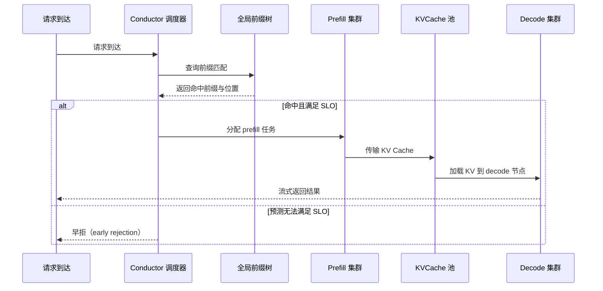

**关键数据：**
- 模拟场景吞吐量提升 **525%**
- 真实工作负载下有效请求容量提升 **59%-498%**（随 TBT SLO 阈值变化）
- 生产环境 Kimi 处理请求数增加 **75%**（A800 集群 +115%，H800 集群 +107%）
- 部署于数千节点，日处理超 **1000 亿 token**

### 6.4 开源生态

Mooncake 已开源（github.com/kvcache-ai/Mooncake），提供 Transfer Engine、P2P Store、Mooncake Store 三大组件，并集成 vLLM、SGLang、LMDeploy，与 LMCache 协同提供增强的 KVCache 管理。

---

## 七、分布式 KV Cache 系统（2024-2025）

### 7.1 Infinite-LLM（arXiv:2401.02669，阿里巴巴）

Infinite-LLM 提出分布式 KV Cache 内存管理，将多个 GPU 节点的显存聚合为统一池，支持动态扩缩容，突破单节点显存上限。

### 7.2 DistServe（OSDI 2024）

**论文**：DistServe（arXiv:2401.09670，OSDI 2024）。

DistServe 将 Prefill 与 Decode 彻底分离到不同 GPU 资源池，消除两阶段相互干扰。

**关键数据：**
- 相比 vLLM，可服务 **7.4× 更多请求**
- 或在相同吞吐下实现 **12.6× 更紧的 SLO**

### 7.3 Splitwise（ISCA 2024，Microsoft）

Splitwise 将 prompt 处理与 token 生成分离到不同硬件池，利用异构硬件特性（prefill 用高算力 GPU，decode 用高带宽 GPU），并通过 KV Cache 传输连接两阶段。

### 7.4 NIXL / NVIDIA Dynamo

NIXL（NVIDIA Inference Transfer Library）是低延迟传输库，支持 GPU↔GPU、GPU↔CPU、GPU↔SSD 的高速 KV block 迁移。NVIDIA Dynamo 以 NIXL 为底座，构建统一的 KV Cache offload 平台，集成 vLLM、LMCache 等引擎。

### 7.5 CachedAttention

CachedAttention 扩展 AttentionStore 思路，支持跨会话、跨用户的 KV Cache 持久化与复用，进一步降低重复 prefill 开销。

---

## 八、SSD/NVMe 卸载（2024-2025）

### 8.1 DeepSeek 3FS

DeepSeek 开源的 3FS（Fire-Flyer File System）是面向 AI 工作负载的高性能分布式文件系统，专门优化了 KV Cache 等大文件的读写。

**关键数据：**
- 聚合读吞吐达 **6.6 TiB/s**
- KV Cache 读写达 **40 GiB/s**
- 在 180 节点集群上实现超高带宽利用

3FS 证明了 SSD/NVMe 层可作为 KV Cache 的大容量冷存储，配合分层架构实现"无限"上下文。

### 8.2 SSD 作为冷存储层

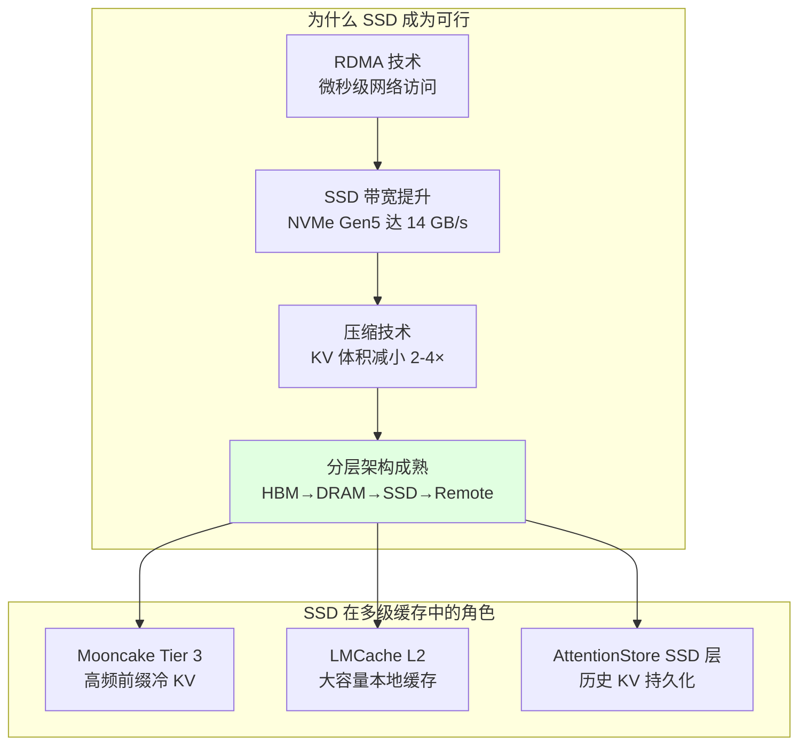

### 8.3 Mooncake 的 SSD offload

Mooncake Store 支持 SSD offload，采用 bucket-based 存储与驱逐策略：
- `MOONCAKE_OFFLOAD_BUCKET_MAX_TOTAL_SIZE`：驱逐阈值（字节），0 表示用 90% 物理磁盘容量
- `MOONCAKE_OFFLOAD_BUCKET_EVICTION_POLICY`：`none`/`fifo`/`lru`
- `MOONCAKE_OFFLOAD_TOTAL_SIZE_LIMIT_BYTES`：全局最大磁盘用量（默认 2TB）

---

## 九、跨实例与跨节点 KV 共享（2025-2026）

### 9.1 llm-d

llm-d 是 2025 年兴起的开源分布式 LLM 推理系统，强调 KV Cache 的全局共享与 cache-aware 路由。

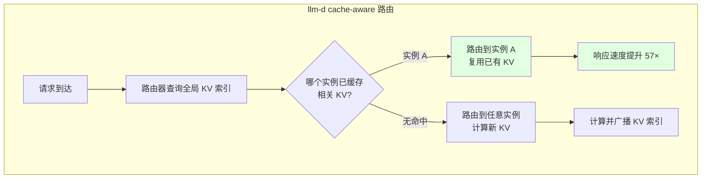

**关键数据：**
- 响应速度提升 **57×**
- 吞吐量提升 **2×**
- 缓存命中率 **87.4%**

llm-d 通过内容哈希索引实现跨实例 KV 复用，配合智能路由将请求导向已缓存相关 KV 的实例。

### 9.2 Perplexity KV Messenger / TransferEngine

Perplexity 在 pplx-garden 项目中开源 TransferEngine，实现跨节点 KV Cache 传输，支持 Prefill/Decode 分离与多实例共享。DeepSeek-R1 服务从 50 TPS 提升到 90+ TPS。

### 9.3 NVIDIA KVBM（KV Block Manager）

NVIDIA KVBM 是三层架构的 KV Block 管理器：

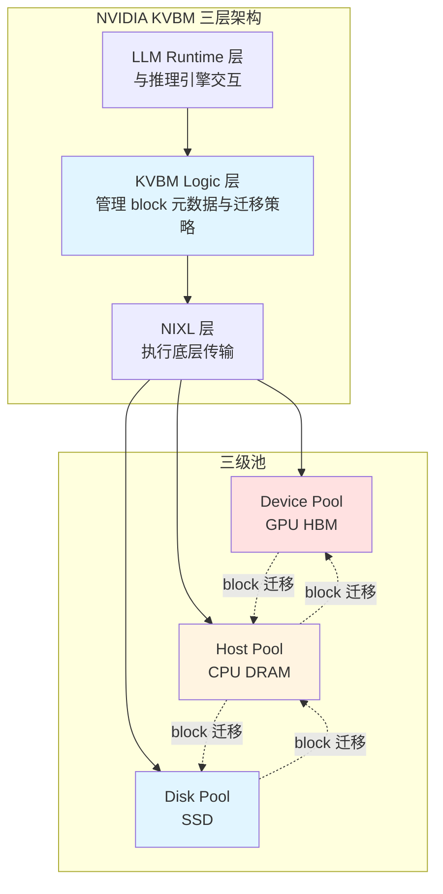

### 9.4 vLLM KV Connector API

vLLM 标准化了 KV Connector API，定义 `save_kv_layer` / `wait_for_save` / `start_load_kv` / `wait_for_layer_load` 等异步接口，支持 producer/consumer/both 角色。

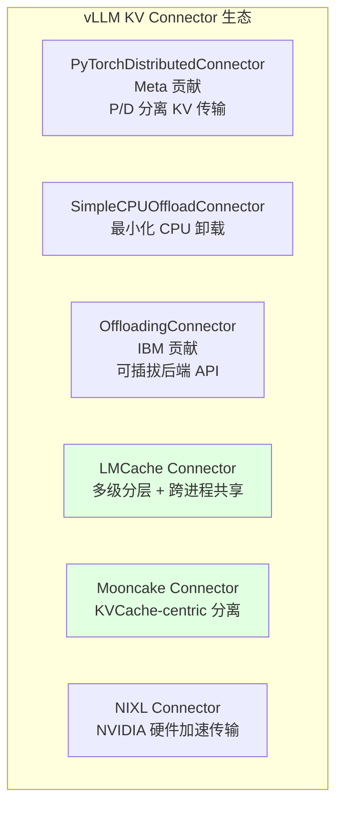

这一标准化使 LMCache、Mooncake、NIXL 等第三方连接器能以插件方式接入，极大促进了生态繁荣。

---

## 十、Prefill/Decode 分离（2024-2026）

### 10.1 为什么需要 PD 分离

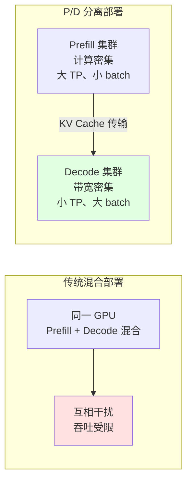

**核心理由**：Prefill 是计算密集型（适合大 TP、小 batch），Decode 是 HBM 带宽密集型（适合小 TP、大 batch），同一 GPU 强行混合会互相干扰。

### 10.2 KV Cache 传输机制

PD 分离的核心挑战是 KV Cache 从 Prefill 节点传输到 Decode 节点：

| 传输方式 | 带宽 | 延迟 | 适用场景 |
|----------|------|------|----------|
| NVLink | 300-900 GB/s | 微秒级 | 同节点 GPU 间 |
| RDMA | 100-400 Gbps | 微秒级 | 跨节点 GPU 间 |
| Shared Memory | 内存带宽 | 微秒级 | 同节点 CPU 间 |
| TCP | 网络带宽 | 毫秒级 | 跨数据中心 |

### 10.3 主要系统

- **DistServe**（OSDI 2024）：7.4× 请求量 / 12.6× SLO
- **Splitwise**（ISCA 2024）：异构硬件池化
- **Mooncake**：KVCache-centric 分离 + Conductor 调度
- **LMCache Transport Mode**：基于 NIXL 的 P2P KV 传输，实现跨引擎 KV 传递
- **vLLM-Ascend 2P1D 架构**：2 Prefill + 1 Decode 的混合部署模式

**效果**：相同 SLO 下 decode 吞吐 3-4×，或相同吞吐下 TTFT 紧缩 2×；长上下文（128K+）生产部署的关键。

---

## 十一、量化 + 卸载结合

### 11.1 量化与卸载的协同

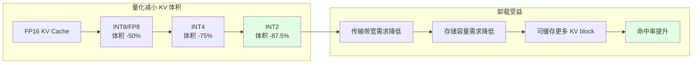

量化与卸载天然互补：量化减小 KV 体积，降低传输带宽与存储成本；卸载提供大容量存储，使量化后的 KV 可持久化复用。

### 11.2 CacheGen（SIGCOMM 2024）

如前述，CacheGen 通过上下文感知编码实现 3.5-4.3× 压缩，是"压缩 + 卸载"的早期实践。

### 11.3 KVQuant（arXiv:2401.18079）

KVQuant 系统性地研究 KV Cache 量化，提出基于注意力重要性的非均匀量化方案，可在 **2-bit** 量化下保持精度，显著降低 KV Cache 体积，从而减少卸载带宽压力。

### 11.4 KIVI（ICML 2024）

KIVI 提出 key 按通道、value 按 token 的 2-bit 量化策略，兼顾精度与效率。

**关键数据：**
- KV Cache 内存占用降低 **2.6×**
- 吞吐量提升 **2.35-3.47×**

---

## 十二、Ascend/NPU 特定卸载

### 12.1 vLLM-Ascend 的 KV Pool 与三种 CPU Offload

vLLM-Ascend 针对昇腾 NPU 实现了专门的 KV Pool 管理，并提供三种 CPU offload 连接器（详见 [cpu_offloading_overview.zh.md](file:///workspace/docs/source/user_guide/feature_guide/cpu_offloading_overview.zh.md)）：

| 连接器 | 核心特性 | 适用场景 |
|--------|----------|----------|
| NPUOffloadingSpec | 双 Stream + Event 池 + LRU + block 聚合 | 单实例长上下文 |
| AscendSimpleCPUOffloadConnector | 后台守护线程 FIFO 队列，上游 API 适配 | 简单 KV 卸载 |
| CPUOffloadingConnector | 跨 DP 共享 + MLA 跨 TP 共享 + CPU prefix caching | DeepSeek V4 4DP+4TP |

此外还有：
- **MooncakeLayerwiseConnector**：与 Mooncake 集成，支持逐层 KV 传输
- **LMCacheAscendConnector**：与 LMCache 集成
- **AscendStoreConnector**：支持 FabricMem/HIXL

### 12.2 Sleep Mode 与 CaMem 分配器

vLLM-Ascend 实现了 NPU 专用的 Sleep Mode，基于 AscendCL 低层 API 管理内存（详见 [sleep_mode.md](file:///workspace/docs/source/user_guide/feature_guide/sleep_mode.md)）：

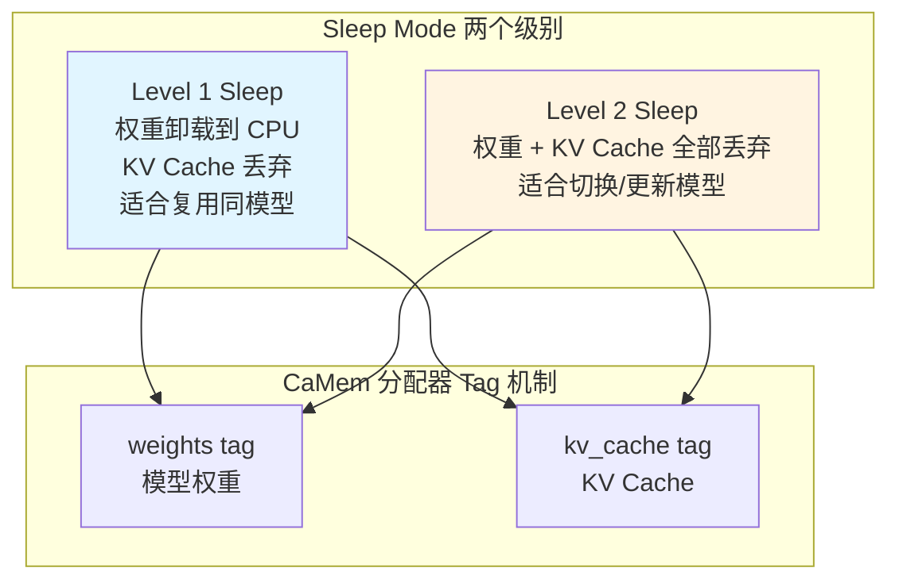

- **Level 1 Sleep**：将模型权重卸载到 CPU 内存，丢弃 KV Cache（适合复用同模型）
- **Level 2 Sleep**：同时丢弃权重与 KV Cache（适合切换/更新模型）

Sleep Mode 通过在内存池中标记 `{"weight": data, "kv_cache": data}` 映射，实现精细化的内存释放与恢复。

**关键数据：**
- 比完整重载快 **18-200×**
- 唤醒后推理比冷启动快 **61-88%**（保留了 CUDA 图捕获、JIT 编译、分配器状态等基础设施）

Sleep Mode 主要服务于 RL 后训练工作负载（PPO、GRPO、DPO），在生成与训练阶段间释放 NPU 内存，避免资源争用。支持 `wake_up(tags=["weights"])` / `wake_up(tags=["kv_cache"])` 的细粒度恢复，防止权重更新时 OOM。

### 12.3 Mooncake Ascend 协议

Mooncake 的 Transfer Engine 提供 Ascend 适配，支持 NPU 间的高速 KV 传输，使昇腾集群也能采用 KVCache-centric 分离架构。

```json
{
    "local_hostname": "xx.xx.xx.xx",
    "metadata_server": "P2PHANDSHAKE",
    "protocol": "ascend",
    "use_ascend_direct": true,
    "device_name": "",
    "master_server_address": "xx.xx.xx.xx:50088",
    "global_segment_size": "1GB",
    "enable_ssd_offload": true,
    "ssd_offload_path": "/nvme/mooncake_offload"
}
```

---

## 十三、现代趋势与未来方向

### 13.1 趋势总结

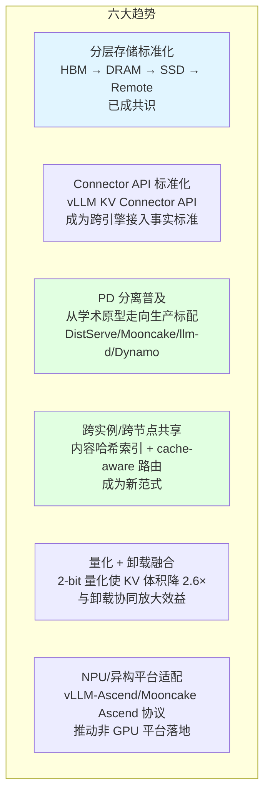

### 13.2 未来方向

- **全局 KV Cache 池**：跨集群、跨数据中心的 KV 共享，配合内容寻址
- **早拒与过载控制**：Mooncake 式预测早拒将成为高负载场景标配
- **RL 工作负载优化**：Sleep Mode 与细粒度内存控制进一步深化
- **异构硬件协同**：NPU/GPU/CPU 混合集群的统一 KV 管理
- **端到端压缩流水线**：量化、编码、传输的一体化优化

---

## 十四、关键性能数据汇总

| 系统 | 关键指标 | 提升 |
|---|---|---|
| FlexGen | 吞吐量 | 100× |
| PagedAttention | 内存浪费 | 60-80% → <4% |
| PagedAttention | 吞吐量 | 2-4× |
| CacheGen | KV 压缩比 | 3.5-4.3× |
| CacheGen | 延迟降低 | 3.2-3.7× |
| AttentionStore | TTFT | -87% |
| AttentionStore | Prefill 吞吐 | 7.8× |
| Mooncake | 吞吐量（模拟） | +525% |
| Mooncake | 生产请求数 | +75% |
| Mooncake | A800 集群 | +115% |
| Mooncake | H800 集群 | +107% |
| LMCache | 整体吞吐 | 15× |
| LMCache MP | TTFT | 13× 降低 |
| LMCache MP | p99 延迟 | 10×+ 降低 |
| LMCache MP | 解码吞吐 | 4× |
| DistServe | 请求数 | 7.4× |
| DistServe | SLO 紧缩 | 12.6× |
| KIVI | 内存降低 | 2.6× |
| KIVI | 吞吐提升 | 2.35-3.47× |
| DeepSeek 3FS | 聚合读吞吐 | 6.6 TiB/s |
| DeepSeek 3FS | KV Cache 读写 | 40 GiB/s |
| llm-d | 响应速度 | 57× |
| llm-d | 缓存命中率 | 87.4% |
| llm-d | 吞吐量 | 2× |
| vLLM Sleep Mode | 重载速度 | 18-200× |
| vLLM Sleep Mode | 唤醒后推理 | 快 61-88% |
| Perplexity KV Messenger | DeepSeek-R1 TPS | 50 → 90+ |

---

## 十五、关键论文时间线

| 年份 | 技术 | 论文/系统 | 关键贡献 |
|---|---|---|---|
| 2023.03 | FlexGen | arXiv:2303.06865, ICML 2023 | 早期单机卸载，线性规划调度 |
| 2023.09 | PagedAttention/vLLM | arXiv:2309.06180, SOSP 2023 | 块级虚拟内存，奠基现代卸载 |
| 2023.12 | Petals | arXiv:2312.08361 | 跨互联网分布式推理 |
| 2023.12 | MoE Offloading | arXiv:2312.17238 | 专家局部性 + LRU 预取 |
| 2024.01 | Infinite-LLM | arXiv:2401.02669 | 分布式 KV Cache 内存管理 |
| 2024.01 | DistServe | arXiv:2401.09670, OSDI 2024 | P/D 分离学术化 |
| 2024.03 | AttentionStore | arXiv:2403.19708, ATC 2024 | 层次化 KV 缓存 + 预取 |
| 2024.05 | Mooncake | arXiv:2407.00079, FAST 2025 | KVCache-centric 分离架构 |
| 2024.05 | Splitwise | ISCA 2024 | 异构硬件 P/D 池化 |
| 2024.05 | CacheGen | arXiv:2310.07240, SIGCOMM 2024 | KV Cache 流式压缩 |
| 2024.01 | KVQuant | arXiv:2401.18079 | 2-bit 量化 |
| 2024 | KIVI | ICML 2024 | key 通道 / value token 2-bit 量化 |
| 2024-2025 | LMCache | lmcache.ai | 多级分层 + MP 模式 + CacheBlend |
| 2025 | DeepSeek 3FS | DeepSeek 开源 | NVMe SSD over RDMA, 6.6 TiB/s |
| 2025 | NVIDIA NIXL/Dynamo/KVBM | developer.nvidia.com | 硬件加速 KV 传输 + 三层管理 |
| 2025 | llm-d | llm-d 开源项目 | cache-aware 路由, 87.4% 命中率 |
| 2025 | Perplexity TransferEngine | pplx-garden | 跨节点 KV 传输 |
| 2025-2026 | vLLM KV Connector API | docs.vllm.ai | 标准化连接器接口 |
| 2025-2026 | vLLM-Ascend Sleep Mode | docs.vllm.ai/projects/ascend | NPU 专用权重 + KV 卸载 |

---

## 结语

KV Cache 卸载从 FlexGen 的单机线性规划调度，经 PagedAttention 的块级抽象奠基，演进到 LMCache 的多级分层与 Mooncake 的 KVCache-centric 分离架构，再到 llm-d、Dynamo 的跨实例共享与 NPU 平台适配，已形成完整的技术生态。

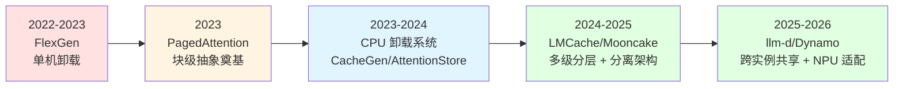

其核心哲学始终是"以存换算"——用更廉价、更大容量的存储资源换取稀缺的 GPU 算力与显存。随着上下文窗口迈向百万 token、RL 后训练成为常态，KV Cache 卸载将继续作为 LLM 推理系统的关键基础设施持续演进。
