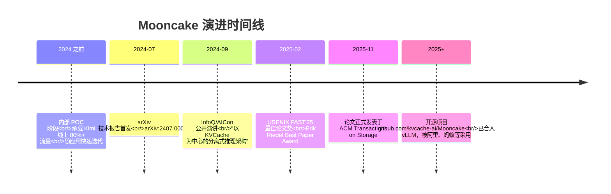
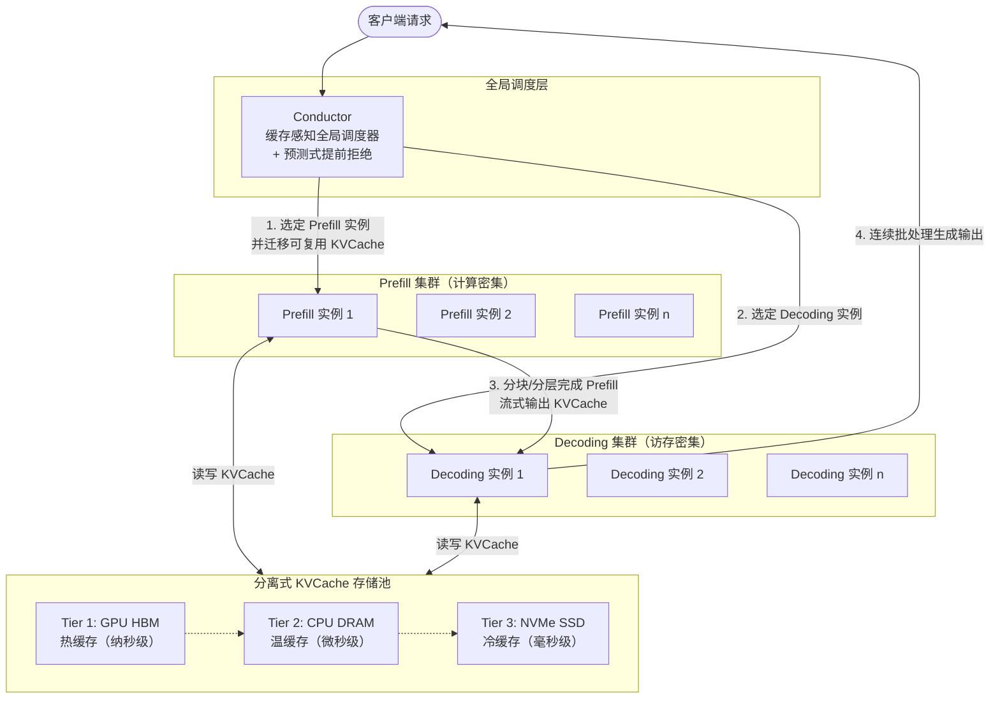
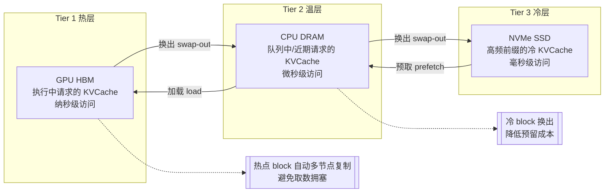
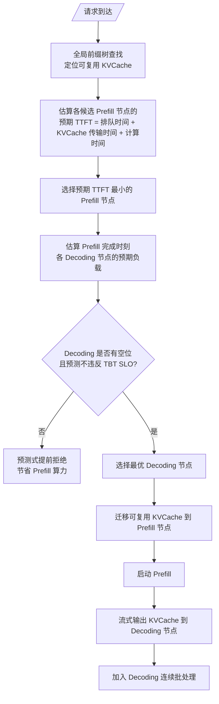
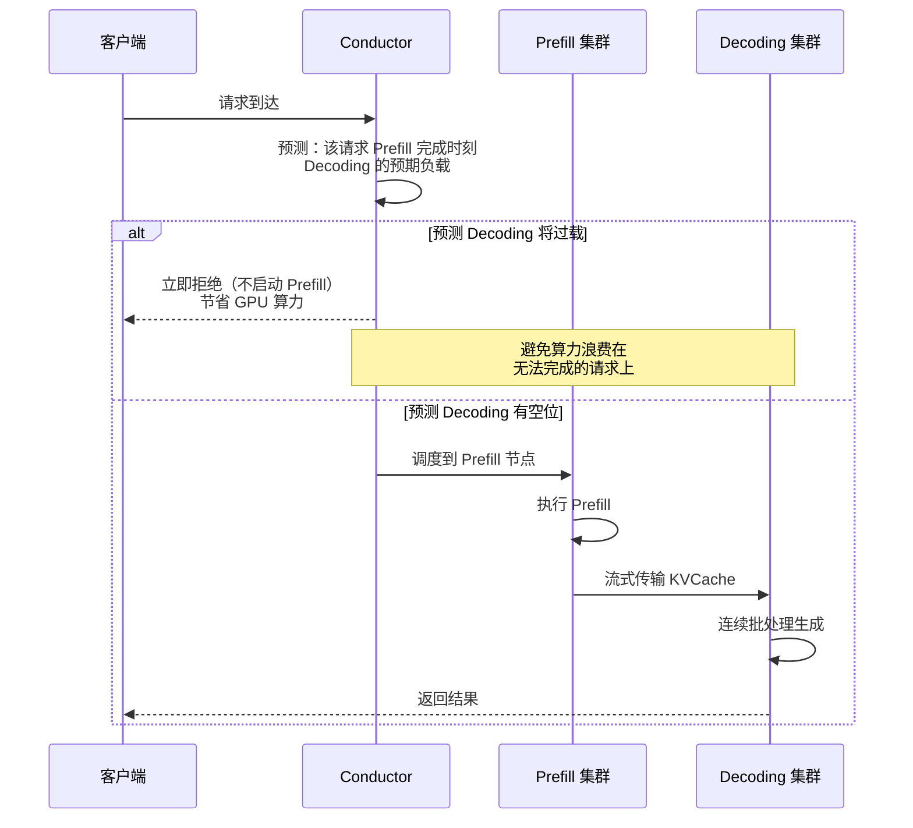
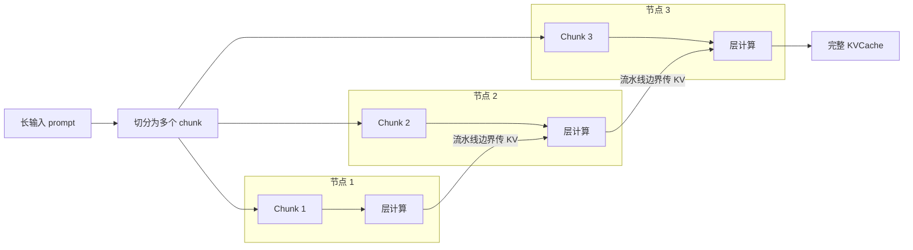
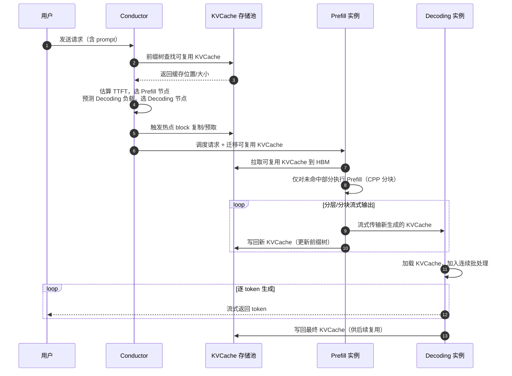

# Mooncake 技术文档：以 KVCache 为中心的分离式 LLM 推理架构

> 本文档系统整理 Mooncake 的原理、核心机制与演进历程，关键环节辅以流程图与时序图。
> 信息来源见文末"参考资料"。

---

## 一、概述

**Mooncake** 是月之暗面（Moonshot AI）为其大模型对话产品 **Kimi** 打造的底层推理服务平台。它采用一种**以键值缓存（KVCache）为中心的分离式架构（KVCache-centric Disaggregated Architecture）**，核心思想是：

- 将 LLM 推理的 **Prefill（预填充）** 与 **Decoding（解码）** 两个阶段在物理集群上彻底分离；
- 把 GPU 服务器中**未被充分利用的 CPU、DRAM、SSD、NIC 资源**整合成一个全局的**分离式 KVCache 存储池**；
- 通过一个**缓存感知的全局调度器 Conductor**，在严格满足延迟类 SLO 的前提下最大化整体有效吞吐。

**核心成果数据**：

| 指标 | 数值 |
|---|---|
| 部署规模 | 数千节点，日处理 token 超过 1000 亿 |
| 模拟场景吞吐提升（对比基线） | 最高 525% |
| 真实负载下请求处理能力提升 | 约 75% |
| NVIDIA A800 集群请求增益 | +115% |
| NVIDIA H800 集群请求增益 | +107% |
| 论文荣誉 | USENIX FAST'25 最佳论文奖（Erik Riedel Best Paper Award） |

---

## 二、前世今生

### 2.1 诞生背景

Kimi 作为支持超长上下文（部分会话超过 100 万 token，约 40% 会话超过 32K token）的 LLM 服务，在规模化推理中面临三大痛点：

1. **阶段间计算特性不对称**：Prefill 是计算密集（高并行 GEMM），Decoding 是访存密集（逐 token 生成）。两者在同一集群中会互相争抢资源，难以同时优化。
2. **KVCache 显存压力**：长上下文请求的 KVCache 体积巨大，常驻 GPU HBM 成本极高，单纯 offload 又会拉长延迟。
3. **过载场景的现实挑战**：传统学术研究多假设"所有请求都能被处理"，而真实 MaaS 服务在高峰期严重过载，必须做请求拒绝，否则会浪费昂贵的 GPU 算力。

### 2.2 关键时间线

### 2.3 设计哲学

Mooncake 团队提出的几条"暴论"级判断：

- **存算分离是长期趋势**：分离后系统可沿"算力"与"带宽"两个方向独立演进，对异构硬件更友好。
- **以存换算**：存储比算力廉价得多，把 KVCache 当作"一等公民"来全局调度，用更多存储换更少计算。
- **与模型层优化正交**：Mooncake 与 MLA、KVCache 量化/压缩等方案完全正交，KVCache 变小反而让分离架构收益更明显。

---

## 三、整体架构

Mooncake 将推理基础设施解耦为三个独立集群，外加一个全局调度器：

**三大集群职责**：

- **Prefill Pool**：专责处理输入 prompt 的并行计算，生成 KVCache。计算密集型，按算力最优配置。
- **Decoding Pool**：专责逐 token 生成。访存密集型，按带宽最优配置，最大化 batch 以提升 MFU。
- **KVCache Storage Pool**：跨节点共享的分布式缓存池，把每台 GPU 服务器闲置的 CPU DRAM/SSD 串联起来。

---

## 四、核心机制

### 4.1 三层 KVCache 存储池

Mooncake 的关键洞察：GPU 服务器上的 CPU DRAM（通常 256GB~2TB）和 NVMe SSD 在 LLM 推理时几乎闲置。把这些"白送"的资源组织成分层缓存，可在不增加成本的情况下获得海量缓存容量与传输带宽。

**分层管理策略**：

- **自动分层迁移**：根据访问模式与剩余容量，在 HBM ↔ DRAM ↔ SSD 间自动 swap/prefetch。
- **热点复制**：被高频访问的 KVCache block 会被复制到多个节点，避免单点取数拥塞。
- **冷块换出**：低频 block 换出到 SSD，降低 DRAM 预留成本。
- **全局前缀树（Prefix Trie）**：Conductor 维护一棵全局前缀树，记录哪些 token 前缀的 KVCache 已被缓存、缓存在哪。

### 4.2 Conductor：缓存感知全局调度器

Conductor 是 Mooncake 的"大脑"，对每个请求需要为一对 Prefill/Decoding 实例做联合选择。其优化目标是在满足 SLO 的前提下最大化吞吐。

**调度策略要点**：

- **不是简单负载均衡**：不是把请求派给"最闲"或"缓存最多"的节点，而是综合排队时延、KVCache 传输时延、计算时延，选出**预期 TTFT 最小**的节点。
- **缓存复用最大化**：尽量复用已缓存的 KVCache，减少冗余 Prefill 计算。
- **热点预测**：预测未来 KVCache block 的使用情况，提前做 swap/replication。
- **SLO 驱动**：同时约束 TTFT（首 token 时延）与 TBT（token 间时延）。

调度策略对 TTFT 的影响（论文实测）：

| 调度策略 | 平均 TTFT |
|---|---|
| 随机分配 | ~192 秒 |
| 负载均衡 | ~60 秒 |
| 缓存感知 | ~14 秒 |
| **KVCache-centric（Mooncake）** | **~6 秒** |

### 4.3 预测式提前拒绝（Prediction-based Early Rejection）

这是 Mooncake 区别于多数学术工作的"实战级"机制。真实服务过载时必须拒绝请求，关键问题是**何时拒绝**。

**问题背景**：Prefill 集群与 Decoding 集群的负载呈"反相"波动——一边忙时另一边闲。若仅在 Decoding 过载时才拒绝，Prefill 已经白白消耗了算力。

**两种拒绝策略对比**：

- **直接拒绝（Direct Rejection）**：仅看当前 Decoding 负载，过载即拒。问题：Prefill 与 Decoding 反相波动，容易"误杀"或"漏杀"，造成 goodput 波动。
- **预测式拒绝（Prediction-based）**：预测请求 Prefill 结束时刻的 Decoding 负载，若届时无空位则提前拒绝。实测在过载场景（RPS ≥ 1.0）下，goodput 从直接拒绝的 76.67% 提升到约 84%+，且波动更小。

### 4.4 Chunked Pipeline Parallelism（CPP）

超长上下文（数十万 token）单节点 Prefill 耗时过长。传统 Sequence Parallelism 每层都要跨节点通信，开销大。Mooncake 采用 **CPP**：

**特点**：

- 输入按 chunk 切分，多个节点以**流水线**方式顺序处理；
- 仅在**流水线边界**通信，网络开销远低于每层通信的 Sequence Parallelism；
- 实现相对简单，适合长上下文场景。

### 4.5 KVCache 全局复用与以存换算

Mooncake 把 KVCache 当作"分布式数据"而非"私有显存"：

- **跨请求复用**：相同前缀（如系统提示、文档）的 KVCache 全局共享，避免重复计算。
- **跨阶段流转**：Prefill 产出的 KVCache 流式传输给 Decoding，无需重算。
- **以存换算**：用廉价的 DRAM/SSD 存储换取昂贵的 GPU 计算，长上下文场景下收益尤其显著。

---

## 五、端到端请求处理时序

下图展示一个请求从到达到返回的完整时序：

**关键步骤说明**：

1. **步骤 1-3**：Conductor 先查全局前缀树，确定哪些前缀 KVCache 可复用。
2. **步骤 4-5**：联合选择 Prefill/Decoding 实例对，并触发热点复制与预取。
3. **步骤 6-7**：把可复用 KVCache 迁移到选定的 Prefill 节点，仅对未命中部分计算。
4. **步骤 8-10**：Prefill 分块/分层完成，KVCache 流式推送到 Decoding 节点，同时写回存储池。
5. **步骤 11-13**：Decoding 加载 KVCache 后加入连续批处理，逐 token 流式返回。
6. **步骤 14**：最终 KVCache 写回，供未来相同前缀的请求复用。

---

## 六、性能表现

### 6.1 吞吐提升

| 场景 | 对比基线 | 提升 |
|---|---|---|
| 模拟 64K token 工作负载 | vLLM 基线 | +525% |
| 真实 Kimi 工作负载 | 旧系统 | +75% |
| ArXiv 摘要数据集 | 基线 | +225% |
| 真实 trace（综合） | 基线 | +59% ~ +498% |

### 6.2 调度策略对比

缓存感知调度使平均 TTFT 从随机分配的 ~192 秒降至 ~6 秒，提升约 30 倍。

### 6.3 提前拒绝策略对比

过载场景（RPS ≥ 1.0）下：

- 不拒绝：goodput 急剧下降（大量请求违反 SLO）
- 直接拒绝：goodput ≈ 76.67%
- 预测式拒绝：goodput ≈ 84%+，且波动更平稳

---

## 七、开源生态与影响

- **开源仓库**：`github.com/kvcache-ai/Mooncake`（Apache-2.0）
- **产学研联合**：清华 MADSys 实验室 + 月之暗面 Kimi + 9#AISoft + 阿里云 + 华为存储 + 面壁智能 + 趋境科技等
- **社区集成**：已合入大模型推理开源社区 **vLLM**；支持 SGLang 集成
- **产业落地**：被阿里、蚂蚁等多家厂商应用于内部项目
- **核心可复用组件**：Transfer Engine（传输引擎）、P2P Store、Mooncake Store，可独立使用

---

## 八、总结

Mooncake 的核心贡献可以归纳为四点：

1. **彻底分离**：Prefill/Decoding 集群物理分离，各自按算力/带宽最优配置。
2. **KVCache 一等公民**：把 KVCache 从 GPU 私有显存解放为全局分布式数据，用三层存储池（HBM/DRAM/SSD）实现以存换算。
3. **缓存感知调度**：Conductor 综合排队、传输、计算时延选最优节点，TTFT 较随机调度降低约 30 倍。
4. **实战级过载处理**：预测式提前拒绝，在 Prefill 启动前预判 Decoding 负载，避免算力浪费，稳定过载 goodput。

其设计哲学——**以存换算、存算分离、与模型层优化正交**——为长上下文 LLM 服务的规模化推理提供了一套经过数千节点实战验证的范式。

---

## 参考资料

- [Mooncake: A KVCache-centric Disaggregated Architecture for LLM Serving (arXiv:2407.00079)](https://arxiv.org/abs/2407.00079)
- [USENIX FAST'25 论文 PDF](https://www.usenix.org/system/files/fast25-qin.pdf)
- [ACM Transactions on Storage 正式版](https://dl.acm.org/doi/10.1145/3773772)
- [清华大学计算机系 FAST'25 最佳论文报道](https://www.cs.tsinghua.edu.cn/info/1034/6611.htm)
- [Mooncake 开源项目](https://github.com/kvcache-ai/Mooncake)
- [InfoQ：Kimi 背后的长文本大模型推理实践](https://www.infoq.cn/article/gqPJLQkCXxfmPzzLsBqf)
- [Mooncake Blog](https://kvcache-ai.github.io/Mooncake/)
