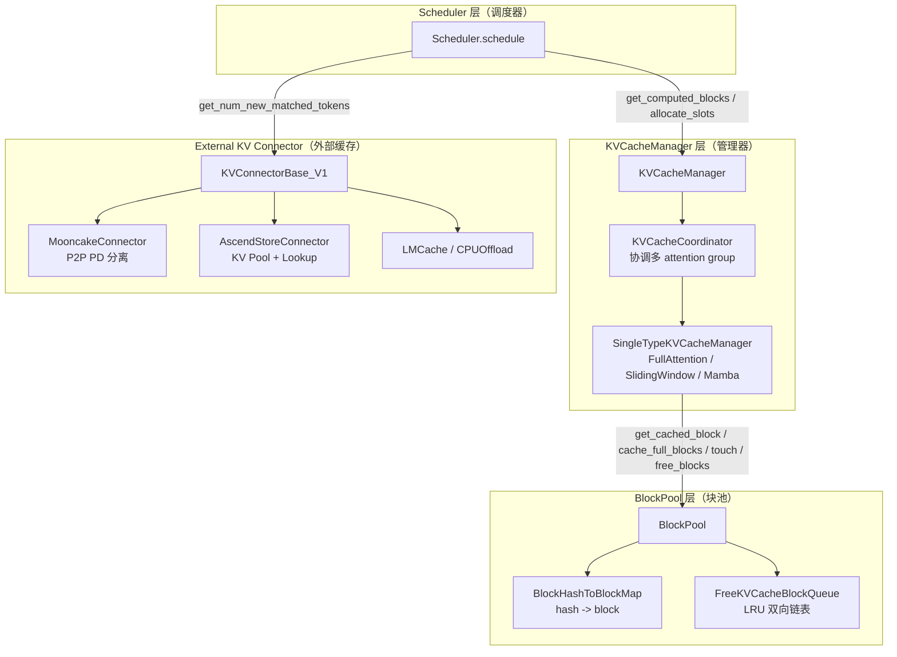
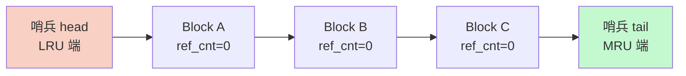
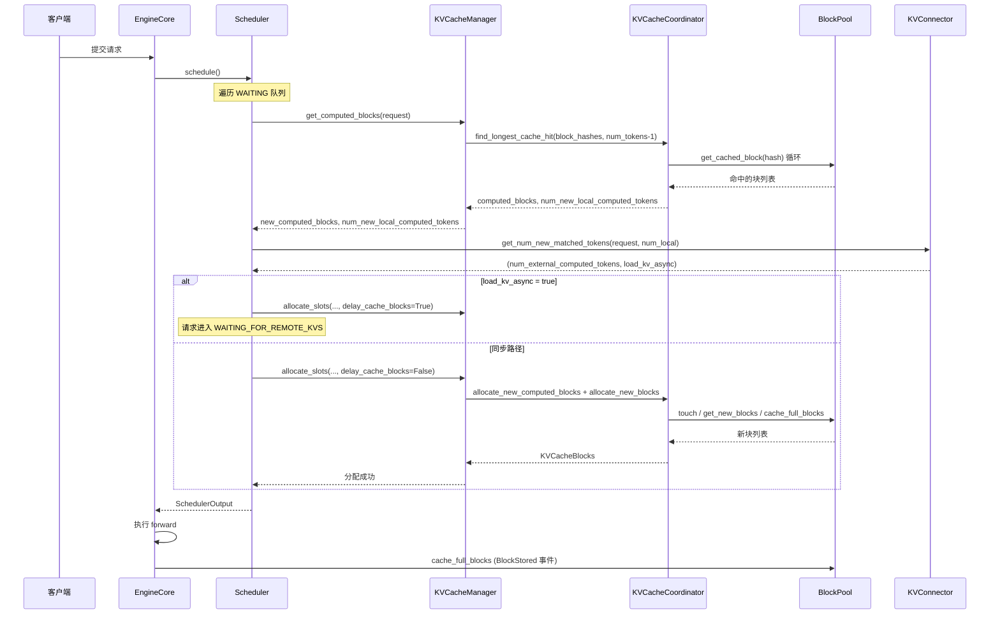

# vLLM Prefix Cache 核心原理机制

> 基于 vLLM main 分支（commit `aa4990a9a2024b3f93f1f26f828931f7301daa15`, 2026-06-22）与 vllm-ascend main 分支源码分析。

## 1. 总览：三层 Prefix Cache 架构

vLLM v1 的 prefix cache 通过「内容寻址的 KV 块 + LRU 淘汰 + 调度器协同」实现跨请求的 KV 复用。整体架构分为三层：



**关键源码位置：**

| 组件 | 文件路径 |
|---|---|
| `KVCacheManager` | `vllm/v1/core/kv_cache_manager.py` |
| `KVCacheCoordinator` | `vllm/v1/core/kv_cache_coordinator.py` |
| `SingleTypeKVCacheManager` | `vllm/v1/core/single_type_kv_cache_manager.py` |
| `BlockPool` | `vllm/v1/core/block_pool.py` |
| `KVCacheBlock` / `FreeKVCacheBlockQueue` | `vllm/v1/core/kv_cache_utils.py` |
| `Scheduler` | `vllm/v1/core/sched/scheduler.py` |
| `KVConnectorBase_V1` | `vllm/distributed/kv_transfer/kv_connector/v1/base.py` |

## 2. 内容寻址：链式 Block Hash

Prefix cache 的核心是「内容寻址」——每个 KV 块的缓存键由其内容（token ids + 额外键）和父块哈希链式计算得出。任何前缀的偏差都会让后续所有块的哈希失效，从而保证缓存命中语义正确。

### 2.1 哈希结构定义

源码位置：`vllm/v1/core/kv_cache_utils.py`

```python
BlockHash = NewType("BlockHash", bytes)
BlockHashWithGroupId = NewType("BlockHashWithGroupId", bytes)
```

`BlockHashWithGroupId` 在 `BlockHash` 后追加 4 字节大端的 `group_id`，使同一 token 序列在不同 KV cache group（如 full-attention vs sliding-window）中可独立缓存：

```python
def make_block_hash_with_group_id(
    block_hash: BlockHash, group_id: int
) -> BlockHashWithGroupId:
    return BlockHashWithGroupId(block_hash + group_id.to_bytes(4, "big"))
```

### 2.2 链式哈希算法

```python
def hash_block_tokens(
    hash_function: Callable[[Any], bytes],
    parent_block_hash: BlockHash | None,
    curr_block_token_ids: Sequence[int],
    extra_keys: tuple[Any, ...] | None = None,
) -> BlockHash:
    if not parent_block_hash:
        parent_block_hash = NONE_HASH
    curr_block_token_ids_tuple = tuple(curr_block_token_ids)
    return BlockHash(
        hash_function((parent_block_hash, curr_block_token_ids_tuple, extra_keys))
    )
```

**链式哈希公式：**

```
block_hash[0] = sha256(NONE_HASH || tokens[0:block_size] || extra_keys[0])
block_hash[i] = sha256(block_hash[i-1] || tokens[i*block_size:(i+1)*block_size] || extra_keys[i])
```

### 2.3 额外键（extra_keys）的组成

`generate_block_hash_extra_keys()` 综合以下来源：

| 来源 | 用途 |
|---|---|
| 多模态特征哈希（MM hashes） | 区分不同图片/音频输入 |
| LoRA request name | 区分不同 LoRA 适配器 |
| `cache_salt` | 用户自定义命名空间，隔离不同租户/会话 |
| Prompt embedding 哈希 | 区分不同 prompt embedding 输入 |

### 2.4 请求级哈希生成器

`get_request_block_hasher()` 返回一个闭包，按 `hash_block_size` 粒度为请求计算块哈希并缓存到 `request.block_hashes`：

```python
def request_block_hasher(request: Request) -> list[BlockHash]:
    start_token_idx = len(request.block_hashes) * hash_block_size
    ...
    while True:
        end_token_idx = start_token_idx + hash_block_size
        if end_token_idx > num_tokens:
            break  # 仅哈希完整块
        extra_keys, curr_mm_idx = generate_block_hash_extra_keys(...)
        block_tokens = request.all_token_ids[start_token_idx:end_token_idx]
        block_hash = hash_block_tokens(
            caching_hash_fn, prev_block_hash_value, block_tokens, extra_keys
        )
        new_block_hashes.append(block_hash)
        start_token_idx += hash_block_size
        prev_block_hash_value = block_hash
    return new_block_hashes
```

## 3. KVCacheBlock 与 LRU 自由队列

### 3.1 KVCacheBlock 数据结构

源码位置：`vllm/v1/core/kv_cache_utils.py`

```python
@dataclass
class KVCacheBlock:
    block_id: int
    ref_cnt: int = 0                              # 引用计数
    _block_hash: BlockHashWithGroupId | None = None  # 当前缓存的哈希
    _block_hash_num_tokens: int = 0
    prev_free_block: KVCacheBlock | None = None   # LRU 链表前驱
    next_free_block: KVCacheBlock | None = None   # LRU 链表后继
    is_null: bool = False                          # 是否为 null 块（占位）
```

### 3.2 FreeKVCacheBlockQueue（LRU 双向链表）



**关键操作：**

- `popleft()`：从 head 端取出最久未使用的块（淘汰候选）
- `append(block)`：将块追加到 tail 端（标记为最近使用）
- `remove(block)`：从链表中移除块

**淘汰策略：** 当需要新块时，从 `popleft()` 取出。若该块已缓存（有 `_block_hash`），则调用 `_maybe_evict_cached_block()` 从 `cached_block_hash_to_block` 移除并发出 `BlockRemoved` 事件。

### 3.3 释放顺序的细节

`BlockPool.free_blocks()` 在块引用计数归零时，根据是否有哈希采用不同策略：

- **无哈希的块**：prepend 到链表 head 端（优先淘汰）
- **有哈希的块**：append 到链表 tail 端（保留为 LRU 候选，可被未来请求命中）

这一设计使得「刚释放但内容仍有价值」的块能在内存压力下尽可能被复用。

## 4. BlockPool：哈希索引与块池管理

源码位置：`vllm/v1/core/block_pool.py`

### 4.1 BlockHashToBlockMap

```python
BlockHashToBlockMap = dict[
    BlockHashWithGroupId,
    KVCacheBlock | dict[int, KVCacheBlock]
]
```

值类型为联合类型：单块命中时直接存 `KVCacheBlock`（避免 dict 分配开销）；多块（如跨 DDP rank）命中时存 `dict[int, KVCacheBlock]`，以 `block_id` 为键。

### 4.2 BlockPool 关键方法

| 方法 | 作用 |
|---|---|
| `get_cached_block(block_hash, group_ids)` | 直接哈希查表，返回匹配的块 |
| `cache_full_blocks(...)` | 请求调度完成后，将新填满的块标记为 cached 并写入哈希表，发出 `BlockStored` 事件 |
| `cache_partial_block(...)` | 拷贝部分尾块的哈希，使未来请求可命中部分前缀 |
| `get_new_blocks(num_blocks)` | 从 LRU 队列取空闲块，必要时淘汰已缓存块 |
| `touch(block)` | 命中时调用：`ref_cnt++` 并重新追加到 LRU 尾部 |
| `free_blocks(blocks)` | `ref_cnt--`；归零时归还队列（按是否有哈希区分位置） |
| `evict_blocks(block_ids)` | 显式从缓存移除（用于 `reset_prefix_cache`） |
| `reset_prefix_cache()` | 清空哈希表，发出 `AllBlocksCleared` 事件 |

### 4.3 KV Cache 事件系统

源码位置：`vllm/distributed/kv_events.py`

```python
class BlockStored(KVCacheEvent):
    block_hashes: list[ExternalBlockHash]
    parent_block_hash: ExternalBlockHash | None
    token_ids: list[int]
    block_size: int
    lora_id: int | None
    medium: str | None
    ...

class BlockRemoved(KVCacheEvent):
    block_hashes: list[ExternalBlockHash]
    ...

class AllBlocksCleared(KVCacheEvent):
    pass
```

`KVEventAggregator` 在 TP/DP worker 间去重事件——只有所有 worker 都看到的事件才会转发给外部消费者（如 LMCache、Mooncake），保证一致性。

## 5. KVCacheManager：调度器门面

源码位置：`vllm/v1/core/kv_cache_manager.py`

`KVCacheManager` 是调度器访问 prefix cache 的统一入口，持有：

- `coordinator: KVCacheCoordinator` —— 协调多个 attention group
- `block_pool: BlockPool` —— 块池
- `enable_caching: bool` —— 是否启用 prefix cache
- `watermark_blocks: int` —— 水位线块数（admission gate）
- `prefix_cache_stats: PrefixCacheStats | None` —— 统计

**调度器调用的核心方法：**

| 方法 | 调用时机 |
|---|---|
| `get_computed_blocks(request)` | 调度 WAITING 请求时，查找本地前缀命中 |
| `allocate_slots(...)` | 确定命中后，分配块（含 admission 检查） |
| `get_num_common_prefix_blocks(...)` | 决定是否启用 cascade attention |
| `free(request)` | 请求结束/抢占时释放块 |
| `reset_prefix_cache()` | 显式清空 prefix cache |
| `new_step_starts()` | 每个调度步开始时触发指标采样 |

## 6. KVCacheCoordinator：多 Attention Group 协调

源码位置：`vllm/v1/core/kv_cache_coordinator.py`

### 6.1 三种协调器

| 协调器 | 适用场景 |
|---|---|
| `KVCacheCoordinatorNoPrefixCache` | 缓存禁用，`find_longest_cache_hit` 返回空 |
| `UnitaryKVCacheCoordinator` | 单 KV cache group（大多数模型） |
| `HybridKVCacheCoordinator` | 多 group（如 full-attention + sliding-window + Mamba） |

### 6.2 Hybrid 协调器的迭代不动点算法

`HybridKVCacheCoordinator.find_longest_cache_hit()` 使用迭代收敛：

```mermaid
flowchart TD
    Start([开始]) --> Init[hits = inf for all groups]
    Init --> Scan[对每个 group g:<br/>h_g = manager[g].find_longest_cache_hit<br/>限制在 min(hits) 内]
    Scan --> Update[hits[g] = h_g]
    Update --> Converge{hits 是否收敛?}
    Converge -- 否 --> Scan
    Converge -- 是 --> Return[返回 hits]
    Return --> End([结束])
```

**为什么需要不动点？** 不同 attention 类型的命中逻辑不同：

- `FullAttentionManager`：从左到右扫描，首次 miss 即 break
- `SlidingWindowManager`：从右到左扫描，要求滑动窗口内连续命中
- `MambaManager`：从右到左扫描，只需最后一块匹配（状态可从该块重建）

例如，sliding-window 层可能在更长前缀上命中（仅限窗口内），而 full-attention 层在更短前缀上命中。不动点算法确保所有 group 对齐到共同前缀长度。

### 6.3 两阶段分配（issue #33775）

为避免一个 group 的 `get_new_blocks` 淘汰另一个 group 刚命中的块，分配分两阶段：

1. `add_local_computed_blocks()` —— touch 本地命中的块（`ref_cnt++`，移出自由队列）
2. `allocate_external_computed_blocks()` —— 为 connector 缓存的 token 分配新块

## 7. Prefix Cache 统计指标

源码位置：`vllm/v1/metrics/stats.py`

```python
@dataclass
class PrefixCacheStats(BaseCacheStats):
    preempted_requests: int = 0
    preempted_queries: int = 0
    preempted_hits: int = 0

    def record(self, num_tokens: int, num_hits: int, preempted: bool) -> None:
        if preempted:
            self.preempted_requests += 1
            self.preempted_queries += num_tokens
            self.preempted_hits += num_hits
        else:
            self.requests += 1
            self.queries += num_tokens
            self.hits += num_hits
```

`SchedulerStats` 同时携带 `prefix_cache_stats`（本地）和 `connector_prefix_cache_stats`（外部）。`PrefillStats` 进一步将 prefill token 拆分为 `num_local_cached_tokens` 和 `num_external_cached_tokens`，满足不变式：

```
num_cached_tokens = num_local_cached_tokens + num_external_cached_tokens
```

## 8. 端到端调度流程



## 9. 关键设计要点总结

1. **内容寻址 + 链式哈希**：O(1) 单块查表，前缀偏差自动失效后续块
2. **LRU + 引用计数**：命中即 touch，淘汰从 LRU 端取；ref_cnt>0 的块不会被淘汰
3. **释放顺序优化**：有哈希的块归队尾（可复用），无哈希的块归队头（优先淘汰）
4. **多 group 不动点对齐**：保证 hybrid 模型各 attention 类型命中长度一致
5. **两阶段分配**：先 touch 本地命中，再分配外部块，避免误淘汰
6. **事件系统**：`BlockStored` / `BlockRemoved` / `AllBlocksCleared` 供外部消费者同步
7. **水位线 admission gate**：WAITING/PREEMPTED 请求需满足 `required_blocks <= free_blocks - watermark`
8. **末 token 重算**：`max_cache_hit_length = num_tokens - 1`，确保 logits 可计算

下一篇：[Prefix Cache 命中计算方法](./02_prefix-cache-hit-calculation.zh.md)
