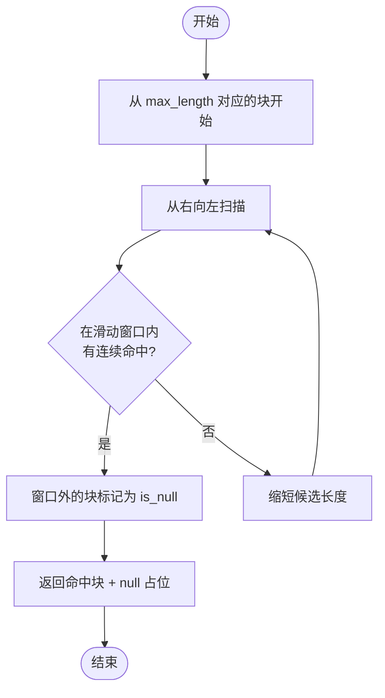
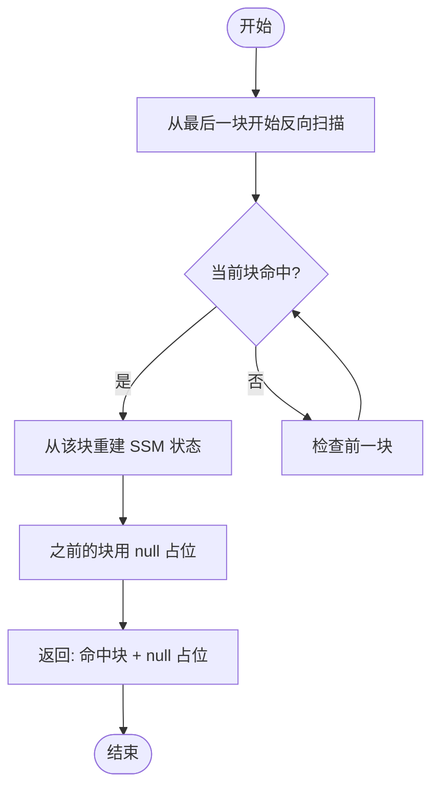
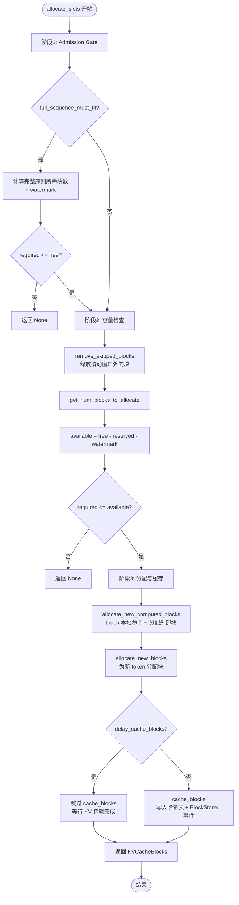
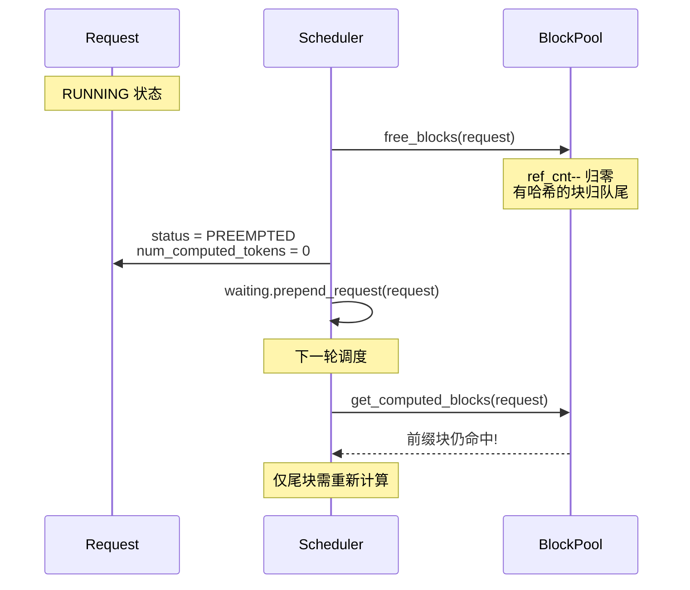

# Prefix Cache 命中计算方法

> 本文详细分析 vLLM 中 prefix cache 命中的计算流程，涵盖本地命中、外部命中、部分命中、抢占恢复等场景。

## 1. 命中计算的入口：get_computed_blocks

源码位置：`vllm/v1/core/kv_cache_manager.py:202`

```python
def get_computed_blocks(self, request: Request) -> tuple[KVCacheBlocks, int]:
    # 跳过条件：缓存禁用 或 请求标记 skip_reading_prefix_cache
    if not self.enable_caching or request.skip_reading_prefix_cache:
        return self.empty_kv_cache_blocks, 0

    # NOTE: 当所有 token 都命中时，必须重算最后一个 token 以获取 logits。
    # 因此 max_cache_hit_length = prompt_length - 1。
    # 这可能触发整块重算，因为 allocate_slots() 要求 num_computed_tokens
    # 按 block_size 对齐。
    max_cache_hit_length = request.num_tokens - 1
    computed_blocks, num_new_computed_tokens = (
        self.coordinator.find_longest_cache_hit(
            request.block_hashes, max_cache_hit_length
        )
    )

    if self.log_stats:
        assert self.prefix_cache_stats is not None
        self.prefix_cache_stats.record(
            num_tokens=request.num_tokens,
            num_hits=num_new_computed_tokens,
            preempted=request.num_preemptions > 0,
        )

    return self.create_kv_cache_blocks(computed_blocks), num_new_computed_tokens
```

### 1.1 跳过条件

| 条件 | 含义 |
|---|---|
| `not enable_caching` | 全局禁用 prefix cache |
| `request.skip_reading_prefix_cache` | 请求级跳过读缓存（prompt logprobs / all-pooling 模型） |

### 1.2 末 token 重算规则

`max_cache_hit_length = request.num_tokens - 1` 是一个关键设计：

- **原因**：logits 需要最后一个 token 的 KV，若全部命中则无 logits 可用
- **副作用**：由于 `allocate_slots` 要求 `num_computed_tokens` 按 `block_size` 对齐，可能整块重算
- **未来优化**：移除对齐限制可只重算单个末 token

## 2. FullAttentionManager 的命中扫描

源码位置：`vllm/v1/core/single_type_kv_cache_manager.py:540`

```python
class FullAttentionManager(SingleTypeKVCacheManager):
    @classmethod
    def find_longest_cache_hit(
        cls,
        block_hashes: BlockHashList,
        max_length: int,
        kv_cache_group_ids: list[int],
        block_pool: BlockPool,
        kv_cache_spec: KVCacheSpec,
        drop_eagle_block: bool,
        alignment_tokens: int,
        dcp_world_size: int = 1,
        pcp_world_size: int = 1,
    ) -> tuple[list[KVCacheBlock], ...]:
        computed_blocks: tuple[list[KVCacheBlock], ...] = tuple(
            [] for _ in range(len(kv_cache_group_ids))
        )
        block_size = kv_cache_spec.block_size
        if dcp_world_size * pcp_world_size > 1:
            block_size *= dcp_world_size * pcp_world_size
        max_num_blocks = max_length // block_size
        for block_hash in itertools.islice(block_hashes, max_num_blocks):
            # block_hashes 是链式哈希。若某块哈希不在缓存表，
            # 后续块哈希必然也未计算，可直接 break。
            if cached_block := block_pool.get_cached_block(
                block_hash, kv_cache_group_ids
            ):
                for computed, cached in zip(computed_blocks, cached_block):
                    computed.append(cached)
            else:
                break
        if drop_eagle_block and computed_blocks[0]:
            # EAGLE/MTP 启用时，丢弃最后一块以强制重算获取 hidden states
            for computed in computed_blocks:
                computed.pop()
        while (
            block_size != alignment_tokens
            and len(computed_blocks[0]) * block_size % alignment_tokens != 0
        ):
            for computed in computed_blocks:
                computed.pop()
        return computed_blocks
```

### 2.1 命中扫描流程图

```mermaid
flowchart TD
    Start([开始 find_longest_cache_hit]) --> Init[computed_blocks = 空列表<br/>block_size = spec.block_size * dcp * pcp]
    Init --> CalcMax[max_num_blocks = max_length // block_size]
    CalcMax --> Loop{遍历 block_hashes<br/>前 max_num_blocks 个}

    Loop --> Lookup[block_pool.get_cached_block<br/>(block_hash, group_ids)]
    Lookup --> Hit{命中?}
    Hit -- 是 --> Append[append 到 computed_blocks]
    Append --> Loop
    Hit -- 否 --> Break[break<br/>后续块必然也 miss]

    Loop --> Eagle{drop_eagle_block<br/>且非空?}
    Eagle -- 是 --> DropEagle[弹出最后一块]
    Eagle -- 否 --> Align
    DropEagle --> Align{block_size != alignment_tokens<br/>且未对齐?}
    Align -- 是 --> PopAlign[弹出末块直到对齐]
    Align -- 否 --> Return
    PopAlign --> Return[返回 computed_blocks]
    Return --> End([结束])
```

### 2.2 链式哈希的「首次 miss 即 break」优化

由于哈希是链式的（`block_hash[i]` 依赖 `block_hash[i-1]`），一旦某块 miss，后续所有块的哈希必然也未在缓存中（因为若 `block_hash[i]` 不在表里，说明从未有请求以该前缀完成 prefill）。因此 `break` 是安全的，无需继续扫描。

### 2.3 EAGLE/MTP 的末块丢弃

EAGLE / MTP 投机解码需要最后一个块的 hidden states 来生成 draft token。若末块完全命中，hidden states 不可得。因此 `drop_eagle_block=True` 时强制弹出最后一块，使其重算。

### 2.4 对齐处理

当 `block_size != alignment_tokens`（如多 group 模型中 hash_block_size 小于 scheduler_block_size），需要弹出末块直到命中长度是 `alignment_tokens` 的整数倍。这是为了让 `num_computed_tokens` 满足调度器对齐要求。

## 3. SlidingWindowManager 的反向扫描

源码位置：`vllm/v1/core/single_type_kv_cache_manager.py`

SlidingWindowManager 的命中逻辑与 FullAttention 完全不同：



**关键差异：**

- **扫描方向**：从右到左（因为只有窗口内的 token 参与注意力）
- **连续性要求**：需要 `sliding_window_contiguous_blocks` 个连续命中
- **null 占位**：窗口外的块用 `null_block` 占位，后续 `remove_skipped_blocks` 会释放它们

## 4. MambaManager 的状态重建

Mamba 是状态空间模型（SSM），其「缓存」是隐状态而非 KV。命中逻辑：



**关键点：** 只需最后一块匹配即可——SSM 状态可从该块重建，无需前缀连续命中。

## 5. Hybrid 模型的多 group 命中协调

源码位置：`vllm/v1/core/kv_cache_coordinator.py`

`HybridKVCacheCoordinator.find_longest_cache_hit()` 使用迭代不动点算法：

```mermaid
flowchart TD
    Start([开始]) --> Init[hits = [inf, inf, ..., inf]<br/>num_groups 个]
    Init --> OuterLoop{迭代}

    OuterLoop --> InnerLoop[遍历每个 group g]
    InnerLoop --> Limit[h_g = manager[g].find_longest_cache_hit<br/>限制 max_length = min(hits)]
    Limit --> Update[hits[g] = h_g]
    Update --> NextG{还有 group?}
    NextG -- 是 --> InnerLoop
    NextG -- 否 --> Converge{hits 收敛?}
    Converge -- 否 --> OuterLoop
    Converge -- 是 --> Return[返回 hits]
    Return --> End([结束])
```

**收敛性证明：** 每次 `hits[g]` 只能减小或不变（因为 `max_length` 取 `min(hits)`），且 `hits` 有下界 0，故必然单调有界收敛。

**实例：** 假设有 full-attention 和 sliding-window 两个 group：

| 迭代 | full-attention 命中 | sliding-window 命中 | min |
|---|---|---|---|
| 0 | inf | inf | inf |
| 1 | 512（首次 miss 在第 5 块） | 1024（窗口内全命中） | 512 |
| 2 | 512（限制在 512 内仍命中 512） | 512（限制在 512 内仍命中 512） | 512 |

收敛，最终命中长度 512。

## 6. allocate_slots：从命中到分配

源码位置：`vllm/v1/core/kv_cache_manager.py:244`

### 6.1 块布局

```
----------------------------------------------------------------------
| < comp > | < new_comp > | < ext_comp >  | < new >  | < lookahead > |
----------------------------------------------------------------------
                          |            < to be allocated >           |
----------------------------------------------------------------------
| < cached by vLLM >    | not cached by |
| ref_cnt  | ref_cnt not | vLLM, but     |
| increased| increased   | cached by     |
|          | yet         | connector     |
----------------------------------------------------------------------
```

**缩写：**

| 字段 | 含义 |
|---|---|
| `comp` | `request.num_computed_tokens`（前序步骤已计算） |
| `new_comp` | `num_new_computed_tokens`（本地 prefix cache 命中） |
| `ext_comp` | `num_external_computed_tokens`（connector 命中） |
| `new` | `num_new_tokens`（本步要计算的） |
| `lookahead` | `num_lookahead_tokens`（投机解码） |

### 6.2 三阶段分配算法



### 6.3 关键代码片段

```python
# 阶段1: Admission Gate
if full_sequence_must_fit:
    full_num_tokens = min(request.num_tokens, self.max_model_len)
    num_blocks_to_allocate = self.coordinator.get_num_blocks_to_allocate(
        request_id=request.request_id,
        num_tokens=full_num_tokens,
        new_computed_blocks=new_computed_block_list,
        num_encoder_tokens=num_encoder_tokens,
        total_computed_tokens=total_computed_tokens,
        num_tokens_main_model=full_num_tokens,
        apply_admission_cap=True,
    )
    required_blocks = num_blocks_to_allocate + watermark_blocks
    if required_blocks > self.block_pool.get_num_free_blocks():
        return None

# 阶段2: 容量检查
self.coordinator.remove_skipped_blocks(
    request.request_id, total_computed_tokens
)
num_blocks_to_allocate = self.coordinator.get_num_blocks_to_allocate(...)
available_blocks = self.block_pool.get_num_free_blocks() - reserved_blocks
required_blocks = num_blocks_to_allocate + watermark_blocks
if required_blocks > available_blocks:
    return None

# 阶段3: 分配与缓存
if (new_computed_block_list is not self.empty_kv_cache_blocks.blocks
    or num_external_computed_tokens > 0):
    self.coordinator.allocate_new_computed_blocks(
        request_id=request.request_id,
        new_computed_blocks=new_computed_block_list,
        num_local_computed_tokens=num_local_computed_tokens,
        num_external_computed_tokens=num_external_computed_tokens,
    )

new_blocks = self.coordinator.allocate_new_blocks(
    request.request_id, num_tokens_need_slot, num_tokens_main_model,
    num_encoder_tokens,
)

if not self.enable_caching or delay_cache_blocks:
    return self.create_kv_cache_blocks(new_blocks)

num_tokens_to_cache = min(
    total_computed_tokens + num_new_tokens,
    request.num_tokens,
)
self.coordinator.cache_blocks(request, num_tokens_to_cache)
return self.create_kv_cache_blocks(new_blocks)
```

### 6.4 `delay_cache_blocks` 的语义

| 场景 | `delay_cache_blocks` | 行为 |
|---|---|---|
| 正常 prefill | False | 立即 `cache_blocks`，写入哈希表 |
| P/D 异步加载 | True | 跳过 `cache_blocks`，等 KV 传输完成后才缓存 |
| 缓存禁用 | N/A | 直接返回，不缓存 |

## 7. 调度器中的命中计算全流程

源码位置：`vllm/v1/core/sched/scheduler.py:667`

```python
num_external_computed_tokens = 0
load_kv_async = False

# 1. 获取本地缓存 token
if request.num_computed_tokens == 0:
    # 1a. 特殊处理：Mamba hybrid 模型
    if (self.connector is not None
        and self.has_mamba_layers
        and isinstance(self.kv_cache_manager.coordinator, HybridKVCacheCoordinator)):
        computed, per_group_hits = (
            self.kv_cache_manager.coordinator.find_longest_cache_hit_per_group(
                request.block_hashes, request.num_tokens - 1,
            )
        )
        new_computed_blocks = self.kv_cache_manager.create_kv_cache_blocks(computed)
        # 取 FA 命中长度（避免重复传输 D-side 已缓存的 FA 块）
        num_new_local_computed_tokens = max(per_group_hits)
    else:
        # 1b. 常规路径
        new_computed_blocks, num_new_local_computed_tokens = (
            self.kv_cache_manager.get_computed_blocks(request)
        )

    # 2. 获取外部缓存 token
    if self.connector is not None:
        ext_tokens, load_kv_async = (
            self.connector.get_num_new_matched_tokens(
                request, num_new_local_computed_tokens
            )
        )
        if ext_tokens is None:
            # connector 无法确定命中，请求延后
            request_queue.pop_request()
            step_skipped_waiting.prepend_request(request)
            continue
        num_external_computed_tokens = ext_tokens

    # 3. 总命中 = 本地 + 外部
    num_computed_tokens = (
        num_new_local_computed_tokens + num_external_computed_tokens
    )
    assert num_computed_tokens <= request.num_tokens
```

### 7.1 命中计算流程图

```mermaid
flowchart TD
    Start([调度 WAITING 请求]) --> CheckComp{num_computed_tokens == 0?}

    CheckComp -- 否 --> SkipLocal[跳过本地命中<br/>num_new_local = 0]
    CheckComp -- 是 --> CheckMamba{Mamba hybrid<br/>且有 connector?}

    CheckMamba -- 是 --> PerGroup[find_longest_cache_hit_per_group<br/>取 max(per_group_hits)]
    CheckMamba -- 否 --> Normal[get_computed_blocks<br/>返回 new_computed_blocks, num_new_local]

    PerGroup --> Connector
    Normal --> Connector
    SkipLocal --> Connector

    Connector{有 connector?}
    Connector -- 是 --> GetExt[connector.get_num_new_matched_tokens]
    Connector -- 否 --> NoExt[num_external = 0]

    GetExt --> CheckNone{返回 None?}
    CheckNone -- 是 --> Defer[请求延后到下一轮]
    CheckNone -- 否 --> SetExt[num_external = ext_tokens]

    NoExt --> Total
    SetExt --> Total[num_computed_tokens = local + external]

    Total --> CalcNew[num_new_tokens = num_tokens - num_computed_tokens]
    CalcNew --> Alloc[allocate_slots]
    Alloc --> End([结束])
    Defer --> End
```

### 7.2 Mamba hybrid 的特殊处理

对于 Mamba hybrid 模型（如 Jamba），使用 `find_longest_cache_hit_per_group` 而非 `find_longest_cache_hit`：

- **原因**：Mamba 状态由 connector 传输，D-side 无本地 Mamba 命中。若用 `find_longest_cache_hit`，Mamba group 命中为 0 会拖累 FA group 命中也为 0。
- **解决**：取 `max(per_group_hits)`，即 FA group 的命中长度，传给 connector 计算 `external = total - local`。
- **Mamba 状态**：由 connector 的 `_apply_prefix_caching` 无条件传输最后一块。

## 8. 部分命中场景

### 8.1 场景一：前缀部分命中

请求 token: `[A, B, C, D, E, F, G, H]`，block_size=4，缓存中有 `[A, B, C, D]` 的块。

| 块索引 | token | 哈希 | 缓存命中? |
|---|---|---|---|
| 0 | A, B, C, D | hash_0 | 是 |
| 1 | E, F, G, H | hash_1 | 否 |

**结果：** `num_new_local_computed_tokens = 4`，`num_new_tokens = 4`（E, F, G, H 需计算）。

### 8.2 场景二：全部命中（末 token 重算）

请求 token: `[A, B, C, D, E]`，block_size=4，缓存中有 `[A, B, C, D]`。

- `max_cache_hit_length = 5 - 1 = 4`
- `max_num_blocks = 4 // 4 = 1`
- 命中块 0，`num_new_local_computed_tokens = 4`
- `num_new_tokens = 5 - 4 = 1`（E 需计算以获取 logits）

### 8.3 场景三：跨请求前缀复用

请求1: `[system_prompt, user_query_1]` → prefill 完成，块缓存
请求2: `[system_prompt, user_query_2]` → 命中 `system_prompt` 对应的块

```
请求1 块: [hash(sys+q1_block0), hash(sys+q1_block1), ...]
请求2 块: [hash(sys+q2_block0), hash(sys+q2_block1), ...]
```

由于 `sys` 部分相同，`hash(sys_block0)` 相同，请求2 命中 `sys` 部分的所有块。第一个不同的 token 导致后续哈希链失效。

## 9. 抢占与恢复

源码位置：`vllm/v1/core/sched/scheduler.py:1107`

```python
def _preempt_request(self, request: Request, timestamp: float) -> None:
    assert request.status == RequestStatus.RUNNING, ...
    self._free_request_blocks(request)
    self.encoder_cache_manager.free(request)
    self._inflight_prefills.discard(request)
    request.status = RequestStatus.PREEMPTED
    request.num_computed_tokens = 0
    if request.spec_token_ids:
        request.spec_token_ids = []
    request.num_preemptions += 1
    ...
    self.waiting.prepend_request(request)
```

**抢占后的命中恢复：**

- `num_computed_tokens` 重置为 0
- 块被释放（`ref_cnt--`），但有哈希的块归入 LRU 队尾，仍可被命中
- 请求重新进入 WAITING 队首
- 下一轮调度时，`get_computed_blocks` 会重新查找命中——**前缀部分仍可能命中**，只有非前缀的尾块丢失



## 10. Cascade Attention 的公共前缀

源码位置：`vllm/v1/core/kv_cache_manager.py:520`

```python
def get_num_common_prefix_blocks(
    self, requests: list[str], num_running_reqs: int
) -> list[int]:
    """获取所有 running 请求的公共前缀块数（per group）。"""
```

`FullAttentionManager.get_num_common_prefix_blocks`:

```python
def get_num_common_prefix_blocks(self, running_request_id: str) -> int:
    blocks = self.req_to_blocks[running_request_id]
    num_common_blocks = 0
    for block in blocks:
        if block.ref_cnt == len(self.req_to_blocks):
            # ref_cnt == running 请求数，说明所有请求都引用该块
            num_common_blocks += 1
        else:
            break
    return num_common_blocks
```

**原理：** 通过 `ref_cnt` 判断公共前缀——若某块被所有 running 请求引用，则属于公共前缀。调度器据此决定是否启用 cascade attention（将公共前缀的 attention 单独计算，减少重复）。

## 11. 命中计算的关键不变式

1. **链式哈希单调性**：`block_hash[i]` 命中 ⟹ `block_hash[0..i-1]` 全部命中
2. **末 token 重算**：`max_cache_hit_length = num_tokens - 1`
3. **对齐约束**：`num_computed_tokens` 必须是 `block_size` 的整数倍
4. **总命中上界**：`num_computed_tokens = local + external <= num_tokens`
5. **ref_cnt 语义**：`ref_cnt == 0` 表示块在自由队列；`ref_cnt > 0` 表示被请求引用
6. **公共前缀判定**：`ref_cnt == num_running_reqs` 表示公共前缀块

## 12. 命中计算的源码索引

| 功能 | 文件 | 行号 |
|---|---|---|
| `get_computed_blocks` | `vllm/v1/core/kv_cache_manager.py` | 202 |
| `FullAttentionManager.find_longest_cache_hit` | `vllm/v1/core/single_type_kv_cache_manager.py` | 540 |
| `SlidingWindowManager.find_longest_cache_hit` | `vllm/v1/core/single_type_kv_cache_manager.py` | (同文件) |
| `MambaManager.find_longest_cache_hit` | `vllm/v1/core/single_type_kv_cache_manager.py` | (同文件) |
| `HybridKVCacheCoordinator.find_longest_cache_hit` | `vllm/v1/core/kv_cache_coordinator.py` | - |
| `allocate_slots` | `vllm/v1/core/kv_cache_manager.py` | 244 |
| `get_num_common_prefix_blocks` | `vllm/v1/core/kv_cache_manager.py` | 520 |
| 调度器命中流程 | `vllm/v1/core/sched/scheduler.py` | 667 |
| `_preempt_request` | `vllm/v1/core/sched/scheduler.py` | 1107 |
| `hash_block_tokens` | `vllm/v1/core/kv_cache_utils.py` | 577 |
| `get_request_block_hasher` | `vllm/v1/core/kv_cache_utils.py` | 673 |

上一篇：[Prefix Cache 核心原理机制](./01_prefix-cache-core-mechanism.zh.md)

下一篇：[External Prefix Cache 外部前缀缓存机制](./03_external-prefix-cache.zh.md)
