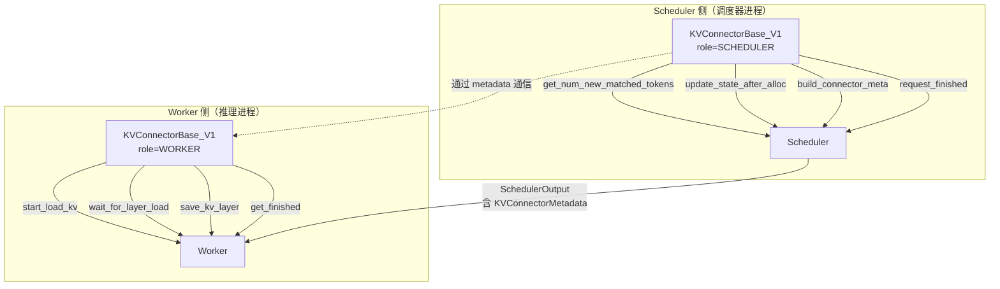
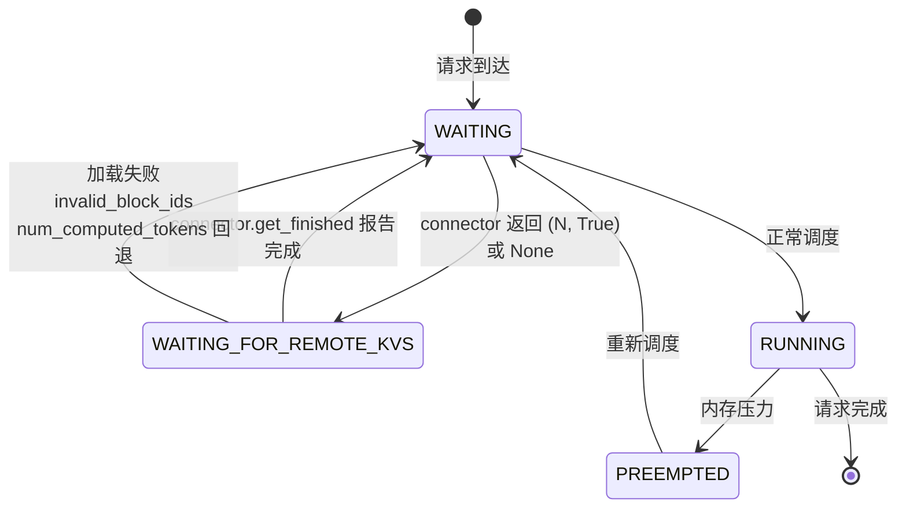
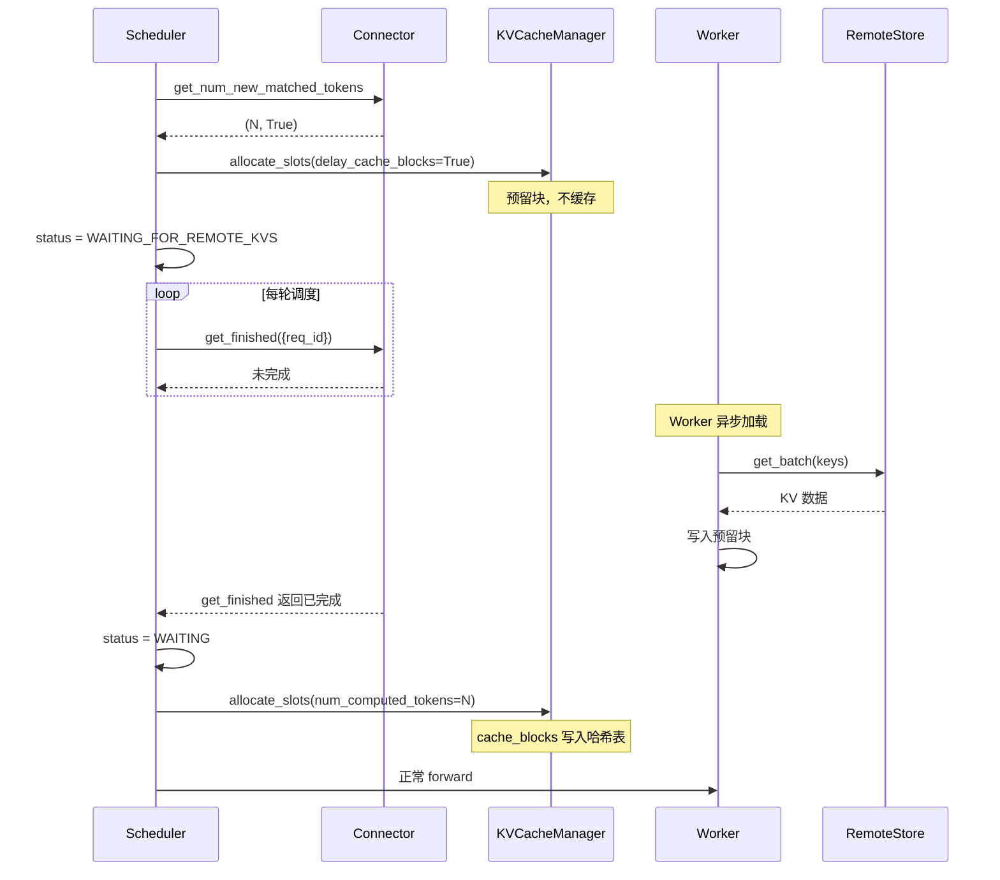
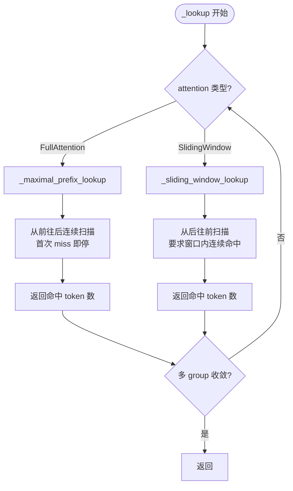
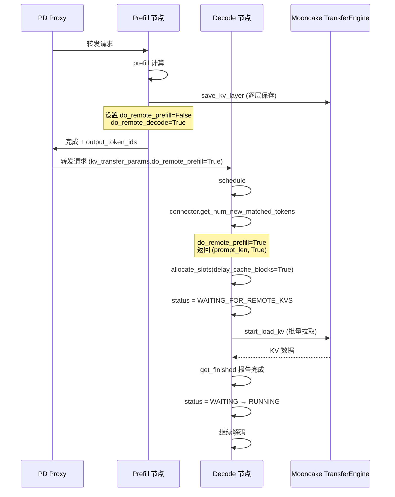
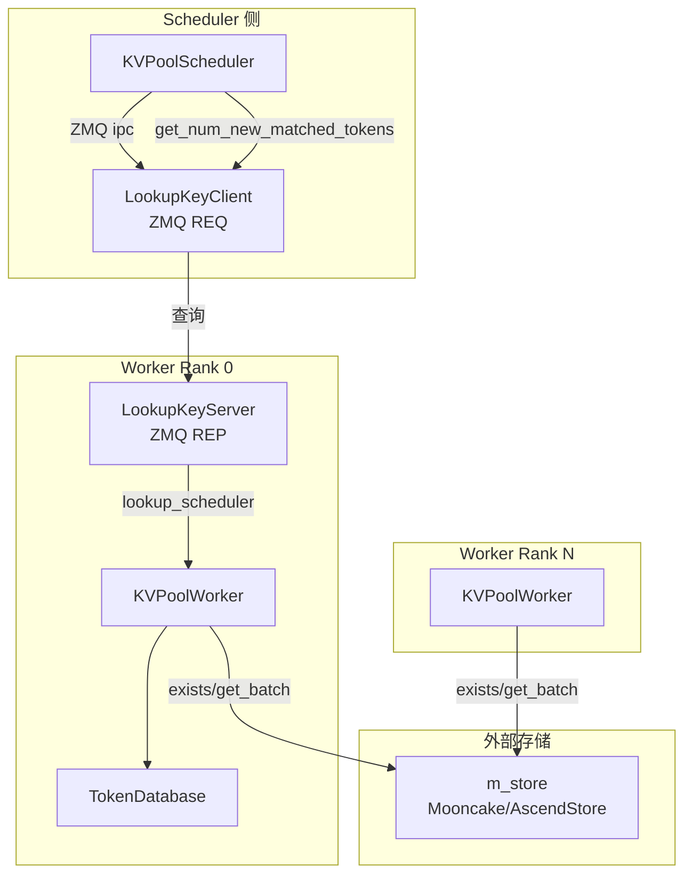
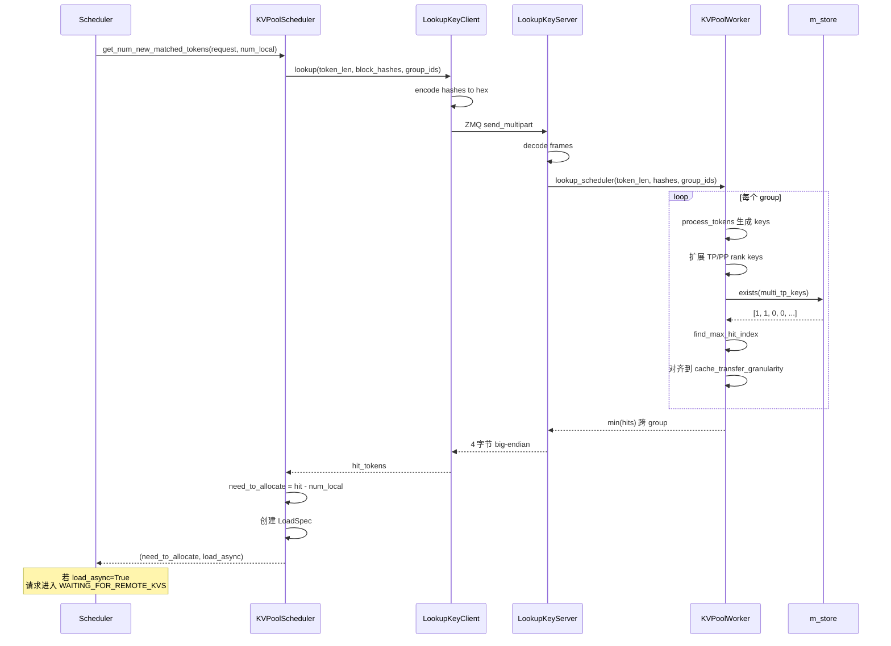
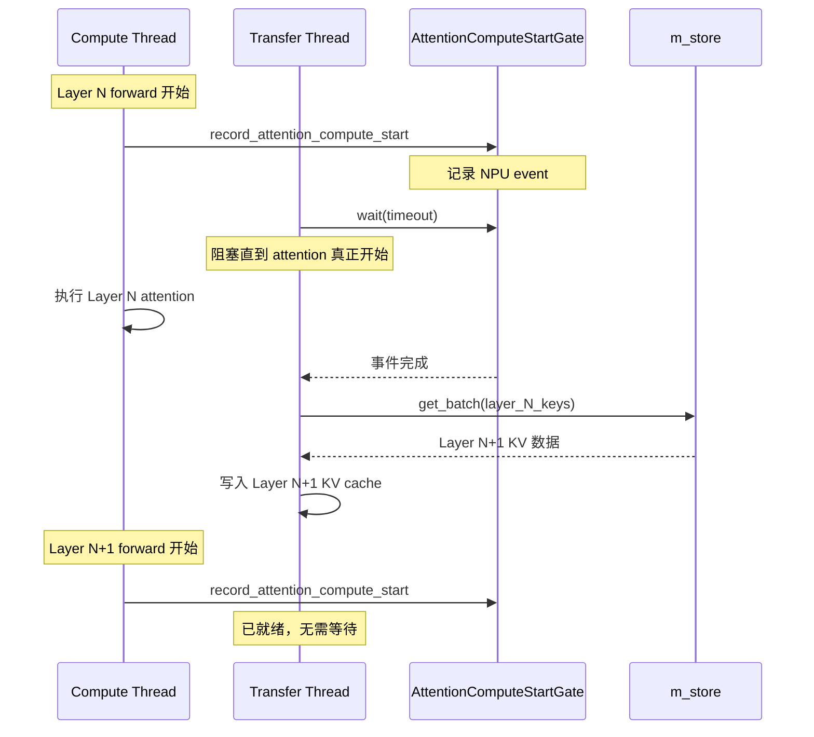
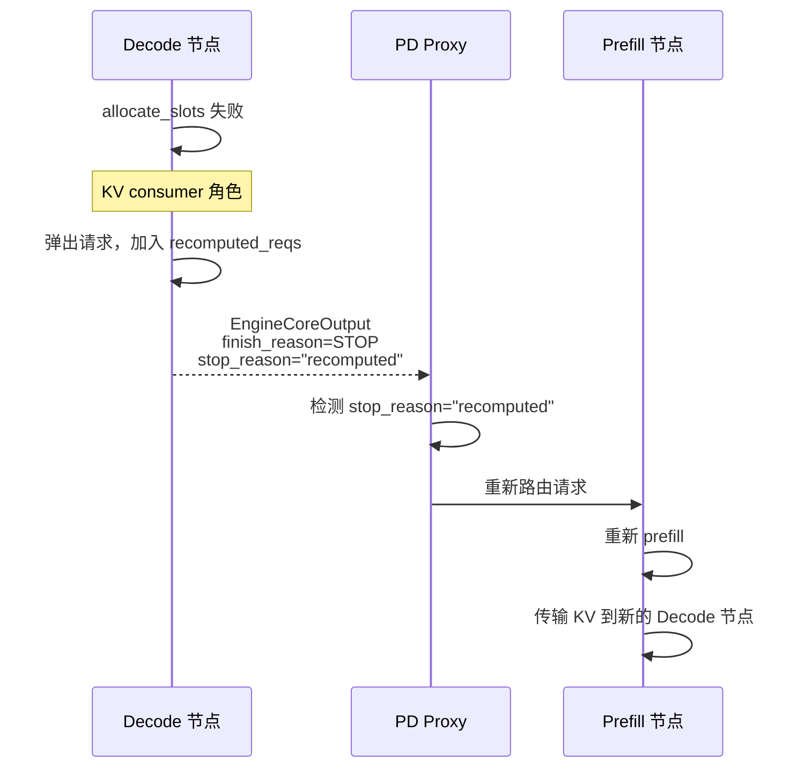

# External Prefix Cache 外部前缀缓存机制

> 本文分析 vLLM 的外部 prefix cache（KV Connector）框架，以及 vllm-ascend 中的具体实现（Mooncake P2P、AscendStore KV Pool、Layerwise 传输等）。

## 1. 外部 Prefix Cache 的动机

本地 prefix cache 受限于单机 GPU/NPU 显存，无法跨：

- **节点**：PD 分离场景下，prefill 节点的 KV 需传给 decode 节点
- **实例**：多实例共享 KV 池，避免重复 prefill
- **层级**：显存不足时，KV 卸载到 CPU 内存或远程存储

`KVConnector` 框架提供统一接口，让外部缓存与本地 prefix cache 协同工作。

## 2. KVConnector 框架架构

源码位置：`vllm/distributed/kv_transfer/kv_connector/v1/base.py`

### 2.1 角色划分



### 2.2 KVConnectorBase_V1 抽象方法

**Scheduler 侧：**

| 方法 | 作用 |
|---|---|
| `get_num_new_matched_tokens(request, num_local)` | 返回 `(external_tokens, is_async)`；`None` 表示延后 |
| `update_state_after_alloc(request, blocks, num_external)` | 分配后更新 connector 状态 |
| `build_connector_meta(scheduler_output)` | 构建序列化给 worker 的元数据 |
| `request_finished(request, block_hashes)` | 通知请求完成，触发 KV 保存 |
| `take_events()` | 取出 KV 事件用于统计 |

**Worker 侧：**

| 方法 | 作用 |
|---|---|
| `start_load_kv(requests, forward_request)` | 启动异步 KV 加载 |
| `wait_for_layer_load(layer_name)` | 等待某层 KV 加载完成 |
| `save_kv_layer(layer_name, kv)` | 保存某层 KV 到外部存储 |
| `wait_for_save()` | 等待所有保存完成 |
| `get_finished(request_ids)` | 返回已完成加载的请求集合 |

### 2.3 Connector 注册表

源码位置：`vllm/distributed/kv_transfer/kv_connector/factory.py`

```python
KVConnectorFactory.register_connector("ExampleConnector", ExampleConnector)
KVConnectorFactory.register_connector("LMCacheConnectorV1", LMCacheConnectorV1)
KVConnectorFactory.register_connector("NixlConnector", NixlConnector)
KVConnectorFactory.register_connector("OffloadingConnector", OffloadingConnector)
KVConnectorFactory.register_connector("SimpleCPUOffloadConnector", SimpleCPUOffloadConnector)
KVConnectorFactory.register_connector("MooncakeConnector", MooncakeConnector)
# ... 更多
```

## 3. 外部命中计算：get_num_new_matched_tokens

### 3.1 调度器调用流程

源码位置：`vllm/v1/core/sched/scheduler.py:723`

```python
if self.connector is not None:
    ext_tokens, load_kv_async = (
        self.connector.get_num_new_matched_tokens(
            request, num_new_local_computed_tokens
        )
    )
    if ext_tokens is None:
        # connector 无法确定命中，请求延后到 WAITING_FOR_REMOTE_KVS
        request_queue.pop_request()
        step_skipped_waiting.prepend_request(request)
        continue
    num_external_computed_tokens = ext_tokens
```

### 3.2 返回值语义

| 返回值 | 含义 | 调度器行为 |
|---|---|---|
| `(N, False)` | 同步命中 N 个 token | 正常调度，`num_external = N` |
| `(N, True)` | 异步命中 N 个 token | `delay_cache_blocks=True`，请求进入 `WAITING_FOR_REMOTE_KVS` |
| `(None, False)` | 延后查找 | 请求进入 `WAITING_FOR_REMOTE_KVS`，下轮重试 |
| `(0, False)` | 无命中 | `num_external = 0`，正常调度 |

### 3.3 异步加载状态机



### 3.4 异步加载的块预留

当 `load_kv_async=True`：

1. `allocate_slots` 以 `delay_cache_blocks=True` 调用
2. 块被预留（`ref_cnt++`），但**不写入哈希表**
3. 请求进入 `WAITING_FOR_REMOTE_KVS`
4. Worker 侧 `start_load_kv` 异步拉取 KV
5. 完成后 `get_finished` 报告，请求回到 `WAITING`
6. 下一轮调度时，`num_computed_tokens > 0`，跳过 `get_computed_blocks`，直接 `allocate_slots`
7. 此时 `cache_blocks` 才将块写入哈希表



## 4. OffloadingConnector 参考实现

源码位置：`vllm/distributed/kv_transfer/kv_connector/v1/offloading/scheduler.py`

### 4.1 两种查找策略



### 4.2 `_maximal_prefix_lookup` 算法

```python
def _maximal_prefix_lookup(self, request, group, ...):
    # 1. 获取 block_hashes
    block_hashes = request.block_hashes
    # 2. 从前往后扫描
    for i, block_hash in enumerate(block_hashes):
        # 3. 构造 store key（含 TP/PP rank 后缀）
        key = self._make_key(block_hash, group, ...)
        # 4. 查询外部存储
        if not self.store.exists(key):
            return i * block_size  # 返回命中 token 数
    return len(block_hashes) * block_size
```

### 4.3 `_sliding_window_lookup` 算法

```python
def _sliding_window_lookup(self, request, group, ...):
    # 1. 从末尾块开始反向扫描
    for i in range(num_blocks - 1, -1, -1):
        key = self._make_key(block_hashes[i], group, ...)
        if self.store.exists(key):
            # 2. 检查窗口内连续性
            if self._check_window_continuous(i, sliding_window_size):
                return (i + 1) * block_size
    return 0
```

## 5. vllm-ascend 的 Connector 实现

源码位置：`vllm_ascend/distributed/kv_transfer/__init__.py:21`

### 5.1 注册的 Ascend Connectors

| Connector 名称 | 模块 | 用途 |
|---|---|---|
| `MooncakeConnectorV1` | `kv_p2p.mooncake_connector` | P2P PD 分离 |
| `MooncakeHybridConnector` | `kv_p2p.mooncake_hybrid_connector` | 混合模式 |
| `MooncakeConnectorStoreV1` / `AscendStoreConnector` | `kv_pool.ascend_store.ascend_store_connector` | KV Pool + Lookup |
| `MooncakeLayerwiseConnector` | `kv_p2p.mooncake_layerwise_connector` | 逐层 KV 传输 |
| `UCMConnector` | `kv_pool.ucm_connector` | UCM 连接器 |
| `LMCacheAscendConnector` | `kv_pool.lmcache_ascend_connector` | LMCache 集成 |
| `SimpleCPUOffloadConnector` | `kv_pool.simple_cpu_offload.simple_cpu_offload_connector` | CPU 卸载（NPU） |
| `MultiConnector` | `ascend_multi_connector` | 多连接器组合 |

## 6. MooncakeConnector（P2P PD 分离）

源码位置：`vllm_ascend/distributed/kv_transfer/kv_p2p/mooncake_connector.py:1571`

### 6.1 命中计算

```python
def get_num_new_matched_tokens(
    self, request: "Request", num_computed_tokens: int
) -> tuple[int, bool]:
    params = request.kv_transfer_params

    if params is not None and params.get("do_remote_prefill"):
        # Remote prefill: 从远端拉取所有 prompt 块
        token_ids = request.prompt_token_ids or []
        actual = self._state_prefill_token_count(len(token_ids))
        params["num_computed_tokens"] = num_computed_tokens
        count = max(actual - num_computed_tokens, 0)
        if count > 0:
            return count, True  # 异步加载

    if params is not None and params.get("do_remote_decode") and self.need_truncate:
        self._truncate_request_for_prefill(request)

    return 0, False
```

### 6.2 PD 分离的命中流程



### 6.3 关键设计点

- **`do_remote_prefill` 标志**：由 PD Proxy 设置，标识该请求需从远端拉取 KV
- **`_state_prefill_token_count`**：计算实际需拉取的 token 数（可能因 truncation 而小于 prompt 长度）
- **异步加载**：返回 `(count, True)`，调度器进入 `WAITING_FOR_REMOTE_KVS`
- **`KVCacheSendingThread` / `KVCacheRecvingThread`**：独立的发送/接收线程，与计算重叠
- **`group_compress_ratios`**：支持压缩 MLA 模型的 KV 传输

## 7. AscendStoreConnector（KV Pool + Lookup）

源码位置：`vllm_ascend/distributed/kv_transfer/kv_pool/ascend_store/`

### 7.1 架构



### 7.2 命中计算（Scheduler 侧）

源码位置：`vllm_ascend/distributed/kv_transfer/kv_pool/ascend_store/pool_scheduler.py:488`

```python
def get_num_new_matched_tokens(
    self, request: "Request", num_computed_tokens: int,
) -> tuple[int, bool]:
    # 1. 角色检查
    if self.kv_role == "kv_consumer" and not self.consumer_is_to_load:
        return 0, False

    # 2. 对齐到 cache_transfer_granularity
    if self._discard_partial_chunks:
        token_len = self._floor_to_cache_transfer_granularity(
            len(request.prompt_token_ids)
        )
    else:
        token_len = len(request.prompt_token_ids)

    if token_len < self.cache_transfer_granularity:
        return 0, False

    # 3. 三种查找路径
    if self.use_gva_layerwise:
        num_external_hit_tokens = self._get_layerwise_gva_hit_tokens(
            request, token_len, num_computed_tokens
        )
    elif self.use_layerwise:
        num_external_hit_tokens = self._get_store_lookup_hit_tokens(
            request, token_len, num_computed_tokens, include_layers=True
        )
    else:
        # 默认：通过 LookupKeyClient 查询
        if self.client is None:
            self.client = LookupKeyClient(self.vllm_config)
        num_external_hit_tokens = self.client.lookup(
            token_len, request.block_hashes, self.kv_cache_group_ids,
        )

    # 4. 边界处理
    if num_external_hit_tokens == 0:
        return 0, False
    if num_external_hit_tokens == request.num_tokens:
        num_external_hit_tokens -= 1  # 末 token 重算

    # 5. 计算需分配的 token 数
    if num_external_hit_tokens < num_computed_tokens:
        need_to_allocate = 0
    else:
        need_to_allocate = num_external_hit_tokens - num_computed_tokens

    # 6. 创建 LoadSpec
    self.load_specs[request.request_id] = LoadSpec(
        vllm_cached_tokens=num_computed_tokens,
        kvpool_cached_tokens=num_external_hit_tokens,
        can_load=force_layerwise_load,
    )

    return need_to_allocate, self.load_async and not self.use_layerwise
```

### 7.3 命中查找（Worker 侧）

源码位置：`vllm_ascend/distributed/kv_transfer/kv_pool/ascend_store/pool_worker.py:1194`

```python
def lookup_scheduler(
    self, token_len: int, block_hashes: list[BlockHash],
    kv_cache_group_ids: list[int] | None = None,
    use_layerwise: bool = False,
) -> int:
    hits = []
    for group_id in kv_cache_group_ids:
        keys = []
        starts = []
        ends = []
        # 1. 为每个块生成 store key（含 TP/PP rank 后缀）
        for start, end, key in self.token_database.process_tokens(
            token_len, block_hashes, kv_cache_group_id=group_id,
        ):
            keys.append(key.to_string())
            starts.append(start)
            ends.append(end)

        # 2. 扩展到所有 TP/PP rank
        multi_tp_keys = keys[:]
        for i in range(1, group_tp_size):
            for item in keys:
                new_str = item.replace(
                    "@head_or_tp_rank:0", f"@head_or_tp_rank:{i}", 1
                )
                multi_tp_keys.append(new_str)
        # ... PP rank 扩展

        # 3. 批量查询存在性
        res = self.m_store.exists(multi_tp_keys)

        # 4. 找到最大连续命中索引
        if self.group_uses_align_state[group_id]:
            # Mamba align 模式：反向扫描
            for i in range(num_block - 1, -1, -1):
                if (all(values[i] == 1 for values in multi_tp_values)
                    and ends[i] % self.cache_transfer_granularity == 0):
                    hits.append(ends[i])
                    break
        else:
            # 常规：找最大命中索引
            index = self.find_max_hit_index(multi_tp_values, num_block)
            if index == -1:
                return 0
            # 对齐到 cache_transfer_granularity
            for hit_index in range(index, -1, -1):
                if ends[hit_index] % self.cache_transfer_granularity == 0:
                    hits.append(ends[hit_index])
                    break

    # 5. 多 group 取最小值（类似 hybrid coordinator）
    return min(hits) if hits else 0
```

### 7.4 LookupKeyClient / LookupKeyServer（ZMQ 协议）

**Client（Scheduler 侧）：**

```python
class LookupKeyClient:
    def lookup(self, token_len, block_hashes, kv_cache_group_ids) -> int:
        hash_strs = [h.hex() for h in block_hashes]
        hash_frames = self.encoder.encode(hash_strs)
        kv_group_frames = self.encoder.encode(kv_cache_group_ids)
        token_len_bytes = token_len.to_bytes(4, byteorder="big")
        all_frames = [token_len_bytes] + list(kv_group_frames) + list(hash_frames)
        self.socket.send_multipart(all_frames, copy=False)
        resp = self.socket.recv()
        return int.from_bytes(resp, "big")
```

**Server（Worker Rank 0）：**

```python
class LookupKeyServer:
    def __init__(self, pool_worker, vllm_config):
        self.socket = make_zmq_socket(
            self.ctx, socket_path, zmq.REP, bind=True
        )
        self.pool_worker = pool_worker

        def process_request():
            while self.running:
                all_frames = self.socket.recv_multipart(copy=False)
                token_len = int.from_bytes(all_frames[0], byteorder="big")
                kv_group_ids = self.decoder.decode([all_frames[1]])
                hashes_str = self.decoder.decode(all_frames[2:])
                result = self.pool_worker.lookup_scheduler(
                    token_len, hashes_str, kv_group_ids, use_layerwise=False,
                )
                response = result.to_bytes(4, "big")
                self.socket.send(response)

        self.thread = threading.Thread(target=process_request, daemon=True)
        self.thread.start()
```

### 7.5 cache_transfer_granularity

源码位置：`pool_scheduler.py:113`

`cache_transfer_granularity` 是所有 KV cache group block size 的 LCM（最小公倍数）。命中长度必须对齐到此粒度，否则跨 group 传输会出现不对齐。

### 7.6 完整命中流程时序图



## 8. Layerwise KV 传输

### 8.1 动机

传统 KV 传输是「整层一次性传输」，需等所有层 KV 到齐才能开始计算。Layerwise 模式逐层传输，与计算重叠：

```mermaid
gantt
    title Layerwise KV 传输与计算重叠
    dateFormat X
    axisFormat %s

    section 传输
    Layer 0 KV 传输 :done, t0, 0, 10
    Layer 1 KV 传输 :done, t1, 10, 20
    Layer 2 KV 传输 :done, t2, 20, 30

    section 计算
    Layer 0 attention :active, c0, 10, 15
    Layer 1 attention :active, c1, 20, 25
    Layer 2 attention :active, c2, 30, 35
```



### 8.2 AttentionComputeStartGate

源码位置：`vllm_ascend/memcache_comm_fence.py`

```python
class AttentionComputeStartGate:
    """For layerwise KV transfer, transfer threads must wait until the
    compute stream actually reaches the attention op."""

    def record(self, stream):
        """在计算流上记录事件"""
        self.event = torch.npu.Event()
        self.event.record(stream)

    def wait(self, timeout):
        """阻塞直到事件完成"""
        with self.condition:
            while not self.event.query():
                self.condition.wait(timeout)
```

**模块级函数：**

- `reset_attention_compute_start_gate()` —— 每层 layerwise load 开始时调用
- `get_attention_compute_start_gate()` —— 获取当前 gate
- `record_attention_compute_start()` —— attention 路径在启动 attention 前调用

### 8.3 Layerwise 传输时序



## 9. NPU 原生内存传输基础设施

### 9.1 swap_blocks_batch 自定义算子

源码位置：`csrc/torch_binding.cpp:123`

```cpp
void swap_blocks_batch(
    const torch::Tensor& src_ptrs,
    const torch::Tensor& dst_ptrs,
    const torch::Tensor& sizes,
    int64_t direction  // 0=H2D, 1=D2H, 2=D2D
);
```

基于 CANN 8.5+ 的 `aclrtMemcpyBatchAsync`，实现批量异步 DMA。

### 9.2 NPUDmaCopyBackend

源码位置：`vllm_ascend/simple_kv_offload/copy_backend.py`

```python
class NPUDmaCopyBackend:
    def init(self):
        # 预构建 load (H2D) 和 store (D2H) 的 BatchMemcpyParams
        self.load_params = build_params(...)
        self.store_params = build_params(...)
        # 启动守护工作线程
        self.worker_thread = threading.Thread(target=self._copy_loop, daemon=True)

    def launch_copy(self, direction, num_blocks):
        # 入队复制任务
        self.queue.put((direction, num_blocks))

    def _copy_loop(self):
        while True:
            direction, num_blocks = self.queue.get()
            # 在专用流上执行批量复制
            with torch.npu.stream(self.stream):
                torch.ops._C_ascend.swap_blocks_batch(...)
            self.event.record(self.stream)
```

### 9.3 SimpleCPUOffloadNPUWorker

源码位置：`vllm_ascend/simple_kv_offload/worker.py`

```python
class SimpleCPUOffloadNPUWorker:
    def __init__(self, vllm_config, kv_cache_config, cpu_capacity):
        # 替换 CUDA DmaCopyBackend 为 NPUDmaCopyBackend
        self.copy_backend = NPUDmaCopyBackend(...)
        # 使用 torch.npu.Stream（注意：不支持 priority_range）
        self.load_stream = torch.npu.Stream()
        self.store_stream = torch.npu.Stream()

    def register_kv_caches(self, kv_caches):
        # 按 data_ptr() 去重
        # 构建 [num_blocks, block_bytes] 的 int8 视图
        self.block_views = self._build_block_views(kv_caches)
```

## 10. Recompute Scheduler（PD 分离回退机制）

源码位置：`vllm_ascend/core/recompute_scheduler.py`

### 10.1 动机

当 KV consumer（decode 节点）无法调度请求（KV 传输失败或内存压力），不是简单抢占，而是将请求回送给 PD Proxy 重新路由。

### 10.2 回退触发

```python
# recompute_scheduler.py:282
transfer_config = self.vllm_config.kv_transfer_config
if transfer_config is not None and not transfer_config.is_kv_producer:
    # KV consumer 节点：回退而非抢占
    recomputed_req = self.running.pop()
    self.kv_cache_manager.free(recomputed_req)
    recomputed_reqs.append(
        RecomputeReqInfo(
            recomputed_req.request_id,
            recomputed_req.output_token_ids,
            recomputed_req.client_index,
        )
    )
```

### 10.3 回退流程



## 11. 外部命中的统计指标

源码位置：`vllm/v1/metrics/stats.py`

```python
@dataclass
class PrefillStats:
    num_prompt_tokens: int = 0
    num_local_cached_tokens: int = 0
    num_external_cached_tokens: int = 0

    @property
    def num_cached_tokens(self) -> int:
        return self.num_local_cached_tokens + self.num_external_cached_tokens
```

调度器在请求首次调度时设置：

```python
if request.prefill_stats is not None:
    request.prefill_stats.set(
        num_prompt_tokens=request.num_prompt_tokens,
        num_local_cached_tokens=num_new_local_computed_tokens,
        num_external_cached_tokens=num_external_computed_tokens,
    )
```

`SchedulerStats` 同时维护 `prefix_cache_stats`（本地）和 `connector_prefix_cache_stats`（外部），分别统计命中率。

## 12. 外部命中的关键设计要点

1. **角色分离**：Scheduler 侧负责查找与准入，Worker 侧负责实际加载与保存
2. **异步优先**：`load_kv_async=True` 时请求进入 `WAITING_FOR_REMOTE_KVS`，不阻塞调度循环
3. **块预留不缓存**：`delay_cache_blocks=True` 预留块但跳过哈希表写入，避免传输失败导致脏缓存
4. **失败回退**：`invalid_block_ids` 触发 `num_computed_tokens` 回退，重算无效块
5. **多 group 对齐**：外部命中长度需对齐到 `cache_transfer_granularity`（LCM of group block sizes）
6. **末 token 重算**：`num_external_hit_tokens == request.num_tokens` 时减 1，确保 logits 可计算
7. **Layerwise 重叠**：通过 `AttentionComputeStartGate` 同步传输与计算，逐层重叠
8. **ZMQ 查询协议**：Scheduler 通过 IPC 向 Worker Rank 0 查询，避免每个 rank 重复查询外部存储
9. **TP/PP rank 扩展**：store key 含 `@head_or_tp_rank:N` 和 `@pp_rank:N` 后缀，确保各 rank KV 独立
10. **PD 回退**：KV consumer 调度失败时回送 Proxy 重路由，而非简单抢占

## 13. 外部命中的源码索引

| 功能 | 文件 | 行号 |
|---|---|---|
| `KVConnectorBase_V1` | `vllm/distributed/kv_transfer/kv_connector/v1/base.py` | - |
| `KVConnectorFactory` | `vllm/distributed/kv_transfer/kv_connector/factory.py` | - |
| 调度器集成 | `vllm/v1/core/sched/scheduler.py` | 667, 723 |
| `WAITING_FOR_REMOTE_KVS` 处理 | `vllm/v1/core/sched/scheduler.py` | 643 |
| `invalid_block_ids` 处理 | `vllm/v1/core/sched/scheduler.py` | 1492 |
| `OffloadingConnectorScheduler._lookup` | `vllm/distributed/kv_transfer/kv_connector/v1/offloading/scheduler.py` | - |
| Ascend connector 注册 | `vllm_ascend/distributed/kv_transfer/__init__.py` | 21 |
| `MooncakeConnectorScheduler.get_num_new_matched_tokens` | `vllm_ascend/distributed/kv_transfer/kv_p2p/mooncake_connector.py` | 1571 |
| `KVPoolScheduler.get_num_new_matched_tokens` | `vllm_ascend/distributed/kv_transfer/kv_pool/ascend_store/pool_scheduler.py` | 488 |
| `LookupKeyClient` | `vllm_ascend/distributed/kv_transfer/kv_pool/ascend_store/pool_scheduler.py` | 1063 |
| `LookupKeyServer` | `vllm_ascend/distributed/kv_transfer/kv_pool/ascend_store/ascend_store_connector.py` | 276 |
| `KVPoolWorker.lookup_scheduler` | `vllm_ascend/distributed/kv_transfer/kv_pool/ascend_store/pool_worker.py` | 1194 |
| `AttentionComputeStartGate` | `vllm_ascend/memcache_comm_fence.py` | 27 |
| `RecomputeScheduler` | `vllm_ascend/core/recompute_scheduler.py` | 111 |
| `swap_blocks_batch` 算子 | `csrc/torch_binding.cpp` | 123 |
| `NPUDmaCopyBackend` | `vllm_ascend/simple_kv_offload/copy_backend.py` | - |
| `SimpleCPUOffloadNPUWorker` | `vllm_ascend/simple_kv_offload/worker.py` | - |

上一篇：[Prefix Cache 命中计算方法](./02_prefix-cache-hit-calculation.zh.md)

下一篇：[vllm-ascend Prefix Cache 定制实现](./04_vllm-ascend-prefix-cache.zh.md)
