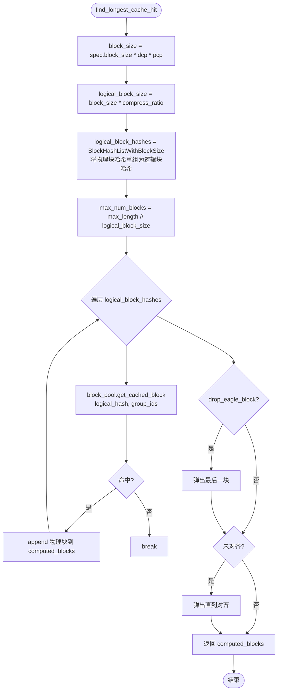
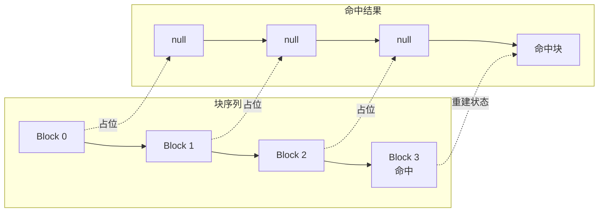
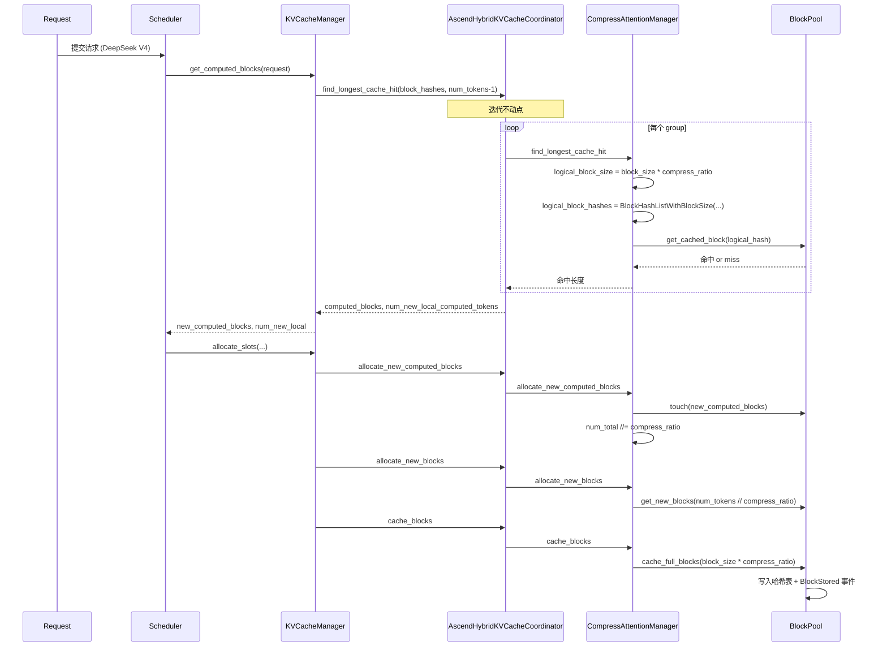
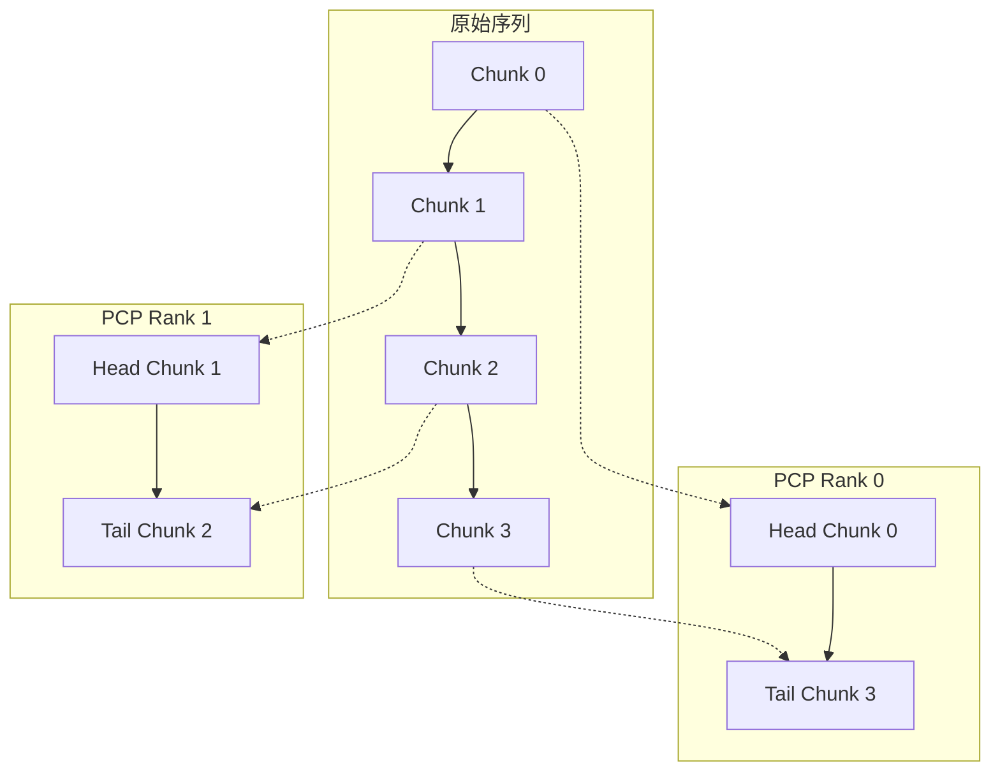

# vllm-ascend Prefix Cache 定制实现

> 本文分析 vllm-ascend 在 vLLM prefix cache 基础上的定制实现，包括压缩 prefix cache（DeepSeek V4）、Ascend Hybrid 协调器、MLA Spec 扩展、Mamba Manager 补丁等。

## 1. vllm-ascend 的定制策略

vllm-ascend 遵循 vLLM 的硬件插件模式，**不替换** prefix cache 核心，而是通过以下方式扩展：

1. **Patching**：替换上游类（`MLAAttentionSpec`、`HybridKVCacheCoordinator`、`MambaManager`）
2. **Inheritance**：`CompressAttentionManager(FullAttentionManager)` 扩展压缩 MLA
3. **Custom Connectors**：Mooncake P2P、AscendStore、Layerwise 等
4. **Custom Schedulers**：`RecomputeScheduler` 用于 PD 分离回退
5. **NPU Native Ops**：`swap_blocks_batch`、`aclrtMemcpyBatchAsync`

## 2. 压缩 Prefix Cache（DeepSeek V4）

### 2.1 问题背景

DeepSeek V4 使用 MLA with compression——多个物理 KV 块组成一个「逻辑块」进行哈希。`compress_ratio`（4 或 128）表示 `compress_ratio` 个物理块共享一个块哈希。

```
物理块:  [P0][P1][P2][P3] [P4][P5][P6][P7] ...
逻辑块:  [    L0         ] [    L1         ] ...
哈希:    hash(L0)          hash(L1)
```

### 2.2 CompressAttentionManager

源码位置：`vllm_ascend/core/single_type_kv_cache_manager.py:29`

```python
class CompressAttentionManager(FullAttentionManager):
    def __init__(self, kv_cache_spec: MLAAttentionSpec, block_pool: BlockPool, **kwargs):
        super().__init__(kv_cache_spec, block_pool, **kwargs)
        self.compress_ratio = kv_cache_spec.compress_ratio
        self._null_block = block_pool.null_block
```

### 2.3 关键方法重写

| 方法 | 与上游的差异 |
|---|---|
| `get_num_blocks_to_allocate` | `num_tokens //= compress_ratio` 后调用 super |
| `allocate_new_computed_blocks` | `num_total_computed_tokens //= compress_ratio` |
| `allocate_new_blocks` | `num_tokens //= compress_ratio` |
| `cache_blocks` | 使用 `block_size * compress_ratio` 作为有效块大小 |
| `find_longest_cache_hit` | 使用逻辑块哈希扫描 |

### 2.4 压缩命中扫描算法

源码位置：`vllm_ascend/core/single_type_kv_cache_manager.py:193`

```python
@classmethod
def find_longest_cache_hit(
    cls, block_hashes, max_length, kv_cache_group_ids, block_pool,
    kv_cache_spec, alignment_tokens, dcp_world_size=1, pcp_world_size=1,
    use_eagle=False, drop_eagle_block=False,
) -> tuple[list[KVCacheBlock], ...]:
    eagle_drop = use_eagle if vllm_version_is("0.22.1") else drop_eagle_block

    computed_blocks = tuple([] for _ in range(len(kv_cache_group_ids)))
    block_size = kv_cache_spec.block_size
    if dcp_world_size * pcp_world_size > 1:
        block_size *= dcp_world_size * pcp_world_size

    # 关键：逻辑块大小 = 物理块大小 * 压缩比
    logical_block_size = block_size * kv_cache_spec.compress_ratio
    # 用 BlockHashListWithBlockSize 将物理块哈希重组为逻辑块哈希
    logical_block_hashes = BlockHashListWithBlockSize(
        block_hashes, block_size, logical_block_size
    )
    max_num_blocks = max_length // logical_block_size

    for block_hash in itertools.islice(logical_block_hashes, max_num_blocks):
        if cached_block := block_pool.get_cached_block(block_hash, kv_cache_group_ids):
            for computed, cached in zip(computed_blocks, cached_block):
                computed.append(cached)
        else:
            break

    if eagle_drop and computed_blocks[0]:
        for computed in computed_blocks:
            computed.pop()

    # 对齐处理
    while (logical_block_size != alignment_tokens
           and len(computed_blocks[0]) * logical_block_size % alignment_tokens != 0):
        for computed in computed_blocks:
            computed.pop()

    return computed_blocks
```

### 2.5 压缩命中流程图



### 2.6 压缩命中的关键特性

**特性1：逻辑块原子性**

由于哈希基于逻辑块（`compress_ratio` 个物理块），任何一个物理块的 token 变化都会使整个逻辑块哈希失效。测试 `test_compressed_prefix_cache_uses_logical_block_hash` 验证：

```python
request_a_tokens = list(range(logical_block_size))  # [0..511]
request_b_tokens = request_a_tokens.copy()
request_b_tokens[block_size + 7] = 999_999  # 修改第二个物理块的 token

# request_b 的逻辑块哈希与 request_a 不同
hit_blocks = CompressAttentionManager.find_longest_cache_hit(
    block_hashes=request_b.block_hashes, ...
)
assert hit_blocks == []  # 无部分命中
```

**特性2：无部分命中**

与物理块粒度的 prefix cache 不同，压缩 prefix cache 不支持「物理块级部分命中」。要么整个逻辑块命中，要么完全 miss。

### 2.7 工厂函数与 Admission Cap

源码位置：`vllm_ascend/core/single_type_kv_cache_manager.py:244`

```python
def get_manager_for_kv_cache_spec(
    kv_cache_spec, max_num_batched_tokens=None, max_model_len=None, **kwargs,
) -> SingleTypeKVCacheManager:
    manager_class = KVCacheSpecRegistry.get_manager_class(kv_cache_spec)

    if isinstance(kv_cache_spec, MLAAttentionSpec) and kv_cache_spec.compress_ratio > 1:
        # 替换为 CompressAttentionManager
        manager_class = CompressAttentionManager
        if max_model_len is not None:
            compress_ratio = kv_cache_spec.compress_ratio
            block_size = kv_cache_spec.block_size
            max_compressed_tokens = max_model_len // compress_ratio
            # Admission cap 与 pool sizing 一致（vLLM PR #40946）
            kwargs["max_admission_blocks_per_request"] = (
                cdiv(max_compressed_tokens, block_size) + 1
            )
    elif isinstance(kv_cache_spec, (SlidingWindowSpec, ChunkedLocalAttentionSpec)):
        # 复刻上游 PR #40946 的 cap 设置
        ...
    return manager_class(kv_cache_spec, **kwargs)
```

## 3. AscendHybridKVCacheCoordinator

源码位置：`vllm_ascend/patch/platform/patch_kv_cache_coordinator.py`

### 3.1 替换上游协调器

```python
# patch_kv_cache_coordinator.py:496
vllm.v1.core.kv_cache_coordinator.get_kv_cache_coordinator = get_kv_cache_coordinator
```

当检测到 DeepSeek V4 或多 group 配置时，返回 `AscendHybridKVCacheCoordinator`。

### 3.2 与上游的差异

| 方面 | 上游 `HybridKVCacheCoordinator` | `AscendHybridKVCacheCoordinator` |
|---|---|---|
| 构造参数 | 标准 | 额外接受 `dcp_world_size`、`pcp_world_size`、`scheduler_block_size`、`max_num_batched_tokens` |
| Manager 工厂 | 上游 registry | `get_manager_for_kv_cache_spec`（Ascend 版） |
| 有效块大小 | `block_size` | `block_size * dcp * pcp * compress_ratio` |
| `find_longest_cache_hit` | 不动点 | 不动点 + CP 支持 |
| `find_longest_cache_hit_per_group` | 无 | 有（PD 分离跳过 Mamba group） |

### 3.3 `_get_effective_block_size`

```python
def _get_effective_block_size(self, spec):
    block_size = spec.block_size
    # 乘以 DCP/PCP world size
    block_size *= self.dcp_world_size * self.pcp_world_size
    # 压缩 spec 再乘以 compress_ratio
    if hasattr(spec, 'compress_ratio') and spec.compress_ratio > 1:
        block_size *= spec.compress_ratio
    return block_size
```

### 3.4 `find_longest_cache_hit_per_group`（PD 分离专用）

源码位置：`patch_kv_cache_coordinator.py:326`

```python
def find_longest_cache_hit_per_group(self, block_hashes, max_length):
    """返回每个 group 的独立命中长度，用于 PD 分离场景。"""
    hits = []
    for manager in self.single_type_managers:
        if isinstance(manager, AscendMambaManager):
            # PD 分离：跳过 Mamba group
            # Mamba 状态由 connector 传输，D-side 无本地命中
            hits.append(0)
            continue
        # 正常扫描
        h = manager.find_longest_cache_hit(...)
        hits.append(h)
    return hits
```

**为什么跳过 Mamba？** 在 PD 分离场景，D-side（decode 节点）的 Mamba 状态由 connector 从 P-side（prefill 节点）传输，本地无 Mamba 命中。若不跳过，Mamba group 命中为 0 会拖累 FA group 命中也为 0（不动点取 min）。

### 3.5 DeepSeek V4 的特殊行为

源码位置：`patch_kv_cache_coordinator.py:311`

DeepSeek V4 有两个 full-attention group（C4 和 C128），存在一个已记录的 quirk：

- 只有第一个 full-attention group 被截断到最终 `hit_length`
- C128 层可能保留 prefix cache 块命中
- 由于 sliding window attention，DeepSeek V4 decode 节点无法有 prefix cache 命中（SWA `hit_length` 为 0）

## 4. MLA Spec 扩展

源码位置：`vllm_ascend/patch/platform/patch_kv_cache_interface.py`

### 4.1 AscendMLAAttentionSpec

```python
class AscendMLAAttentionSpec(MLAAttentionSpec):
    """扩展 MLA spec，支持 Ascend 特有字段。"""

    # 量化相关
    scale_dim: int
    scale_dtype: str
    # 稀疏注意力
    sparse_head_dim: int
    cache_sparse_c8: bool
    # C8 K cache（A5 用 fp8，其他用 int8）
    c8_k_cache_dtype: str
    c8_k_scale_cache_dtype: str

    @property
    def page_size_bytes(self):
        """计算 page 字节数，含 sparse C8 组件"""
        ...

    @property
    def max_memory_usage_bytes(self):
        """考虑 DCP/PCP 的最大内存使用"""
        return base_size // (self.dcp_world_size * self.pcp_world_size)
```

### 4.2 AscendSlidingWindowMLASpec

```python
class AscendSlidingWindowMLASpec(SlidingWindowMLASpec):
    cache_dtype_str: str
    alignment: int
    compress_ratio: int
    model_version: str  # "deepseek_v4"
```

### 4.3 Patching

```python
# patch_kv_cache_interface.py:264
vllm.v1.kv_cache_interface.MLAAttentionSpec = AscendMLAAttentionSpec
vllm.v1.kv_cache_interface.SlidingWindowMLASpec = AscendSlidingWindowMLASpec
vllm.model_executor.layers.attention.mla_attention.MLAAttentionSpec = AscendMLAAttentionSpec
```

### 4.4 `_init_mla_cache_fields`

```python
def _init_mla_cache_fields(spec):
    """验证 DeepSeek V4 MLA 配置。"""
    if spec.compress_ratio not in [0, 4, 128]:
        raise ValueError(f"compress_ratio must be 0, 4, or 128, got {spec.compress_ratio}")
    if spec.block_size % spec.compress_ratio != 0:
        raise ValueError("block_size must be divisible by compress_ratio")
```

## 5. AscendMambaManager

源码位置：`vllm_ascend/patch/platform/patch_mamba_manager.py`

### 5.1 反向扫描命中

```python
class AscendMambaManager(MambaManager):
    @classmethod
    def find_longest_cache_hit(cls, block_hashes, max_length, ...):
        computed_blocks = tuple([] for _ in range(len(kv_cache_group_ids)))
        block_size = kv_cache_spec.block_size
        max_num_blocks = max_length // block_size

        # 反向扫描：从最后一块开始
        for i in range(max_num_blocks - 1, -1, -1):
            if cached_block := block_pool.get_cached_block(
                block_hashes[i], kv_cache_group_ids
            ):
                # 对齐检查
                if block_size != alignment_tokens and \
                   (i + 1) * block_size % alignment_tokens != 0:
                    continue
                # 命中：之前的块用 null 占位
                for computed, cached in zip(computed_blocks, cached_block):
                    computed.extend([block_pool.null_block] * i)
                    computed.append(cached)
                break
        return computed_blocks
```

### 5.2 Mamba 命中语义



**关键点：** Mamba 是 SSM，状态可从最后一块重建。命中块之前的块用 `null_block` 占位（不参与注意力），后续 `remove_skipped_blocks` 会释放它们。

## 6. 端到端压缩 Prefix Cache 流程



## 7. 压缩 Prefix Cache 的测试验证

源码位置：`tests/ut/test_compressed_prefix_cache.py`

### 7.1 测试用例

| 测试 | 验证点 |
|---|---|
| `test_compressed_prefix_cache_uses_logical_block_hash` | 修改任一物理块 token 使逻辑块哈希失效，无部分命中 |
| `test_compressed_prefix_cache_hits_identical_logical_block` | 相同逻辑块内容产生命中 |
| `test_hybrid_coordinator_rejects_partial_compressed_prefix_hit` | 一个 group miss 时，hybrid 协调器返回 0 命中 |

### 7.2 测试代码示例

```python
def test_compressed_prefix_cache_uses_logical_block_hash():
    block_size = 128
    compress_ratio = 4
    logical_block_size = block_size * compress_ratio  # 512
    spec, block_pool, manager = _make_compress_manager(block_size, compress_ratio)

    request_a_tokens = list(range(logical_block_size))  # [0..511]
    request_b_tokens = request_a_tokens.copy()
    request_b_tokens[block_size + 7] = 999_999  # 修改第 135 个 token

    request_a = _make_request("a", request_a_tokens, block_size)
    request_b = _make_request("b", request_b_tokens, block_size)

    # 缓存 request_a
    manager.allocate_new_blocks(request_a.request_id, ...)
    manager.cache_blocks(request_a, num_tokens=logical_block_size)

    # request_b 查找命中
    hit_blocks = CompressAttentionManager.find_longest_cache_hit(
        block_hashes=request_b.block_hashes,
        max_length=logical_block_size,
        kv_cache_group_ids=[0],
        block_pool=block_pool,
        kv_cache_spec=spec,
        use_eagle=False,
        alignment_tokens=logical_block_size,
    )[0]

    assert hit_blocks == []  # 无部分命中
```

## 8. PCP（Prefill Context Parallelism）对 Prefix Cache 的影响

源码位置：`vllm_ascend/worker/pcp_utils.py`

### 8.1 DualChunkSwap 模式

PCP 将 prefill 序列分散到多个 PCP rank，使用「DualChunkSwap」模式：



### 8.2 对块哈希的影响

- `block_size` 乘以 `dcp_world_size * pcp_world_size`
- `max_memory_usage_bytes` 除以 `dcp_world_size * pcp_world_size`
- 块哈希基于扩展后的 block_size 计算

## 9. KVComp（Hamming 稀疏注意力）

源码位置：`vllm_ascend/worker/kvcomp_utils.py`

### 9.1 与 Prefix Cache 的关系

KVComp 不是 prefix cache，但修改 KV cache 布局（添加 `hashk_cache`），影响块管理。

### 9.2 KVCompConfig

```python
@dataclass
class KVCompConfig:
    is_mla: bool
    hash_weight_type: str  # "random" or "fixed"
    seq_len_threshhold: int = 2048  # 触发 KVComp 的最小 seq_len
    chunk_size: int  # 必须被 128 整除
    top_k_ratio_per_layer: dict  # 每层 top-k 比例
    must_select_blocks: list  # 必选块（如 [0, -2, -1]）
    # MLA 特有
    kv_lora_rank: int
    qk_rope_head_dim: int
    hash_bits_kv_lora: int
    hash_bits_qk_rope: int
```

### 9.3 hashk_cache 绑定

```python
def bind_hashk_cache(kv_cache, hashk_cache, ...):
    """将 hashk_cache 绑定到 KV cache，用于 GQA 模式。"""

def bind_hashk_cache_nope(kv_cache, hashk_cache, ...):
    """MLA nope 部分的绑定。"""

def bind_hashk_cache_rope(kv_cache, hashk_cache, ...):
    """MLA rope 部分的绑定。"""
```

## 10. vllm-ascend 与上游的差异总结

| 方面 | 上游 vLLM | vllm-ascend |
|---|---|---|
| 压缩 MLA prefix cache | 不支持 | `CompressAttentionManager` with `compress_ratio` |
| Hybrid 协调器 | `HybridKVCacheCoordinator` | `AscendHybridKVCacheCoordinator`（CP 支持 + per_group） |
| Mamba 命中 | `MambaManager` | `AscendMambaManager`（反向扫描） |
| MLA Spec | `MLAAttentionSpec` | `AscendMLAAttentionSpec`（sparse C8, scale_dim） |
| KV consumer 回退 | 不支持 | `RecomputeScheduler` 回送 PD Proxy |
| CPU 卸载传输 | CUDA `aclrtMemcpyBatchAsync` | NPU `swap_blocks_batch` |
| Layerwise KV 传输 | NIXL-based | `MooncakeLayerwiseConnector` + `AttentionComputeStartGate` |
| KV pool lookup | N/A | `AscendStoreConnector` with ZMQ lookup server |
| PD 分离 | LMCache/Simple | `MooncakeConnector` (P2P), `AscendStoreConnector` (pool) |
| Hash 稀疏注意力 | N/A | `KVComp` with `hashk_cache` |
| Prefill context parallelism | CP for attention only | `PCPManager` with DualChunkSwap |

## 11. 关键源码索引

| 功能 | 文件 | 行号 |
|---|---|---|
| `CompressAttentionManager` | `vllm_ascend/core/single_type_kv_cache_manager.py` | 29 |
| `CompressAttentionManager.find_longest_cache_hit` | `vllm_ascend/core/single_type_kv_cache_manager.py` | 193 |
| `get_manager_for_kv_cache_spec` | `vllm_ascend/core/single_type_kv_cache_manager.py` | 244 |
| `AscendHybridKVCacheCoordinator` | `vllm_ascend/patch/platform/patch_kv_cache_coordinator.py` | 58 |
| `find_longest_cache_hit_per_group` | `vllm_ascend/patch/platform/patch_kv_cache_coordinator.py` | 326 |
| `AscendMLAAttentionSpec` | `vllm_ascend/patch/platform/patch_kv_cache_interface.py` | 29 |
| `AscendSlidingWindowMLASpec` | `vllm_ascend/patch/platform/patch_kv_cache_interface.py` | 214 |
| `AscendMambaManager` | `vllm_ascend/patch/platform/patch_mamba_manager.py` | 20 |
| `RecomputeScheduler` | `vllm_ascend/core/recompute_scheduler.py` | 111 |
| `PCPManager` | `vllm_ascend/worker/pcp_utils.py` | 36 |
| `KVCompConfig` | `vllm_ascend/worker/kvcomp_utils.py` | 144 |
| `initialize_kvcomp_metadata` | `vllm_ascend/worker/kvcomp_utils.py` | 516 |
| 压缩 prefix cache 测试 | `tests/ut/test_compressed_prefix_cache.py` | - |
| Ascend connector 注册 | `vllm_ascend/distributed/kv_transfer/__init__.py` | 21 |
| `AttentionComputeStartGate` | `vllm_ascend/memcache_comm_fence.py` | 27 |
| `swap_blocks_batch` 算子 | `csrc/torch_binding.cpp` | 123 |
| `NPUDmaCopyBackend` | `vllm_ascend/simple_kv_offload/copy_backend.py` | - |

## 12. 环境变量

源码位置：`vllm_ascend/envs.py`

| 环境变量 | 默认值 | 作用 |
|---|---|---|
| `VLLM_ASCEND_FUSION_OP_TRANSPOSE_KV_CACHE_BY_BLOCK` | 1 | 使用融合算子转置 KV cache |
| `VLLM_ASCEND_ENABLE_BATCH_MEMCPY` | None（自动检测） | 控制 `aclrtMemcpyBatchAsync` 编译路径；"1"=强制启用，"0"=强制禁用 |

> **注意：** 大部分 prefix cache 配置通过上游 vLLM 的 `cache_config.enable_prefix_caching` 控制，而非 Ascend 特有环境变量。`VLLM_PREFIX_CACHE_RETENTION_INTERVAL`（上游）在 `patch_kv_cache_coordinator.py:94` 被引用。

## 13. 总结

vllm-ascend 的 prefix cache 定制围绕 DeepSeek V4 的压缩 MLA 展开，核心创新是 `CompressAttentionManager` 的逻辑块哈希机制。通过 patching 模式扩展上游 vLLM，保持了与上游的兼容性，同时支持 Ascend NPU 的硬件特性（CP、稀疏注意力、NPU 原生 DMA）。外部 prefix cache 通过多种 connector（Mooncake P2P、AscendStore Pool、Layerwise）实现 PD 分离与跨节点 KV 共享，配合 `RecomputeScheduler` 提供回退机制。

上一篇：[External Prefix Cache 外部前缀缓存机制](./03_external-prefix-cache.zh.md)
